# Semantic Facts for `AxialVelocityTopOfString`
```DWIS
DWIS:DigitalTwin:v_tos BelongsToClass opc:double .
DWIS:DigitalTwin:sigma_v_tos BelongsToClass opc:double .
DWIS:DigitalTwin:v_tos#01 BelongsToClass PhysicalData .
DWIS:DigitalTwin:tos#01 BelongsToClass TopOfStringReferenceLocation .
DWIS:DigitalTwin:MovingAverage BelongsToClass MovingAverage .
DWIS:DigitalTwin:sigma_v_tos#01 BelongsToClass DrillingDataPoint .
DWIS:DigitalTwin:GaussianUncertainty#01 BelongsToClass GaussianUncertainty .
DWIS:DigitalTwin:v_tos#01 HasDynamicValue DWIS:DigitalTwin:v_tos .
DWIS:DigitalTwin:v_tos#01 IsOfMeasurableQuantity BlockVelocityDrilling .
DWIS:DigitalTwin:v_tos#01 IsPhysicallyLocatedAt DWIS:DigitalTwin:tos#01 .
DWIS:DigitalTwin:v_tos#01 IsTransformationOutput DWIS:DigitalTwin:MovingAverage .
DWIS:DigitalTwin:sigma_v_tos#01 HasValue DWIS:DigitalTwin:sigma_v_tos .
DWIS:DigitalTwin:v_tos#01 HasUncertainty DWIS:DigitalTwin:GaussianUncertainty#01 .
DWIS:DigitalTwin:GaussianUncertainty#01 HasUncertaintyStandardDeviation DWIS:DigitalTwin:sigma_v_tos#01 .
DWIS:DigitalTwin:GaussianUncertainty#01 HasUncertaintyMean DWIS:DigitalTwin:v_tos#01 .
```

# Semantic Graph for `AxialVelocityTopOfString`
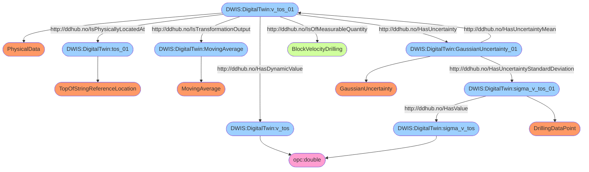

# Semantic Facts for `StandardDeviationAxialVelocityTopOfString`
```DWIS
DWIS:DigitalTwin:sigma_v_tos BelongsToClass opc:double .
DWIS:DigitalTwin:sigma_sigma_v_tos BelongsToClass opc:double .
DWIS:DigitalTwin:sigma_v_tos#01 BelongsToClass PhysicalData .
DWIS:DigitalTwin:tos#01 BelongsToClass TopOfStringReferenceLocation .
DWIS:DigitalTwin:MovingStandardDeviation BelongsToClass MovingStandardDeviation .
DWIS:DigitalTwin:sigma_sigma_v_tos#01 BelongsToClass DrillingDataPoint .
DWIS:DigitalTwin:GaussianUncertainty#01 BelongsToClass GaussianUncertainty .
DWIS:DigitalTwin:sigma_v_tos#01 HasDynamicValue DWIS:DigitalTwin:sigma_v_tos .
DWIS:DigitalTwin:sigma_v_tos#01 IsOfMeasurableQuantity BlockVelocityDrilling .
DWIS:DigitalTwin:sigma_v_tos#01 IsPhysicallyLocatedAt DWIS:DigitalTwin:tos#01 .
DWIS:DigitalTwin:sigma_v_tos#01 IsTransformationOutput DWIS:DigitalTwin:MovingStandardDeviation .
DWIS:DigitalTwin:sigma_sigma_v_tos#01 HasValue DWIS:DigitalTwin:sigma_sigma_v_tos .
DWIS:DigitalTwin:sigma_v_tos#01 HasUncertainty DWIS:DigitalTwin:GaussianUncertainty#01 .
DWIS:DigitalTwin:GaussianUncertainty#01 HasUncertaintyStandardDeviation DWIS:DigitalTwin:sigma_sigma_v_tos#01 .
DWIS:DigitalTwin:GaussianUncertainty#01 HasUncertaintyMean DWIS:DigitalTwin:sigma_v_tos#01 .
```

# Semantic Graph for `StandardDeviationAxialVelocityTopOfString`
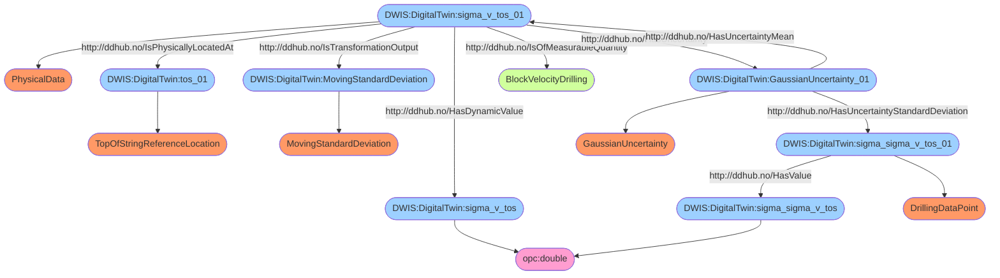

# Semantic Facts for `RotationalVelocityTopOfString`
```DWIS
DWIS:DigitalTwin:omega_tos BelongsToClass opc:double .
DWIS:DigitalTwin:sigma_omega_tos BelongsToClass opc:double .
DWIS:DigitalTwin:omega_tos#01 BelongsToClass PhysicalData .
DWIS:DigitalTwin:tos#01 BelongsToClass TopOfStringReferenceLocation .
DWIS:DigitalTwin:MovingAverage BelongsToClass MovingAverage .
DWIS:DigitalTwin:sigma_omega_tos#01 BelongsToClass DrillingDataPoint .
DWIS:DigitalTwin:GaussianUncertainty#01 BelongsToClass GaussianUncertainty .
DWIS:DigitalTwin:omega_tos#01 HasDynamicValue DWIS:DigitalTwin:omega_tos .
DWIS:DigitalTwin:omega_tos#01 IsOfMeasurableQuantity AngularVelocityDrilling .
DWIS:DigitalTwin:omega_tos#01 IsPhysicallyLocatedAt DWIS:DigitalTwin:tos#01 .
DWIS:DigitalTwin:omega_tos#01 IsTransformationOutput DWIS:DigitalTwin:MovingAverage .
DWIS:DigitalTwin:sigma_omega_tos#01 HasValue DWIS:DigitalTwin:sigma_omega_tos .
DWIS:DigitalTwin:omega_tos#01 HasUncertainty DWIS:DigitalTwin:GaussianUncertainty#01 .
DWIS:DigitalTwin:GaussianUncertainty#01 HasUncertaintyStandardDeviation DWIS:DigitalTwin:sigma_omega_tos#01 .
DWIS:DigitalTwin:GaussianUncertainty#01 HasUncertaintyMean DWIS:DigitalTwin:omega_tos#01 .
```

# Semantic Graph for `RotationalVelocityTopOfString`
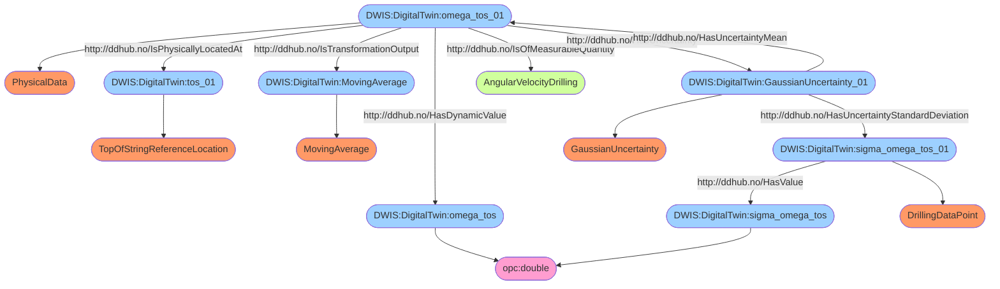

# Semantic Facts for `StandardDeviationRotationalVelocityTopOfString`
```DWIS
DWIS:DigitalTwin:sigma_omega_tos BelongsToClass opc:double .
DWIS:DigitalTwin:sigma_sigma_omega_tos BelongsToClass opc:double .
DWIS:DigitalTwin:sigma_omega_tos#01 BelongsToClass PhysicalData .
DWIS:DigitalTwin:tos#01 BelongsToClass TopOfStringReferenceLocation .
DWIS:DigitalTwin:MovingStandardDeviation BelongsToClass MovingStandardDeviation .
DWIS:DigitalTwin:sigma_sigma_omega_tos#01 BelongsToClass DrillingDataPoint .
DWIS:DigitalTwin:GaussianUncertainty#01 BelongsToClass GaussianUncertainty .
DWIS:DigitalTwin:sigma_omega_tos#01 HasDynamicValue DWIS:DigitalTwin:sigma_omega_tos .
DWIS:DigitalTwin:sigma_omega_tos#01 IsOfMeasurableQuantity AngularVelocityDrilling .
DWIS:DigitalTwin:sigma_omega_tos#01 IsPhysicallyLocatedAt DWIS:DigitalTwin:tos#01 .
DWIS:DigitalTwin:sigma_omega_tos#01 IsTransformationOutput DWIS:DigitalTwin:MovingStandardDeviation .
DWIS:DigitalTwin:sigma_sigma_omega_tos#01 HasValue DWIS:DigitalTwin:sigma_sigma_omega_tos .
DWIS:DigitalTwin:sigma_omega_tos#01 HasUncertainty DWIS:DigitalTwin:GaussianUncertainty#01 .
DWIS:DigitalTwin:GaussianUncertainty#01 HasUncertaintyStandardDeviation DWIS:DigitalTwin:sigma_sigma_omega_tos#01 .
DWIS:DigitalTwin:GaussianUncertainty#01 HasUncertaintyMean DWIS:DigitalTwin:sigma_omega_tos#01 .
```

# Semantic Graph for `StandardDeviationRotationalVelocityTopOfString`
```mermaid
flowchart TD
	 classDef typeClass fill:#f96;
	 classDef classClass fill:#9dd0ff;
	 classDef opcClass fill:#ff9dd0;
	 classDef quantityClass fill:#d0ff9d;
	DWIS:DigitalTwin:sigma_omega_tos([DWIS:DigitalTwin:sigma_omega_tos]) --> opc:double([opc:double]):::opcClass
	DWIS:DigitalTwin:sigma_sigma_omega_tos([DWIS:DigitalTwin:sigma_sigma_omega_tos]) --> opc:double([opc:double]):::opcClass
	DWIS:DigitalTwin:sigma_omega_tos_01([DWIS:DigitalTwin:sigma_omega_tos_01]) --> PhysicalData([PhysicalData]):::typeClass
	DWIS:DigitalTwin:tos_01([DWIS:DigitalTwin:tos_01]) --> TopOfStringReferenceLocation([TopOfStringReferenceLocation]):::typeClass
	DWIS:DigitalTwin:MovingStandardDeviation([DWIS:DigitalTwin:MovingStandardDeviation]) --> MovingStandardDeviation([MovingStandardDeviation]):::typeClass
	DWIS:DigitalTwin:sigma_sigma_omega_tos_01([DWIS:DigitalTwin:sigma_sigma_omega_tos_01]) --> DrillingDataPoint([DrillingDataPoint]):::typeClass
	DWIS:DigitalTwin:GaussianUncertainty_01([DWIS:DigitalTwin:GaussianUncertainty_01]) --> GaussianUncertainty([GaussianUncertainty]):::typeClass
	DWIS:DigitalTwin:sigma_omega_tos_01([DWIS:DigitalTwin:sigma_omega_tos_01]) -- http://ddhub.no/HasDynamicValue --> DWIS:DigitalTwin:sigma_omega_tos([DWIS:DigitalTwin:sigma_omega_tos]):::classClass
	DWIS:DigitalTwin:sigma_omega_tos_01([DWIS:DigitalTwin:sigma_omega_tos_01]) -- http://ddhub.no/IsOfMeasurableQuantity --> AngularVelocityDrilling([AngularVelocityDrilling]):::quantityClass
	DWIS:DigitalTwin:sigma_omega_tos_01([DWIS:DigitalTwin:sigma_omega_tos_01]) -- http://ddhub.no/IsPhysicallyLocatedAt --> DWIS:DigitalTwin:tos_01([DWIS:DigitalTwin:tos_01]):::classClass
	DWIS:DigitalTwin:sigma_omega_tos_01([DWIS:DigitalTwin:sigma_omega_tos_01]) -- http://ddhub.no/IsTransformationOutput --> DWIS:DigitalTwin:MovingStandardDeviation([DWIS:DigitalTwin:MovingStandardDeviation]):::classClass
	DWIS:DigitalTwin:sigma_sigma_omega_tos_01([DWIS:DigitalTwin:sigma_sigma_omega_tos_01]) -- http://ddhub.no/HasValue --> DWIS:DigitalTwin:sigma_sigma_omega_tos([DWIS:DigitalTwin:sigma_sigma_omega_tos]):::classClass
	DWIS:DigitalTwin:sigma_omega_tos_01([DWIS:DigitalTwin:sigma_omega_tos_01]) -- http://ddhub.no/HasUncertainty --> DWIS:DigitalTwin:GaussianUncertainty_01([DWIS:DigitalTwin:GaussianUncertainty_01]):::classClass
	DWIS:DigitalTwin:GaussianUncertainty_01([DWIS:DigitalTwin:GaussianUncertainty_01]) -- http://ddhub.no/HasUncertaintyStandardDeviation --> DWIS:DigitalTwin:sigma_sigma_omega_tos_01([DWIS:DigitalTwin:sigma_sigma_omega_tos_01]):::classClass
	DWIS:DigitalTwin:GaussianUncertainty_01([DWIS:DigitalTwin:GaussianUncertainty_01]) -- http://ddhub.no/HasUncertaintyMean --> DWIS:DigitalTwin:sigma_omega_tos_01([DWIS:DigitalTwin:sigma_omega_tos_01]):::classClass
```

# Semantic Facts for `FlowTopOfString`
```DWIS
DWIS:DigitalTwin:Q_tos BelongsToClass opc:double .
DWIS:DigitalTwin:sigma_Q_tos BelongsToClass opc:double .
DWIS:DigitalTwin:Q_tos#01 BelongsToClass PhysicalData .
DWIS:DigitalTwin:tos#01 BelongsToClass TopOfStringReferenceLocation .
DWIS:DigitalTwin:MovingAverage BelongsToClass MovingAverage .
DWIS:DigitalTwin:sigma_Q_tos#01 BelongsToClass DrillingDataPoint .
DWIS:DigitalTwin:GaussianUncertainty#01 BelongsToClass GaussianUncertainty .
DWIS:DigitalTwin:Q_tos#01 HasDynamicValue DWIS:DigitalTwin:Q_tos .
DWIS:DigitalTwin:Q_tos#01 IsOfMeasurableQuantity VolumetricFlowrateDrilling .
DWIS:DigitalTwin:Q_tos#01 IsPhysicallyLocatedAt DWIS:DigitalTwin:tos#01 .
DWIS:DigitalTwin:Q_tos#01 IsTransformationOutput DWIS:DigitalTwin:MovingAverage .
DWIS:DigitalTwin:sigma_Q_tos#01 HasValue DWIS:DigitalTwin:sigma_Q_tos .
DWIS:DigitalTwin:Q_tos#01 HasUncertainty DWIS:DigitalTwin:GaussianUncertainty#01 .
DWIS:DigitalTwin:GaussianUncertainty#01 HasUncertaintyStandardDeviation DWIS:DigitalTwin:sigma_Q_tos#01 .
DWIS:DigitalTwin:GaussianUncertainty#01 HasUncertaintyMean DWIS:DigitalTwin:Q_tos#01 .
```

# Semantic Graph for `FlowTopOfString`
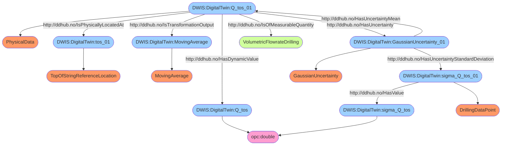

# Semantic Facts for `StandardDeviationFlowTopOfString`
```DWIS
DWIS:DigitalTwin:sigma_Q_tos BelongsToClass opc:double .
DWIS:DigitalTwin:sigma_sigma_Q_tos BelongsToClass opc:double .
DWIS:DigitalTwin:sigma_Q_tos#01 BelongsToClass PhysicalData .
DWIS:DigitalTwin:tos#01 BelongsToClass TopOfStringReferenceLocation .
DWIS:DigitalTwin:MovingStandardDeviation BelongsToClass MovingStandardDeviation .
DWIS:DigitalTwin:sigma_sigma_Q_tos#01 BelongsToClass DrillingDataPoint .
DWIS:DigitalTwin:GaussianUncertainty#01 BelongsToClass GaussianUncertainty .
DWIS:DigitalTwin:sigma_Q_tos#01 HasDynamicValue DWIS:DigitalTwin:sigma_Q_tos .
DWIS:DigitalTwin:sigma_Q_tos#01 IsOfMeasurableQuantity VolumetricFlowrateDrilling .
DWIS:DigitalTwin:sigma_Q_tos#01 IsPhysicallyLocatedAt DWIS:DigitalTwin:tos#01 .
DWIS:DigitalTwin:sigma_Q_tos#01 IsTransformationOutput DWIS:DigitalTwin:MovingStandardDeviation .
DWIS:DigitalTwin:sigma_sigma_Q_tos#01 HasValue DWIS:DigitalTwin:sigma_sigma_Q_tos .
DWIS:DigitalTwin:sigma_Q_tos#01 HasUncertainty DWIS:DigitalTwin:GaussianUncertainty#01 .
DWIS:DigitalTwin:GaussianUncertainty#01 HasUncertaintyStandardDeviation DWIS:DigitalTwin:sigma_sigma_Q_tos#01 .
DWIS:DigitalTwin:GaussianUncertainty#01 HasUncertaintyMean DWIS:DigitalTwin:sigma_Q_tos#01 .
```

# Semantic Graph for `StandardDeviationFlowTopOfString`
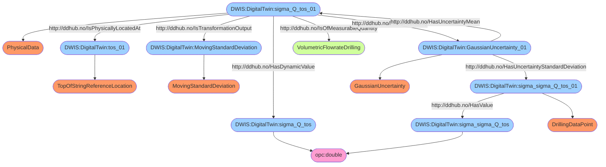

# Semantic Facts for `TensionTopOfString`
```DWIS
DWIS:DigitalTwin:T_tos BelongsToClass opc:double .
DWIS:DigitalTwin:sigma_T_tos BelongsToClass opc:double .
DWIS:DigitalTwin:T_tos#01 BelongsToClass PhysicalData .
DWIS:DigitalTwin:tos#01 BelongsToClass TopOfStringReferenceLocation .
DWIS:DigitalTwin:MovingAverage BelongsToClass MovingAverage .
DWIS:DigitalTwin:sigma_T_tos#01 BelongsToClass DrillingDataPoint .
DWIS:DigitalTwin:GaussianUncertainty#01 BelongsToClass GaussianUncertainty .
DWIS:DigitalTwin:T_tos#01 HasDynamicValue DWIS:DigitalTwin:T_tos .
DWIS:DigitalTwin:T_tos#01 IsOfMeasurableQuantity ForceDrilling .
DWIS:DigitalTwin:T_tos#01 IsPhysicallyLocatedAt DWIS:DigitalTwin:tos#01 .
DWIS:DigitalTwin:T_tos#01 IsTransformationOutput DWIS:DigitalTwin:MovingAverage .
DWIS:DigitalTwin:sigma_T_tos#01 HasValue DWIS:DigitalTwin:sigma_T_tos .
DWIS:DigitalTwin:T_tos#01 HasUncertainty DWIS:DigitalTwin:GaussianUncertainty#01 .
DWIS:DigitalTwin:GaussianUncertainty#01 HasUncertaintyStandardDeviation DWIS:DigitalTwin:sigma_T_tos#01 .
DWIS:DigitalTwin:GaussianUncertainty#01 HasUncertaintyMean DWIS:DigitalTwin:T_tos#01 .
```

# Semantic Graph for `TensionTopOfString`


# Semantic Facts for `ForceBottomTopDrive`
```DWIS
DWIS:DigitalTwin:F_btd BelongsToClass opc:double .
DWIS:DigitalTwin:sigma_F_btd BelongsToClass opc:double .
DWIS:DigitalTwin:F_btd#01 BelongsToClass PhysicalData .
DWIS:DigitalTwin:btd#01 BelongsToClass Quill .
DWIS:DigitalTwin:Logical_btd#01 BelongsToClass MechanicalLogicalElement .
DWIS:DigitalTwin:MovingAverage BelongsToClass MovingAverage .
DWIS:DigitalTwin:sigma_F_btd#01 BelongsToClass DrillingDataPoint .
DWIS:DigitalTwin:GaussianUncertainty#01 BelongsToClass GaussianUncertainty .
DWIS:DigitalTwin:F_btd#01 HasDynamicValue DWIS:DigitalTwin:F_btd .
DWIS:DigitalTwin:F_btd#01 IsOfMeasurableQuantity ForceDrilling .
DWIS:DigitalTwin:Logical_btd#01 IsAMechanicalRepresentationFor DWIS:DigitalTwin:btd#01 .
DWIS:DigitalTwin:logical_btd#01 IsAMechanicalRepresentationFor DWIS:DigitalTwin:btd#01 .
DWIS:DigitalTwin:F_btd#01 IsMechanicallyLocatedAt DWIS:DigitalTwin:Logical_btd#01 .
DWIS:DigitalTwin:F_btd#01 IsTransformationOutput DWIS:DigitalTwin:MovingAverage .
DWIS:DigitalTwin:sigma_F_btd#01 HasValue DWIS:DigitalTwin:sigma_F_btd .
DWIS:DigitalTwin:F_btd#01 HasUncertainty DWIS:DigitalTwin:GaussianUncertainty#01 .
DWIS:DigitalTwin:GaussianUncertainty#01 HasUncertaintyStandardDeviation DWIS:DigitalTwin:sigma_F_btd#01 .
DWIS:DigitalTwin:GaussianUncertainty#01 HasUncertaintyMean DWIS:DigitalTwin:F_btd#01 .
```

# Semantic Graph for `ForceBottomTopDrive`
```mermaid
flowchart TD
	 classDef typeClass fill:#f96;
	 classDef classClass fill:#9dd0ff;
	 classDef opcClass fill:#ff9dd0;
	 classDef quantityClass fill:#d0ff9d;
	DWIS:DigitalTwin:F_btd([DWIS:DigitalTwin:F_btd]) --> opc:double([opc:double]):::opcClass
	DWIS:DigitalTwin:sigma_F_btd([DWIS:DigitalTwin:sigma_F_btd]) --> opc:double([opc:double]):::opcClass
	DWIS:DigitalTwin:F_btd_01([DWIS:DigitalTwin:F_btd_01]) --> PhysicalData([PhysicalData]):::typeClass
	DWIS:DigitalTwin:btd_01([DWIS:DigitalTwin:btd_01]) --> Quill([Quill]):::typeClass
	DWIS:DigitalTwin:Logical_btd_01([DWIS:DigitalTwin:Logical_btd_01]) --> MechanicalLogicalElement([MechanicalLogicalElement]):::typeClass
	DWIS:DigitalTwin:MovingAverage([DWIS:DigitalTwin:MovingAverage]) --> MovingAverage([MovingAverage]):::typeClass
	DWIS:DigitalTwin:sigma_F_btd_01([DWIS:DigitalTwin:sigma_F_btd_01]) --> DrillingDataPoint([DrillingDataPoint]):::typeClass
	DWIS:DigitalTwin:GaussianUncertainty_01([DWIS:DigitalTwin:GaussianUncertainty_01]) --> GaussianUncertainty([GaussianUncertainty]):::typeClass
	DWIS:DigitalTwin:F_btd_01([DWIS:DigitalTwin:F_btd_01]) -- http://ddhub.no/HasDynamicValue --> DWIS:DigitalTwin:F_btd([DWIS:DigitalTwin:F_btd]):::classClass
	DWIS:DigitalTwin:F_btd_01([DWIS:DigitalTwin:F_btd_01]) -- http://ddhub.no/IsOfMeasurableQuantity --> ForceDrilling([ForceDrilling]):::quantityClass
	DWIS:DigitalTwin:Logical_btd_01([DWIS:DigitalTwin:Logical_btd_01]) -- http://ddhub.no/IsAMechanicalRepresentationFor --> DWIS:DigitalTwin:btd_01([DWIS:DigitalTwin:btd_01]):::classClass
	DWIS:DigitalTwin:logical_btd_01([DWIS:DigitalTwin:logical_btd_01]) -- http://ddhub.no/IsAMechanicalRepresentationFor --> DWIS:DigitalTwin:btd_01([DWIS:DigitalTwin:btd_01]):::classClass
	DWIS:DigitalTwin:F_btd_01([DWIS:DigitalTwin:F_btd_01]) -- http://ddhub.no/IsMechanicallyLocatedAt --> DWIS:DigitalTwin:Logical_btd_01([DWIS:DigitalTwin:Logical_btd_01]):::classClass
	DWIS:DigitalTwin:F_btd_01([DWIS:DigitalTwin:F_btd_01]) -- http://ddhub.no/IsTransformationOutput --> DWIS:DigitalTwin:MovingAverage([DWIS:DigitalTwin:MovingAverage]):::classClass
	DWIS:DigitalTwin:sigma_F_btd_01([DWIS:DigitalTwin:sigma_F_btd_01]) -- http://ddhub.no/HasValue --> DWIS:DigitalTwin:sigma_F_btd([DWIS:DigitalTwin:sigma_F_btd]):::classClass
	DWIS:DigitalTwin:F_btd_01([DWIS:DigitalTwin:F_btd_01]) -- http://ddhub.no/HasUncertainty --> DWIS:DigitalTwin:GaussianUncertainty_01([DWIS:DigitalTwin:GaussianUncertainty_01]):::classClass
	DWIS:DigitalTwin:GaussianUncertainty_01([DWIS:DigitalTwin:GaussianUncertainty_01]) -- http://ddhub.no/HasUncertaintyStandardDeviation --> DWIS:DigitalTwin:sigma_F_btd_01([DWIS:DigitalTwin:sigma_F_btd_01]):::classClass
	DWIS:DigitalTwin:GaussianUncertainty_01([DWIS:DigitalTwin:GaussianUncertainty_01]) -- http://ddhub.no/HasUncertaintyMean --> DWIS:DigitalTwin:F_btd_01([DWIS:DigitalTwin:F_btd_01]):::classClass
```

# Semantic Facts for `ForceElevator`
```DWIS
DWIS:DigitalTwin:F_elev BelongsToClass opc:double .
DWIS:DigitalTwin:sigma_F_elev BelongsToClass opc:double .
DWIS:DigitalTwin:F_elev#01 BelongsToClass PhysicalData .
DWIS:DigitalTwin:elev#01 BelongsToClass DrillPipeElevator .
DWIS:DigitalTwin:Logical_elev#01 BelongsToClass MechanicalLogicalElement .
DWIS:DigitalTwin:MovingAverage BelongsToClass MovingAverage .
DWIS:DigitalTwin:sigma_F_elev#01 BelongsToClass DrillingDataPoint .
DWIS:DigitalTwin:GaussianUncertainty#01 BelongsToClass GaussianUncertainty .
DWIS:DigitalTwin:F_elev#01 HasDynamicValue DWIS:DigitalTwin:F_elev .
DWIS:DigitalTwin:F_elev#01 IsOfMeasurableQuantity ForceDrilling .
DWIS:DigitalTwin:Logical_elev#01 IsAMechanicalRepresentationFor DWIS:DigitalTwin:elev#01 .
DWIS:DigitalTwin:F_elev#01 IsMechanicallyLocatedAt DWIS:DigitalTwin:Logical_elev#01 .
DWIS:DigitalTwin:F_elev#01 IsTransformationOutput DWIS:DigitalTwin:MovingAverage .
DWIS:DigitalTwin:sigma_F_elev#01 HasValue DWIS:DigitalTwin:sigma_F_elev .
DWIS:DigitalTwin:F_elev#01 HasUncertainty DWIS:DigitalTwin:GaussianUncertainty#01 .
DWIS:DigitalTwin:GaussianUncertainty#01 HasUncertaintyStandardDeviation DWIS:DigitalTwin:sigma_F_elev#01 .
DWIS:DigitalTwin:GaussianUncertainty#01 HasUncertaintyMean DWIS:DigitalTwin:F_elev#01 .
```

# Semantic Graph for `ForceElevator`
```mermaid
flowchart TD
	 classDef typeClass fill:#f96;
	 classDef classClass fill:#9dd0ff;
	 classDef opcClass fill:#ff9dd0;
	 classDef quantityClass fill:#d0ff9d;
	DWIS:DigitalTwin:F_elev([DWIS:DigitalTwin:F_elev]) --> opc:double([opc:double]):::opcClass
	DWIS:DigitalTwin:sigma_F_elev([DWIS:DigitalTwin:sigma_F_elev]) --> opc:double([opc:double]):::opcClass
	DWIS:DigitalTwin:F_elev_01([DWIS:DigitalTwin:F_elev_01]) --> PhysicalData([PhysicalData]):::typeClass
	DWIS:DigitalTwin:elev_01([DWIS:DigitalTwin:elev_01]) --> DrillPipeElevator([DrillPipeElevator]):::typeClass
	DWIS:DigitalTwin:Logical_elev_01([DWIS:DigitalTwin:Logical_elev_01]) --> MechanicalLogicalElement([MechanicalLogicalElement]):::typeClass
	DWIS:DigitalTwin:MovingAverage([DWIS:DigitalTwin:MovingAverage]) --> MovingAverage([MovingAverage]):::typeClass
	DWIS:DigitalTwin:sigma_F_elev_01([DWIS:DigitalTwin:sigma_F_elev_01]) --> DrillingDataPoint([DrillingDataPoint]):::typeClass
	DWIS:DigitalTwin:GaussianUncertainty_01([DWIS:DigitalTwin:GaussianUncertainty_01]) --> GaussianUncertainty([GaussianUncertainty]):::typeClass
	DWIS:DigitalTwin:F_elev_01([DWIS:DigitalTwin:F_elev_01]) -- http://ddhub.no/HasDynamicValue --> DWIS:DigitalTwin:F_elev([DWIS:DigitalTwin:F_elev]):::classClass
	DWIS:DigitalTwin:F_elev_01([DWIS:DigitalTwin:F_elev_01]) -- http://ddhub.no/IsOfMeasurableQuantity --> ForceDrilling([ForceDrilling]):::quantityClass
	DWIS:DigitalTwin:Logical_elev_01([DWIS:DigitalTwin:Logical_elev_01]) -- http://ddhub.no/IsAMechanicalRepresentationFor --> DWIS:DigitalTwin:elev_01([DWIS:DigitalTwin:elev_01]):::classClass
	DWIS:DigitalTwin:F_elev_01([DWIS:DigitalTwin:F_elev_01]) -- http://ddhub.no/IsMechanicallyLocatedAt --> DWIS:DigitalTwin:Logical_elev_01([DWIS:DigitalTwin:Logical_elev_01]):::classClass
	DWIS:DigitalTwin:F_elev_01([DWIS:DigitalTwin:F_elev_01]) -- http://ddhub.no/IsTransformationOutput --> DWIS:DigitalTwin:MovingAverage([DWIS:DigitalTwin:MovingAverage]):::classClass
	DWIS:DigitalTwin:sigma_F_elev_01([DWIS:DigitalTwin:sigma_F_elev_01]) -- http://ddhub.no/HasValue --> DWIS:DigitalTwin:sigma_F_elev([DWIS:DigitalTwin:sigma_F_elev]):::classClass
	DWIS:DigitalTwin:F_elev_01([DWIS:DigitalTwin:F_elev_01]) -- http://ddhub.no/HasUncertainty --> DWIS:DigitalTwin:GaussianUncertainty_01([DWIS:DigitalTwin:GaussianUncertainty_01]):::classClass
	DWIS:DigitalTwin:GaussianUncertainty_01([DWIS:DigitalTwin:GaussianUncertainty_01]) -- http://ddhub.no/HasUncertaintyStandardDeviation --> DWIS:DigitalTwin:sigma_F_elev_01([DWIS:DigitalTwin:sigma_F_elev_01]):::classClass
	DWIS:DigitalTwin:GaussianUncertainty_01([DWIS:DigitalTwin:GaussianUncertainty_01]) -- http://ddhub.no/HasUncertaintyMean --> DWIS:DigitalTwin:F_elev_01([DWIS:DigitalTwin:F_elev_01]):::classClass
```

# Semantic Facts for `StandardDeviationTensionTopOfString`
```DWIS
DWIS:DigitalTwin:sigma_T_tos BelongsToClass opc:double .
DWIS:DigitalTwin:sigma_sigma_T_tos BelongsToClass opc:double .
DWIS:DigitalTwin:sigma_T_tos#01 BelongsToClass PhysicalData .
DWIS:DigitalTwin:tos#01 BelongsToClass TopOfStringReferenceLocation .
DWIS:DigitalTwin:MovingStandardDeviation BelongsToClass MovingStandardDeviation .
DWIS:DigitalTwin:sigma_sigma_T_tos#01 BelongsToClass DrillingDataPoint .
DWIS:DigitalTwin:GaussianUncertainty#01 BelongsToClass GaussianUncertainty .
DWIS:DigitalTwin:sigma_T_tos#01 HasDynamicValue DWIS:DigitalTwin:sigma_T_tos .
DWIS:DigitalTwin:sigma_T_tos#01 IsOfMeasurableQuantity ForceDrilling .
DWIS:DigitalTwin:sigma_T_tos#01 IsPhysicallyLocatedAt DWIS:DigitalTwin:tos#01 .
DWIS:DigitalTwin:sigma_T_tos#01 IsTransformationOutput DWIS:DigitalTwin:MovingStandardDeviation .
DWIS:DigitalTwin:sigma_sigma_T_tos#01 HasValue DWIS:DigitalTwin:sigma_sigma_T_tos .
DWIS:DigitalTwin:sigma_T_tos#01 HasUncertainty DWIS:DigitalTwin:GaussianUncertainty#01 .
DWIS:DigitalTwin:GaussianUncertainty#01 HasUncertaintyStandardDeviation DWIS:DigitalTwin:sigma_sigma_T_tos#01 .
DWIS:DigitalTwin:GaussianUncertainty#01 HasUncertaintyMean DWIS:DigitalTwin:sigma_T_tos#01 .
```

# Semantic Graph for `StandardDeviationTensionTopOfString`
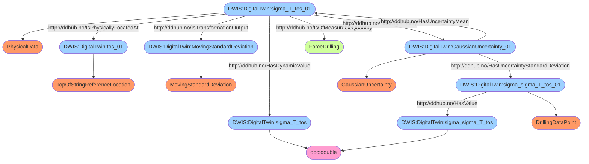

# Semantic Facts for `PressureTopOfString`
```DWIS
DWIS:DigitalTwin:p_tos BelongsToClass opc:double .
DWIS:DigitalTwin:sigma_p_tos BelongsToClass opc:double .
DWIS:DigitalTwin:p_tos#01 BelongsToClass PhysicalData .
DWIS:DigitalTwin:tos#01 BelongsToClass TopOfStringReferenceLocation .
DWIS:DigitalTwin:AbsolutePressure BelongsToClass AbsolutePressureReference .
DWIS:DigitalTwin:MovingAverage BelongsToClass MovingAverage .
DWIS:DigitalTwin:sigma_p_tos#01 BelongsToClass DrillingDataPoint .
DWIS:DigitalTwin:GaussianUncertainty#01 BelongsToClass GaussianUncertainty .
DWIS:DigitalTwin:p_tos#01 HasDynamicValue DWIS:DigitalTwin:p_tos .
DWIS:DigitalTwin:p_tos#01 IsOfMeasurableQuantity PressureDrilling .
DWIS:DigitalTwin:p_tos#01 IsPhysicallyLocatedAt DWIS:DigitalTwin:tos#01 .
DWIS:DigitalTwin:p_tos#01 HasPressureReferenceType DWIS:DigitalTwin:AbsolutePressure .
DWIS:DigitalTwin:p_tos#01 IsTransformationOutput DWIS:DigitalTwin:MovingAverage .
DWIS:DigitalTwin:sigma_p_tos#01 HasValue DWIS:DigitalTwin:sigma_p_tos .
DWIS:DigitalTwin:p_tos#01 HasUncertainty DWIS:DigitalTwin:GaussianUncertainty#01 .
DWIS:DigitalTwin:GaussianUncertainty#01 HasUncertaintyStandardDeviation DWIS:DigitalTwin:sigma_p_tos#01 .
DWIS:DigitalTwin:GaussianUncertainty#01 HasUncertaintyMean DWIS:DigitalTwin:p_tos#01 .
```

# Semantic Graph for `PressureTopOfString`
```mermaid
flowchart TD
	 classDef typeClass fill:#f96;
	 classDef classClass fill:#9dd0ff;
	 classDef opcClass fill:#ff9dd0;
	 classDef quantityClass fill:#d0ff9d;
	DWIS:DigitalTwin:p_tos([DWIS:DigitalTwin:p_tos]) --> opc:double([opc:double]):::opcClass
	DWIS:DigitalTwin:sigma_p_tos([DWIS:DigitalTwin:sigma_p_tos]) --> opc:double([opc:double]):::opcClass
	DWIS:DigitalTwin:p_tos_01([DWIS:DigitalTwin:p_tos_01]) --> PhysicalData([PhysicalData]):::typeClass
	DWIS:DigitalTwin:tos_01([DWIS:DigitalTwin:tos_01]) --> TopOfStringReferenceLocation([TopOfStringReferenceLocation]):::typeClass
	DWIS:DigitalTwin:AbsolutePressure([DWIS:DigitalTwin:AbsolutePressure]) --> AbsolutePressureReference([AbsolutePressureReference]):::typeClass
	DWIS:DigitalTwin:MovingAverage([DWIS:DigitalTwin:MovingAverage]) --> MovingAverage([MovingAverage]):::typeClass
	DWIS:DigitalTwin:sigma_p_tos_01([DWIS:DigitalTwin:sigma_p_tos_01]) --> DrillingDataPoint([DrillingDataPoint]):::typeClass
	DWIS:DigitalTwin:GaussianUncertainty_01([DWIS:DigitalTwin:GaussianUncertainty_01]) --> GaussianUncertainty([GaussianUncertainty]):::typeClass
	DWIS:DigitalTwin:p_tos_01([DWIS:DigitalTwin:p_tos_01]) -- http://ddhub.no/HasDynamicValue --> DWIS:DigitalTwin:p_tos([DWIS:DigitalTwin:p_tos]):::classClass
	DWIS:DigitalTwin:p_tos_01([DWIS:DigitalTwin:p_tos_01]) -- http://ddhub.no/IsOfMeasurableQuantity --> PressureDrilling([PressureDrilling]):::quantityClass
	DWIS:DigitalTwin:p_tos_01([DWIS:DigitalTwin:p_tos_01]) -- http://ddhub.no/IsPhysicallyLocatedAt --> DWIS:DigitalTwin:tos_01([DWIS:DigitalTwin:tos_01]):::classClass
	DWIS:DigitalTwin:p_tos_01([DWIS:DigitalTwin:p_tos_01]) -- http://ddhub.no/HasPressureReferenceType --> DWIS:DigitalTwin:AbsolutePressure([DWIS:DigitalTwin:AbsolutePressure]):::classClass
	DWIS:DigitalTwin:p_tos_01([DWIS:DigitalTwin:p_tos_01]) -- http://ddhub.no/IsTransformationOutput --> DWIS:DigitalTwin:MovingAverage([DWIS:DigitalTwin:MovingAverage]):::classClass
	DWIS:DigitalTwin:sigma_p_tos_01([DWIS:DigitalTwin:sigma_p_tos_01]) -- http://ddhub.no/HasValue --> DWIS:DigitalTwin:sigma_p_tos([DWIS:DigitalTwin:sigma_p_tos]):::classClass
	DWIS:DigitalTwin:p_tos_01([DWIS:DigitalTwin:p_tos_01]) -- http://ddhub.no/HasUncertainty --> DWIS:DigitalTwin:GaussianUncertainty_01([DWIS:DigitalTwin:GaussianUncertainty_01]):::classClass
	DWIS:DigitalTwin:GaussianUncertainty_01([DWIS:DigitalTwin:GaussianUncertainty_01]) -- http://ddhub.no/HasUncertaintyStandardDeviation --> DWIS:DigitalTwin:sigma_p_tos_01([DWIS:DigitalTwin:sigma_p_tos_01]):::classClass
	DWIS:DigitalTwin:GaussianUncertainty_01([DWIS:DigitalTwin:GaussianUncertainty_01]) -- http://ddhub.no/HasUncertaintyMean --> DWIS:DigitalTwin:p_tos_01([DWIS:DigitalTwin:p_tos_01]):::classClass
```

# Semantic Facts for `StandardDeviationPressureTopOfString`
```DWIS
DWIS:DigitalTwin:sigma_p_tos BelongsToClass opc:double .
DWIS:DigitalTwin:sigma_sigma_p_tos BelongsToClass opc:double .
DWIS:DigitalTwin:sigma_p_tos#01 BelongsToClass PhysicalData .
DWIS:DigitalTwin:tos#01 BelongsToClass TopOfStringReferenceLocation .
DWIS:DigitalTwin:AbsolutePressure BelongsToClass AbsolutePressureReference .
DWIS:DigitalTwin:MovingStandardDeviation BelongsToClass MovingStandardDeviation .
DWIS:DigitalTwin:sigma_sigma_p_tos#01 BelongsToClass DrillingDataPoint .
DWIS:DigitalTwin:GaussianUncertainty#01 BelongsToClass GaussianUncertainty .
DWIS:DigitalTwin:sigma_p_tos#01 HasDynamicValue DWIS:DigitalTwin:sigma_p_tos .
DWIS:DigitalTwin:sigma_p_tos#01 IsOfMeasurableQuantity PressureDrilling .
DWIS:DigitalTwin:sigma_p_tos#01 IsPhysicallyLocatedAt DWIS:DigitalTwin:tos#01 .
DWIS:DigitalTwin:sigma_p_tos#01 HasPressureReferenceType DWIS:DigitalTwin:AbsolutePressure .
DWIS:DigitalTwin:sigma_p_tos#01 IsTransformationOutput DWIS:DigitalTwin:MovingStandardDeviation .
DWIS:DigitalTwin:sigma_sigma_p_tos#01 HasValue DWIS:DigitalTwin:sigma_sigma_p_tos .
DWIS:DigitalTwin:sigma_p_tos#01 HasUncertainty DWIS:DigitalTwin:GaussianUncertainty#01 .
DWIS:DigitalTwin:GaussianUncertainty#01 HasUncertaintyStandardDeviation DWIS:DigitalTwin:sigma_sigma_p_tos#01 .
DWIS:DigitalTwin:GaussianUncertainty#01 HasUncertaintyMean DWIS:DigitalTwin:sigma_p_tos#01 .
```

# Semantic Graph for `StandardDeviationPressureTopOfString`
```mermaid
flowchart TD
	 classDef typeClass fill:#f96;
	 classDef classClass fill:#9dd0ff;
	 classDef opcClass fill:#ff9dd0;
	 classDef quantityClass fill:#d0ff9d;
	DWIS:DigitalTwin:sigma_p_tos([DWIS:DigitalTwin:sigma_p_tos]) --> opc:double([opc:double]):::opcClass
	DWIS:DigitalTwin:sigma_sigma_p_tos([DWIS:DigitalTwin:sigma_sigma_p_tos]) --> opc:double([opc:double]):::opcClass
	DWIS:DigitalTwin:sigma_p_tos_01([DWIS:DigitalTwin:sigma_p_tos_01]) --> PhysicalData([PhysicalData]):::typeClass
	DWIS:DigitalTwin:tos_01([DWIS:DigitalTwin:tos_01]) --> TopOfStringReferenceLocation([TopOfStringReferenceLocation]):::typeClass
	DWIS:DigitalTwin:AbsolutePressure([DWIS:DigitalTwin:AbsolutePressure]) --> AbsolutePressureReference([AbsolutePressureReference]):::typeClass
	DWIS:DigitalTwin:MovingStandardDeviation([DWIS:DigitalTwin:MovingStandardDeviation]) --> MovingStandardDeviation([MovingStandardDeviation]):::typeClass
	DWIS:DigitalTwin:sigma_sigma_p_tos_01([DWIS:DigitalTwin:sigma_sigma_p_tos_01]) --> DrillingDataPoint([DrillingDataPoint]):::typeClass
	DWIS:DigitalTwin:GaussianUncertainty_01([DWIS:DigitalTwin:GaussianUncertainty_01]) --> GaussianUncertainty([GaussianUncertainty]):::typeClass
	DWIS:DigitalTwin:sigma_p_tos_01([DWIS:DigitalTwin:sigma_p_tos_01]) -- http://ddhub.no/HasDynamicValue --> DWIS:DigitalTwin:sigma_p_tos([DWIS:DigitalTwin:sigma_p_tos]):::classClass
	DWIS:DigitalTwin:sigma_p_tos_01([DWIS:DigitalTwin:sigma_p_tos_01]) -- http://ddhub.no/IsOfMeasurableQuantity --> PressureDrilling([PressureDrilling]):::quantityClass
	DWIS:DigitalTwin:sigma_p_tos_01([DWIS:DigitalTwin:sigma_p_tos_01]) -- http://ddhub.no/IsPhysicallyLocatedAt --> DWIS:DigitalTwin:tos_01([DWIS:DigitalTwin:tos_01]):::classClass
	DWIS:DigitalTwin:sigma_p_tos_01([DWIS:DigitalTwin:sigma_p_tos_01]) -- http://ddhub.no/HasPressureReferenceType --> DWIS:DigitalTwin:AbsolutePressure([DWIS:DigitalTwin:AbsolutePressure]):::classClass
	DWIS:DigitalTwin:sigma_p_tos_01([DWIS:DigitalTwin:sigma_p_tos_01]) -- http://ddhub.no/IsTransformationOutput --> DWIS:DigitalTwin:MovingStandardDeviation([DWIS:DigitalTwin:MovingStandardDeviation]):::classClass
	DWIS:DigitalTwin:sigma_sigma_p_tos_01([DWIS:DigitalTwin:sigma_sigma_p_tos_01]) -- http://ddhub.no/HasValue --> DWIS:DigitalTwin:sigma_sigma_p_tos([DWIS:DigitalTwin:sigma_sigma_p_tos]):::classClass
	DWIS:DigitalTwin:sigma_p_tos_01([DWIS:DigitalTwin:sigma_p_tos_01]) -- http://ddhub.no/HasUncertainty --> DWIS:DigitalTwin:GaussianUncertainty_01([DWIS:DigitalTwin:GaussianUncertainty_01]):::classClass
	DWIS:DigitalTwin:GaussianUncertainty_01([DWIS:DigitalTwin:GaussianUncertainty_01]) -- http://ddhub.no/HasUncertaintyStandardDeviation --> DWIS:DigitalTwin:sigma_sigma_p_tos_01([DWIS:DigitalTwin:sigma_sigma_p_tos_01]):::classClass
	DWIS:DigitalTwin:GaussianUncertainty_01([DWIS:DigitalTwin:GaussianUncertainty_01]) -- http://ddhub.no/HasUncertaintyMean --> DWIS:DigitalTwin:sigma_p_tos_01([DWIS:DigitalTwin:sigma_p_tos_01]):::classClass
```

# Semantic Facts for `TorqueTopOfString`
```DWIS
DWIS:DigitalTwin:trq_tos BelongsToClass opc:double .
DWIS:DigitalTwin:sigma_trq_tos BelongsToClass opc:double .
DWIS:DigitalTwin:trq_tos#01 BelongsToClass PhysicalData .
DWIS:DigitalTwin:tos#01 BelongsToClass TopOfStringReferenceLocation .
DWIS:DigitalTwin:MovingAverage BelongsToClass MovingAverage .
DWIS:DigitalTwin:sigma_trq_tos#01 BelongsToClass DrillingDataPoint .
DWIS:DigitalTwin:GaussianUncertainty#01 BelongsToClass GaussianUncertainty .
DWIS:DigitalTwin:trq_tos#01 HasDynamicValue DWIS:DigitalTwin:trq_tos .
DWIS:DigitalTwin:trq_tos#01 IsOfMeasurableQuantity TorqueDrilling .
DWIS:DigitalTwin:trq_tos#01 IsPhysicallyLocatedAt DWIS:DigitalTwin:tos#01 .
DWIS:DigitalTwin:trq_tos#01 IsTransformationOutput DWIS:DigitalTwin:MovingAverage .
DWIS:DigitalTwin:sigma_trq_tos#01 HasValue DWIS:DigitalTwin:sigma_trq_tos .
DWIS:DigitalTwin:trq_tos#01 HasUncertainty DWIS:DigitalTwin:GaussianUncertainty#01 .
DWIS:DigitalTwin:GaussianUncertainty#01 HasUncertaintyStandardDeviation DWIS:DigitalTwin:sigma_trq_tos#01 .
DWIS:DigitalTwin:GaussianUncertainty#01 HasUncertaintyMean DWIS:DigitalTwin:trq_tos#01 .
```

# Semantic Graph for `TorqueTopOfString`
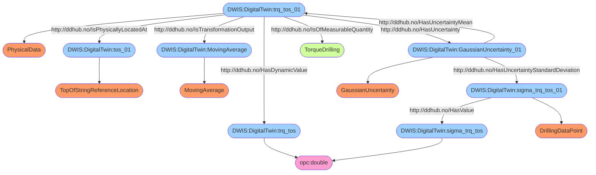

# Semantic Facts for `StandardDeviationTorqueTopOfString`
```DWIS
DWIS:DigitalTwin:sigma_trq_tos BelongsToClass opc:double .
DWIS:DigitalTwin:sigma_sigma_trq_tos BelongsToClass opc:double .
DWIS:DigitalTwin:sigma_trq_tos#01 BelongsToClass PhysicalData .
DWIS:DigitalTwin:tos#01 BelongsToClass TopOfStringReferenceLocation .
DWIS:DigitalTwin:MovingStandardDeviation BelongsToClass MovingStandardDeviation .
DWIS:DigitalTwin:sigma_sigma_trq_tos#01 BelongsToClass DrillingDataPoint .
DWIS:DigitalTwin:GaussianUncertainty#01 BelongsToClass GaussianUncertainty .
DWIS:DigitalTwin:sigma_trq_tos#01 HasDynamicValue DWIS:DigitalTwin:sigma_trq_tos .
DWIS:DigitalTwin:sigma_trq_tos#01 IsOfMeasurableQuantity TorqueDrilling .
DWIS:DigitalTwin:sigma_trq_tos#01 IsPhysicallyLocatedAt DWIS:DigitalTwin:tos#01 .
DWIS:DigitalTwin:sigma_trq_tos#01 IsTransformationOutput DWIS:DigitalTwin:MovingStandardDeviation .
DWIS:DigitalTwin:sigma_sigma_trq_tos#01 HasValue DWIS:DigitalTwin:sigma_sigma_trq_tos .
DWIS:DigitalTwin:sigma_trq_tos#01 HasUncertainty DWIS:DigitalTwin:GaussianUncertainty#01 .
DWIS:DigitalTwin:GaussianUncertainty#01 HasUncertaintyStandardDeviation DWIS:DigitalTwin:sigma_sigma_trq_tos#01 .
DWIS:DigitalTwin:GaussianUncertainty#01 HasUncertaintyMean DWIS:DigitalTwin:sigma_trq_tos#01 .
```

# Semantic Graph for `StandardDeviationTorqueTopOfString`


# Semantic Facts for `FlowAnnulusOutlet`
```DWIS
DWIS:DigitalTwin:Q_out BelongsToClass opc:double .
DWIS:DigitalTwin:sigma_Q_out BelongsToClass opc:double .
DWIS:DigitalTwin:Q_out#01 BelongsToClass PhysicalData .
DWIS:DigitalTwin:AnnulusTerminator#01 BelongsToClass WellControlSystem .
DWIS:DigitalTwin:Logical_AnnulusTerminator#01 BelongsToClass HydraulicLogicalElement .
DWIS:DigitalTwin:LiquidComponent#01 BelongsToClass LiquidComponent .
DWIS:DigitalTwin:SolidComponent#01 BelongsToClass SolidComponent .
DWIS:DigitalTwin:GasComponent#01 BelongsToClass GasComponent .
DWIS:DigitalTwin:MovingAverage BelongsToClass MovingAverage .
DWIS:DigitalTwin:sigma_Q_out#01 BelongsToClass DrillingDataPoint .
DWIS:DigitalTwin:GaussianUncertainty#01 BelongsToClass GaussianUncertainty .
DWIS:DigitalTwin:Q_out#01 HasDynamicValue DWIS:DigitalTwin:Q_out .
DWIS:DigitalTwin:Q_out#01 IsOfMeasurableQuantity VolumetricFlowrateDrilling .
DWIS:DigitalTwin:Logical_AnnulusTerminator#01 IsAHydraulicRepresentationFor DWIS:DigitalTwin:AnnulusTerminator#01 .
DWIS:DigitalTwin:Q_out#01 IsHydraulicallyLocatedAt DWIS:DigitalTwin:Logical_AnnulusTerminator#01 .
DWIS:DigitalTwin:Q_out#01 ConcernsAFluidComponent DWIS:DigitalTwin:LiquidComponent#01 .
DWIS:DigitalTwin:Q_out#01 ConcernsAFluidComponent DWIS:DigitalTwin:SolidComponent#01 .
DWIS:DigitalTwin:Q_out#01 ConcernsAFluidComponent DWIS:DigitalTwin:GasComponent#01 .
DWIS:DigitalTwin:Q_out#01 IsTransformationOutput DWIS:DigitalTwin:MovingAverage .
DWIS:DigitalTwin:sigma_Q_out#01 HasValue DWIS:DigitalTwin:sigma_Q_out .
DWIS:DigitalTwin:Q_out#01 HasUncertainty DWIS:DigitalTwin:GaussianUncertainty#01 .
DWIS:DigitalTwin:GaussianUncertainty#01 HasUncertaintyStandardDeviation DWIS:DigitalTwin:sigma_Q_out#01 .
DWIS:DigitalTwin:GaussianUncertainty#01 HasUncertaintyMean DWIS:DigitalTwin:Q_out#01 .
```

# Semantic Graph for `FlowAnnulusOutlet`
```mermaid
flowchart TD
	 classDef typeClass fill:#f96;
	 classDef classClass fill:#9dd0ff;
	 classDef opcClass fill:#ff9dd0;
	 classDef quantityClass fill:#d0ff9d;
	DWIS:DigitalTwin:Q_out([DWIS:DigitalTwin:Q_out]) --> opc:double([opc:double]):::opcClass
	DWIS:DigitalTwin:sigma_Q_out([DWIS:DigitalTwin:sigma_Q_out]) --> opc:double([opc:double]):::opcClass
	DWIS:DigitalTwin:Q_out_01([DWIS:DigitalTwin:Q_out_01]) --> PhysicalData([PhysicalData]):::typeClass
	DWIS:DigitalTwin:AnnulusTerminator_01([DWIS:DigitalTwin:AnnulusTerminator_01]) --> WellControlSystem([WellControlSystem]):::typeClass
	DWIS:DigitalTwin:Logical_AnnulusTerminator_01([DWIS:DigitalTwin:Logical_AnnulusTerminator_01]) --> HydraulicLogicalElement([HydraulicLogicalElement]):::typeClass
	DWIS:DigitalTwin:LiquidComponent_01([DWIS:DigitalTwin:LiquidComponent_01]) --> LiquidComponent([LiquidComponent]):::typeClass
	DWIS:DigitalTwin:SolidComponent_01([DWIS:DigitalTwin:SolidComponent_01]) --> SolidComponent([SolidComponent]):::typeClass
	DWIS:DigitalTwin:GasComponent_01([DWIS:DigitalTwin:GasComponent_01]) --> GasComponent([GasComponent]):::typeClass
	DWIS:DigitalTwin:MovingAverage([DWIS:DigitalTwin:MovingAverage]) --> MovingAverage([MovingAverage]):::typeClass
	DWIS:DigitalTwin:sigma_Q_out_01([DWIS:DigitalTwin:sigma_Q_out_01]) --> DrillingDataPoint([DrillingDataPoint]):::typeClass
	DWIS:DigitalTwin:GaussianUncertainty_01([DWIS:DigitalTwin:GaussianUncertainty_01]) --> GaussianUncertainty([GaussianUncertainty]):::typeClass
	DWIS:DigitalTwin:Q_out_01([DWIS:DigitalTwin:Q_out_01]) -- http://ddhub.no/HasDynamicValue --> DWIS:DigitalTwin:Q_out([DWIS:DigitalTwin:Q_out]):::classClass
	DWIS:DigitalTwin:Q_out_01([DWIS:DigitalTwin:Q_out_01]) -- http://ddhub.no/IsOfMeasurableQuantity --> VolumetricFlowrateDrilling([VolumetricFlowrateDrilling]):::quantityClass
	DWIS:DigitalTwin:Logical_AnnulusTerminator_01([DWIS:DigitalTwin:Logical_AnnulusTerminator_01]) -- http://ddhub.no/IsAHydraulicRepresentationFor --> DWIS:DigitalTwin:AnnulusTerminator_01([DWIS:DigitalTwin:AnnulusTerminator_01]):::classClass
	DWIS:DigitalTwin:Q_out_01([DWIS:DigitalTwin:Q_out_01]) -- http://ddhub.no/IsHydraulicallyLocatedAt --> DWIS:DigitalTwin:Logical_AnnulusTerminator_01([DWIS:DigitalTwin:Logical_AnnulusTerminator_01]):::classClass
	DWIS:DigitalTwin:Q_out_01([DWIS:DigitalTwin:Q_out_01]) -- http://ddhub.no/ConcernsAFluidComponent --> DWIS:DigitalTwin:LiquidComponent_01([DWIS:DigitalTwin:LiquidComponent_01]):::classClass
	DWIS:DigitalTwin:Q_out_01([DWIS:DigitalTwin:Q_out_01]) -- http://ddhub.no/ConcernsAFluidComponent --> DWIS:DigitalTwin:SolidComponent_01([DWIS:DigitalTwin:SolidComponent_01]):::classClass
	DWIS:DigitalTwin:Q_out_01([DWIS:DigitalTwin:Q_out_01]) -- http://ddhub.no/ConcernsAFluidComponent --> DWIS:DigitalTwin:GasComponent_01([DWIS:DigitalTwin:GasComponent_01]):::classClass
	DWIS:DigitalTwin:Q_out_01([DWIS:DigitalTwin:Q_out_01]) -- http://ddhub.no/IsTransformationOutput --> DWIS:DigitalTwin:MovingAverage([DWIS:DigitalTwin:MovingAverage]):::classClass
	DWIS:DigitalTwin:sigma_Q_out_01([DWIS:DigitalTwin:sigma_Q_out_01]) -- http://ddhub.no/HasValue --> DWIS:DigitalTwin:sigma_Q_out([DWIS:DigitalTwin:sigma_Q_out]):::classClass
	DWIS:DigitalTwin:Q_out_01([DWIS:DigitalTwin:Q_out_01]) -- http://ddhub.no/HasUncertainty --> DWIS:DigitalTwin:GaussianUncertainty_01([DWIS:DigitalTwin:GaussianUncertainty_01]):::classClass
	DWIS:DigitalTwin:GaussianUncertainty_01([DWIS:DigitalTwin:GaussianUncertainty_01]) -- http://ddhub.no/HasUncertaintyStandardDeviation --> DWIS:DigitalTwin:sigma_Q_out_01([DWIS:DigitalTwin:sigma_Q_out_01]):::classClass
	DWIS:DigitalTwin:GaussianUncertainty_01([DWIS:DigitalTwin:GaussianUncertainty_01]) -- http://ddhub.no/HasUncertaintyMean --> DWIS:DigitalTwin:Q_out_01([DWIS:DigitalTwin:Q_out_01]):::classClass
```

# Semantic Facts for `StandardDeviationFlowAnnulusOutlet`
```DWIS
DWIS:DigitalTwin:sigma_Q_out BelongsToClass opc:double .
DWIS:DigitalTwin:sigma_sigma_Q_out BelongsToClass opc:double .
DWIS:DigitalTwin:sigma_Q_out#01 BelongsToClass PhysicalData .
DWIS:DigitalTwin:AnnulusTerminator#01 BelongsToClass WellControlSystem .
DWIS:DigitalTwin:Logical_AnnulusTerminator#01 BelongsToClass HydraulicLogicalElement .
DWIS:DigitalTwin:MovingStandardDeviation BelongsToClass MovingStandardDeviation .
DWIS:DigitalTwin:LiquidComponent#01 BelongsToClass LiquidComponent .
DWIS:DigitalTwin:SolidComponent#01 BelongsToClass SolidComponent .
DWIS:DigitalTwin:GasComponent#01 BelongsToClass GasComponent .
DWIS:DigitalTwin:sigma_sigma_Q_out#01 BelongsToClass DrillingDataPoint .
DWIS:DigitalTwin:GaussianUncertainty#01 BelongsToClass GaussianUncertainty .
DWIS:DigitalTwin:sigma_Q_out#01 HasDynamicValue DWIS:DigitalTwin:sigma_Q_out .
DWIS:DigitalTwin:sigma_Q_out#01 IsOfMeasurableQuantity VolumetricFlowrateDrilling .
DWIS:DigitalTwin:Logical_AnnulusTerminator#01 IsAHydraulicRepresentationFor DWIS:DigitalTwin:AnnulusTerminator#01 .
DWIS:DigitalTwin:sigma_Q_out#01 IsHydraulicallyLocatedAt DWIS:DigitalTwin:Logical_AnnulusTerminator#01 .
DWIS:DigitalTwin:sigma_Q_out#01 IsTransformationOutput DWIS:DigitalTwin:MovingStandardDeviation .
DWIS:DigitalTwin:sigma_Q_out#01 ConcernsAFluidComponent DWIS:DigitalTwin:LiquidComponent#01 .
DWIS:DigitalTwin:sigma_Q_out#01 ConcernsAFluidComponent DWIS:DigitalTwin:SolidComponent#01 .
DWIS:DigitalTwin:sigma_Q_out#01 ConcernsAFluidComponent DWIS:DigitalTwin:GasComponent#01 .
DWIS:DigitalTwin:sigma_sigma_Q_out#01 HasValue DWIS:DigitalTwin:sigma_sigma_Q_out .
DWIS:DigitalTwin:sigma_Q_out#01 HasUncertainty DWIS:DigitalTwin:GaussianUncertainty#01 .
DWIS:DigitalTwin:GaussianUncertainty#01 HasUncertaintyStandardDeviation DWIS:DigitalTwin:sigma_sigma_Q_out#01 .
DWIS:DigitalTwin:GaussianUncertainty#01 HasUncertaintyMean DWIS:DigitalTwin:sigma_Q_out#01 .
```

# Semantic Graph for `StandardDeviationFlowAnnulusOutlet`
```mermaid
flowchart TD
	 classDef typeClass fill:#f96;
	 classDef classClass fill:#9dd0ff;
	 classDef opcClass fill:#ff9dd0;
	 classDef quantityClass fill:#d0ff9d;
	DWIS:DigitalTwin:sigma_Q_out([DWIS:DigitalTwin:sigma_Q_out]) --> opc:double([opc:double]):::opcClass
	DWIS:DigitalTwin:sigma_sigma_Q_out([DWIS:DigitalTwin:sigma_sigma_Q_out]) --> opc:double([opc:double]):::opcClass
	DWIS:DigitalTwin:sigma_Q_out_01([DWIS:DigitalTwin:sigma_Q_out_01]) --> PhysicalData([PhysicalData]):::typeClass
	DWIS:DigitalTwin:AnnulusTerminator_01([DWIS:DigitalTwin:AnnulusTerminator_01]) --> WellControlSystem([WellControlSystem]):::typeClass
	DWIS:DigitalTwin:Logical_AnnulusTerminator_01([DWIS:DigitalTwin:Logical_AnnulusTerminator_01]) --> HydraulicLogicalElement([HydraulicLogicalElement]):::typeClass
	DWIS:DigitalTwin:MovingStandardDeviation([DWIS:DigitalTwin:MovingStandardDeviation]) --> MovingStandardDeviation([MovingStandardDeviation]):::typeClass
	DWIS:DigitalTwin:LiquidComponent_01([DWIS:DigitalTwin:LiquidComponent_01]) --> LiquidComponent([LiquidComponent]):::typeClass
	DWIS:DigitalTwin:SolidComponent_01([DWIS:DigitalTwin:SolidComponent_01]) --> SolidComponent([SolidComponent]):::typeClass
	DWIS:DigitalTwin:GasComponent_01([DWIS:DigitalTwin:GasComponent_01]) --> GasComponent([GasComponent]):::typeClass
	DWIS:DigitalTwin:sigma_sigma_Q_out_01([DWIS:DigitalTwin:sigma_sigma_Q_out_01]) --> DrillingDataPoint([DrillingDataPoint]):::typeClass
	DWIS:DigitalTwin:GaussianUncertainty_01([DWIS:DigitalTwin:GaussianUncertainty_01]) --> GaussianUncertainty([GaussianUncertainty]):::typeClass
	DWIS:DigitalTwin:sigma_Q_out_01([DWIS:DigitalTwin:sigma_Q_out_01]) -- http://ddhub.no/HasDynamicValue --> DWIS:DigitalTwin:sigma_Q_out([DWIS:DigitalTwin:sigma_Q_out]):::classClass
	DWIS:DigitalTwin:sigma_Q_out_01([DWIS:DigitalTwin:sigma_Q_out_01]) -- http://ddhub.no/IsOfMeasurableQuantity --> VolumetricFlowrateDrilling([VolumetricFlowrateDrilling]):::quantityClass
	DWIS:DigitalTwin:Logical_AnnulusTerminator_01([DWIS:DigitalTwin:Logical_AnnulusTerminator_01]) -- http://ddhub.no/IsAHydraulicRepresentationFor --> DWIS:DigitalTwin:AnnulusTerminator_01([DWIS:DigitalTwin:AnnulusTerminator_01]):::classClass
	DWIS:DigitalTwin:sigma_Q_out_01([DWIS:DigitalTwin:sigma_Q_out_01]) -- http://ddhub.no/IsHydraulicallyLocatedAt --> DWIS:DigitalTwin:Logical_AnnulusTerminator_01([DWIS:DigitalTwin:Logical_AnnulusTerminator_01]):::classClass
	DWIS:DigitalTwin:sigma_Q_out_01([DWIS:DigitalTwin:sigma_Q_out_01]) -- http://ddhub.no/IsTransformationOutput --> DWIS:DigitalTwin:MovingStandardDeviation([DWIS:DigitalTwin:MovingStandardDeviation]):::classClass
	DWIS:DigitalTwin:sigma_Q_out_01([DWIS:DigitalTwin:sigma_Q_out_01]) -- http://ddhub.no/ConcernsAFluidComponent --> DWIS:DigitalTwin:LiquidComponent_01([DWIS:DigitalTwin:LiquidComponent_01]):::classClass
	DWIS:DigitalTwin:sigma_Q_out_01([DWIS:DigitalTwin:sigma_Q_out_01]) -- http://ddhub.no/ConcernsAFluidComponent --> DWIS:DigitalTwin:SolidComponent_01([DWIS:DigitalTwin:SolidComponent_01]):::classClass
	DWIS:DigitalTwin:sigma_Q_out_01([DWIS:DigitalTwin:sigma_Q_out_01]) -- http://ddhub.no/ConcernsAFluidComponent --> DWIS:DigitalTwin:GasComponent_01([DWIS:DigitalTwin:GasComponent_01]):::classClass
	DWIS:DigitalTwin:sigma_sigma_Q_out_01([DWIS:DigitalTwin:sigma_sigma_Q_out_01]) -- http://ddhub.no/HasValue --> DWIS:DigitalTwin:sigma_sigma_Q_out([DWIS:DigitalTwin:sigma_sigma_Q_out]):::classClass
	DWIS:DigitalTwin:sigma_Q_out_01([DWIS:DigitalTwin:sigma_Q_out_01]) -- http://ddhub.no/HasUncertainty --> DWIS:DigitalTwin:GaussianUncertainty_01([DWIS:DigitalTwin:GaussianUncertainty_01]):::classClass
	DWIS:DigitalTwin:GaussianUncertainty_01([DWIS:DigitalTwin:GaussianUncertainty_01]) -- http://ddhub.no/HasUncertaintyStandardDeviation --> DWIS:DigitalTwin:sigma_sigma_Q_out_01([DWIS:DigitalTwin:sigma_sigma_Q_out_01]):::classClass
	DWIS:DigitalTwin:GaussianUncertainty_01([DWIS:DigitalTwin:GaussianUncertainty_01]) -- http://ddhub.no/HasUncertaintyMean --> DWIS:DigitalTwin:sigma_Q_out_01([DWIS:DigitalTwin:sigma_Q_out_01]):::classClass
```

# Semantic Facts for `FlowCuttingsAnnulusOutlet`
```DWIS
DWIS:DigitalTwin:Q_cuttings_out BelongsToClass opc:double .
DWIS:DigitalTwin:sigma_Q_cuttings_out BelongsToClass opc:double .
DWIS:DigitalTwin:Q_cuttings_out#01 BelongsToClass PhysicalData .
DWIS:DigitalTwin:AnnulusTerminator#01 BelongsToClass WellControlSystem .
DWIS:DigitalTwin:Logical_AnnulusTerminator#01 BelongsToClass HydraulicLogicalElement .
DWIS:DigitalTwin:MovingAverage BelongsToClass MovingAverage .
DWIS:DigitalTwin:CuttingsComponent#01 BelongsToClass CuttingsComponent .
DWIS:DigitalTwin:sigma_Q_cuttings_out#01 BelongsToClass DrillingDataPoint .
DWIS:DigitalTwin:GaussianUncertainty#01 BelongsToClass GaussianUncertainty .
DWIS:DigitalTwin:Q_cuttings_out#01 HasDynamicValue DWIS:DigitalTwin:Q_cuttings_out .
DWIS:DigitalTwin:Q_cuttings_out#01 IsOfMeasurableQuantity VolumetricFlowrateDrilling .
DWIS:DigitalTwin:Logical_AnnulusTerminator#01 IsAHydraulicRepresentationFor DWIS:DigitalTwin:AnnulusTerminator#01 .
DWIS:DigitalTwin:Q_cuttings_out#01 IsHydraulicallyLocatedAt DWIS:DigitalTwin:Logical_AnnulusTerminator#01 .
DWIS:DigitalTwin:Q_cuttings_out#01 IsTransformationOutput DWIS:DigitalTwin:MovingAverage .
DWIS:DigitalTwin:Q_cuttings_out#01 ConcernsAFluidComponent DWIS:DigitalTwin:CuttingsComponent#01 .
DWIS:DigitalTwin:sigma_Q_cuttings_out#01 HasValue DWIS:DigitalTwin:sigma_Q_cuttings_out .
DWIS:DigitalTwin:Q_cuttings_out#01 HasUncertainty DWIS:DigitalTwin:GaussianUncertainty#01 .
DWIS:DigitalTwin:GaussianUncertainty#01 HasUncertaintyStandardDeviation DWIS:DigitalTwin:sigma_Q_cuttings_out#01 .
DWIS:DigitalTwin:GaussianUncertainty#01 HasUncertaintyMean DWIS:DigitalTwin:Q_cuttings_out#01 .
```

# Semantic Graph for `FlowCuttingsAnnulusOutlet`
```mermaid
flowchart TD
	 classDef typeClass fill:#f96;
	 classDef classClass fill:#9dd0ff;
	 classDef opcClass fill:#ff9dd0;
	 classDef quantityClass fill:#d0ff9d;
	DWIS:DigitalTwin:Q_cuttings_out([DWIS:DigitalTwin:Q_cuttings_out]) --> opc:double([opc:double]):::opcClass
	DWIS:DigitalTwin:sigma_Q_cuttings_out([DWIS:DigitalTwin:sigma_Q_cuttings_out]) --> opc:double([opc:double]):::opcClass
	DWIS:DigitalTwin:Q_cuttings_out_01([DWIS:DigitalTwin:Q_cuttings_out_01]) --> PhysicalData([PhysicalData]):::typeClass
	DWIS:DigitalTwin:AnnulusTerminator_01([DWIS:DigitalTwin:AnnulusTerminator_01]) --> WellControlSystem([WellControlSystem]):::typeClass
	DWIS:DigitalTwin:Logical_AnnulusTerminator_01([DWIS:DigitalTwin:Logical_AnnulusTerminator_01]) --> HydraulicLogicalElement([HydraulicLogicalElement]):::typeClass
	DWIS:DigitalTwin:MovingAverage([DWIS:DigitalTwin:MovingAverage]) --> MovingAverage([MovingAverage]):::typeClass
	DWIS:DigitalTwin:CuttingsComponent_01([DWIS:DigitalTwin:CuttingsComponent_01]) --> CuttingsComponent([CuttingsComponent]):::typeClass
	DWIS:DigitalTwin:sigma_Q_cuttings_out_01([DWIS:DigitalTwin:sigma_Q_cuttings_out_01]) --> DrillingDataPoint([DrillingDataPoint]):::typeClass
	DWIS:DigitalTwin:GaussianUncertainty_01([DWIS:DigitalTwin:GaussianUncertainty_01]) --> GaussianUncertainty([GaussianUncertainty]):::typeClass
	DWIS:DigitalTwin:Q_cuttings_out_01([DWIS:DigitalTwin:Q_cuttings_out_01]) -- http://ddhub.no/HasDynamicValue --> DWIS:DigitalTwin:Q_cuttings_out([DWIS:DigitalTwin:Q_cuttings_out]):::classClass
	DWIS:DigitalTwin:Q_cuttings_out_01([DWIS:DigitalTwin:Q_cuttings_out_01]) -- http://ddhub.no/IsOfMeasurableQuantity --> VolumetricFlowrateDrilling([VolumetricFlowrateDrilling]):::quantityClass
	DWIS:DigitalTwin:Logical_AnnulusTerminator_01([DWIS:DigitalTwin:Logical_AnnulusTerminator_01]) -- http://ddhub.no/IsAHydraulicRepresentationFor --> DWIS:DigitalTwin:AnnulusTerminator_01([DWIS:DigitalTwin:AnnulusTerminator_01]):::classClass
	DWIS:DigitalTwin:Q_cuttings_out_01([DWIS:DigitalTwin:Q_cuttings_out_01]) -- http://ddhub.no/IsHydraulicallyLocatedAt --> DWIS:DigitalTwin:Logical_AnnulusTerminator_01([DWIS:DigitalTwin:Logical_AnnulusTerminator_01]):::classClass
	DWIS:DigitalTwin:Q_cuttings_out_01([DWIS:DigitalTwin:Q_cuttings_out_01]) -- http://ddhub.no/IsTransformationOutput --> DWIS:DigitalTwin:MovingAverage([DWIS:DigitalTwin:MovingAverage]):::classClass
	DWIS:DigitalTwin:Q_cuttings_out_01([DWIS:DigitalTwin:Q_cuttings_out_01]) -- http://ddhub.no/ConcernsAFluidComponent --> DWIS:DigitalTwin:CuttingsComponent_01([DWIS:DigitalTwin:CuttingsComponent_01]):::classClass
	DWIS:DigitalTwin:sigma_Q_cuttings_out_01([DWIS:DigitalTwin:sigma_Q_cuttings_out_01]) -- http://ddhub.no/HasValue --> DWIS:DigitalTwin:sigma_Q_cuttings_out([DWIS:DigitalTwin:sigma_Q_cuttings_out]):::classClass
	DWIS:DigitalTwin:Q_cuttings_out_01([DWIS:DigitalTwin:Q_cuttings_out_01]) -- http://ddhub.no/HasUncertainty --> DWIS:DigitalTwin:GaussianUncertainty_01([DWIS:DigitalTwin:GaussianUncertainty_01]):::classClass
	DWIS:DigitalTwin:GaussianUncertainty_01([DWIS:DigitalTwin:GaussianUncertainty_01]) -- http://ddhub.no/HasUncertaintyStandardDeviation --> DWIS:DigitalTwin:sigma_Q_cuttings_out_01([DWIS:DigitalTwin:sigma_Q_cuttings_out_01]):::classClass
	DWIS:DigitalTwin:GaussianUncertainty_01([DWIS:DigitalTwin:GaussianUncertainty_01]) -- http://ddhub.no/HasUncertaintyMean --> DWIS:DigitalTwin:Q_cuttings_out_01([DWIS:DigitalTwin:Q_cuttings_out_01]):::classClass
```

# Semantic Facts for `ForceBottomOfStringOnRock`
```DWIS
DWIS:DigitalTwin:F_bos BelongsToClass opc:double .
DWIS:DigitalTwin:sigma_F_bos BelongsToClass opc:double .
DWIS:DigitalTwin:F_bos#01 BelongsToClass PhysicalData .
DWIS:DigitalTwin:MovingAverage BelongsToClass MovingAverage .
DWIS:DigitalTwin:sigma_F_bos#01 BelongsToClass DrillingDataPoint .
DWIS:DigitalTwin:GaussianUncertainty#01 BelongsToClass GaussianUncertainty .
DWIS:DigitalTwin:F_bos#01 HasDynamicValue DWIS:DigitalTwin:F_bos .
DWIS:DigitalTwin:F_bos#01 IsOfMeasurableQuantity ForceDrilling .
DWIS:DigitalTwin:F_bos#01 IsTransformationOutput DWIS:DigitalTwin:MovingAverage .
DWIS:DigitalTwin:sigma_F_bos#01 HasValue DWIS:DigitalTwin:sigma_F_bos .
DWIS:DigitalTwin:F_bos#01 HasUncertainty DWIS:DigitalTwin:GaussianUncertainty#01 .
DWIS:DigitalTwin:GaussianUncertainty#01 HasUncertaintyStandardDeviation DWIS:DigitalTwin:sigma_F_bos#01 .
DWIS:DigitalTwin:GaussianUncertainty#01 HasUncertaintyMean DWIS:DigitalTwin:F_bos#01 .
```

# Semantic Graph for `ForceBottomOfStringOnRock`
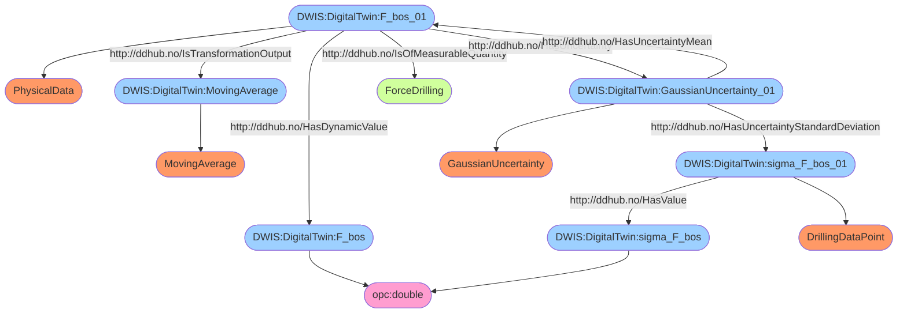

# Semantic Facts for `StandardDeviationForceBottomOfStringOnRock`
```DWIS
DWIS:DigitalTwin:sigma_F_bos BelongsToClass opc:double .
DWIS:DigitalTwin:sigma_sigma_F_bos BelongsToClass opc:double .
DWIS:DigitalTwin:sigma_F_bos#01 BelongsToClass PhysicalData .
DWIS:DigitalTwin:MovingStandardDeviation BelongsToClass MovingStandardDeviation .
DWIS:DigitalTwin:sigma_sigma_F_bos#01 BelongsToClass DrillingDataPoint .
DWIS:DigitalTwin:GaussianUncertainty#01 BelongsToClass GaussianUncertainty .
DWIS:DigitalTwin:sigma_F_bos#01 HasDynamicValue DWIS:DigitalTwin:sigma_F_bos .
DWIS:DigitalTwin:sigma_F_bos#01 IsOfMeasurableQuantity ForceDrilling .
DWIS:DigitalTwin:sigma_F_bos#01 IsTransformationOutput DWIS:DigitalTwin:MovingStandardDeviation .
DWIS:DigitalTwin:sigma_sigma_F_bos#01 HasValue DWIS:DigitalTwin:sigma_sigma_F_bos .
DWIS:DigitalTwin:sigma_F_bos#01 HasUncertainty DWIS:DigitalTwin:GaussianUncertainty#01 .
DWIS:DigitalTwin:GaussianUncertainty#01 HasUncertaintyStandardDeviation DWIS:DigitalTwin:sigma_sigma_F_bos#01 .
DWIS:DigitalTwin:GaussianUncertainty#01 HasUncertaintyMean DWIS:DigitalTwin:sigma_F_bos#01 .
```

# Semantic Graph for `StandardDeviationForceBottomOfStringOnRock`
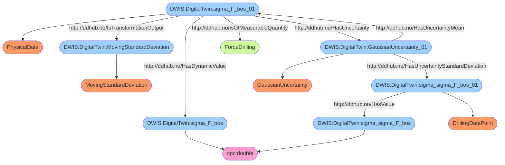

# Semantic Facts for `ForceHoleOpenerOnRock`
```DWIS
DWIS:DigitalTwin:F_urho BelongsToClass opc:double .
DWIS:DigitalTwin:sigma_F_urho BelongsToClass opc:double .
DWIS:DigitalTwin:F_urho#01 BelongsToClass PhysicalData .
DWIS:DigitalTwin:MovingAverage BelongsToClass MovingAverage .
DWIS:DigitalTwin:urho#01 BelongsToClass HoleOpener .
DWIS:DigitalTwin:logical_urho#01 BelongsToClass MechanicalLogicalElement .
DWIS:DigitalTwin:sigma_F_urho#01 BelongsToClass DrillingDataPoint .
DWIS:DigitalTwin:GaussianUncertainty#01 BelongsToClass GaussianUncertainty .
DWIS:DigitalTwin:F_urho#01 HasDynamicValue DWIS:DigitalTwin:F_urho .
DWIS:DigitalTwin:F_urho#01 IsOfMeasurableQuantity ForceDrilling .
DWIS:DigitalTwin:F_urho#01 IsTransformationOutput DWIS:DigitalTwin:MovingAverage .
DWIS:DigitalTwin:logical_urho#01 IsAMechanicalRepresentationFor DWIS:DigitalTwin:urho#01 .
DWIS:DigitalTwin:F_urho#01 IsMechanicallyLocatedAt DWIS:DigitalTwin:logical_urho#01 .
DWIS:DigitalTwin:sigma_F_urho#01 HasValue DWIS:DigitalTwin:sigma_F_urho .
DWIS:DigitalTwin:F_urho#01 HasUncertainty DWIS:DigitalTwin:GaussianUncertainty#01 .
DWIS:DigitalTwin:GaussianUncertainty#01 HasUncertaintyStandardDeviation DWIS:DigitalTwin:sigma_F_urho#01 .
DWIS:DigitalTwin:GaussianUncertainty#01 HasUncertaintyMean DWIS:DigitalTwin:F_urho#01 .
```

# Semantic Graph for `ForceHoleOpenerOnRock`
```mermaid
flowchart TD
	 classDef typeClass fill:#f96;
	 classDef classClass fill:#9dd0ff;
	 classDef opcClass fill:#ff9dd0;
	 classDef quantityClass fill:#d0ff9d;
	DWIS:DigitalTwin:F_urho([DWIS:DigitalTwin:F_urho]) --> opc:double([opc:double]):::opcClass
	DWIS:DigitalTwin:sigma_F_urho([DWIS:DigitalTwin:sigma_F_urho]) --> opc:double([opc:double]):::opcClass
	DWIS:DigitalTwin:F_urho_01([DWIS:DigitalTwin:F_urho_01]) --> PhysicalData([PhysicalData]):::typeClass
	DWIS:DigitalTwin:MovingAverage([DWIS:DigitalTwin:MovingAverage]) --> MovingAverage([MovingAverage]):::typeClass
	DWIS:DigitalTwin:urho_01([DWIS:DigitalTwin:urho_01]) --> HoleOpener([HoleOpener]):::typeClass
	DWIS:DigitalTwin:logical_urho_01([DWIS:DigitalTwin:logical_urho_01]) --> MechanicalLogicalElement([MechanicalLogicalElement]):::typeClass
	DWIS:DigitalTwin:sigma_F_urho_01([DWIS:DigitalTwin:sigma_F_urho_01]) --> DrillingDataPoint([DrillingDataPoint]):::typeClass
	DWIS:DigitalTwin:GaussianUncertainty_01([DWIS:DigitalTwin:GaussianUncertainty_01]) --> GaussianUncertainty([GaussianUncertainty]):::typeClass
	DWIS:DigitalTwin:F_urho_01([DWIS:DigitalTwin:F_urho_01]) -- http://ddhub.no/HasDynamicValue --> DWIS:DigitalTwin:F_urho([DWIS:DigitalTwin:F_urho]):::classClass
	DWIS:DigitalTwin:F_urho_01([DWIS:DigitalTwin:F_urho_01]) -- http://ddhub.no/IsOfMeasurableQuantity --> ForceDrilling([ForceDrilling]):::quantityClass
	DWIS:DigitalTwin:F_urho_01([DWIS:DigitalTwin:F_urho_01]) -- http://ddhub.no/IsTransformationOutput --> DWIS:DigitalTwin:MovingAverage([DWIS:DigitalTwin:MovingAverage]):::classClass
	DWIS:DigitalTwin:logical_urho_01([DWIS:DigitalTwin:logical_urho_01]) -- http://ddhub.no/IsAMechanicalRepresentationFor --> DWIS:DigitalTwin:urho_01([DWIS:DigitalTwin:urho_01]):::classClass
	DWIS:DigitalTwin:F_urho_01([DWIS:DigitalTwin:F_urho_01]) -- http://ddhub.no/IsMechanicallyLocatedAt --> DWIS:DigitalTwin:logical_urho_01([DWIS:DigitalTwin:logical_urho_01]):::classClass
	DWIS:DigitalTwin:sigma_F_urho_01([DWIS:DigitalTwin:sigma_F_urho_01]) -- http://ddhub.no/HasValue --> DWIS:DigitalTwin:sigma_F_urho([DWIS:DigitalTwin:sigma_F_urho]):::classClass
	DWIS:DigitalTwin:F_urho_01([DWIS:DigitalTwin:F_urho_01]) -- http://ddhub.no/HasUncertainty --> DWIS:DigitalTwin:GaussianUncertainty_01([DWIS:DigitalTwin:GaussianUncertainty_01]):::classClass
	DWIS:DigitalTwin:GaussianUncertainty_01([DWIS:DigitalTwin:GaussianUncertainty_01]) -- http://ddhub.no/HasUncertaintyStandardDeviation --> DWIS:DigitalTwin:sigma_F_urho_01([DWIS:DigitalTwin:sigma_F_urho_01]):::classClass
	DWIS:DigitalTwin:GaussianUncertainty_01([DWIS:DigitalTwin:GaussianUncertainty_01]) -- http://ddhub.no/HasUncertaintyMean --> DWIS:DigitalTwin:F_urho_01([DWIS:DigitalTwin:F_urho_01]):::classClass
```

# Semantic Facts for `RotationaVelocityBottomOfString`
```DWIS
DWIS:DigitalTwin:omega_bos BelongsToClass opc:double .
DWIS:DigitalTwin:sigma_omega_bos BelongsToClass opc:double .
DWIS:DigitalTwin:omega_bos#01 BelongsToClass PhysicalData .
DWIS:DigitalTwin:TorsionalMotion BelongsToClass TorsionalMotionType .
DWIS:DigitalTwin:MovingAverage BelongsToClass MovingAverage .
DWIS:DigitalTwin:sigma_omega_bos#01 BelongsToClass DrillingDataPoint .
DWIS:DigitalTwin:GaussianUncertainty#01 BelongsToClass GaussianUncertainty .
DWIS:DigitalTwin:omega_bos#01 HasDynamicValue DWIS:DigitalTwin:omega_bos .
DWIS:DigitalTwin:omega_bos#01 IsOfMeasurableQuantity AngularVelocityDrilling .
DWIS:DigitalTwin:omega_bos#01 HasMotionType DWIS:DigitalTwin:TorsionalMotion .
DWIS:DigitalTwin:omega_bos#01 IsTransformationOutput DWIS:DigitalTwin:MovingAverage .
DWIS:DigitalTwin:sigma_omega_bos#01 HasValue DWIS:DigitalTwin:sigma_omega_bos .
DWIS:DigitalTwin:omega_bos#01 HasUncertainty DWIS:DigitalTwin:GaussianUncertainty#01 .
DWIS:DigitalTwin:GaussianUncertainty#01 HasUncertaintyStandardDeviation DWIS:DigitalTwin:sigma_omega_bos#01 .
DWIS:DigitalTwin:GaussianUncertainty#01 HasUncertaintyMean DWIS:DigitalTwin:omega_bos#01 .
```

# Semantic Graph for `RotationaVelocityBottomOfString`
```mermaid
flowchart TD
	 classDef typeClass fill:#f96;
	 classDef classClass fill:#9dd0ff;
	 classDef opcClass fill:#ff9dd0;
	 classDef quantityClass fill:#d0ff9d;
	DWIS:DigitalTwin:omega_bos([DWIS:DigitalTwin:omega_bos]) --> opc:double([opc:double]):::opcClass
	DWIS:DigitalTwin:sigma_omega_bos([DWIS:DigitalTwin:sigma_omega_bos]) --> opc:double([opc:double]):::opcClass
	DWIS:DigitalTwin:omega_bos_01([DWIS:DigitalTwin:omega_bos_01]) --> PhysicalData([PhysicalData]):::typeClass
	DWIS:DigitalTwin:TorsionalMotion([DWIS:DigitalTwin:TorsionalMotion]) --> TorsionalMotionType([TorsionalMotionType]):::typeClass
	DWIS:DigitalTwin:MovingAverage([DWIS:DigitalTwin:MovingAverage]) --> MovingAverage([MovingAverage]):::typeClass
	DWIS:DigitalTwin:sigma_omega_bos_01([DWIS:DigitalTwin:sigma_omega_bos_01]) --> DrillingDataPoint([DrillingDataPoint]):::typeClass
	DWIS:DigitalTwin:GaussianUncertainty_01([DWIS:DigitalTwin:GaussianUncertainty_01]) --> GaussianUncertainty([GaussianUncertainty]):::typeClass
	DWIS:DigitalTwin:omega_bos_01([DWIS:DigitalTwin:omega_bos_01]) -- http://ddhub.no/HasDynamicValue --> DWIS:DigitalTwin:omega_bos([DWIS:DigitalTwin:omega_bos]):::classClass
	DWIS:DigitalTwin:omega_bos_01([DWIS:DigitalTwin:omega_bos_01]) -- http://ddhub.no/IsOfMeasurableQuantity --> AngularVelocityDrilling([AngularVelocityDrilling]):::quantityClass
	DWIS:DigitalTwin:omega_bos_01([DWIS:DigitalTwin:omega_bos_01]) -- http://ddhub.no/HasMotionType --> DWIS:DigitalTwin:TorsionalMotion([DWIS:DigitalTwin:TorsionalMotion]):::classClass
	DWIS:DigitalTwin:omega_bos_01([DWIS:DigitalTwin:omega_bos_01]) -- http://ddhub.no/IsTransformationOutput --> DWIS:DigitalTwin:MovingAverage([DWIS:DigitalTwin:MovingAverage]):::classClass
	DWIS:DigitalTwin:sigma_omega_bos_01([DWIS:DigitalTwin:sigma_omega_bos_01]) -- http://ddhub.no/HasValue --> DWIS:DigitalTwin:sigma_omega_bos([DWIS:DigitalTwin:sigma_omega_bos]):::classClass
	DWIS:DigitalTwin:omega_bos_01([DWIS:DigitalTwin:omega_bos_01]) -- http://ddhub.no/HasUncertainty --> DWIS:DigitalTwin:GaussianUncertainty_01([DWIS:DigitalTwin:GaussianUncertainty_01]):::classClass
	DWIS:DigitalTwin:GaussianUncertainty_01([DWIS:DigitalTwin:GaussianUncertainty_01]) -- http://ddhub.no/HasUncertaintyStandardDeviation --> DWIS:DigitalTwin:sigma_omega_bos_01([DWIS:DigitalTwin:sigma_omega_bos_01]):::classClass
	DWIS:DigitalTwin:GaussianUncertainty_01([DWIS:DigitalTwin:GaussianUncertainty_01]) -- http://ddhub.no/HasUncertaintyMean --> DWIS:DigitalTwin:omega_bos_01([DWIS:DigitalTwin:omega_bos_01]):::classClass
```

# Semantic Facts for `StandardDeviationRotationalVelocityBottomOfString`
```DWIS
DWIS:DigitalTwin:sigma_omega_bos BelongsToClass opc:double .
DWIS:DigitalTwin:sigma_sigma_omega_bos BelongsToClass opc:double .
DWIS:DigitalTwin:sigma_omega_bos#01 BelongsToClass PhysicalData .
DWIS:DigitalTwin:TorsionalMotion BelongsToClass TorsionalMotionType .
DWIS:DigitalTwin:MovingStandardDeviation BelongsToClass MovingStandardDeviation .
DWIS:DigitalTwin:sigma_sigma_omega_bos#01 BelongsToClass DrillingDataPoint .
DWIS:DigitalTwin:GaussianUncertainty#01 BelongsToClass GaussianUncertainty .
DWIS:DigitalTwin:sigma_omega_bos#01 HasDynamicValue DWIS:DigitalTwin:sigma_omega_bos .
DWIS:DigitalTwin:sigma_omega_bos#01 IsOfMeasurableQuantity AngularVelocityDrilling .
DWIS:DigitalTwin:sigma_omega_bos#01 HasMotionType DWIS:DigitalTwin:TorsionalMotion .
DWIS:DigitalTwin:sigma_omega_bos#01 IsTransformationOutput DWIS:DigitalTwin:MovingStandardDeviation .
DWIS:DigitalTwin:sigma_sigma_omega_bos#01 HasValue DWIS:DigitalTwin:sigma_sigma_omega_bos .
DWIS:DigitalTwin:sigma_omega_bos#01 HasUncertainty DWIS:DigitalTwin:GaussianUncertainty#01 .
DWIS:DigitalTwin:GaussianUncertainty#01 HasUncertaintyStandardDeviation DWIS:DigitalTwin:sigma_sigma_omega_bos#01 .
DWIS:DigitalTwin:GaussianUncertainty#01 HasUncertaintyMean DWIS:DigitalTwin:sigma_omega_bos#01 .
```

# Semantic Graph for `StandardDeviationRotationalVelocityBottomOfString`
```mermaid
flowchart TD
	 classDef typeClass fill:#f96;
	 classDef classClass fill:#9dd0ff;
	 classDef opcClass fill:#ff9dd0;
	 classDef quantityClass fill:#d0ff9d;
	DWIS:DigitalTwin:sigma_omega_bos([DWIS:DigitalTwin:sigma_omega_bos]) --> opc:double([opc:double]):::opcClass
	DWIS:DigitalTwin:sigma_sigma_omega_bos([DWIS:DigitalTwin:sigma_sigma_omega_bos]) --> opc:double([opc:double]):::opcClass
	DWIS:DigitalTwin:sigma_omega_bos_01([DWIS:DigitalTwin:sigma_omega_bos_01]) --> PhysicalData([PhysicalData]):::typeClass
	DWIS:DigitalTwin:TorsionalMotion([DWIS:DigitalTwin:TorsionalMotion]) --> TorsionalMotionType([TorsionalMotionType]):::typeClass
	DWIS:DigitalTwin:MovingStandardDeviation([DWIS:DigitalTwin:MovingStandardDeviation]) --> MovingStandardDeviation([MovingStandardDeviation]):::typeClass
	DWIS:DigitalTwin:sigma_sigma_omega_bos_01([DWIS:DigitalTwin:sigma_sigma_omega_bos_01]) --> DrillingDataPoint([DrillingDataPoint]):::typeClass
	DWIS:DigitalTwin:GaussianUncertainty_01([DWIS:DigitalTwin:GaussianUncertainty_01]) --> GaussianUncertainty([GaussianUncertainty]):::typeClass
	DWIS:DigitalTwin:sigma_omega_bos_01([DWIS:DigitalTwin:sigma_omega_bos_01]) -- http://ddhub.no/HasDynamicValue --> DWIS:DigitalTwin:sigma_omega_bos([DWIS:DigitalTwin:sigma_omega_bos]):::classClass
	DWIS:DigitalTwin:sigma_omega_bos_01([DWIS:DigitalTwin:sigma_omega_bos_01]) -- http://ddhub.no/IsOfMeasurableQuantity --> AngularVelocityDrilling([AngularVelocityDrilling]):::quantityClass
	DWIS:DigitalTwin:sigma_omega_bos_01([DWIS:DigitalTwin:sigma_omega_bos_01]) -- http://ddhub.no/HasMotionType --> DWIS:DigitalTwin:TorsionalMotion([DWIS:DigitalTwin:TorsionalMotion]):::classClass
	DWIS:DigitalTwin:sigma_omega_bos_01([DWIS:DigitalTwin:sigma_omega_bos_01]) -- http://ddhub.no/IsTransformationOutput --> DWIS:DigitalTwin:MovingStandardDeviation([DWIS:DigitalTwin:MovingStandardDeviation]):::classClass
	DWIS:DigitalTwin:sigma_sigma_omega_bos_01([DWIS:DigitalTwin:sigma_sigma_omega_bos_01]) -- http://ddhub.no/HasValue --> DWIS:DigitalTwin:sigma_sigma_omega_bos([DWIS:DigitalTwin:sigma_sigma_omega_bos]):::classClass
	DWIS:DigitalTwin:sigma_omega_bos_01([DWIS:DigitalTwin:sigma_omega_bos_01]) -- http://ddhub.no/HasUncertainty --> DWIS:DigitalTwin:GaussianUncertainty_01([DWIS:DigitalTwin:GaussianUncertainty_01]):::classClass
	DWIS:DigitalTwin:GaussianUncertainty_01([DWIS:DigitalTwin:GaussianUncertainty_01]) -- http://ddhub.no/HasUncertaintyStandardDeviation --> DWIS:DigitalTwin:sigma_sigma_omega_bos_01([DWIS:DigitalTwin:sigma_sigma_omega_bos_01]):::classClass
	DWIS:DigitalTwin:GaussianUncertainty_01([DWIS:DigitalTwin:GaussianUncertainty_01]) -- http://ddhub.no/HasUncertaintyMean --> DWIS:DigitalTwin:sigma_omega_bos_01([DWIS:DigitalTwin:sigma_omega_bos_01]):::classClass
```

# Semantic Facts for `FlowCuttingsBottomHole`
```DWIS
DWIS:DigitalTwin:Q_cuttings_bh BelongsToClass opc:double .
DWIS:DigitalTwin:sigma_Q_cuttings_bh BelongsToClass opc:double .
DWIS:DigitalTwin:Q_cuttings_bh#01 BelongsToClass PhysicalData .
DWIS:DigitalTwin:MovingAverage BelongsToClass MovingAverage .
DWIS:DigitalTwin:CuttingsComponent#01 BelongsToClass CuttingsComponent .
DWIS:DigitalTwin:bh#01 BelongsToClass HoleBottomLocation .
DWIS:DigitalTwin:sigma_Q_cuttings_bh#01 BelongsToClass DrillingDataPoint .
DWIS:DigitalTwin:GaussianUncertainty#01 BelongsToClass GaussianUncertainty .
DWIS:DigitalTwin:Q_cuttings_bh#01 HasDynamicValue DWIS:DigitalTwin:Q_cuttings_bh .
DWIS:DigitalTwin:Q_cuttings_bh#01 IsOfMeasurableQuantity VolumetricFlowrateDrilling .
DWIS:DigitalTwin:Q_cuttings_bh#01 IsTransformationOutput DWIS:DigitalTwin:MovingAverage .
DWIS:DigitalTwin:Q_cuttings_bh#01 ConcernsAFluidComponent DWIS:DigitalTwin:CuttingsComponent#01 .
DWIS:DigitalTwin:Q_cuttings_bh#01 IsPhysicallyLocatedAt DWIS:DigitalTwin:bh#01 .
DWIS:DigitalTwin:sigma_Q_cuttings_bh#01 HasValue DWIS:DigitalTwin:sigma_Q_cuttings_bh .
DWIS:DigitalTwin:Q_cuttings_bh#01 HasUncertainty DWIS:DigitalTwin:GaussianUncertainty#01 .
DWIS:DigitalTwin:GaussianUncertainty#01 HasUncertaintyStandardDeviation DWIS:DigitalTwin:sigma_Q_cuttings_bh#01 .
DWIS:DigitalTwin:GaussianUncertainty#01 HasUncertaintyMean DWIS:DigitalTwin:Q_cuttings_bh#01 .
```

# Semantic Graph for `FlowCuttingsBottomHole`
```mermaid
flowchart TD
	 classDef typeClass fill:#f96;
	 classDef classClass fill:#9dd0ff;
	 classDef opcClass fill:#ff9dd0;
	 classDef quantityClass fill:#d0ff9d;
	DWIS:DigitalTwin:Q_cuttings_bh([DWIS:DigitalTwin:Q_cuttings_bh]) --> opc:double([opc:double]):::opcClass
	DWIS:DigitalTwin:sigma_Q_cuttings_bh([DWIS:DigitalTwin:sigma_Q_cuttings_bh]) --> opc:double([opc:double]):::opcClass
	DWIS:DigitalTwin:Q_cuttings_bh_01([DWIS:DigitalTwin:Q_cuttings_bh_01]) --> PhysicalData([PhysicalData]):::typeClass
	DWIS:DigitalTwin:MovingAverage([DWIS:DigitalTwin:MovingAverage]) --> MovingAverage([MovingAverage]):::typeClass
	DWIS:DigitalTwin:CuttingsComponent_01([DWIS:DigitalTwin:CuttingsComponent_01]) --> CuttingsComponent([CuttingsComponent]):::typeClass
	DWIS:DigitalTwin:bh_01([DWIS:DigitalTwin:bh_01]) --> HoleBottomLocation([HoleBottomLocation]):::typeClass
	DWIS:DigitalTwin:sigma_Q_cuttings_bh_01([DWIS:DigitalTwin:sigma_Q_cuttings_bh_01]) --> DrillingDataPoint([DrillingDataPoint]):::typeClass
	DWIS:DigitalTwin:GaussianUncertainty_01([DWIS:DigitalTwin:GaussianUncertainty_01]) --> GaussianUncertainty([GaussianUncertainty]):::typeClass
	DWIS:DigitalTwin:Q_cuttings_bh_01([DWIS:DigitalTwin:Q_cuttings_bh_01]) -- http://ddhub.no/HasDynamicValue --> DWIS:DigitalTwin:Q_cuttings_bh([DWIS:DigitalTwin:Q_cuttings_bh]):::classClass
	DWIS:DigitalTwin:Q_cuttings_bh_01([DWIS:DigitalTwin:Q_cuttings_bh_01]) -- http://ddhub.no/IsOfMeasurableQuantity --> VolumetricFlowrateDrilling([VolumetricFlowrateDrilling]):::quantityClass
	DWIS:DigitalTwin:Q_cuttings_bh_01([DWIS:DigitalTwin:Q_cuttings_bh_01]) -- http://ddhub.no/IsTransformationOutput --> DWIS:DigitalTwin:MovingAverage([DWIS:DigitalTwin:MovingAverage]):::classClass
	DWIS:DigitalTwin:Q_cuttings_bh_01([DWIS:DigitalTwin:Q_cuttings_bh_01]) -- http://ddhub.no/ConcernsAFluidComponent --> DWIS:DigitalTwin:CuttingsComponent_01([DWIS:DigitalTwin:CuttingsComponent_01]):::classClass
	DWIS:DigitalTwin:Q_cuttings_bh_01([DWIS:DigitalTwin:Q_cuttings_bh_01]) -- http://ddhub.no/IsPhysicallyLocatedAt --> DWIS:DigitalTwin:bh_01([DWIS:DigitalTwin:bh_01]):::classClass
	DWIS:DigitalTwin:sigma_Q_cuttings_bh_01([DWIS:DigitalTwin:sigma_Q_cuttings_bh_01]) -- http://ddhub.no/HasValue --> DWIS:DigitalTwin:sigma_Q_cuttings_bh([DWIS:DigitalTwin:sigma_Q_cuttings_bh]):::classClass
	DWIS:DigitalTwin:Q_cuttings_bh_01([DWIS:DigitalTwin:Q_cuttings_bh_01]) -- http://ddhub.no/HasUncertainty --> DWIS:DigitalTwin:GaussianUncertainty_01([DWIS:DigitalTwin:GaussianUncertainty_01]):::classClass
	DWIS:DigitalTwin:GaussianUncertainty_01([DWIS:DigitalTwin:GaussianUncertainty_01]) -- http://ddhub.no/HasUncertaintyStandardDeviation --> DWIS:DigitalTwin:sigma_Q_cuttings_bh_01([DWIS:DigitalTwin:sigma_Q_cuttings_bh_01]):::classClass
	DWIS:DigitalTwin:GaussianUncertainty_01([DWIS:DigitalTwin:GaussianUncertainty_01]) -- http://ddhub.no/HasUncertaintyMean --> DWIS:DigitalTwin:Q_cuttings_bh_01([DWIS:DigitalTwin:Q_cuttings_bh_01]):::classClass
```

# Semantic Facts for `FlowCuttingsTopOfRateHole`
```DWIS
DWIS:DigitalTwin:Q_cuttings_trh BelongsToClass opc:double .
DWIS:DigitalTwin:sigma_Q_cuttings_trh BelongsToClass opc:double .
DWIS:DigitalTwin:Q_cuttings_trh#01 BelongsToClass PhysicalData .
DWIS:DigitalTwin:MovingAverage BelongsToClass MovingAverage .
DWIS:DigitalTwin:CuttingsComponent#01 BelongsToClass CuttingsComponent .
DWIS:DigitalTwin:trh#01 BelongsToClass TopOfRatHoleLocation .
DWIS:DigitalTwin:sigma_Q_cuttings_trh#01 BelongsToClass DrillingDataPoint .
DWIS:DigitalTwin:GaussianUncertainty#01 BelongsToClass GaussianUncertainty .
DWIS:DigitalTwin:Q_cuttings_trh#01 HasDynamicValue DWIS:DigitalTwin:Q_cuttings_trh .
DWIS:DigitalTwin:Q_cuttings_trh#01 IsOfMeasurableQuantity VolumetricFlowrateDrilling .
DWIS:DigitalTwin:Q_cuttings_trh#01 IsTransformationOutput DWIS:DigitalTwin:MovingAverage .
DWIS:DigitalTwin:Q_cuttings_trh#01 ConcernsAFluidComponent DWIS:DigitalTwin:CuttingsComponent#01 .
DWIS:DigitalTwin:Q_cuttings_trh#01 IsPhysicallyLocatedAt DWIS:DigitalTwin:trh#01 .
DWIS:DigitalTwin:sigma_Q_cuttings_trh#01 HasValue DWIS:DigitalTwin:sigma_Q_cuttings_trh .
DWIS:DigitalTwin:Q_cuttings_trh#01 HasUncertainty DWIS:DigitalTwin:GaussianUncertainty#01 .
DWIS:DigitalTwin:GaussianUncertainty#01 HasUncertaintyStandardDeviation DWIS:DigitalTwin:sigma_Q_cuttings_trh#01 .
DWIS:DigitalTwin:GaussianUncertainty#01 HasUncertaintyMean DWIS:DigitalTwin:Q_cuttings_trh#01 .
```

# Semantic Graph for `FlowCuttingsTopOfRateHole`
```mermaid
flowchart TD
	 classDef typeClass fill:#f96;
	 classDef classClass fill:#9dd0ff;
	 classDef opcClass fill:#ff9dd0;
	 classDef quantityClass fill:#d0ff9d;
	DWIS:DigitalTwin:Q_cuttings_trh([DWIS:DigitalTwin:Q_cuttings_trh]) --> opc:double([opc:double]):::opcClass
	DWIS:DigitalTwin:sigma_Q_cuttings_trh([DWIS:DigitalTwin:sigma_Q_cuttings_trh]) --> opc:double([opc:double]):::opcClass
	DWIS:DigitalTwin:Q_cuttings_trh_01([DWIS:DigitalTwin:Q_cuttings_trh_01]) --> PhysicalData([PhysicalData]):::typeClass
	DWIS:DigitalTwin:MovingAverage([DWIS:DigitalTwin:MovingAverage]) --> MovingAverage([MovingAverage]):::typeClass
	DWIS:DigitalTwin:CuttingsComponent_01([DWIS:DigitalTwin:CuttingsComponent_01]) --> CuttingsComponent([CuttingsComponent]):::typeClass
	DWIS:DigitalTwin:trh_01([DWIS:DigitalTwin:trh_01]) --> TopOfRatHoleLocation([TopOfRatHoleLocation]):::typeClass
	DWIS:DigitalTwin:sigma_Q_cuttings_trh_01([DWIS:DigitalTwin:sigma_Q_cuttings_trh_01]) --> DrillingDataPoint([DrillingDataPoint]):::typeClass
	DWIS:DigitalTwin:GaussianUncertainty_01([DWIS:DigitalTwin:GaussianUncertainty_01]) --> GaussianUncertainty([GaussianUncertainty]):::typeClass
	DWIS:DigitalTwin:Q_cuttings_trh_01([DWIS:DigitalTwin:Q_cuttings_trh_01]) -- http://ddhub.no/HasDynamicValue --> DWIS:DigitalTwin:Q_cuttings_trh([DWIS:DigitalTwin:Q_cuttings_trh]):::classClass
	DWIS:DigitalTwin:Q_cuttings_trh_01([DWIS:DigitalTwin:Q_cuttings_trh_01]) -- http://ddhub.no/IsOfMeasurableQuantity --> VolumetricFlowrateDrilling([VolumetricFlowrateDrilling]):::quantityClass
	DWIS:DigitalTwin:Q_cuttings_trh_01([DWIS:DigitalTwin:Q_cuttings_trh_01]) -- http://ddhub.no/IsTransformationOutput --> DWIS:DigitalTwin:MovingAverage([DWIS:DigitalTwin:MovingAverage]):::classClass
	DWIS:DigitalTwin:Q_cuttings_trh_01([DWIS:DigitalTwin:Q_cuttings_trh_01]) -- http://ddhub.no/ConcernsAFluidComponent --> DWIS:DigitalTwin:CuttingsComponent_01([DWIS:DigitalTwin:CuttingsComponent_01]):::classClass
	DWIS:DigitalTwin:Q_cuttings_trh_01([DWIS:DigitalTwin:Q_cuttings_trh_01]) -- http://ddhub.no/IsPhysicallyLocatedAt --> DWIS:DigitalTwin:trh_01([DWIS:DigitalTwin:trh_01]):::classClass
	DWIS:DigitalTwin:sigma_Q_cuttings_trh_01([DWIS:DigitalTwin:sigma_Q_cuttings_trh_01]) -- http://ddhub.no/HasValue --> DWIS:DigitalTwin:sigma_Q_cuttings_trh([DWIS:DigitalTwin:sigma_Q_cuttings_trh]):::classClass
	DWIS:DigitalTwin:Q_cuttings_trh_01([DWIS:DigitalTwin:Q_cuttings_trh_01]) -- http://ddhub.no/HasUncertainty --> DWIS:DigitalTwin:GaussianUncertainty_01([DWIS:DigitalTwin:GaussianUncertainty_01]):::classClass
	DWIS:DigitalTwin:GaussianUncertainty_01([DWIS:DigitalTwin:GaussianUncertainty_01]) -- http://ddhub.no/HasUncertaintyStandardDeviation --> DWIS:DigitalTwin:sigma_Q_cuttings_trh_01([DWIS:DigitalTwin:sigma_Q_cuttings_trh_01]):::classClass
	DWIS:DigitalTwin:GaussianUncertainty_01([DWIS:DigitalTwin:GaussianUncertainty_01]) -- http://ddhub.no/HasUncertaintyMean --> DWIS:DigitalTwin:Q_cuttings_trh_01([DWIS:DigitalTwin:Q_cuttings_trh_01]):::classClass
```

# Semantic Facts for `AxialVelocityBottomOfString`
```DWIS
DWIS:DigitalTwin:va_bos BelongsToClass opc:double .
DWIS:DigitalTwin:va_bos BelongsToClass opc:double .
DWIS:DigitalTwin:va_bos#01 BelongsToClass PhysicalData .
DWIS:DigitalTwin:MovingAverage BelongsToClass MovingAverage .
DWIS:DigitalTwin:GaussianUncertainty#01 BelongsToClass GaussianUncertainty .
DWIS:DigitalTwin:va_bos#01 BelongsToClass http://ddhub.no/DrillingDataPoint .
DWIS:DigitalTwin:va_bos#01 HasDynamicValue DWIS:DigitalTwin:va_bos .
DWIS:DigitalTwin:va_bos#01 IsOfMeasurableQuantity BlockVelocityDrilling .
DWIS:DigitalTwin:va_bos#01 IsTransformationOutput DWIS:DigitalTwin:MovingAverage .
DWIS:DigitalTwin:va_bos#01 HasValue DWIS:DigitalTwin:va_bos .
DWIS:DigitalTwin:va_bos#01 HasUncertainty DWIS:DigitalTwin:GaussianUncertainty#01 .
DWIS:DigitalTwin:GaussianUncertainty#01 HasUncertaintyStandardDeviation DWIS:DigitalTwin:va_bos#01 .
DWIS:DigitalTwin:GaussianUncertainty#01 HasUncertaintyMean DWIS:DigitalTwin:va_bos#01 .
```

# Semantic Graph for `AxialVelocityBottomOfString`
```mermaid
flowchart TD
	 classDef typeClass fill:#f96;
	 classDef classClass fill:#9dd0ff;
	 classDef opcClass fill:#ff9dd0;
	 classDef quantityClass fill:#d0ff9d;
	DWIS:DigitalTwin:va_bos([DWIS:DigitalTwin:va_bos]) --> opc:double([opc:double]):::opcClass
	DWIS:DigitalTwin:va_bos([DWIS:DigitalTwin:va_bos]) --> opc:double([opc:double]):::opcClass
	DWIS:DigitalTwin:va_bos_01([DWIS:DigitalTwin:va_bos_01]) --> PhysicalData([PhysicalData]):::typeClass
	DWIS:DigitalTwin:MovingAverage([DWIS:DigitalTwin:MovingAverage]) --> MovingAverage([MovingAverage]):::typeClass
	DWIS:DigitalTwin:GaussianUncertainty_01([DWIS:DigitalTwin:GaussianUncertainty_01]) --> GaussianUncertainty([GaussianUncertainty]):::typeClass
	DWIS:DigitalTwin:va_bos_01([DWIS:DigitalTwin:va_bos_01]) -- http://ddhub.no/BelongsToClass --> http://ddhub.no/DrillingDataPoint([http://ddhub.no/DrillingDataPoint]):::classClass
	DWIS:DigitalTwin:va_bos_01([DWIS:DigitalTwin:va_bos_01]) -- http://ddhub.no/HasDynamicValue --> DWIS:DigitalTwin:va_bos([DWIS:DigitalTwin:va_bos]):::classClass
	DWIS:DigitalTwin:va_bos_01([DWIS:DigitalTwin:va_bos_01]) -- http://ddhub.no/IsOfMeasurableQuantity --> BlockVelocityDrilling([BlockVelocityDrilling]):::quantityClass
	DWIS:DigitalTwin:va_bos_01([DWIS:DigitalTwin:va_bos_01]) -- http://ddhub.no/IsTransformationOutput --> DWIS:DigitalTwin:MovingAverage([DWIS:DigitalTwin:MovingAverage]):::classClass
	DWIS:DigitalTwin:va_bos_01([DWIS:DigitalTwin:va_bos_01]) -- http://ddhub.no/HasValue --> DWIS:DigitalTwin:va_bos([DWIS:DigitalTwin:va_bos]):::classClass
	DWIS:DigitalTwin:va_bos_01([DWIS:DigitalTwin:va_bos_01]) -- http://ddhub.no/HasUncertainty --> DWIS:DigitalTwin:GaussianUncertainty_01([DWIS:DigitalTwin:GaussianUncertainty_01]):::classClass
	DWIS:DigitalTwin:GaussianUncertainty_01([DWIS:DigitalTwin:GaussianUncertainty_01]) -- http://ddhub.no/HasUncertaintyStandardDeviation --> DWIS:DigitalTwin:va_bos_01([DWIS:DigitalTwin:va_bos_01]):::classClass
	DWIS:DigitalTwin:GaussianUncertainty_01([DWIS:DigitalTwin:GaussianUncertainty_01]) -- http://ddhub.no/HasUncertaintyMean --> DWIS:DigitalTwin:va_bos_01([DWIS:DigitalTwin:va_bos_01]):::classClass
```

# Semantic Facts for `StandardDeviationAxialVelocityBottomOfString`
```DWIS
DWIS:DigitalTwin:sigma_va_bos BelongsToClass opc:double .
DWIS:DigitalTwin:sigma_sigma_va_bos BelongsToClass opc:double .
DWIS:DigitalTwin:sigma_va_bos#01 BelongsToClass PhysicalData .
DWIS:DigitalTwin:MovingStandardDeviation BelongsToClass MovingStandardDeviation .
DWIS:DigitalTwin:sigma_sigma_va_bos#01 BelongsToClass DrillingDataPoint .
DWIS:DigitalTwin:GaussianUncertainty#01 BelongsToClass GaussianUncertainty .
DWIS:DigitalTwin:sigma_va_bos#01 HasDynamicValue DWIS:DigitalTwin:sigma_va_bos .
DWIS:DigitalTwin:sigma_va_bos#01 IsOfMeasurableQuantity BlockVelocityDrilling .
DWIS:DigitalTwin:sigma_va_bos#01 IsTransformationOutput DWIS:DigitalTwin:MovingStandardDeviation .
DWIS:DigitalTwin:sigma_sigma_va_bos#01 HasValue DWIS:DigitalTwin:sigma_sigma_va_bos .
DWIS:DigitalTwin:sigma_va_bos#01 HasUncertainty DWIS:DigitalTwin:GaussianUncertainty#01 .
DWIS:DigitalTwin:GaussianUncertainty#01 HasUncertaintyStandardDeviation DWIS:DigitalTwin:sigma_sigma_va_bos#01 .
DWIS:DigitalTwin:GaussianUncertainty#01 HasUncertaintyMean DWIS:DigitalTwin:sigma_va_bos#01 .
```

# Semantic Graph for `StandardDeviationAxialVelocityBottomOfString`
```mermaid
flowchart TD
	 classDef typeClass fill:#f96;
	 classDef classClass fill:#9dd0ff;
	 classDef opcClass fill:#ff9dd0;
	 classDef quantityClass fill:#d0ff9d;
	DWIS:DigitalTwin:sigma_va_bos([DWIS:DigitalTwin:sigma_va_bos]) --> opc:double([opc:double]):::opcClass
	DWIS:DigitalTwin:sigma_sigma_va_bos([DWIS:DigitalTwin:sigma_sigma_va_bos]) --> opc:double([opc:double]):::opcClass
	DWIS:DigitalTwin:sigma_va_bos_01([DWIS:DigitalTwin:sigma_va_bos_01]) --> PhysicalData([PhysicalData]):::typeClass
	DWIS:DigitalTwin:MovingStandardDeviation([DWIS:DigitalTwin:MovingStandardDeviation]) --> MovingStandardDeviation([MovingStandardDeviation]):::typeClass
	DWIS:DigitalTwin:sigma_sigma_va_bos_01([DWIS:DigitalTwin:sigma_sigma_va_bos_01]) --> DrillingDataPoint([DrillingDataPoint]):::typeClass
	DWIS:DigitalTwin:GaussianUncertainty_01([DWIS:DigitalTwin:GaussianUncertainty_01]) --> GaussianUncertainty([GaussianUncertainty]):::typeClass
	DWIS:DigitalTwin:sigma_va_bos_01([DWIS:DigitalTwin:sigma_va_bos_01]) -- http://ddhub.no/HasDynamicValue --> DWIS:DigitalTwin:sigma_va_bos([DWIS:DigitalTwin:sigma_va_bos]):::classClass
	DWIS:DigitalTwin:sigma_va_bos_01([DWIS:DigitalTwin:sigma_va_bos_01]) -- http://ddhub.no/IsOfMeasurableQuantity --> BlockVelocityDrilling([BlockVelocityDrilling]):::quantityClass
	DWIS:DigitalTwin:sigma_va_bos_01([DWIS:DigitalTwin:sigma_va_bos_01]) -- http://ddhub.no/IsTransformationOutput --> DWIS:DigitalTwin:MovingStandardDeviation([DWIS:DigitalTwin:MovingStandardDeviation]):::classClass
	DWIS:DigitalTwin:sigma_sigma_va_bos_01([DWIS:DigitalTwin:sigma_sigma_va_bos_01]) -- http://ddhub.no/HasValue --> DWIS:DigitalTwin:sigma_sigma_va_bos([DWIS:DigitalTwin:sigma_sigma_va_bos]):::classClass
	DWIS:DigitalTwin:sigma_va_bos_01([DWIS:DigitalTwin:sigma_va_bos_01]) -- http://ddhub.no/HasUncertainty --> DWIS:DigitalTwin:GaussianUncertainty_01([DWIS:DigitalTwin:GaussianUncertainty_01]):::classClass
	DWIS:DigitalTwin:GaussianUncertainty_01([DWIS:DigitalTwin:GaussianUncertainty_01]) -- http://ddhub.no/HasUncertaintyStandardDeviation --> DWIS:DigitalTwin:sigma_sigma_va_bos_01([DWIS:DigitalTwin:sigma_sigma_va_bos_01]):::classClass
	DWIS:DigitalTwin:GaussianUncertainty_01([DWIS:DigitalTwin:GaussianUncertainty_01]) -- http://ddhub.no/HasUncertaintyMean --> DWIS:DigitalTwin:sigma_va_bos_01([DWIS:DigitalTwin:sigma_va_bos_01]):::classClass
```

# Semantic Facts for `CurvilinearAbscissaBottomOfString`
```DWIS
DWIS:DigitalTwin:s_bos BelongsToClass opc:double .
DWIS:DigitalTwin:s_bos BelongsToClass opc:double .
DWIS:DigitalTwin:s_bos#01 BelongsToClass PhysicalData .
DWIS:DigitalTwin:MovingAverage BelongsToClass MovingAverage .
DWIS:DigitalTwin:GaussianUncertainty#01 BelongsToClass GaussianUncertainty .
DWIS:DigitalTwin:s_bos#01 BelongsToClass http://ddhub.no/DrillingDataPoint .
DWIS:DigitalTwin:s_bos#01 HasDynamicValue DWIS:DigitalTwin:s_bos .
DWIS:DigitalTwin:s_bos#01 IsOfMeasurableQuantity DepthDrilling .
DWIS:DigitalTwin:s_bos#01 IsTransformationOutput DWIS:DigitalTwin:MovingAverage .
DWIS:DigitalTwin:s_bos#01 HasValue DWIS:DigitalTwin:s_bos .
DWIS:DigitalTwin:s_bos#01 HasUncertainty DWIS:DigitalTwin:GaussianUncertainty#01 .
DWIS:DigitalTwin:GaussianUncertainty#01 HasUncertaintyStandardDeviation DWIS:DigitalTwin:s_bos#01 .
DWIS:DigitalTwin:GaussianUncertainty#01 HasUncertaintyMean DWIS:DigitalTwin:s_bos#01 .
```

# Semantic Graph for `CurvilinearAbscissaBottomOfString`
```mermaid
flowchart TD
	 classDef typeClass fill:#f96;
	 classDef classClass fill:#9dd0ff;
	 classDef opcClass fill:#ff9dd0;
	 classDef quantityClass fill:#d0ff9d;
	DWIS:DigitalTwin:s_bos([DWIS:DigitalTwin:s_bos]) --> opc:double([opc:double]):::opcClass
	DWIS:DigitalTwin:s_bos([DWIS:DigitalTwin:s_bos]) --> opc:double([opc:double]):::opcClass
	DWIS:DigitalTwin:s_bos_01([DWIS:DigitalTwin:s_bos_01]) --> PhysicalData([PhysicalData]):::typeClass
	DWIS:DigitalTwin:MovingAverage([DWIS:DigitalTwin:MovingAverage]) --> MovingAverage([MovingAverage]):::typeClass
	DWIS:DigitalTwin:GaussianUncertainty_01([DWIS:DigitalTwin:GaussianUncertainty_01]) --> GaussianUncertainty([GaussianUncertainty]):::typeClass
	DWIS:DigitalTwin:s_bos_01([DWIS:DigitalTwin:s_bos_01]) -- http://ddhub.no/BelongsToClass --> http://ddhub.no/DrillingDataPoint([http://ddhub.no/DrillingDataPoint]):::classClass
	DWIS:DigitalTwin:s_bos_01([DWIS:DigitalTwin:s_bos_01]) -- http://ddhub.no/HasDynamicValue --> DWIS:DigitalTwin:s_bos([DWIS:DigitalTwin:s_bos]):::classClass
	DWIS:DigitalTwin:s_bos_01([DWIS:DigitalTwin:s_bos_01]) -- http://ddhub.no/IsOfMeasurableQuantity --> DepthDrilling([DepthDrilling]):::quantityClass
	DWIS:DigitalTwin:s_bos_01([DWIS:DigitalTwin:s_bos_01]) -- http://ddhub.no/IsTransformationOutput --> DWIS:DigitalTwin:MovingAverage([DWIS:DigitalTwin:MovingAverage]):::classClass
	DWIS:DigitalTwin:s_bos_01([DWIS:DigitalTwin:s_bos_01]) -- http://ddhub.no/HasValue --> DWIS:DigitalTwin:s_bos([DWIS:DigitalTwin:s_bos]):::classClass
	DWIS:DigitalTwin:s_bos_01([DWIS:DigitalTwin:s_bos_01]) -- http://ddhub.no/HasUncertainty --> DWIS:DigitalTwin:GaussianUncertainty_01([DWIS:DigitalTwin:GaussianUncertainty_01]):::classClass
	DWIS:DigitalTwin:GaussianUncertainty_01([DWIS:DigitalTwin:GaussianUncertainty_01]) -- http://ddhub.no/HasUncertaintyStandardDeviation --> DWIS:DigitalTwin:s_bos_01([DWIS:DigitalTwin:s_bos_01]):::classClass
	DWIS:DigitalTwin:GaussianUncertainty_01([DWIS:DigitalTwin:GaussianUncertainty_01]) -- http://ddhub.no/HasUncertaintyMean --> DWIS:DigitalTwin:s_bos_01([DWIS:DigitalTwin:s_bos_01]):::classClass
```

# Semantic Facts for `CurvilinearAbscissaHoleOpener`
```DWIS
DWIS:DigitalTwin:s_urho BelongsToClass opc:double .
DWIS:DigitalTwin:s_urho BelongsToClass opc:double .
DWIS:DigitalTwin:s_urho#01 BelongsToClass PhysicalData .
DWIS:DigitalTwin:MovingAverage BelongsToClass MovingAverage .
DWIS:DigitalTwin:urho#01 BelongsToClass HoleOpener .
DWIS:DigitalTwin:logical_urho#01 BelongsToClass MechanicalLogicalElement .
DWIS:DigitalTwin:GaussianUncertainty#01 BelongsToClass GaussianUncertainty .
DWIS:DigitalTwin:s_urho#01 BelongsToClass http://ddhub.no/DrillingDataPoint .
DWIS:DigitalTwin:s_urho#01 HasDynamicValue DWIS:DigitalTwin:s_urho .
DWIS:DigitalTwin:s_urho#01 IsOfMeasurableQuantity DepthDrilling .
DWIS:DigitalTwin:s_urho#01 IsTransformationOutput DWIS:DigitalTwin:MovingAverage .
DWIS:DigitalTwin:logical_urho#01 IsAMechanicalRepresentationFor DWIS:DigitalTwin:urho#01 .
DWIS:DigitalTwin:s_urho#01 IsMechanicallyLocatedAt DWIS:DigitalTwin:logical_urho#01 .
DWIS:DigitalTwin:s_urho#01 HasValue DWIS:DigitalTwin:s_urho .
DWIS:DigitalTwin:s_urho#01 HasUncertainty DWIS:DigitalTwin:GaussianUncertainty#01 .
DWIS:DigitalTwin:GaussianUncertainty#01 HasUncertaintyStandardDeviation DWIS:DigitalTwin:s_urho#01 .
DWIS:DigitalTwin:GaussianUncertainty#01 HasUncertaintyMean DWIS:DigitalTwin:s_urho#01 .
```

# Semantic Graph for `CurvilinearAbscissaHoleOpener`
```mermaid
flowchart TD
	 classDef typeClass fill:#f96;
	 classDef classClass fill:#9dd0ff;
	 classDef opcClass fill:#ff9dd0;
	 classDef quantityClass fill:#d0ff9d;
	DWIS:DigitalTwin:s_urho([DWIS:DigitalTwin:s_urho]) --> opc:double([opc:double]):::opcClass
	DWIS:DigitalTwin:s_urho([DWIS:DigitalTwin:s_urho]) --> opc:double([opc:double]):::opcClass
	DWIS:DigitalTwin:s_urho_01([DWIS:DigitalTwin:s_urho_01]) --> PhysicalData([PhysicalData]):::typeClass
	DWIS:DigitalTwin:MovingAverage([DWIS:DigitalTwin:MovingAverage]) --> MovingAverage([MovingAverage]):::typeClass
	DWIS:DigitalTwin:urho_01([DWIS:DigitalTwin:urho_01]) --> HoleOpener([HoleOpener]):::typeClass
	DWIS:DigitalTwin:logical_urho_01([DWIS:DigitalTwin:logical_urho_01]) --> MechanicalLogicalElement([MechanicalLogicalElement]):::typeClass
	DWIS:DigitalTwin:GaussianUncertainty_01([DWIS:DigitalTwin:GaussianUncertainty_01]) --> GaussianUncertainty([GaussianUncertainty]):::typeClass
	DWIS:DigitalTwin:s_urho_01([DWIS:DigitalTwin:s_urho_01]) -- http://ddhub.no/BelongsToClass --> http://ddhub.no/DrillingDataPoint([http://ddhub.no/DrillingDataPoint]):::classClass
	DWIS:DigitalTwin:s_urho_01([DWIS:DigitalTwin:s_urho_01]) -- http://ddhub.no/HasDynamicValue --> DWIS:DigitalTwin:s_urho([DWIS:DigitalTwin:s_urho]):::classClass
	DWIS:DigitalTwin:s_urho_01([DWIS:DigitalTwin:s_urho_01]) -- http://ddhub.no/IsOfMeasurableQuantity --> DepthDrilling([DepthDrilling]):::quantityClass
	DWIS:DigitalTwin:s_urho_01([DWIS:DigitalTwin:s_urho_01]) -- http://ddhub.no/IsTransformationOutput --> DWIS:DigitalTwin:MovingAverage([DWIS:DigitalTwin:MovingAverage]):::classClass
	DWIS:DigitalTwin:logical_urho_01([DWIS:DigitalTwin:logical_urho_01]) -- http://ddhub.no/IsAMechanicalRepresentationFor --> DWIS:DigitalTwin:urho_01([DWIS:DigitalTwin:urho_01]):::classClass
	DWIS:DigitalTwin:s_urho_01([DWIS:DigitalTwin:s_urho_01]) -- http://ddhub.no/IsMechanicallyLocatedAt --> DWIS:DigitalTwin:logical_urho_01([DWIS:DigitalTwin:logical_urho_01]):::classClass
	DWIS:DigitalTwin:s_urho_01([DWIS:DigitalTwin:s_urho_01]) -- http://ddhub.no/HasValue --> DWIS:DigitalTwin:s_urho([DWIS:DigitalTwin:s_urho]):::classClass
	DWIS:DigitalTwin:s_urho_01([DWIS:DigitalTwin:s_urho_01]) -- http://ddhub.no/HasUncertainty --> DWIS:DigitalTwin:GaussianUncertainty_01([DWIS:DigitalTwin:GaussianUncertainty_01]):::classClass
	DWIS:DigitalTwin:GaussianUncertainty_01([DWIS:DigitalTwin:GaussianUncertainty_01]) -- http://ddhub.no/HasUncertaintyStandardDeviation --> DWIS:DigitalTwin:s_urho_01([DWIS:DigitalTwin:s_urho_01]):::classClass
	DWIS:DigitalTwin:GaussianUncertainty_01([DWIS:DigitalTwin:GaussianUncertainty_01]) -- http://ddhub.no/HasUncertaintyMean --> DWIS:DigitalTwin:s_urho_01([DWIS:DigitalTwin:s_urho_01]):::classClass
```

# Semantic Facts for `CurvilinearAbscissaBottomOfHole`
```DWIS
DWIS:DigitalTwin:s_boh BelongsToClass opc:double .
DWIS:DigitalTwin:s_boh BelongsToClass opc:double .
DWIS:DigitalTwin:s_boh#01 BelongsToClass PhysicalData .
DWIS:DigitalTwin:MovingAverage BelongsToClass MovingAverage .
DWIS:DigitalTwin:boh#01 BelongsToClass HoleBottomLocation .
DWIS:DigitalTwin:GaussianUncertainty#01 BelongsToClass GaussianUncertainty .
DWIS:DigitalTwin:s_boh#01 BelongsToClass http://ddhub.no/DrillingDataPoint .
DWIS:DigitalTwin:s_boh#01 HasDynamicValue DWIS:DigitalTwin:s_boh .
DWIS:DigitalTwin:s_boh#01 IsOfMeasurableQuantity DepthDrilling .
DWIS:DigitalTwin:s_boh#01 IsTransformationOutput DWIS:DigitalTwin:MovingAverage .
DWIS:DigitalTwin:s_boh#01 IsPhysicallyLocatedAt DWIS:DigitalTwin:boh#01 .
DWIS:DigitalTwin:s_boh#01 HasValue DWIS:DigitalTwin:s_boh .
DWIS:DigitalTwin:s_boh#01 HasUncertainty DWIS:DigitalTwin:GaussianUncertainty#01 .
DWIS:DigitalTwin:GaussianUncertainty#01 HasUncertaintyStandardDeviation DWIS:DigitalTwin:s_boh#01 .
DWIS:DigitalTwin:GaussianUncertainty#01 HasUncertaintyMean DWIS:DigitalTwin:s_boh#01 .
```

# Semantic Graph for `CurvilinearAbscissaBottomOfHole`
```mermaid
flowchart TD
	 classDef typeClass fill:#f96;
	 classDef classClass fill:#9dd0ff;
	 classDef opcClass fill:#ff9dd0;
	 classDef quantityClass fill:#d0ff9d;
	DWIS:DigitalTwin:s_boh([DWIS:DigitalTwin:s_boh]) --> opc:double([opc:double]):::opcClass
	DWIS:DigitalTwin:s_boh([DWIS:DigitalTwin:s_boh]) --> opc:double([opc:double]):::opcClass
	DWIS:DigitalTwin:s_boh_01([DWIS:DigitalTwin:s_boh_01]) --> PhysicalData([PhysicalData]):::typeClass
	DWIS:DigitalTwin:MovingAverage([DWIS:DigitalTwin:MovingAverage]) --> MovingAverage([MovingAverage]):::typeClass
	DWIS:DigitalTwin:boh_01([DWIS:DigitalTwin:boh_01]) --> HoleBottomLocation([HoleBottomLocation]):::typeClass
	DWIS:DigitalTwin:GaussianUncertainty_01([DWIS:DigitalTwin:GaussianUncertainty_01]) --> GaussianUncertainty([GaussianUncertainty]):::typeClass
	DWIS:DigitalTwin:s_boh_01([DWIS:DigitalTwin:s_boh_01]) -- http://ddhub.no/BelongsToClass --> http://ddhub.no/DrillingDataPoint([http://ddhub.no/DrillingDataPoint]):::classClass
	DWIS:DigitalTwin:s_boh_01([DWIS:DigitalTwin:s_boh_01]) -- http://ddhub.no/HasDynamicValue --> DWIS:DigitalTwin:s_boh([DWIS:DigitalTwin:s_boh]):::classClass
	DWIS:DigitalTwin:s_boh_01([DWIS:DigitalTwin:s_boh_01]) -- http://ddhub.no/IsOfMeasurableQuantity --> DepthDrilling([DepthDrilling]):::quantityClass
	DWIS:DigitalTwin:s_boh_01([DWIS:DigitalTwin:s_boh_01]) -- http://ddhub.no/IsTransformationOutput --> DWIS:DigitalTwin:MovingAverage([DWIS:DigitalTwin:MovingAverage]):::classClass
	DWIS:DigitalTwin:s_boh_01([DWIS:DigitalTwin:s_boh_01]) -- http://ddhub.no/IsPhysicallyLocatedAt --> DWIS:DigitalTwin:boh_01([DWIS:DigitalTwin:boh_01]):::classClass
	DWIS:DigitalTwin:s_boh_01([DWIS:DigitalTwin:s_boh_01]) -- http://ddhub.no/HasValue --> DWIS:DigitalTwin:s_boh([DWIS:DigitalTwin:s_boh]):::classClass
	DWIS:DigitalTwin:s_boh_01([DWIS:DigitalTwin:s_boh_01]) -- http://ddhub.no/HasUncertainty --> DWIS:DigitalTwin:GaussianUncertainty_01([DWIS:DigitalTwin:GaussianUncertainty_01]):::classClass
	DWIS:DigitalTwin:GaussianUncertainty_01([DWIS:DigitalTwin:GaussianUncertainty_01]) -- http://ddhub.no/HasUncertaintyStandardDeviation --> DWIS:DigitalTwin:s_boh_01([DWIS:DigitalTwin:s_boh_01]):::classClass
	DWIS:DigitalTwin:GaussianUncertainty_01([DWIS:DigitalTwin:GaussianUncertainty_01]) -- http://ddhub.no/HasUncertaintyMean --> DWIS:DigitalTwin:s_boh_01([DWIS:DigitalTwin:s_boh_01]):::classClass
```

# Semantic Facts for `CurvilinearAbscissaTopOfRatHole`
```DWIS
DWIS:DigitalTwin:s_trh BelongsToClass opc:double .
DWIS:DigitalTwin:s_trh BelongsToClass opc:double .
DWIS:DigitalTwin:s_trh#01 BelongsToClass PhysicalData .
DWIS:DigitalTwin:MovingAverage BelongsToClass MovingAverage .
DWIS:DigitalTwin:trh#01 BelongsToClass TopOfRatHoleLocation .
DWIS:DigitalTwin:GaussianUncertainty#01 BelongsToClass GaussianUncertainty .
DWIS:DigitalTwin:s_trh#01 BelongsToClass http://ddhub.no/DrillingDataPoint .
DWIS:DigitalTwin:s_trh#01 HasDynamicValue DWIS:DigitalTwin:s_trh .
DWIS:DigitalTwin:s_trh#01 IsOfMeasurableQuantity DepthDrilling .
DWIS:DigitalTwin:s_trh#01 IsTransformationOutput DWIS:DigitalTwin:MovingAverage .
DWIS:DigitalTwin:s_trh#01 IsPhysicallyLocatedAt DWIS:DigitalTwin:trh#01 .
DWIS:DigitalTwin:s_trh#01 HasValue DWIS:DigitalTwin:s_trh .
DWIS:DigitalTwin:s_trh#01 HasUncertainty DWIS:DigitalTwin:GaussianUncertainty#01 .
DWIS:DigitalTwin:GaussianUncertainty#01 HasUncertaintyStandardDeviation DWIS:DigitalTwin:s_trh#01 .
DWIS:DigitalTwin:GaussianUncertainty#01 HasUncertaintyMean DWIS:DigitalTwin:s_trh#01 .
```

# Semantic Graph for `CurvilinearAbscissaTopOfRatHole`
```mermaid
flowchart TD
	 classDef typeClass fill:#f96;
	 classDef classClass fill:#9dd0ff;
	 classDef opcClass fill:#ff9dd0;
	 classDef quantityClass fill:#d0ff9d;
	DWIS:DigitalTwin:s_trh([DWIS:DigitalTwin:s_trh]) --> opc:double([opc:double]):::opcClass
	DWIS:DigitalTwin:s_trh([DWIS:DigitalTwin:s_trh]) --> opc:double([opc:double]):::opcClass
	DWIS:DigitalTwin:s_trh_01([DWIS:DigitalTwin:s_trh_01]) --> PhysicalData([PhysicalData]):::typeClass
	DWIS:DigitalTwin:MovingAverage([DWIS:DigitalTwin:MovingAverage]) --> MovingAverage([MovingAverage]):::typeClass
	DWIS:DigitalTwin:trh_01([DWIS:DigitalTwin:trh_01]) --> TopOfRatHoleLocation([TopOfRatHoleLocation]):::typeClass
	DWIS:DigitalTwin:GaussianUncertainty_01([DWIS:DigitalTwin:GaussianUncertainty_01]) --> GaussianUncertainty([GaussianUncertainty]):::typeClass
	DWIS:DigitalTwin:s_trh_01([DWIS:DigitalTwin:s_trh_01]) -- http://ddhub.no/BelongsToClass --> http://ddhub.no/DrillingDataPoint([http://ddhub.no/DrillingDataPoint]):::classClass
	DWIS:DigitalTwin:s_trh_01([DWIS:DigitalTwin:s_trh_01]) -- http://ddhub.no/HasDynamicValue --> DWIS:DigitalTwin:s_trh([DWIS:DigitalTwin:s_trh]):::classClass
	DWIS:DigitalTwin:s_trh_01([DWIS:DigitalTwin:s_trh_01]) -- http://ddhub.no/IsOfMeasurableQuantity --> DepthDrilling([DepthDrilling]):::quantityClass
	DWIS:DigitalTwin:s_trh_01([DWIS:DigitalTwin:s_trh_01]) -- http://ddhub.no/IsTransformationOutput --> DWIS:DigitalTwin:MovingAverage([DWIS:DigitalTwin:MovingAverage]):::classClass
	DWIS:DigitalTwin:s_trh_01([DWIS:DigitalTwin:s_trh_01]) -- http://ddhub.no/IsPhysicallyLocatedAt --> DWIS:DigitalTwin:trh_01([DWIS:DigitalTwin:trh_01]):::classClass
	DWIS:DigitalTwin:s_trh_01([DWIS:DigitalTwin:s_trh_01]) -- http://ddhub.no/HasValue --> DWIS:DigitalTwin:s_trh([DWIS:DigitalTwin:s_trh]):::classClass
	DWIS:DigitalTwin:s_trh_01([DWIS:DigitalTwin:s_trh_01]) -- http://ddhub.no/HasUncertainty --> DWIS:DigitalTwin:GaussianUncertainty_01([DWIS:DigitalTwin:GaussianUncertainty_01]):::classClass
	DWIS:DigitalTwin:GaussianUncertainty_01([DWIS:DigitalTwin:GaussianUncertainty_01]) -- http://ddhub.no/HasUncertaintyStandardDeviation --> DWIS:DigitalTwin:s_trh_01([DWIS:DigitalTwin:s_trh_01]):::classClass
	DWIS:DigitalTwin:GaussianUncertainty_01([DWIS:DigitalTwin:GaussianUncertainty_01]) -- http://ddhub.no/HasUncertaintyMean --> DWIS:DigitalTwin:s_trh_01([DWIS:DigitalTwin:s_trh_01]):::classClass
```

# Semantic Facts for `FlowBottomOfString`
```DWIS
DWIS:DigitalTwin:Q_bos BelongsToClass opc:double .
DWIS:DigitalTwin:sigma_Q_bos BelongsToClass opc:double .
DWIS:DigitalTwin:Q_bos#01 BelongsToClass PhysicalData .
DWIS:DigitalTwin:MovingAverage BelongsToClass MovingAverage .
DWIS:DigitalTwin:sigma_Q_bos#01 BelongsToClass DrillingDataPoint .
DWIS:DigitalTwin:GaussianUncertainty#01 BelongsToClass GaussianUncertainty .
DWIS:DigitalTwin:Q_bos#01 HasDynamicValue DWIS:DigitalTwin:Q_bos .
DWIS:DigitalTwin:Q_bos#01 IsOfMeasurableQuantity VolumetricFlowrateDrilling .
DWIS:DigitalTwin:Q_bos#01 IsTransformationOutput DWIS:DigitalTwin:MovingAverage .
DWIS:DigitalTwin:sigma_Q_bos#01 HasValue DWIS:DigitalTwin:sigma_Q_bos .
DWIS:DigitalTwin:Q_bos#01 HasUncertainty DWIS:DigitalTwin:GaussianUncertainty#01 .
DWIS:DigitalTwin:GaussianUncertainty#01 HasUncertaintyStandardDeviation DWIS:DigitalTwin:sigma_Q_bos#01 .
DWIS:DigitalTwin:GaussianUncertainty#01 HasUncertaintyMean DWIS:DigitalTwin:Q_bos#01 .
```

# Semantic Graph for `FlowBottomOfString`
```mermaid
flowchart TD
	 classDef typeClass fill:#f96;
	 classDef classClass fill:#9dd0ff;
	 classDef opcClass fill:#ff9dd0;
	 classDef quantityClass fill:#d0ff9d;
	DWIS:DigitalTwin:Q_bos([DWIS:DigitalTwin:Q_bos]) --> opc:double([opc:double]):::opcClass
	DWIS:DigitalTwin:sigma_Q_bos([DWIS:DigitalTwin:sigma_Q_bos]) --> opc:double([opc:double]):::opcClass
	DWIS:DigitalTwin:Q_bos_01([DWIS:DigitalTwin:Q_bos_01]) --> PhysicalData([PhysicalData]):::typeClass
	DWIS:DigitalTwin:MovingAverage([DWIS:DigitalTwin:MovingAverage]) --> MovingAverage([MovingAverage]):::typeClass
	DWIS:DigitalTwin:sigma_Q_bos_01([DWIS:DigitalTwin:sigma_Q_bos_01]) --> DrillingDataPoint([DrillingDataPoint]):::typeClass
	DWIS:DigitalTwin:GaussianUncertainty_01([DWIS:DigitalTwin:GaussianUncertainty_01]) --> GaussianUncertainty([GaussianUncertainty]):::typeClass
	DWIS:DigitalTwin:Q_bos_01([DWIS:DigitalTwin:Q_bos_01]) -- http://ddhub.no/HasDynamicValue --> DWIS:DigitalTwin:Q_bos([DWIS:DigitalTwin:Q_bos]):::classClass
	DWIS:DigitalTwin:Q_bos_01([DWIS:DigitalTwin:Q_bos_01]) -- http://ddhub.no/IsOfMeasurableQuantity --> VolumetricFlowrateDrilling([VolumetricFlowrateDrilling]):::quantityClass
	DWIS:DigitalTwin:Q_bos_01([DWIS:DigitalTwin:Q_bos_01]) -- http://ddhub.no/IsTransformationOutput --> DWIS:DigitalTwin:MovingAverage([DWIS:DigitalTwin:MovingAverage]):::classClass
	DWIS:DigitalTwin:sigma_Q_bos_01([DWIS:DigitalTwin:sigma_Q_bos_01]) -- http://ddhub.no/HasValue --> DWIS:DigitalTwin:sigma_Q_bos([DWIS:DigitalTwin:sigma_Q_bos]):::classClass
	DWIS:DigitalTwin:Q_bos_01([DWIS:DigitalTwin:Q_bos_01]) -- http://ddhub.no/HasUncertainty --> DWIS:DigitalTwin:GaussianUncertainty_01([DWIS:DigitalTwin:GaussianUncertainty_01]):::classClass
	DWIS:DigitalTwin:GaussianUncertainty_01([DWIS:DigitalTwin:GaussianUncertainty_01]) -- http://ddhub.no/HasUncertaintyStandardDeviation --> DWIS:DigitalTwin:sigma_Q_bos_01([DWIS:DigitalTwin:sigma_Q_bos_01]):::classClass
	DWIS:DigitalTwin:GaussianUncertainty_01([DWIS:DigitalTwin:GaussianUncertainty_01]) -- http://ddhub.no/HasUncertaintyMean --> DWIS:DigitalTwin:Q_bos_01([DWIS:DigitalTwin:Q_bos_01]):::classClass
```

# Semantic Facts for `StableFlowBottomOfString`
```DWIS
DWIS:DigitalTwin:sigma_Q_bos BelongsToClass opc:double .
DWIS:DigitalTwin:sigma_sigma_Q_bos BelongsToClass opc:double .
DWIS:DigitalTwin:sigma_Q_bos#01 BelongsToClass PhysicalData .
DWIS:DigitalTwin:MovingStandardDeviation BelongsToClass MovingStandardDeviation .
DWIS:DigitalTwin:sigma_sigma_Q_bos#01 BelongsToClass DrillingDataPoint .
DWIS:DigitalTwin:GaussianUncertainty#01 BelongsToClass GaussianUncertainty .
DWIS:DigitalTwin:sigma_Q_bos#01 HasDynamicValue DWIS:DigitalTwin:sigma_Q_bos .
DWIS:DigitalTwin:sigma_Q_bos#01 IsOfMeasurableQuantity VolumetricFlowrateDrilling .
DWIS:DigitalTwin:sigma_Q_bos#01 IsTransformationOutput DWIS:DigitalTwin:MovingStandardDeviation .
DWIS:DigitalTwin:sigma_sigma_Q_bos#01 HasValue DWIS:DigitalTwin:sigma_sigma_Q_bos .
DWIS:DigitalTwin:sigma_Q_bos#01 HasUncertainty DWIS:DigitalTwin:GaussianUncertainty#01 .
DWIS:DigitalTwin:GaussianUncertainty#01 HasUncertaintyStandardDeviation DWIS:DigitalTwin:sigma_sigma_Q_bos#01 .
DWIS:DigitalTwin:GaussianUncertainty#01 HasUncertaintyMean DWIS:DigitalTwin:sigma_Q_bos#01 .
```

# Semantic Graph for `StableFlowBottomOfString`
```mermaid
flowchart TD
	 classDef typeClass fill:#f96;
	 classDef classClass fill:#9dd0ff;
	 classDef opcClass fill:#ff9dd0;
	 classDef quantityClass fill:#d0ff9d;
	DWIS:DigitalTwin:sigma_Q_bos([DWIS:DigitalTwin:sigma_Q_bos]) --> opc:double([opc:double]):::opcClass
	DWIS:DigitalTwin:sigma_sigma_Q_bos([DWIS:DigitalTwin:sigma_sigma_Q_bos]) --> opc:double([opc:double]):::opcClass
	DWIS:DigitalTwin:sigma_Q_bos_01([DWIS:DigitalTwin:sigma_Q_bos_01]) --> PhysicalData([PhysicalData]):::typeClass
	DWIS:DigitalTwin:MovingStandardDeviation([DWIS:DigitalTwin:MovingStandardDeviation]) --> MovingStandardDeviation([MovingStandardDeviation]):::typeClass
	DWIS:DigitalTwin:sigma_sigma_Q_bos_01([DWIS:DigitalTwin:sigma_sigma_Q_bos_01]) --> DrillingDataPoint([DrillingDataPoint]):::typeClass
	DWIS:DigitalTwin:GaussianUncertainty_01([DWIS:DigitalTwin:GaussianUncertainty_01]) --> GaussianUncertainty([GaussianUncertainty]):::typeClass
	DWIS:DigitalTwin:sigma_Q_bos_01([DWIS:DigitalTwin:sigma_Q_bos_01]) -- http://ddhub.no/HasDynamicValue --> DWIS:DigitalTwin:sigma_Q_bos([DWIS:DigitalTwin:sigma_Q_bos]):::classClass
	DWIS:DigitalTwin:sigma_Q_bos_01([DWIS:DigitalTwin:sigma_Q_bos_01]) -- http://ddhub.no/IsOfMeasurableQuantity --> VolumetricFlowrateDrilling([VolumetricFlowrateDrilling]):::quantityClass
	DWIS:DigitalTwin:sigma_Q_bos_01([DWIS:DigitalTwin:sigma_Q_bos_01]) -- http://ddhub.no/IsTransformationOutput --> DWIS:DigitalTwin:MovingStandardDeviation([DWIS:DigitalTwin:MovingStandardDeviation]):::classClass
	DWIS:DigitalTwin:sigma_sigma_Q_bos_01([DWIS:DigitalTwin:sigma_sigma_Q_bos_01]) -- http://ddhub.no/HasValue --> DWIS:DigitalTwin:sigma_sigma_Q_bos([DWIS:DigitalTwin:sigma_sigma_Q_bos]):::classClass
	DWIS:DigitalTwin:sigma_Q_bos_01([DWIS:DigitalTwin:sigma_Q_bos_01]) -- http://ddhub.no/HasUncertainty --> DWIS:DigitalTwin:GaussianUncertainty_01([DWIS:DigitalTwin:GaussianUncertainty_01]):::classClass
	DWIS:DigitalTwin:GaussianUncertainty_01([DWIS:DigitalTwin:GaussianUncertainty_01]) -- http://ddhub.no/HasUncertaintyStandardDeviation --> DWIS:DigitalTwin:sigma_sigma_Q_bos_01([DWIS:DigitalTwin:sigma_sigma_Q_bos_01]):::classClass
	DWIS:DigitalTwin:GaussianUncertainty_01([DWIS:DigitalTwin:GaussianUncertainty_01]) -- http://ddhub.no/HasUncertaintyMean --> DWIS:DigitalTwin:sigma_Q_bos_01([DWIS:DigitalTwin:sigma_Q_bos_01]):::classClass
```

# Semantic Facts for `FlowHoleOpener`
```DWIS
DWIS:DigitalTwin:Q_urho BelongsToClass opc:double .
DWIS:DigitalTwin:sigma_Q_urho BelongsToClass opc:double .
DWIS:DigitalTwin:Q_urho#01 BelongsToClass PhysicalData .
DWIS:DigitalTwin:MovingAverage BelongsToClass MovingAverage .
DWIS:DigitalTwin:urho#01 BelongsToClass HoleOpener .
DWIS:DigitalTwin:logical_urho#01 BelongsToClass MechanicalLogicalElement .
DWIS:DigitalTwin:sigma_Q_urho#01 BelongsToClass DrillingDataPoint .
DWIS:DigitalTwin:GaussianUncertainty#01 BelongsToClass GaussianUncertainty .
DWIS:DigitalTwin:Q_urho#01 HasDynamicValue DWIS:DigitalTwin:Q_urho .
DWIS:DigitalTwin:Q_urho#01 IsOfMeasurableQuantity VolumetricFlowrateDrilling .
DWIS:DigitalTwin:Q_urho#01 IsTransformationOutput DWIS:DigitalTwin:MovingAverage .
DWIS:DigitalTwin:logical_urho#01 IsAMechanicalRepresentationFor DWIS:DigitalTwin:urho#01 .
DWIS:DigitalTwin:Q_urho#01 IsMechanicallyLocatedAt DWIS:DigitalTwin:logical_urho#01 .
DWIS:DigitalTwin:sigma_Q_urho#01 HasValue DWIS:DigitalTwin:sigma_Q_urho .
DWIS:DigitalTwin:Q_urho#01 HasUncertainty DWIS:DigitalTwin:GaussianUncertainty#01 .
DWIS:DigitalTwin:GaussianUncertainty#01 HasUncertaintyStandardDeviation DWIS:DigitalTwin:sigma_Q_urho#01 .
DWIS:DigitalTwin:GaussianUncertainty#01 HasUncertaintyMean DWIS:DigitalTwin:Q_urho#01 .
```

# Semantic Graph for `FlowHoleOpener`
```mermaid
flowchart TD
	 classDef typeClass fill:#f96;
	 classDef classClass fill:#9dd0ff;
	 classDef opcClass fill:#ff9dd0;
	 classDef quantityClass fill:#d0ff9d;
	DWIS:DigitalTwin:Q_urho([DWIS:DigitalTwin:Q_urho]) --> opc:double([opc:double]):::opcClass
	DWIS:DigitalTwin:sigma_Q_urho([DWIS:DigitalTwin:sigma_Q_urho]) --> opc:double([opc:double]):::opcClass
	DWIS:DigitalTwin:Q_urho_01([DWIS:DigitalTwin:Q_urho_01]) --> PhysicalData([PhysicalData]):::typeClass
	DWIS:DigitalTwin:MovingAverage([DWIS:DigitalTwin:MovingAverage]) --> MovingAverage([MovingAverage]):::typeClass
	DWIS:DigitalTwin:urho_01([DWIS:DigitalTwin:urho_01]) --> HoleOpener([HoleOpener]):::typeClass
	DWIS:DigitalTwin:logical_urho_01([DWIS:DigitalTwin:logical_urho_01]) --> MechanicalLogicalElement([MechanicalLogicalElement]):::typeClass
	DWIS:DigitalTwin:sigma_Q_urho_01([DWIS:DigitalTwin:sigma_Q_urho_01]) --> DrillingDataPoint([DrillingDataPoint]):::typeClass
	DWIS:DigitalTwin:GaussianUncertainty_01([DWIS:DigitalTwin:GaussianUncertainty_01]) --> GaussianUncertainty([GaussianUncertainty]):::typeClass
	DWIS:DigitalTwin:Q_urho_01([DWIS:DigitalTwin:Q_urho_01]) -- http://ddhub.no/HasDynamicValue --> DWIS:DigitalTwin:Q_urho([DWIS:DigitalTwin:Q_urho]):::classClass
	DWIS:DigitalTwin:Q_urho_01([DWIS:DigitalTwin:Q_urho_01]) -- http://ddhub.no/IsOfMeasurableQuantity --> VolumetricFlowrateDrilling([VolumetricFlowrateDrilling]):::quantityClass
	DWIS:DigitalTwin:Q_urho_01([DWIS:DigitalTwin:Q_urho_01]) -- http://ddhub.no/IsTransformationOutput --> DWIS:DigitalTwin:MovingAverage([DWIS:DigitalTwin:MovingAverage]):::classClass
	DWIS:DigitalTwin:logical_urho_01([DWIS:DigitalTwin:logical_urho_01]) -- http://ddhub.no/IsAMechanicalRepresentationFor --> DWIS:DigitalTwin:urho_01([DWIS:DigitalTwin:urho_01]):::classClass
	DWIS:DigitalTwin:Q_urho_01([DWIS:DigitalTwin:Q_urho_01]) -- http://ddhub.no/IsMechanicallyLocatedAt --> DWIS:DigitalTwin:logical_urho_01([DWIS:DigitalTwin:logical_urho_01]):::classClass
	DWIS:DigitalTwin:sigma_Q_urho_01([DWIS:DigitalTwin:sigma_Q_urho_01]) -- http://ddhub.no/HasValue --> DWIS:DigitalTwin:sigma_Q_urho([DWIS:DigitalTwin:sigma_Q_urho]):::classClass
	DWIS:DigitalTwin:Q_urho_01([DWIS:DigitalTwin:Q_urho_01]) -- http://ddhub.no/HasUncertainty --> DWIS:DigitalTwin:GaussianUncertainty_01([DWIS:DigitalTwin:GaussianUncertainty_01]):::classClass
	DWIS:DigitalTwin:GaussianUncertainty_01([DWIS:DigitalTwin:GaussianUncertainty_01]) -- http://ddhub.no/HasUncertaintyStandardDeviation --> DWIS:DigitalTwin:sigma_Q_urho_01([DWIS:DigitalTwin:sigma_Q_urho_01]):::classClass
	DWIS:DigitalTwin:GaussianUncertainty_01([DWIS:DigitalTwin:GaussianUncertainty_01]) -- http://ddhub.no/HasUncertaintyMean --> DWIS:DigitalTwin:Q_urho_01([DWIS:DigitalTwin:Q_urho_01]):::classClass
```

# Semantic Facts for `StableFlowHoleOpener`
```DWIS
DWIS:DigitalTwin:sigma_Q_urho BelongsToClass opc:double .
DWIS:DigitalTwin:sigma_sigma_Q_urho BelongsToClass opc:double .
DWIS:DigitalTwin:sigma_Q_urho#01 BelongsToClass PhysicalData .
DWIS:DigitalTwin:MovingStandardDeviation BelongsToClass MovingStandardDeviation .
DWIS:DigitalTwin:urho#01 BelongsToClass HoleOpener .
DWIS:DigitalTwin:logical_urho#01 BelongsToClass MechanicalLogicalElement .
DWIS:DigitalTwin:sigma_sigma_Q_urho#01 BelongsToClass DrillingDataPoint .
DWIS:DigitalTwin:GaussianUncertainty#01 BelongsToClass GaussianUncertainty .
DWIS:DigitalTwin:sigma_Q_urho#01 HasDynamicValue DWIS:DigitalTwin:sigma_Q_urho .
DWIS:DigitalTwin:sigma_Q_urho#01 IsOfMeasurableQuantity VolumetricFlowrateDrilling .
DWIS:DigitalTwin:sigma_Q_urho#01 IsTransformationOutput DWIS:DigitalTwin:MovingStandardDeviation .
DWIS:DigitalTwin:logical_urho#01 IsAMechanicalRepresentationFor DWIS:DigitalTwin:urho#01 .
DWIS:DigitalTwin:sigma_Q_urho#01 IsMechanicallyLocatedAt DWIS:DigitalTwin:logical_urho#01 .
DWIS:DigitalTwin:sigma_sigma_Q_urho#01 HasValue DWIS:DigitalTwin:sigma_sigma_Q_urho .
DWIS:DigitalTwin:sigma_Q_urho#01 HasUncertainty DWIS:DigitalTwin:GaussianUncertainty#01 .
DWIS:DigitalTwin:GaussianUncertainty#01 HasUncertaintyStandardDeviation DWIS:DigitalTwin:sigma_sigma_Q_urho#01 .
DWIS:DigitalTwin:GaussianUncertainty#01 HasUncertaintyMean DWIS:DigitalTwin:sigma_Q_urho#01 .
```

# Semantic Graph for `StableFlowHoleOpener`
```mermaid
flowchart TD
	 classDef typeClass fill:#f96;
	 classDef classClass fill:#9dd0ff;
	 classDef opcClass fill:#ff9dd0;
	 classDef quantityClass fill:#d0ff9d;
	DWIS:DigitalTwin:sigma_Q_urho([DWIS:DigitalTwin:sigma_Q_urho]) --> opc:double([opc:double]):::opcClass
	DWIS:DigitalTwin:sigma_sigma_Q_urho([DWIS:DigitalTwin:sigma_sigma_Q_urho]) --> opc:double([opc:double]):::opcClass
	DWIS:DigitalTwin:sigma_Q_urho_01([DWIS:DigitalTwin:sigma_Q_urho_01]) --> PhysicalData([PhysicalData]):::typeClass
	DWIS:DigitalTwin:MovingStandardDeviation([DWIS:DigitalTwin:MovingStandardDeviation]) --> MovingStandardDeviation([MovingStandardDeviation]):::typeClass
	DWIS:DigitalTwin:urho_01([DWIS:DigitalTwin:urho_01]) --> HoleOpener([HoleOpener]):::typeClass
	DWIS:DigitalTwin:logical_urho_01([DWIS:DigitalTwin:logical_urho_01]) --> MechanicalLogicalElement([MechanicalLogicalElement]):::typeClass
	DWIS:DigitalTwin:sigma_sigma_Q_urho_01([DWIS:DigitalTwin:sigma_sigma_Q_urho_01]) --> DrillingDataPoint([DrillingDataPoint]):::typeClass
	DWIS:DigitalTwin:GaussianUncertainty_01([DWIS:DigitalTwin:GaussianUncertainty_01]) --> GaussianUncertainty([GaussianUncertainty]):::typeClass
	DWIS:DigitalTwin:sigma_Q_urho_01([DWIS:DigitalTwin:sigma_Q_urho_01]) -- http://ddhub.no/HasDynamicValue --> DWIS:DigitalTwin:sigma_Q_urho([DWIS:DigitalTwin:sigma_Q_urho]):::classClass
	DWIS:DigitalTwin:sigma_Q_urho_01([DWIS:DigitalTwin:sigma_Q_urho_01]) -- http://ddhub.no/IsOfMeasurableQuantity --> VolumetricFlowrateDrilling([VolumetricFlowrateDrilling]):::quantityClass
	DWIS:DigitalTwin:sigma_Q_urho_01([DWIS:DigitalTwin:sigma_Q_urho_01]) -- http://ddhub.no/IsTransformationOutput --> DWIS:DigitalTwin:MovingStandardDeviation([DWIS:DigitalTwin:MovingStandardDeviation]):::classClass
	DWIS:DigitalTwin:logical_urho_01([DWIS:DigitalTwin:logical_urho_01]) -- http://ddhub.no/IsAMechanicalRepresentationFor --> DWIS:DigitalTwin:urho_01([DWIS:DigitalTwin:urho_01]):::classClass
	DWIS:DigitalTwin:sigma_Q_urho_01([DWIS:DigitalTwin:sigma_Q_urho_01]) -- http://ddhub.no/IsMechanicallyLocatedAt --> DWIS:DigitalTwin:logical_urho_01([DWIS:DigitalTwin:logical_urho_01]):::classClass
	DWIS:DigitalTwin:sigma_sigma_Q_urho_01([DWIS:DigitalTwin:sigma_sigma_Q_urho_01]) -- http://ddhub.no/HasValue --> DWIS:DigitalTwin:sigma_sigma_Q_urho([DWIS:DigitalTwin:sigma_sigma_Q_urho]):::classClass
	DWIS:DigitalTwin:sigma_Q_urho_01([DWIS:DigitalTwin:sigma_Q_urho_01]) -- http://ddhub.no/HasUncertainty --> DWIS:DigitalTwin:GaussianUncertainty_01([DWIS:DigitalTwin:GaussianUncertainty_01]):::classClass
	DWIS:DigitalTwin:GaussianUncertainty_01([DWIS:DigitalTwin:GaussianUncertainty_01]) -- http://ddhub.no/HasUncertaintyStandardDeviation --> DWIS:DigitalTwin:sigma_sigma_Q_urho_01([DWIS:DigitalTwin:sigma_sigma_Q_urho_01]):::classClass
	DWIS:DigitalTwin:GaussianUncertainty_01([DWIS:DigitalTwin:GaussianUncertainty_01]) -- http://ddhub.no/HasUncertaintyMean --> DWIS:DigitalTwin:sigma_Q_urho_01([DWIS:DigitalTwin:sigma_Q_urho_01]):::classClass
```

# Semantic Facts for `ForceOnLedge`
```DWIS
DWIS:DigitalTwin:F_ledge BelongsToClass opc:double .
DWIS:DigitalTwin:sigma_F_ledge BelongsToClass opc:double .
DWIS:DigitalTwin:F_ledge#01 BelongsToClass PhysicalData .
DWIS:DigitalTwin:MovingAverage BelongsToClass MovingAverage .
DWIS:DigitalTwin:ledge#01 BelongsToClass LedgeLocation .
DWIS:DigitalTwin:sigma_F_ledge#01 BelongsToClass DrillingDataPoint .
DWIS:DigitalTwin:GaussianUncertainty#01 BelongsToClass GaussianUncertainty .
DWIS:DigitalTwin:F_ledge#01 HasDynamicValue DWIS:DigitalTwin:F_ledge .
DWIS:DigitalTwin:F_ledge#01 IsOfMeasurableQuantity ForceDrilling .
DWIS:DigitalTwin:F_ledge#01 IsTransformationOutput DWIS:DigitalTwin:MovingAverage .
DWIS:DigitalTwin:F_ledge#01 IsPhysicallyLocatedAt DWIS:DigitalTwin:ledge#01 .
DWIS:DigitalTwin:sigma_F_ledge#01 HasValue DWIS:DigitalTwin:sigma_F_ledge .
DWIS:DigitalTwin:F_ledge#01 HasUncertainty DWIS:DigitalTwin:GaussianUncertainty#01 .
DWIS:DigitalTwin:GaussianUncertainty#01 HasUncertaintyStandardDeviation DWIS:DigitalTwin:sigma_F_ledge#01 .
DWIS:DigitalTwin:GaussianUncertainty#01 HasUncertaintyMean DWIS:DigitalTwin:F_ledge#01 .
```

# Semantic Graph for `ForceOnLedge`
```mermaid
flowchart TD
	 classDef typeClass fill:#f96;
	 classDef classClass fill:#9dd0ff;
	 classDef opcClass fill:#ff9dd0;
	 classDef quantityClass fill:#d0ff9d;
	DWIS:DigitalTwin:F_ledge([DWIS:DigitalTwin:F_ledge]) --> opc:double([opc:double]):::opcClass
	DWIS:DigitalTwin:sigma_F_ledge([DWIS:DigitalTwin:sigma_F_ledge]) --> opc:double([opc:double]):::opcClass
	DWIS:DigitalTwin:F_ledge_01([DWIS:DigitalTwin:F_ledge_01]) --> PhysicalData([PhysicalData]):::typeClass
	DWIS:DigitalTwin:MovingAverage([DWIS:DigitalTwin:MovingAverage]) --> MovingAverage([MovingAverage]):::typeClass
	DWIS:DigitalTwin:ledge_01([DWIS:DigitalTwin:ledge_01]) --> LedgeLocation([LedgeLocation]):::typeClass
	DWIS:DigitalTwin:sigma_F_ledge_01([DWIS:DigitalTwin:sigma_F_ledge_01]) --> DrillingDataPoint([DrillingDataPoint]):::typeClass
	DWIS:DigitalTwin:GaussianUncertainty_01([DWIS:DigitalTwin:GaussianUncertainty_01]) --> GaussianUncertainty([GaussianUncertainty]):::typeClass
	DWIS:DigitalTwin:F_ledge_01([DWIS:DigitalTwin:F_ledge_01]) -- http://ddhub.no/HasDynamicValue --> DWIS:DigitalTwin:F_ledge([DWIS:DigitalTwin:F_ledge]):::classClass
	DWIS:DigitalTwin:F_ledge_01([DWIS:DigitalTwin:F_ledge_01]) -- http://ddhub.no/IsOfMeasurableQuantity --> ForceDrilling([ForceDrilling]):::quantityClass
	DWIS:DigitalTwin:F_ledge_01([DWIS:DigitalTwin:F_ledge_01]) -- http://ddhub.no/IsTransformationOutput --> DWIS:DigitalTwin:MovingAverage([DWIS:DigitalTwin:MovingAverage]):::classClass
	DWIS:DigitalTwin:F_ledge_01([DWIS:DigitalTwin:F_ledge_01]) -- http://ddhub.no/IsPhysicallyLocatedAt --> DWIS:DigitalTwin:ledge_01([DWIS:DigitalTwin:ledge_01]):::classClass
	DWIS:DigitalTwin:sigma_F_ledge_01([DWIS:DigitalTwin:sigma_F_ledge_01]) -- http://ddhub.no/HasValue --> DWIS:DigitalTwin:sigma_F_ledge([DWIS:DigitalTwin:sigma_F_ledge]):::classClass
	DWIS:DigitalTwin:F_ledge_01([DWIS:DigitalTwin:F_ledge_01]) -- http://ddhub.no/HasUncertainty --> DWIS:DigitalTwin:GaussianUncertainty_01([DWIS:DigitalTwin:GaussianUncertainty_01]):::classClass
	DWIS:DigitalTwin:GaussianUncertainty_01([DWIS:DigitalTwin:GaussianUncertainty_01]) -- http://ddhub.no/HasUncertaintyStandardDeviation --> DWIS:DigitalTwin:sigma_F_ledge_01([DWIS:DigitalTwin:sigma_F_ledge_01]):::classClass
	DWIS:DigitalTwin:GaussianUncertainty_01([DWIS:DigitalTwin:GaussianUncertainty_01]) -- http://ddhub.no/HasUncertaintyMean --> DWIS:DigitalTwin:F_ledge_01([DWIS:DigitalTwin:F_ledge_01]):::classClass
```

# Semantic Facts for `ForceOnCuttingsBed`
```DWIS
DWIS:DigitalTwin:F_bed BelongsToClass opc:double .
DWIS:DigitalTwin:sigma_F_bed BelongsToClass opc:double .
DWIS:DigitalTwin:F_bed#01 BelongsToClass PhysicalData .
DWIS:DigitalTwin:MovingAverage BelongsToClass MovingAverage .
DWIS:DigitalTwin:bed#01 BelongsToClass CuttingsBedLocation .
DWIS:DigitalTwin:sigma_F_bed#01 BelongsToClass DrillingDataPoint .
DWIS:DigitalTwin:GaussianUncertainty#01 BelongsToClass GaussianUncertainty .
DWIS:DigitalTwin:F_bed#01 HasDynamicValue DWIS:DigitalTwin:F_bed .
DWIS:DigitalTwin:F_bed#01 IsOfMeasurableQuantity ForceDrilling .
DWIS:DigitalTwin:F_bed#01 IsTransformationOutput DWIS:DigitalTwin:MovingAverage .
DWIS:DigitalTwin:F_bed#01 IsPhysicallyLocatedAt DWIS:DigitalTwin:bed#01 .
DWIS:DigitalTwin:sigma_F_bed#01 HasValue DWIS:DigitalTwin:sigma_F_bed .
DWIS:DigitalTwin:F_bed#01 HasUncertainty DWIS:DigitalTwin:GaussianUncertainty#01 .
DWIS:DigitalTwin:GaussianUncertainty#01 HasUncertaintyStandardDeviation DWIS:DigitalTwin:sigma_F_bed#01 .
DWIS:DigitalTwin:GaussianUncertainty#01 HasUncertaintyMean DWIS:DigitalTwin:F_bed#01 .
```

# Semantic Graph for `ForceOnCuttingsBed`
```mermaid
flowchart TD
	 classDef typeClass fill:#f96;
	 classDef classClass fill:#9dd0ff;
	 classDef opcClass fill:#ff9dd0;
	 classDef quantityClass fill:#d0ff9d;
	DWIS:DigitalTwin:F_bed([DWIS:DigitalTwin:F_bed]) --> opc:double([opc:double]):::opcClass
	DWIS:DigitalTwin:sigma_F_bed([DWIS:DigitalTwin:sigma_F_bed]) --> opc:double([opc:double]):::opcClass
	DWIS:DigitalTwin:F_bed_01([DWIS:DigitalTwin:F_bed_01]) --> PhysicalData([PhysicalData]):::typeClass
	DWIS:DigitalTwin:MovingAverage([DWIS:DigitalTwin:MovingAverage]) --> MovingAverage([MovingAverage]):::typeClass
	DWIS:DigitalTwin:bed_01([DWIS:DigitalTwin:bed_01]) --> CuttingsBedLocation([CuttingsBedLocation]):::typeClass
	DWIS:DigitalTwin:sigma_F_bed_01([DWIS:DigitalTwin:sigma_F_bed_01]) --> DrillingDataPoint([DrillingDataPoint]):::typeClass
	DWIS:DigitalTwin:GaussianUncertainty_01([DWIS:DigitalTwin:GaussianUncertainty_01]) --> GaussianUncertainty([GaussianUncertainty]):::typeClass
	DWIS:DigitalTwin:F_bed_01([DWIS:DigitalTwin:F_bed_01]) -- http://ddhub.no/HasDynamicValue --> DWIS:DigitalTwin:F_bed([DWIS:DigitalTwin:F_bed]):::classClass
	DWIS:DigitalTwin:F_bed_01([DWIS:DigitalTwin:F_bed_01]) -- http://ddhub.no/IsOfMeasurableQuantity --> ForceDrilling([ForceDrilling]):::quantityClass
	DWIS:DigitalTwin:F_bed_01([DWIS:DigitalTwin:F_bed_01]) -- http://ddhub.no/IsTransformationOutput --> DWIS:DigitalTwin:MovingAverage([DWIS:DigitalTwin:MovingAverage]):::classClass
	DWIS:DigitalTwin:F_bed_01([DWIS:DigitalTwin:F_bed_01]) -- http://ddhub.no/IsPhysicallyLocatedAt --> DWIS:DigitalTwin:bed_01([DWIS:DigitalTwin:bed_01]):::classClass
	DWIS:DigitalTwin:sigma_F_bed_01([DWIS:DigitalTwin:sigma_F_bed_01]) -- http://ddhub.no/HasValue --> DWIS:DigitalTwin:sigma_F_bed([DWIS:DigitalTwin:sigma_F_bed]):::classClass
	DWIS:DigitalTwin:F_bed_01([DWIS:DigitalTwin:F_bed_01]) -- http://ddhub.no/HasUncertainty --> DWIS:DigitalTwin:GaussianUncertainty_01([DWIS:DigitalTwin:GaussianUncertainty_01]):::classClass
	DWIS:DigitalTwin:GaussianUncertainty_01([DWIS:DigitalTwin:GaussianUncertainty_01]) -- http://ddhub.no/HasUncertaintyStandardDeviation --> DWIS:DigitalTwin:sigma_F_bed_01([DWIS:DigitalTwin:sigma_F_bed_01]):::classClass
	DWIS:DigitalTwin:GaussianUncertainty_01([DWIS:DigitalTwin:GaussianUncertainty_01]) -- http://ddhub.no/HasUncertaintyMean --> DWIS:DigitalTwin:F_bed_01([DWIS:DigitalTwin:F_bed_01]):::classClass
```

# Semantic Facts for `ForceDifferentialSticking`
```DWIS
DWIS:DigitalTwin:F_DifferentialSticking BelongsToClass opc:double .
DWIS:DigitalTwin:sigma_F_DifferentialSticking BelongsToClass opc:double .
DWIS:DigitalTwin:F_DifferentialSticking#01 BelongsToClass PhysicalData .
DWIS:DigitalTwin:MovingAverage BelongsToClass MovingAverage .
DWIS:DigitalTwin:DifferentialSticking#01 BelongsToClass DifferentialStickingLocation .
DWIS:DigitalTwin:sigma_F_DifferentialSticking#01 BelongsToClass DrillingDataPoint .
DWIS:DigitalTwin:GaussianUncertainty#01 BelongsToClass GaussianUncertainty .
DWIS:DigitalTwin:F_DifferentialSticking#01 HasDynamicValue DWIS:DigitalTwin:F_DifferentialSticking .
DWIS:DigitalTwin:F_DifferentialSticking#01 IsOfMeasurableQuantity ForceDrilling .
DWIS:DigitalTwin:F_DifferentialSticking#01 IsTransformationOutput DWIS:DigitalTwin:MovingAverage .
DWIS:DigitalTwin:F_DifferentialSticking#01 IsPhysicallyLocatedAt DWIS:DigitalTwin:DifferentialSticking#01 .
DWIS:DigitalTwin:sigma_F_DifferentialSticking#01 HasValue DWIS:DigitalTwin:sigma_F_DifferentialSticking .
DWIS:DigitalTwin:F_DifferentialSticking#01 HasUncertainty DWIS:DigitalTwin:GaussianUncertainty#01 .
DWIS:DigitalTwin:GaussianUncertainty#01 HasUncertaintyStandardDeviation DWIS:DigitalTwin:sigma_F_DifferentialSticking#01 .
DWIS:DigitalTwin:GaussianUncertainty#01 HasUncertaintyMean DWIS:DigitalTwin:F_DifferentialSticking#01 .
```

# Semantic Graph for `ForceDifferentialSticking`
```mermaid
flowchart TD
	 classDef typeClass fill:#f96;
	 classDef classClass fill:#9dd0ff;
	 classDef opcClass fill:#ff9dd0;
	 classDef quantityClass fill:#d0ff9d;
	DWIS:DigitalTwin:F_DifferentialSticking([DWIS:DigitalTwin:F_DifferentialSticking]) --> opc:double([opc:double]):::opcClass
	DWIS:DigitalTwin:sigma_F_DifferentialSticking([DWIS:DigitalTwin:sigma_F_DifferentialSticking]) --> opc:double([opc:double]):::opcClass
	DWIS:DigitalTwin:F_DifferentialSticking_01([DWIS:DigitalTwin:F_DifferentialSticking_01]) --> PhysicalData([PhysicalData]):::typeClass
	DWIS:DigitalTwin:MovingAverage([DWIS:DigitalTwin:MovingAverage]) --> MovingAverage([MovingAverage]):::typeClass
	DWIS:DigitalTwin:DifferentialSticking_01([DWIS:DigitalTwin:DifferentialSticking_01]) --> DifferentialStickingLocation([DifferentialStickingLocation]):::typeClass
	DWIS:DigitalTwin:sigma_F_DifferentialSticking_01([DWIS:DigitalTwin:sigma_F_DifferentialSticking_01]) --> DrillingDataPoint([DrillingDataPoint]):::typeClass
	DWIS:DigitalTwin:GaussianUncertainty_01([DWIS:DigitalTwin:GaussianUncertainty_01]) --> GaussianUncertainty([GaussianUncertainty]):::typeClass
	DWIS:DigitalTwin:F_DifferentialSticking_01([DWIS:DigitalTwin:F_DifferentialSticking_01]) -- http://ddhub.no/HasDynamicValue --> DWIS:DigitalTwin:F_DifferentialSticking([DWIS:DigitalTwin:F_DifferentialSticking]):::classClass
	DWIS:DigitalTwin:F_DifferentialSticking_01([DWIS:DigitalTwin:F_DifferentialSticking_01]) -- http://ddhub.no/IsOfMeasurableQuantity --> ForceDrilling([ForceDrilling]):::quantityClass
	DWIS:DigitalTwin:F_DifferentialSticking_01([DWIS:DigitalTwin:F_DifferentialSticking_01]) -- http://ddhub.no/IsTransformationOutput --> DWIS:DigitalTwin:MovingAverage([DWIS:DigitalTwin:MovingAverage]):::classClass
	DWIS:DigitalTwin:F_DifferentialSticking_01([DWIS:DigitalTwin:F_DifferentialSticking_01]) -- http://ddhub.no/IsPhysicallyLocatedAt --> DWIS:DigitalTwin:DifferentialSticking_01([DWIS:DigitalTwin:DifferentialSticking_01]):::classClass
	DWIS:DigitalTwin:sigma_F_DifferentialSticking_01([DWIS:DigitalTwin:sigma_F_DifferentialSticking_01]) -- http://ddhub.no/HasValue --> DWIS:DigitalTwin:sigma_F_DifferentialSticking([DWIS:DigitalTwin:sigma_F_DifferentialSticking]):::classClass
	DWIS:DigitalTwin:F_DifferentialSticking_01([DWIS:DigitalTwin:F_DifferentialSticking_01]) -- http://ddhub.no/HasUncertainty --> DWIS:DigitalTwin:GaussianUncertainty_01([DWIS:DigitalTwin:GaussianUncertainty_01]):::classClass
	DWIS:DigitalTwin:GaussianUncertainty_01([DWIS:DigitalTwin:GaussianUncertainty_01]) -- http://ddhub.no/HasUncertaintyStandardDeviation --> DWIS:DigitalTwin:sigma_F_DifferentialSticking_01([DWIS:DigitalTwin:sigma_F_DifferentialSticking_01]):::classClass
	DWIS:DigitalTwin:GaussianUncertainty_01([DWIS:DigitalTwin:GaussianUncertainty_01]) -- http://ddhub.no/HasUncertaintyMean --> DWIS:DigitalTwin:F_DifferentialSticking_01([DWIS:DigitalTwin:F_DifferentialSticking_01]):::classClass
```

# Semantic Facts for `FlowFluidFromOrToFormation`
```DWIS
DWIS:DigitalTwin:Q_FormationFluidFlow BelongsToClass opc:double .
DWIS:DigitalTwin:sigma_Q_FormationFluidFlow BelongsToClass opc:double .
DWIS:DigitalTwin:Q_FormationFluidFlow#01 BelongsToClass PhysicalData .
DWIS:DigitalTwin:MovingAverage BelongsToClass MovingAverage .
DWIS:DigitalTwin:FormationFluidFlow#01 BelongsToClass FormationFluidTransferLocation .
DWIS:DigitalTwin:sigma_Q_FormationFluidFlow#01 BelongsToClass DrillingDataPoint .
DWIS:DigitalTwin:GaussianUncertainty#01 BelongsToClass GaussianUncertainty .
DWIS:DigitalTwin:Q_FormationFluidFlow#01 HasDynamicValue DWIS:DigitalTwin:Q_FormationFluidFlow .
DWIS:DigitalTwin:Q_FormationFluidFlow#01 IsOfMeasurableQuantity VolumetricFlowrateDrilling .
DWIS:DigitalTwin:Q_FormationFluidFlow#01 IsTransformationOutput DWIS:DigitalTwin:MovingAverage .
DWIS:DigitalTwin:Q_FormationFluidFlow#01 IsPhysicallyLocatedAt DWIS:DigitalTwin:FormationFluidFlow#01 .
DWIS:DigitalTwin:sigma_Q_FormationFluidFlow#01 HasValue DWIS:DigitalTwin:sigma_Q_FormationFluidFlow .
DWIS:DigitalTwin:Q_FormationFluidFlow#01 HasUncertainty DWIS:DigitalTwin:GaussianUncertainty#01 .
DWIS:DigitalTwin:GaussianUncertainty#01 HasUncertaintyStandardDeviation DWIS:DigitalTwin:sigma_Q_FormationFluidFlow#01 .
DWIS:DigitalTwin:GaussianUncertainty#01 HasUncertaintyMean DWIS:DigitalTwin:Q_FormationFluidFlow#01 .
```

# Semantic Graph for `FlowFluidFromOrToFormation`
```mermaid
flowchart TD
	 classDef typeClass fill:#f96;
	 classDef classClass fill:#9dd0ff;
	 classDef opcClass fill:#ff9dd0;
	 classDef quantityClass fill:#d0ff9d;
	DWIS:DigitalTwin:Q_FormationFluidFlow([DWIS:DigitalTwin:Q_FormationFluidFlow]) --> opc:double([opc:double]):::opcClass
	DWIS:DigitalTwin:sigma_Q_FormationFluidFlow([DWIS:DigitalTwin:sigma_Q_FormationFluidFlow]) --> opc:double([opc:double]):::opcClass
	DWIS:DigitalTwin:Q_FormationFluidFlow_01([DWIS:DigitalTwin:Q_FormationFluidFlow_01]) --> PhysicalData([PhysicalData]):::typeClass
	DWIS:DigitalTwin:MovingAverage([DWIS:DigitalTwin:MovingAverage]) --> MovingAverage([MovingAverage]):::typeClass
	DWIS:DigitalTwin:FormationFluidFlow_01([DWIS:DigitalTwin:FormationFluidFlow_01]) --> FormationFluidTransferLocation([FormationFluidTransferLocation]):::typeClass
	DWIS:DigitalTwin:sigma_Q_FormationFluidFlow_01([DWIS:DigitalTwin:sigma_Q_FormationFluidFlow_01]) --> DrillingDataPoint([DrillingDataPoint]):::typeClass
	DWIS:DigitalTwin:GaussianUncertainty_01([DWIS:DigitalTwin:GaussianUncertainty_01]) --> GaussianUncertainty([GaussianUncertainty]):::typeClass
	DWIS:DigitalTwin:Q_FormationFluidFlow_01([DWIS:DigitalTwin:Q_FormationFluidFlow_01]) -- http://ddhub.no/HasDynamicValue --> DWIS:DigitalTwin:Q_FormationFluidFlow([DWIS:DigitalTwin:Q_FormationFluidFlow]):::classClass
	DWIS:DigitalTwin:Q_FormationFluidFlow_01([DWIS:DigitalTwin:Q_FormationFluidFlow_01]) -- http://ddhub.no/IsOfMeasurableQuantity --> VolumetricFlowrateDrilling([VolumetricFlowrateDrilling]):::quantityClass
	DWIS:DigitalTwin:Q_FormationFluidFlow_01([DWIS:DigitalTwin:Q_FormationFluidFlow_01]) -- http://ddhub.no/IsTransformationOutput --> DWIS:DigitalTwin:MovingAverage([DWIS:DigitalTwin:MovingAverage]):::classClass
	DWIS:DigitalTwin:Q_FormationFluidFlow_01([DWIS:DigitalTwin:Q_FormationFluidFlow_01]) -- http://ddhub.no/IsPhysicallyLocatedAt --> DWIS:DigitalTwin:FormationFluidFlow_01([DWIS:DigitalTwin:FormationFluidFlow_01]):::classClass
	DWIS:DigitalTwin:sigma_Q_FormationFluidFlow_01([DWIS:DigitalTwin:sigma_Q_FormationFluidFlow_01]) -- http://ddhub.no/HasValue --> DWIS:DigitalTwin:sigma_Q_FormationFluidFlow([DWIS:DigitalTwin:sigma_Q_FormationFluidFlow]):::classClass
	DWIS:DigitalTwin:Q_FormationFluidFlow_01([DWIS:DigitalTwin:Q_FormationFluidFlow_01]) -- http://ddhub.no/HasUncertainty --> DWIS:DigitalTwin:GaussianUncertainty_01([DWIS:DigitalTwin:GaussianUncertainty_01]):::classClass
	DWIS:DigitalTwin:GaussianUncertainty_01([DWIS:DigitalTwin:GaussianUncertainty_01]) -- http://ddhub.no/HasUncertaintyStandardDeviation --> DWIS:DigitalTwin:sigma_Q_FormationFluidFlow_01([DWIS:DigitalTwin:sigma_Q_FormationFluidFlow_01]):::classClass
	DWIS:DigitalTwin:GaussianUncertainty_01([DWIS:DigitalTwin:GaussianUncertainty_01]) -- http://ddhub.no/HasUncertaintyMean --> DWIS:DigitalTwin:Q_FormationFluidFlow_01([DWIS:DigitalTwin:Q_FormationFluidFlow_01]):::classClass
```

# Semantic Facts for `FlowFormationFluidAnnulusOutlet`
```DWIS
DWIS:DigitalTwin:Q_FormationFluid_out BelongsToClass opc:double .
DWIS:DigitalTwin:sigma_Q_FormationFluid_out BelongsToClass opc:double .
DWIS:DigitalTwin:Q_FormationFluid_out#01 BelongsToClass PhysicalData .
DWIS:DigitalTwin:AnnulusTerminator#01 BelongsToClass WellControlSystem .
DWIS:DigitalTwin:Logical_AnnulusTerminator#01 BelongsToClass HydraulicLogicalElement .
DWIS:DigitalTwin:FormationLiquidComponent#01 BelongsToClass FormationLiquidComponent .
DWIS:DigitalTwin:FormationGasComponent#01 BelongsToClass FormationGasComponent .
DWIS:DigitalTwin:MovingAverage BelongsToClass MovingAverage .
DWIS:DigitalTwin:sigma_Q_FormationFluid_out#01 BelongsToClass DrillingDataPoint .
DWIS:DigitalTwin:GaussianUncertainty#01 BelongsToClass GaussianUncertainty .
DWIS:DigitalTwin:Q_FormationFluid_out#01 HasDynamicValue DWIS:DigitalTwin:Q_FormationFluid_out .
DWIS:DigitalTwin:Q_FormationFluid_out#01 IsOfMeasurableQuantity VolumetricFlowrateDrilling .
DWIS:DigitalTwin:Logical_AnnulusTerminator#01 IsAHydraulicRepresentationFor DWIS:DigitalTwin:AnnulusTerminator#01 .
DWIS:DigitalTwin:Q_FormationFluid_out#01 IsHydraulicallyLocatedAt DWIS:DigitalTwin:Logical_AnnulusTerminator#01 .
DWIS:DigitalTwin:Q_FormationFluid_out#01 ConcernsAFluidComponent DWIS:DigitalTwin:FormationLiquidComponent#01 .
DWIS:DigitalTwin:Q_FormationFluid_out#01 ConcernsAFluidComponent DWIS:DigitalTwin:FormationGasComponent#01 .
DWIS:DigitalTwin:Q_FormationFluid_out#01 IsTransformationOutput DWIS:DigitalTwin:MovingAverage .
DWIS:DigitalTwin:sigma_Q_FormationFluid_out#01 HasValue DWIS:DigitalTwin:sigma_Q_FormationFluid_out .
DWIS:DigitalTwin:Q_FormationFluid_out#01 HasUncertainty DWIS:DigitalTwin:GaussianUncertainty#01 .
DWIS:DigitalTwin:GaussianUncertainty#01 HasUncertaintyStandardDeviation DWIS:DigitalTwin:sigma_Q_FormationFluid_out#01 .
DWIS:DigitalTwin:GaussianUncertainty#01 HasUncertaintyMean DWIS:DigitalTwin:Q_FormationFluid_out#01 .
```

# Semantic Graph for `FlowFormationFluidAnnulusOutlet`
```mermaid
flowchart TD
	 classDef typeClass fill:#f96;
	 classDef classClass fill:#9dd0ff;
	 classDef opcClass fill:#ff9dd0;
	 classDef quantityClass fill:#d0ff9d;
	DWIS:DigitalTwin:Q_FormationFluid_out([DWIS:DigitalTwin:Q_FormationFluid_out]) --> opc:double([opc:double]):::opcClass
	DWIS:DigitalTwin:sigma_Q_FormationFluid_out([DWIS:DigitalTwin:sigma_Q_FormationFluid_out]) --> opc:double([opc:double]):::opcClass
	DWIS:DigitalTwin:Q_FormationFluid_out_01([DWIS:DigitalTwin:Q_FormationFluid_out_01]) --> PhysicalData([PhysicalData]):::typeClass
	DWIS:DigitalTwin:AnnulusTerminator_01([DWIS:DigitalTwin:AnnulusTerminator_01]) --> WellControlSystem([WellControlSystem]):::typeClass
	DWIS:DigitalTwin:Logical_AnnulusTerminator_01([DWIS:DigitalTwin:Logical_AnnulusTerminator_01]) --> HydraulicLogicalElement([HydraulicLogicalElement]):::typeClass
	DWIS:DigitalTwin:FormationLiquidComponent_01([DWIS:DigitalTwin:FormationLiquidComponent_01]) --> FormationLiquidComponent([FormationLiquidComponent]):::typeClass
	DWIS:DigitalTwin:FormationGasComponent_01([DWIS:DigitalTwin:FormationGasComponent_01]) --> FormationGasComponent([FormationGasComponent]):::typeClass
	DWIS:DigitalTwin:MovingAverage([DWIS:DigitalTwin:MovingAverage]) --> MovingAverage([MovingAverage]):::typeClass
	DWIS:DigitalTwin:sigma_Q_FormationFluid_out_01([DWIS:DigitalTwin:sigma_Q_FormationFluid_out_01]) --> DrillingDataPoint([DrillingDataPoint]):::typeClass
	DWIS:DigitalTwin:GaussianUncertainty_01([DWIS:DigitalTwin:GaussianUncertainty_01]) --> GaussianUncertainty([GaussianUncertainty]):::typeClass
	DWIS:DigitalTwin:Q_FormationFluid_out_01([DWIS:DigitalTwin:Q_FormationFluid_out_01]) -- http://ddhub.no/HasDynamicValue --> DWIS:DigitalTwin:Q_FormationFluid_out([DWIS:DigitalTwin:Q_FormationFluid_out]):::classClass
	DWIS:DigitalTwin:Q_FormationFluid_out_01([DWIS:DigitalTwin:Q_FormationFluid_out_01]) -- http://ddhub.no/IsOfMeasurableQuantity --> VolumetricFlowrateDrilling([VolumetricFlowrateDrilling]):::quantityClass
	DWIS:DigitalTwin:Logical_AnnulusTerminator_01([DWIS:DigitalTwin:Logical_AnnulusTerminator_01]) -- http://ddhub.no/IsAHydraulicRepresentationFor --> DWIS:DigitalTwin:AnnulusTerminator_01([DWIS:DigitalTwin:AnnulusTerminator_01]):::classClass
	DWIS:DigitalTwin:Q_FormationFluid_out_01([DWIS:DigitalTwin:Q_FormationFluid_out_01]) -- http://ddhub.no/IsHydraulicallyLocatedAt --> DWIS:DigitalTwin:Logical_AnnulusTerminator_01([DWIS:DigitalTwin:Logical_AnnulusTerminator_01]):::classClass
	DWIS:DigitalTwin:Q_FormationFluid_out_01([DWIS:DigitalTwin:Q_FormationFluid_out_01]) -- http://ddhub.no/ConcernsAFluidComponent --> DWIS:DigitalTwin:FormationLiquidComponent_01([DWIS:DigitalTwin:FormationLiquidComponent_01]):::classClass
	DWIS:DigitalTwin:Q_FormationFluid_out_01([DWIS:DigitalTwin:Q_FormationFluid_out_01]) -- http://ddhub.no/ConcernsAFluidComponent --> DWIS:DigitalTwin:FormationGasComponent_01([DWIS:DigitalTwin:FormationGasComponent_01]):::classClass
	DWIS:DigitalTwin:Q_FormationFluid_out_01([DWIS:DigitalTwin:Q_FormationFluid_out_01]) -- http://ddhub.no/IsTransformationOutput --> DWIS:DigitalTwin:MovingAverage([DWIS:DigitalTwin:MovingAverage]):::classClass
	DWIS:DigitalTwin:sigma_Q_FormationFluid_out_01([DWIS:DigitalTwin:sigma_Q_FormationFluid_out_01]) -- http://ddhub.no/HasValue --> DWIS:DigitalTwin:sigma_Q_FormationFluid_out([DWIS:DigitalTwin:sigma_Q_FormationFluid_out]):::classClass
	DWIS:DigitalTwin:Q_FormationFluid_out_01([DWIS:DigitalTwin:Q_FormationFluid_out_01]) -- http://ddhub.no/HasUncertainty --> DWIS:DigitalTwin:GaussianUncertainty_01([DWIS:DigitalTwin:GaussianUncertainty_01]):::classClass
	DWIS:DigitalTwin:GaussianUncertainty_01([DWIS:DigitalTwin:GaussianUncertainty_01]) -- http://ddhub.no/HasUncertaintyStandardDeviation --> DWIS:DigitalTwin:sigma_Q_FormationFluid_out_01([DWIS:DigitalTwin:sigma_Q_FormationFluid_out_01]):::classClass
	DWIS:DigitalTwin:GaussianUncertainty_01([DWIS:DigitalTwin:GaussianUncertainty_01]) -- http://ddhub.no/HasUncertaintyMean --> DWIS:DigitalTwin:Q_FormationFluid_out_01([DWIS:DigitalTwin:Q_FormationFluid_out_01]):::classClass
```

# Semantic Facts for `FlowCavingsFromFormation`
```DWIS
DWIS:DigitalTwin:Q_CavingsFormation BelongsToClass opc:double .
DWIS:DigitalTwin:sigma_Q_CavingsFormation BelongsToClass opc:double .
DWIS:DigitalTwin:Q_CavingsFormation#01 BelongsToClass PhysicalData .
DWIS:DigitalTwin:MovingAverage BelongsToClass MovingAverage .
DWIS:DigitalTwin:FormationCollapse#01 BelongsToClass FormationCollapseLocation .
DWIS:DigitalTwin:sigma_Q_CavingsFormation#01 BelongsToClass DrillingDataPoint .
DWIS:DigitalTwin:GaussianUncertainty#01 BelongsToClass GaussianUncertainty .
DWIS:DigitalTwin:Q_CavingsFormation#01 HasDynamicValue DWIS:DigitalTwin:Q_CavingsFormation .
DWIS:DigitalTwin:Q_CavingsFormation#01 IsOfMeasurableQuantity VolumetricFlowrateDrilling .
DWIS:DigitalTwin:Q_CavingsFormation#01 IsTransformationOutput DWIS:DigitalTwin:MovingAverage .
DWIS:DigitalTwin:Q_CavingsFormation#01 IsPhysicallyLocatedAt DWIS:DigitalTwin:FormationCollapse#01 .
DWIS:DigitalTwin:sigma_Q_CavingsFormation#01 HasValue DWIS:DigitalTwin:sigma_Q_CavingsFormation .
DWIS:DigitalTwin:Q_CavingsFormation#01 HasUncertainty DWIS:DigitalTwin:GaussianUncertainty#01 .
DWIS:DigitalTwin:GaussianUncertainty#01 HasUncertaintyStandardDeviation DWIS:DigitalTwin:sigma_Q_CavingsFormation#01 .
DWIS:DigitalTwin:GaussianUncertainty#01 HasUncertaintyMean DWIS:DigitalTwin:Q_CavingsFormation#01 .
```

# Semantic Graph for `FlowCavingsFromFormation`
```mermaid
flowchart TD
	 classDef typeClass fill:#f96;
	 classDef classClass fill:#9dd0ff;
	 classDef opcClass fill:#ff9dd0;
	 classDef quantityClass fill:#d0ff9d;
	DWIS:DigitalTwin:Q_CavingsFormation([DWIS:DigitalTwin:Q_CavingsFormation]) --> opc:double([opc:double]):::opcClass
	DWIS:DigitalTwin:sigma_Q_CavingsFormation([DWIS:DigitalTwin:sigma_Q_CavingsFormation]) --> opc:double([opc:double]):::opcClass
	DWIS:DigitalTwin:Q_CavingsFormation_01([DWIS:DigitalTwin:Q_CavingsFormation_01]) --> PhysicalData([PhysicalData]):::typeClass
	DWIS:DigitalTwin:MovingAverage([DWIS:DigitalTwin:MovingAverage]) --> MovingAverage([MovingAverage]):::typeClass
	DWIS:DigitalTwin:FormationCollapse_01([DWIS:DigitalTwin:FormationCollapse_01]) --> FormationCollapseLocation([FormationCollapseLocation]):::typeClass
	DWIS:DigitalTwin:sigma_Q_CavingsFormation_01([DWIS:DigitalTwin:sigma_Q_CavingsFormation_01]) --> DrillingDataPoint([DrillingDataPoint]):::typeClass
	DWIS:DigitalTwin:GaussianUncertainty_01([DWIS:DigitalTwin:GaussianUncertainty_01]) --> GaussianUncertainty([GaussianUncertainty]):::typeClass
	DWIS:DigitalTwin:Q_CavingsFormation_01([DWIS:DigitalTwin:Q_CavingsFormation_01]) -- http://ddhub.no/HasDynamicValue --> DWIS:DigitalTwin:Q_CavingsFormation([DWIS:DigitalTwin:Q_CavingsFormation]):::classClass
	DWIS:DigitalTwin:Q_CavingsFormation_01([DWIS:DigitalTwin:Q_CavingsFormation_01]) -- http://ddhub.no/IsOfMeasurableQuantity --> VolumetricFlowrateDrilling([VolumetricFlowrateDrilling]):::quantityClass
	DWIS:DigitalTwin:Q_CavingsFormation_01([DWIS:DigitalTwin:Q_CavingsFormation_01]) -- http://ddhub.no/IsTransformationOutput --> DWIS:DigitalTwin:MovingAverage([DWIS:DigitalTwin:MovingAverage]):::classClass
	DWIS:DigitalTwin:Q_CavingsFormation_01([DWIS:DigitalTwin:Q_CavingsFormation_01]) -- http://ddhub.no/IsPhysicallyLocatedAt --> DWIS:DigitalTwin:FormationCollapse_01([DWIS:DigitalTwin:FormationCollapse_01]):::classClass
	DWIS:DigitalTwin:sigma_Q_CavingsFormation_01([DWIS:DigitalTwin:sigma_Q_CavingsFormation_01]) -- http://ddhub.no/HasValue --> DWIS:DigitalTwin:sigma_Q_CavingsFormation([DWIS:DigitalTwin:sigma_Q_CavingsFormation]):::classClass
	DWIS:DigitalTwin:Q_CavingsFormation_01([DWIS:DigitalTwin:Q_CavingsFormation_01]) -- http://ddhub.no/HasUncertainty --> DWIS:DigitalTwin:GaussianUncertainty_01([DWIS:DigitalTwin:GaussianUncertainty_01]):::classClass
	DWIS:DigitalTwin:GaussianUncertainty_01([DWIS:DigitalTwin:GaussianUncertainty_01]) -- http://ddhub.no/HasUncertaintyStandardDeviation --> DWIS:DigitalTwin:sigma_Q_CavingsFormation_01([DWIS:DigitalTwin:sigma_Q_CavingsFormation_01]):::classClass
	DWIS:DigitalTwin:GaussianUncertainty_01([DWIS:DigitalTwin:GaussianUncertainty_01]) -- http://ddhub.no/HasUncertaintyMean --> DWIS:DigitalTwin:Q_CavingsFormation_01([DWIS:DigitalTwin:Q_CavingsFormation_01]):::classClass
```

# Semantic Facts for `FlowCavingsAnnulusOutlet`
```DWIS
DWIS:DigitalTwin:Q_Cavings_out BelongsToClass opc:double .
DWIS:DigitalTwin:sigma_Q_Cavings_out BelongsToClass opc:double .
DWIS:DigitalTwin:Q_Cavings_out#01 BelongsToClass PhysicalData .
DWIS:DigitalTwin:AnnulusTerminator#01 BelongsToClass WellControlSystem .
DWIS:DigitalTwin:Logical_AnnulusTerminator#01 BelongsToClass HydraulicLogicalElement .
DWIS:DigitalTwin:CavingsComponent#01 BelongsToClass CavingsComponent .
DWIS:DigitalTwin:MovingAverage BelongsToClass MovingAverage .
DWIS:DigitalTwin:sigma_Q_Cavings_out#01 BelongsToClass DrillingDataPoint .
DWIS:DigitalTwin:GaussianUncertainty#01 BelongsToClass GaussianUncertainty .
DWIS:DigitalTwin:Q_Cavings_out#01 HasDynamicValue DWIS:DigitalTwin:Q_Cavings_out .
DWIS:DigitalTwin:Q_Cavings_out#01 IsOfMeasurableQuantity VolumetricFlowrateDrilling .
DWIS:DigitalTwin:Logical_AnnulusTerminator#01 IsAHydraulicRepresentationFor DWIS:DigitalTwin:AnnulusTerminator#01 .
DWIS:DigitalTwin:Q_Cavings_out#01 IsHydraulicallyLocatedAt DWIS:DigitalTwin:Logical_AnnulusTerminator#01 .
DWIS:DigitalTwin:Q_Cavings_out#01 ConcernsAFluidComponent DWIS:DigitalTwin:CavingsComponent#01 .
DWIS:DigitalTwin:Q_Cavings_out#01 IsTransformationOutput DWIS:DigitalTwin:MovingAverage .
DWIS:DigitalTwin:sigma_Q_Cavings_out#01 HasValue DWIS:DigitalTwin:sigma_Q_Cavings_out .
DWIS:DigitalTwin:Q_Cavings_out#01 HasUncertainty DWIS:DigitalTwin:GaussianUncertainty#01 .
DWIS:DigitalTwin:GaussianUncertainty#01 HasUncertaintyStandardDeviation DWIS:DigitalTwin:sigma_Q_Cavings_out#01 .
DWIS:DigitalTwin:GaussianUncertainty#01 HasUncertaintyMean DWIS:DigitalTwin:Q_Cavings_out#01 .
```

# Semantic Graph for `FlowCavingsAnnulusOutlet`
```mermaid
flowchart TD
	 classDef typeClass fill:#f96;
	 classDef classClass fill:#9dd0ff;
	 classDef opcClass fill:#ff9dd0;
	 classDef quantityClass fill:#d0ff9d;
	DWIS:DigitalTwin:Q_Cavings_out([DWIS:DigitalTwin:Q_Cavings_out]) --> opc:double([opc:double]):::opcClass
	DWIS:DigitalTwin:sigma_Q_Cavings_out([DWIS:DigitalTwin:sigma_Q_Cavings_out]) --> opc:double([opc:double]):::opcClass
	DWIS:DigitalTwin:Q_Cavings_out_01([DWIS:DigitalTwin:Q_Cavings_out_01]) --> PhysicalData([PhysicalData]):::typeClass
	DWIS:DigitalTwin:AnnulusTerminator_01([DWIS:DigitalTwin:AnnulusTerminator_01]) --> WellControlSystem([WellControlSystem]):::typeClass
	DWIS:DigitalTwin:Logical_AnnulusTerminator_01([DWIS:DigitalTwin:Logical_AnnulusTerminator_01]) --> HydraulicLogicalElement([HydraulicLogicalElement]):::typeClass
	DWIS:DigitalTwin:CavingsComponent_01([DWIS:DigitalTwin:CavingsComponent_01]) --> CavingsComponent([CavingsComponent]):::typeClass
	DWIS:DigitalTwin:MovingAverage([DWIS:DigitalTwin:MovingAverage]) --> MovingAverage([MovingAverage]):::typeClass
	DWIS:DigitalTwin:sigma_Q_Cavings_out_01([DWIS:DigitalTwin:sigma_Q_Cavings_out_01]) --> DrillingDataPoint([DrillingDataPoint]):::typeClass
	DWIS:DigitalTwin:GaussianUncertainty_01([DWIS:DigitalTwin:GaussianUncertainty_01]) --> GaussianUncertainty([GaussianUncertainty]):::typeClass
	DWIS:DigitalTwin:Q_Cavings_out_01([DWIS:DigitalTwin:Q_Cavings_out_01]) -- http://ddhub.no/HasDynamicValue --> DWIS:DigitalTwin:Q_Cavings_out([DWIS:DigitalTwin:Q_Cavings_out]):::classClass
	DWIS:DigitalTwin:Q_Cavings_out_01([DWIS:DigitalTwin:Q_Cavings_out_01]) -- http://ddhub.no/IsOfMeasurableQuantity --> VolumetricFlowrateDrilling([VolumetricFlowrateDrilling]):::quantityClass
	DWIS:DigitalTwin:Logical_AnnulusTerminator_01([DWIS:DigitalTwin:Logical_AnnulusTerminator_01]) -- http://ddhub.no/IsAHydraulicRepresentationFor --> DWIS:DigitalTwin:AnnulusTerminator_01([DWIS:DigitalTwin:AnnulusTerminator_01]):::classClass
	DWIS:DigitalTwin:Q_Cavings_out_01([DWIS:DigitalTwin:Q_Cavings_out_01]) -- http://ddhub.no/IsHydraulicallyLocatedAt --> DWIS:DigitalTwin:Logical_AnnulusTerminator_01([DWIS:DigitalTwin:Logical_AnnulusTerminator_01]):::classClass
	DWIS:DigitalTwin:Q_Cavings_out_01([DWIS:DigitalTwin:Q_Cavings_out_01]) -- http://ddhub.no/ConcernsAFluidComponent --> DWIS:DigitalTwin:CavingsComponent_01([DWIS:DigitalTwin:CavingsComponent_01]):::classClass
	DWIS:DigitalTwin:Q_Cavings_out_01([DWIS:DigitalTwin:Q_Cavings_out_01]) -- http://ddhub.no/IsTransformationOutput --> DWIS:DigitalTwin:MovingAverage([DWIS:DigitalTwin:MovingAverage]):::classClass
	DWIS:DigitalTwin:sigma_Q_Cavings_out_01([DWIS:DigitalTwin:sigma_Q_Cavings_out_01]) -- http://ddhub.no/HasValue --> DWIS:DigitalTwin:sigma_Q_Cavings_out([DWIS:DigitalTwin:sigma_Q_Cavings_out]):::classClass
	DWIS:DigitalTwin:Q_Cavings_out_01([DWIS:DigitalTwin:Q_Cavings_out_01]) -- http://ddhub.no/HasUncertainty --> DWIS:DigitalTwin:GaussianUncertainty_01([DWIS:DigitalTwin:GaussianUncertainty_01]):::classClass
	DWIS:DigitalTwin:GaussianUncertainty_01([DWIS:DigitalTwin:GaussianUncertainty_01]) -- http://ddhub.no/HasUncertaintyStandardDeviation --> DWIS:DigitalTwin:sigma_Q_Cavings_out_01([DWIS:DigitalTwin:sigma_Q_Cavings_out_01]):::classClass
	DWIS:DigitalTwin:GaussianUncertainty_01([DWIS:DigitalTwin:GaussianUncertainty_01]) -- http://ddhub.no/HasUncertaintyMean --> DWIS:DigitalTwin:Q_Cavings_out_01([DWIS:DigitalTwin:Q_Cavings_out_01]):::classClass
```

# Semantic Facts for `FlowPipeToAnnulus`
```DWIS
DWIS:DigitalTwin:Q_PipeWashout BelongsToClass opc:double .
DWIS:DigitalTwin:sigma_Q_PipeWashout BelongsToClass opc:double .
DWIS:DigitalTwin:Q_PipeWashout#01 BelongsToClass PhysicalData .
DWIS:DigitalTwin:MovingAverage BelongsToClass MovingAverage .
DWIS:DigitalTwin:PipeWashout#01 BelongsToClass PipeWashoutLocation .
DWIS:DigitalTwin:sigma_Q_PipeWashout#01 BelongsToClass DrillingDataPoint .
DWIS:DigitalTwin:GaussianUncertainty#01 BelongsToClass GaussianUncertainty .
DWIS:DigitalTwin:Q_PipeWashout#01 HasDynamicValue DWIS:DigitalTwin:Q_PipeWashout .
DWIS:DigitalTwin:Q_PipeWashout#01 IsOfMeasurableQuantity VolumetricFlowrateDrilling .
DWIS:DigitalTwin:Q_PipeWashout#01 IsTransformationOutput DWIS:DigitalTwin:MovingAverage .
DWIS:DigitalTwin:Q_PipeWashout#01 IsPhysicallyLocatedAt DWIS:DigitalTwin:PipeWashout#01 .
DWIS:DigitalTwin:sigma_Q_PipeWashout#01 HasValue DWIS:DigitalTwin:sigma_Q_PipeWashout .
DWIS:DigitalTwin:Q_PipeWashout#01 HasUncertainty DWIS:DigitalTwin:GaussianUncertainty#01 .
DWIS:DigitalTwin:GaussianUncertainty#01 HasUncertaintyStandardDeviation DWIS:DigitalTwin:sigma_Q_PipeWashout#01 .
DWIS:DigitalTwin:GaussianUncertainty#01 HasUncertaintyMean DWIS:DigitalTwin:Q_PipeWashout#01 .
```

# Semantic Graph for `FlowPipeToAnnulus`
```mermaid
flowchart TD
	 classDef typeClass fill:#f96;
	 classDef classClass fill:#9dd0ff;
	 classDef opcClass fill:#ff9dd0;
	 classDef quantityClass fill:#d0ff9d;
	DWIS:DigitalTwin:Q_PipeWashout([DWIS:DigitalTwin:Q_PipeWashout]) --> opc:double([opc:double]):::opcClass
	DWIS:DigitalTwin:sigma_Q_PipeWashout([DWIS:DigitalTwin:sigma_Q_PipeWashout]) --> opc:double([opc:double]):::opcClass
	DWIS:DigitalTwin:Q_PipeWashout_01([DWIS:DigitalTwin:Q_PipeWashout_01]) --> PhysicalData([PhysicalData]):::typeClass
	DWIS:DigitalTwin:MovingAverage([DWIS:DigitalTwin:MovingAverage]) --> MovingAverage([MovingAverage]):::typeClass
	DWIS:DigitalTwin:PipeWashout_01([DWIS:DigitalTwin:PipeWashout_01]) --> PipeWashoutLocation([PipeWashoutLocation]):::typeClass
	DWIS:DigitalTwin:sigma_Q_PipeWashout_01([DWIS:DigitalTwin:sigma_Q_PipeWashout_01]) --> DrillingDataPoint([DrillingDataPoint]):::typeClass
	DWIS:DigitalTwin:GaussianUncertainty_01([DWIS:DigitalTwin:GaussianUncertainty_01]) --> GaussianUncertainty([GaussianUncertainty]):::typeClass
	DWIS:DigitalTwin:Q_PipeWashout_01([DWIS:DigitalTwin:Q_PipeWashout_01]) -- http://ddhub.no/HasDynamicValue --> DWIS:DigitalTwin:Q_PipeWashout([DWIS:DigitalTwin:Q_PipeWashout]):::classClass
	DWIS:DigitalTwin:Q_PipeWashout_01([DWIS:DigitalTwin:Q_PipeWashout_01]) -- http://ddhub.no/IsOfMeasurableQuantity --> VolumetricFlowrateDrilling([VolumetricFlowrateDrilling]):::quantityClass
	DWIS:DigitalTwin:Q_PipeWashout_01([DWIS:DigitalTwin:Q_PipeWashout_01]) -- http://ddhub.no/IsTransformationOutput --> DWIS:DigitalTwin:MovingAverage([DWIS:DigitalTwin:MovingAverage]):::classClass
	DWIS:DigitalTwin:Q_PipeWashout_01([DWIS:DigitalTwin:Q_PipeWashout_01]) -- http://ddhub.no/IsPhysicallyLocatedAt --> DWIS:DigitalTwin:PipeWashout_01([DWIS:DigitalTwin:PipeWashout_01]):::classClass
	DWIS:DigitalTwin:sigma_Q_PipeWashout_01([DWIS:DigitalTwin:sigma_Q_PipeWashout_01]) -- http://ddhub.no/HasValue --> DWIS:DigitalTwin:sigma_Q_PipeWashout([DWIS:DigitalTwin:sigma_Q_PipeWashout]):::classClass
	DWIS:DigitalTwin:Q_PipeWashout_01([DWIS:DigitalTwin:Q_PipeWashout_01]) -- http://ddhub.no/HasUncertainty --> DWIS:DigitalTwin:GaussianUncertainty_01([DWIS:DigitalTwin:GaussianUncertainty_01]):::classClass
	DWIS:DigitalTwin:GaussianUncertainty_01([DWIS:DigitalTwin:GaussianUncertainty_01]) -- http://ddhub.no/HasUncertaintyStandardDeviation --> DWIS:DigitalTwin:sigma_Q_PipeWashout_01([DWIS:DigitalTwin:sigma_Q_PipeWashout_01]):::classClass
	DWIS:DigitalTwin:GaussianUncertainty_01([DWIS:DigitalTwin:GaussianUncertainty_01]) -- http://ddhub.no/HasUncertaintyMean --> DWIS:DigitalTwin:Q_PipeWashout_01([DWIS:DigitalTwin:Q_PipeWashout_01]):::classClass
```

# Semantic Facts for `WhirlRateBottomOfString`
```DWIS
DWIS:DigitalTwin:whirl_bos BelongsToClass opc:double .
DWIS:DigitalTwin:sigma_whirl_bos BelongsToClass opc:double .
DWIS:DigitalTwin:whirl_bos#01 BelongsToClass PhysicalData .
DWIS:DigitalTwin:LateralMotion BelongsToClass LateralMotionType .
DWIS:DigitalTwin:MovingAverage BelongsToClass MovingAverage .
DWIS:DigitalTwin:sigma_whirl_bos#01 BelongsToClass DrillingDataPoint .
DWIS:DigitalTwin:GaussianUncertainty#01 BelongsToClass GaussianUncertainty .
DWIS:DigitalTwin:whirl_bos#01 HasDynamicValue DWIS:DigitalTwin:whirl_bos .
DWIS:DigitalTwin:whirl_bos#01 IsOfMeasurableQuantity AngularVelocityDrilling .
DWIS:DigitalTwin:whirl_bos#01 HasMotionType DWIS:DigitalTwin:LateralMotion .
DWIS:DigitalTwin:whirl_bos#01 IsTransformationOutput DWIS:DigitalTwin:MovingAverage .
DWIS:DigitalTwin:sigma_whirl_bos#01 HasValue DWIS:DigitalTwin:sigma_whirl_bos .
DWIS:DigitalTwin:whirl_bos#01 HasUncertainty DWIS:DigitalTwin:GaussianUncertainty#01 .
DWIS:DigitalTwin:GaussianUncertainty#01 HasUncertaintyStandardDeviation DWIS:DigitalTwin:sigma_whirl_bos#01 .
DWIS:DigitalTwin:GaussianUncertainty#01 HasUncertaintyMean DWIS:DigitalTwin:whirl_bos#01 .
```

# Semantic Graph for `WhirlRateBottomOfString`
```mermaid
flowchart TD
	 classDef typeClass fill:#f96;
	 classDef classClass fill:#9dd0ff;
	 classDef opcClass fill:#ff9dd0;
	 classDef quantityClass fill:#d0ff9d;
	DWIS:DigitalTwin:whirl_bos([DWIS:DigitalTwin:whirl_bos]) --> opc:double([opc:double]):::opcClass
	DWIS:DigitalTwin:sigma_whirl_bos([DWIS:DigitalTwin:sigma_whirl_bos]) --> opc:double([opc:double]):::opcClass
	DWIS:DigitalTwin:whirl_bos_01([DWIS:DigitalTwin:whirl_bos_01]) --> PhysicalData([PhysicalData]):::typeClass
	DWIS:DigitalTwin:LateralMotion([DWIS:DigitalTwin:LateralMotion]) --> LateralMotionType([LateralMotionType]):::typeClass
	DWIS:DigitalTwin:MovingAverage([DWIS:DigitalTwin:MovingAverage]) --> MovingAverage([MovingAverage]):::typeClass
	DWIS:DigitalTwin:sigma_whirl_bos_01([DWIS:DigitalTwin:sigma_whirl_bos_01]) --> DrillingDataPoint([DrillingDataPoint]):::typeClass
	DWIS:DigitalTwin:GaussianUncertainty_01([DWIS:DigitalTwin:GaussianUncertainty_01]) --> GaussianUncertainty([GaussianUncertainty]):::typeClass
	DWIS:DigitalTwin:whirl_bos_01([DWIS:DigitalTwin:whirl_bos_01]) -- http://ddhub.no/HasDynamicValue --> DWIS:DigitalTwin:whirl_bos([DWIS:DigitalTwin:whirl_bos]):::classClass
	DWIS:DigitalTwin:whirl_bos_01([DWIS:DigitalTwin:whirl_bos_01]) -- http://ddhub.no/IsOfMeasurableQuantity --> AngularVelocityDrilling([AngularVelocityDrilling]):::quantityClass
	DWIS:DigitalTwin:whirl_bos_01([DWIS:DigitalTwin:whirl_bos_01]) -- http://ddhub.no/HasMotionType --> DWIS:DigitalTwin:LateralMotion([DWIS:DigitalTwin:LateralMotion]):::classClass
	DWIS:DigitalTwin:whirl_bos_01([DWIS:DigitalTwin:whirl_bos_01]) -- http://ddhub.no/IsTransformationOutput --> DWIS:DigitalTwin:MovingAverage([DWIS:DigitalTwin:MovingAverage]):::classClass
	DWIS:DigitalTwin:sigma_whirl_bos_01([DWIS:DigitalTwin:sigma_whirl_bos_01]) -- http://ddhub.no/HasValue --> DWIS:DigitalTwin:sigma_whirl_bos([DWIS:DigitalTwin:sigma_whirl_bos]):::classClass
	DWIS:DigitalTwin:whirl_bos_01([DWIS:DigitalTwin:whirl_bos_01]) -- http://ddhub.no/HasUncertainty --> DWIS:DigitalTwin:GaussianUncertainty_01([DWIS:DigitalTwin:GaussianUncertainty_01]):::classClass
	DWIS:DigitalTwin:GaussianUncertainty_01([DWIS:DigitalTwin:GaussianUncertainty_01]) -- http://ddhub.no/HasUncertaintyStandardDeviation --> DWIS:DigitalTwin:sigma_whirl_bos_01([DWIS:DigitalTwin:sigma_whirl_bos_01]):::classClass
	DWIS:DigitalTwin:GaussianUncertainty_01([DWIS:DigitalTwin:GaussianUncertainty_01]) -- http://ddhub.no/HasUncertaintyMean --> DWIS:DigitalTwin:whirl_bos_01([DWIS:DigitalTwin:whirl_bos_01]):::classClass
```

# Semantic Facts for `WhirlRateHoleOpener`
```DWIS
DWIS:DigitalTwin:whirl_urho BelongsToClass opc:double .
DWIS:DigitalTwin:sigma_whirl_urho BelongsToClass opc:double .
DWIS:DigitalTwin:whirl_urho#01 BelongsToClass PhysicalData .
DWIS:DigitalTwin:LateralMotion BelongsToClass LateralMotionType .
DWIS:DigitalTwin:MovingAverage BelongsToClass MovingAverage .
DWIS:DigitalTwin:urho#01 BelongsToClass HoleOpener .
DWIS:DigitalTwin:logical_urho#01 BelongsToClass MechanicalLogicalElement .
DWIS:DigitalTwin:sigma_whirl_urho#01 BelongsToClass DrillingDataPoint .
DWIS:DigitalTwin:GaussianUncertainty#01 BelongsToClass GaussianUncertainty .
DWIS:DigitalTwin:whirl_urho#01 HasDynamicValue DWIS:DigitalTwin:whirl_urho .
DWIS:DigitalTwin:whirl_urho#01 IsOfMeasurableQuantity AngularVelocityDrilling .
DWIS:DigitalTwin:whirl_urho#01 HasMotionType DWIS:DigitalTwin:LateralMotion .
DWIS:DigitalTwin:whirl_urho#01 IsTransformationOutput DWIS:DigitalTwin:MovingAverage .
DWIS:DigitalTwin:logical_urho#01 IsAMechanicalRepresentationFor DWIS:DigitalTwin:urho#01 .
DWIS:DigitalTwin:whirl_urho#01 IsMechanicallyLocatedAt DWIS:DigitalTwin:logical_urho#01 .
DWIS:DigitalTwin:sigma_whirl_urho#01 HasValue DWIS:DigitalTwin:sigma_whirl_urho .
DWIS:DigitalTwin:whirl_urho#01 HasUncertainty DWIS:DigitalTwin:GaussianUncertainty#01 .
DWIS:DigitalTwin:GaussianUncertainty#01 HasUncertaintyStandardDeviation DWIS:DigitalTwin:sigma_whirl_urho#01 .
DWIS:DigitalTwin:GaussianUncertainty#01 HasUncertaintyMean DWIS:DigitalTwin:whirl_urho#01 .
```

# Semantic Graph for `WhirlRateHoleOpener`
```mermaid
flowchart TD
	 classDef typeClass fill:#f96;
	 classDef classClass fill:#9dd0ff;
	 classDef opcClass fill:#ff9dd0;
	 classDef quantityClass fill:#d0ff9d;
	DWIS:DigitalTwin:whirl_urho([DWIS:DigitalTwin:whirl_urho]) --> opc:double([opc:double]):::opcClass
	DWIS:DigitalTwin:sigma_whirl_urho([DWIS:DigitalTwin:sigma_whirl_urho]) --> opc:double([opc:double]):::opcClass
	DWIS:DigitalTwin:whirl_urho_01([DWIS:DigitalTwin:whirl_urho_01]) --> PhysicalData([PhysicalData]):::typeClass
	DWIS:DigitalTwin:LateralMotion([DWIS:DigitalTwin:LateralMotion]) --> LateralMotionType([LateralMotionType]):::typeClass
	DWIS:DigitalTwin:MovingAverage([DWIS:DigitalTwin:MovingAverage]) --> MovingAverage([MovingAverage]):::typeClass
	DWIS:DigitalTwin:urho_01([DWIS:DigitalTwin:urho_01]) --> HoleOpener([HoleOpener]):::typeClass
	DWIS:DigitalTwin:logical_urho_01([DWIS:DigitalTwin:logical_urho_01]) --> MechanicalLogicalElement([MechanicalLogicalElement]):::typeClass
	DWIS:DigitalTwin:sigma_whirl_urho_01([DWIS:DigitalTwin:sigma_whirl_urho_01]) --> DrillingDataPoint([DrillingDataPoint]):::typeClass
	DWIS:DigitalTwin:GaussianUncertainty_01([DWIS:DigitalTwin:GaussianUncertainty_01]) --> GaussianUncertainty([GaussianUncertainty]):::typeClass
	DWIS:DigitalTwin:whirl_urho_01([DWIS:DigitalTwin:whirl_urho_01]) -- http://ddhub.no/HasDynamicValue --> DWIS:DigitalTwin:whirl_urho([DWIS:DigitalTwin:whirl_urho]):::classClass
	DWIS:DigitalTwin:whirl_urho_01([DWIS:DigitalTwin:whirl_urho_01]) -- http://ddhub.no/IsOfMeasurableQuantity --> AngularVelocityDrilling([AngularVelocityDrilling]):::quantityClass
	DWIS:DigitalTwin:whirl_urho_01([DWIS:DigitalTwin:whirl_urho_01]) -- http://ddhub.no/HasMotionType --> DWIS:DigitalTwin:LateralMotion([DWIS:DigitalTwin:LateralMotion]):::classClass
	DWIS:DigitalTwin:whirl_urho_01([DWIS:DigitalTwin:whirl_urho_01]) -- http://ddhub.no/IsTransformationOutput --> DWIS:DigitalTwin:MovingAverage([DWIS:DigitalTwin:MovingAverage]):::classClass
	DWIS:DigitalTwin:logical_urho_01([DWIS:DigitalTwin:logical_urho_01]) -- http://ddhub.no/IsAMechanicalRepresentationFor --> DWIS:DigitalTwin:urho_01([DWIS:DigitalTwin:urho_01]):::classClass
	DWIS:DigitalTwin:whirl_urho_01([DWIS:DigitalTwin:whirl_urho_01]) -- http://ddhub.no/IsMechanicallyLocatedAt --> DWIS:DigitalTwin:logical_urho_01([DWIS:DigitalTwin:logical_urho_01]):::classClass
	DWIS:DigitalTwin:sigma_whirl_urho_01([DWIS:DigitalTwin:sigma_whirl_urho_01]) -- http://ddhub.no/HasValue --> DWIS:DigitalTwin:sigma_whirl_urho([DWIS:DigitalTwin:sigma_whirl_urho]):::classClass
	DWIS:DigitalTwin:whirl_urho_01([DWIS:DigitalTwin:whirl_urho_01]) -- http://ddhub.no/HasUncertainty --> DWIS:DigitalTwin:GaussianUncertainty_01([DWIS:DigitalTwin:GaussianUncertainty_01]):::classClass
	DWIS:DigitalTwin:GaussianUncertainty_01([DWIS:DigitalTwin:GaussianUncertainty_01]) -- http://ddhub.no/HasUncertaintyStandardDeviation --> DWIS:DigitalTwin:sigma_whirl_urho_01([DWIS:DigitalTwin:sigma_whirl_urho_01]):::classClass
	DWIS:DigitalTwin:GaussianUncertainty_01([DWIS:DigitalTwin:GaussianUncertainty_01]) -- http://ddhub.no/HasUncertaintyMean --> DWIS:DigitalTwin:whirl_urho_01([DWIS:DigitalTwin:whirl_urho_01]):::classClass
```

# Semantic Facts for `WhirlRateDrillString`
```DWIS
DWIS:DigitalTwin:whirl_bos BelongsToClass opc:double .
DWIS:DigitalTwin:sigma_whirl_bos BelongsToClass opc:double .
DWIS:DigitalTwin:whirl_bos#01 BelongsToClass PhysicalData .
DWIS:DigitalTwin:LateralMotion BelongsToClass LateralMotionType .
DWIS:DigitalTwin:MovingAverage BelongsToClass MovingAverage .
DWIS:DigitalTwin:urho BelongsToClass HoleOpener .
DWIS:DigitalTwin:urho_logical BelongsToClass MechanicalLogicalElement .
DWIS:DigitalTwin:sigma_whirl_bos#01 BelongsToClass DrillingDataPoint .
DWIS:DigitalTwin:GaussianUncertainty#01 BelongsToClass GaussianUncertainty .
DWIS:DigitalTwin:whirl_bos#01 HasDynamicValue DWIS:DigitalTwin:whirl_bos .
DWIS:DigitalTwin:whirl_bos#01 IsOfMeasurableQuantity AngularVelocityDrilling .
DWIS:DigitalTwin:whirl_bos#01 HasMotionType DWIS:DigitalTwin:LateralMotion .
DWIS:DigitalTwin:whirl_bos#01 IsTransformationOutput DWIS:DigitalTwin:MovingAverage .
DWIS:DigitalTwin:urho_logical IsAMechanicalRepresentationFor DWIS:DigitalTwin:urho .
DWIS:DigitalTwin:sigma_whirl_bos#01 HasValue DWIS:DigitalTwin:sigma_whirl_bos .
DWIS:DigitalTwin:whirl_bos#01 HasUncertainty DWIS:DigitalTwin:GaussianUncertainty#01 .
DWIS:DigitalTwin:GaussianUncertainty#01 HasUncertaintyStandardDeviation DWIS:DigitalTwin:sigma_whirl_bos#01 .
DWIS:DigitalTwin:GaussianUncertainty#01 HasUncertaintyMean DWIS:DigitalTwin:whirl_bos#01 .
```

# Semantic Graph for `WhirlRateDrillString`
```mermaid
flowchart TD
	 classDef typeClass fill:#f96;
	 classDef classClass fill:#9dd0ff;
	 classDef opcClass fill:#ff9dd0;
	 classDef quantityClass fill:#d0ff9d;
	DWIS:DigitalTwin:whirl_bos([DWIS:DigitalTwin:whirl_bos]) --> opc:double([opc:double]):::opcClass
	DWIS:DigitalTwin:sigma_whirl_bos([DWIS:DigitalTwin:sigma_whirl_bos]) --> opc:double([opc:double]):::opcClass
	DWIS:DigitalTwin:whirl_bos_01([DWIS:DigitalTwin:whirl_bos_01]) --> PhysicalData([PhysicalData]):::typeClass
	DWIS:DigitalTwin:LateralMotion([DWIS:DigitalTwin:LateralMotion]) --> LateralMotionType([LateralMotionType]):::typeClass
	DWIS:DigitalTwin:MovingAverage([DWIS:DigitalTwin:MovingAverage]) --> MovingAverage([MovingAverage]):::typeClass
	DWIS:DigitalTwin:urho([DWIS:DigitalTwin:urho]) --> HoleOpener([HoleOpener]):::typeClass
	DWIS:DigitalTwin:urho_logical([DWIS:DigitalTwin:urho_logical]) --> MechanicalLogicalElement([MechanicalLogicalElement]):::typeClass
	DWIS:DigitalTwin:sigma_whirl_bos_01([DWIS:DigitalTwin:sigma_whirl_bos_01]) --> DrillingDataPoint([DrillingDataPoint]):::typeClass
	DWIS:DigitalTwin:GaussianUncertainty_01([DWIS:DigitalTwin:GaussianUncertainty_01]) --> GaussianUncertainty([GaussianUncertainty]):::typeClass
	DWIS:DigitalTwin:whirl_bos_01([DWIS:DigitalTwin:whirl_bos_01]) -- http://ddhub.no/HasDynamicValue --> DWIS:DigitalTwin:whirl_bos([DWIS:DigitalTwin:whirl_bos]):::classClass
	DWIS:DigitalTwin:whirl_bos_01([DWIS:DigitalTwin:whirl_bos_01]) -- http://ddhub.no/IsOfMeasurableQuantity --> AngularVelocityDrilling([AngularVelocityDrilling]):::quantityClass
	DWIS:DigitalTwin:whirl_bos_01([DWIS:DigitalTwin:whirl_bos_01]) -- http://ddhub.no/HasMotionType --> DWIS:DigitalTwin:LateralMotion([DWIS:DigitalTwin:LateralMotion]):::classClass
	DWIS:DigitalTwin:whirl_bos_01([DWIS:DigitalTwin:whirl_bos_01]) -- http://ddhub.no/IsTransformationOutput --> DWIS:DigitalTwin:MovingAverage([DWIS:DigitalTwin:MovingAverage]):::classClass
	DWIS:DigitalTwin:urho_logical([DWIS:DigitalTwin:urho_logical]) -- http://ddhub.no/IsAMechanicalRepresentationFor --> DWIS:DigitalTwin:urho([DWIS:DigitalTwin:urho]):::classClass
	DWIS:DigitalTwin:sigma_whirl_bos_01([DWIS:DigitalTwin:sigma_whirl_bos_01]) -- http://ddhub.no/HasValue --> DWIS:DigitalTwin:sigma_whirl_bos([DWIS:DigitalTwin:sigma_whirl_bos]):::classClass
	DWIS:DigitalTwin:whirl_bos_01([DWIS:DigitalTwin:whirl_bos_01]) -- http://ddhub.no/HasUncertainty --> DWIS:DigitalTwin:GaussianUncertainty_01([DWIS:DigitalTwin:GaussianUncertainty_01]):::classClass
	DWIS:DigitalTwin:GaussianUncertainty_01([DWIS:DigitalTwin:GaussianUncertainty_01]) -- http://ddhub.no/HasUncertaintyStandardDeviation --> DWIS:DigitalTwin:sigma_whirl_bos_01([DWIS:DigitalTwin:sigma_whirl_bos_01]):::classClass
	DWIS:DigitalTwin:GaussianUncertainty_01([DWIS:DigitalTwin:GaussianUncertainty_01]) -- http://ddhub.no/HasUncertaintyMean --> DWIS:DigitalTwin:whirl_bos_01([DWIS:DigitalTwin:whirl_bos_01]):::classClass
```

# Semantic Facts for `DifferentialPressureFloatValve`
```DWIS
DWIS:DigitalTwin:dp_float BelongsToClass opc:double .
DWIS:DigitalTwin:sigma_dp_float BelongsToClass opc:double .
DWIS:DigitalTwin:dp_float#01 BelongsToClass PhysicalData .
DWIS:DigitalTwin:FloatValve#01 BelongsToClass FloatValveNonreturnValve .
DWIS:DigitalTwin:Logical_FloatValve#01 BelongsToClass HydraulicLogicalElement .
DWIS:DigitalTwin:MovingAverage BelongsToClass MovingAverage .
DWIS:DigitalTwin:DifferentialPressure BelongsToClass RelativePressureReference .
DWIS:DigitalTwin:sigma_dp_float#01 BelongsToClass DrillingDataPoint .
DWIS:DigitalTwin:GaussianUncertainty#01 BelongsToClass GaussianUncertainty .
DWIS:DigitalTwin:dp_float#01 HasDynamicValue DWIS:DigitalTwin:dp_float .
DWIS:DigitalTwin:dp_float#01 IsOfMeasurableQuantity PressureDrilling .
DWIS:DigitalTwin:Logical_FloatValve#01 IsAHydraulicRepresentationFor DWIS:DigitalTwin:FloatValve#01 .
DWIS:DigitalTwin:dp_float#01 IsHydraulicallyLocatedAt DWIS:DigitalTwin:Logical_FloatValve#01 .
DWIS:DigitalTwin:dp_float#01 IsTransformationOutput DWIS:DigitalTwin:MovingAverage .
DWIS:DigitalTwin:dp_float#01 HasPressureReferenceType DWIS:DigitalTwin:DifferentialPressure .
DWIS:DigitalTwin:sigma_dp_float#01 HasValue DWIS:DigitalTwin:sigma_dp_float .
DWIS:DigitalTwin:dp_float#01 HasUncertainty DWIS:DigitalTwin:GaussianUncertainty#01 .
DWIS:DigitalTwin:GaussianUncertainty#01 HasUncertaintyStandardDeviation DWIS:DigitalTwin:sigma_dp_float#01 .
DWIS:DigitalTwin:GaussianUncertainty#01 HasUncertaintyMean DWIS:DigitalTwin:dp_float#01 .
```

# Semantic Graph for `DifferentialPressureFloatValve`
```mermaid
flowchart TD
	 classDef typeClass fill:#f96;
	 classDef classClass fill:#9dd0ff;
	 classDef opcClass fill:#ff9dd0;
	 classDef quantityClass fill:#d0ff9d;
	DWIS:DigitalTwin:dp_float([DWIS:DigitalTwin:dp_float]) --> opc:double([opc:double]):::opcClass
	DWIS:DigitalTwin:sigma_dp_float([DWIS:DigitalTwin:sigma_dp_float]) --> opc:double([opc:double]):::opcClass
	DWIS:DigitalTwin:dp_float_01([DWIS:DigitalTwin:dp_float_01]) --> PhysicalData([PhysicalData]):::typeClass
	DWIS:DigitalTwin:FloatValve_01([DWIS:DigitalTwin:FloatValve_01]) --> FloatValveNonreturnValve([FloatValveNonreturnValve]):::typeClass
	DWIS:DigitalTwin:Logical_FloatValve_01([DWIS:DigitalTwin:Logical_FloatValve_01]) --> HydraulicLogicalElement([HydraulicLogicalElement]):::typeClass
	DWIS:DigitalTwin:MovingAverage([DWIS:DigitalTwin:MovingAverage]) --> MovingAverage([MovingAverage]):::typeClass
	DWIS:DigitalTwin:DifferentialPressure([DWIS:DigitalTwin:DifferentialPressure]) --> RelativePressureReference([RelativePressureReference]):::typeClass
	DWIS:DigitalTwin:sigma_dp_float_01([DWIS:DigitalTwin:sigma_dp_float_01]) --> DrillingDataPoint([DrillingDataPoint]):::typeClass
	DWIS:DigitalTwin:GaussianUncertainty_01([DWIS:DigitalTwin:GaussianUncertainty_01]) --> GaussianUncertainty([GaussianUncertainty]):::typeClass
	DWIS:DigitalTwin:dp_float_01([DWIS:DigitalTwin:dp_float_01]) -- http://ddhub.no/HasDynamicValue --> DWIS:DigitalTwin:dp_float([DWIS:DigitalTwin:dp_float]):::classClass
	DWIS:DigitalTwin:dp_float_01([DWIS:DigitalTwin:dp_float_01]) -- http://ddhub.no/IsOfMeasurableQuantity --> PressureDrilling([PressureDrilling]):::quantityClass
	DWIS:DigitalTwin:Logical_FloatValve_01([DWIS:DigitalTwin:Logical_FloatValve_01]) -- http://ddhub.no/IsAHydraulicRepresentationFor --> DWIS:DigitalTwin:FloatValve_01([DWIS:DigitalTwin:FloatValve_01]):::classClass
	DWIS:DigitalTwin:dp_float_01([DWIS:DigitalTwin:dp_float_01]) -- http://ddhub.no/IsHydraulicallyLocatedAt --> DWIS:DigitalTwin:Logical_FloatValve_01([DWIS:DigitalTwin:Logical_FloatValve_01]):::classClass
	DWIS:DigitalTwin:dp_float_01([DWIS:DigitalTwin:dp_float_01]) -- http://ddhub.no/IsTransformationOutput --> DWIS:DigitalTwin:MovingAverage([DWIS:DigitalTwin:MovingAverage]):::classClass
	DWIS:DigitalTwin:dp_float_01([DWIS:DigitalTwin:dp_float_01]) -- http://ddhub.no/HasPressureReferenceType --> DWIS:DigitalTwin:DifferentialPressure([DWIS:DigitalTwin:DifferentialPressure]):::classClass
	DWIS:DigitalTwin:sigma_dp_float_01([DWIS:DigitalTwin:sigma_dp_float_01]) -- http://ddhub.no/HasValue --> DWIS:DigitalTwin:sigma_dp_float([DWIS:DigitalTwin:sigma_dp_float]):::classClass
	DWIS:DigitalTwin:dp_float_01([DWIS:DigitalTwin:dp_float_01]) -- http://ddhub.no/HasUncertainty --> DWIS:DigitalTwin:GaussianUncertainty_01([DWIS:DigitalTwin:GaussianUncertainty_01]):::classClass
	DWIS:DigitalTwin:GaussianUncertainty_01([DWIS:DigitalTwin:GaussianUncertainty_01]) -- http://ddhub.no/HasUncertaintyStandardDeviation --> DWIS:DigitalTwin:sigma_dp_float_01([DWIS:DigitalTwin:sigma_dp_float_01]):::classClass
	DWIS:DigitalTwin:GaussianUncertainty_01([DWIS:DigitalTwin:GaussianUncertainty_01]) -- http://ddhub.no/HasUncertaintyMean --> DWIS:DigitalTwin:dp_float_01([DWIS:DigitalTwin:dp_float_01]):::classClass
```

# Semantic Facts for `UnderReamerOpen`
```DWIS
DWIS:DigitalTwin:ur_open_probabilist BelongsToClass opc:array_of_2_double .
DWIS:DigitalTwin:underReamer BelongsToClass Underreamers .
DWIS:DigitalTwin:logical_underReamer BelongsToClass MechanicalLogicalElement .
DWIS:DigitalTwin:OpenState BelongsToClass MechanicallyOpenState .
DWIS:DigitalTwin:ur_open_probabilist#01 BelongsToClass PhysicalData .
DWIS:DigitalTwin:ur_open_probabilist#01 BelongsToClass http://ddhub.no/NormalizedDataType .
DWIS:DigitalTwin:logical_underReamer IsAMechanicalRepresentationFor DWIS:DigitalTwin:underReamer .
DWIS:DigitalTwin:logical_underReamer HasMechanicalState DWIS:DigitalTwin:OpenState .
DWIS:DigitalTwin:ur_open_probabilist#01 HasDynamicValue DWIS:DigitalTwin:ur_open_probabilist .
DWIS:DigitalTwin:ur_open_probabilist#01 IsPhysicallyLocatedAt DWIS:DigitalTwin:logical_underReamer .
```

# Semantic Graph for `UnderReamerOpen`
```mermaid
flowchart TD
	 classDef typeClass fill:#f96;
	 classDef classClass fill:#9dd0ff;
	 classDef opcClass fill:#ff9dd0;
	 classDef quantityClass fill:#d0ff9d;
	DWIS:DigitalTwin:ur_open_probabilist([DWIS:DigitalTwin:ur_open_probabilist]) --> opc:array_of_2_double([opc:array_of_2_double]):::opcClass
	DWIS:DigitalTwin:underReamer([DWIS:DigitalTwin:underReamer]) --> Underreamers([Underreamers]):::typeClass
	DWIS:DigitalTwin:logical_underReamer([DWIS:DigitalTwin:logical_underReamer]) --> MechanicalLogicalElement([MechanicalLogicalElement]):::typeClass
	DWIS:DigitalTwin:OpenState([DWIS:DigitalTwin:OpenState]) --> MechanicallyOpenState([MechanicallyOpenState]):::typeClass
	DWIS:DigitalTwin:ur_open_probabilist_01([DWIS:DigitalTwin:ur_open_probabilist_01]) --> PhysicalData([PhysicalData]):::typeClass
	DWIS:DigitalTwin:ur_open_probabilist_01([DWIS:DigitalTwin:ur_open_probabilist_01]) -- http://ddhub.no/BelongsToClass --> http://ddhub.no/NormalizedDataType([http://ddhub.no/NormalizedDataType]):::classClass
	DWIS:DigitalTwin:logical_underReamer([DWIS:DigitalTwin:logical_underReamer]) -- http://ddhub.no/IsAMechanicalRepresentationFor --> DWIS:DigitalTwin:underReamer([DWIS:DigitalTwin:underReamer]):::classClass
	DWIS:DigitalTwin:logical_underReamer([DWIS:DigitalTwin:logical_underReamer]) -- http://ddhub.no/HasMechanicalState --> DWIS:DigitalTwin:OpenState([DWIS:DigitalTwin:OpenState]):::classClass
	DWIS:DigitalTwin:ur_open_probabilist_01([DWIS:DigitalTwin:ur_open_probabilist_01]) -- http://ddhub.no/HasDynamicValue --> DWIS:DigitalTwin:ur_open_probabilist([DWIS:DigitalTwin:ur_open_probabilist]):::classClass
	DWIS:DigitalTwin:ur_open_probabilist_01([DWIS:DigitalTwin:ur_open_probabilist_01]) -- http://ddhub.no/IsPhysicallyLocatedAt --> DWIS:DigitalTwin:logical_underReamer([DWIS:DigitalTwin:logical_underReamer]):::classClass
```

# Semantic Facts for `CirculationSubOpen`
```DWIS
DWIS:DigitalTwin:cs_open_probabilist BelongsToClass opc:array_of_2_double .
DWIS:DigitalTwin:circulationSub BelongsToClass CirculationSub .
DWIS:DigitalTwin:logical_circulationSub BelongsToClass MechanicalLogicalElement .
DWIS:DigitalTwin:OpenState BelongsToClass MechanicallyOpenState .
DWIS:DigitalTwin:cs_open_probabilist#01 BelongsToClass PhysicalData .
DWIS:DigitalTwin:cs_open_probabilist#01 BelongsToClass http://ddhub.no/NormalizedDataType .
DWIS:DigitalTwin:logical_circulationSub IsAMechanicalRepresentationFor DWIS:DigitalTwin:circulationSub .
DWIS:DigitalTwin:logical_circulationSub HasMechanicalState DWIS:DigitalTwin:OpenState .
DWIS:DigitalTwin:cs_open_probabilist#01 HasDynamicValue DWIS:DigitalTwin:cs_open_probabilist .
DWIS:DigitalTwin:cs_open_probabilist#01 IsPhysicallyLocatedAt DWIS:DigitalTwin:logical_circulationSub .
```

# Semantic Graph for `CirculationSubOpen`
```mermaid
flowchart TD
	 classDef typeClass fill:#f96;
	 classDef classClass fill:#9dd0ff;
	 classDef opcClass fill:#ff9dd0;
	 classDef quantityClass fill:#d0ff9d;
	DWIS:DigitalTwin:cs_open_probabilist([DWIS:DigitalTwin:cs_open_probabilist]) --> opc:array_of_2_double([opc:array_of_2_double]):::opcClass
	DWIS:DigitalTwin:circulationSub([DWIS:DigitalTwin:circulationSub]) --> CirculationSub([CirculationSub]):::typeClass
	DWIS:DigitalTwin:logical_circulationSub([DWIS:DigitalTwin:logical_circulationSub]) --> MechanicalLogicalElement([MechanicalLogicalElement]):::typeClass
	DWIS:DigitalTwin:OpenState([DWIS:DigitalTwin:OpenState]) --> MechanicallyOpenState([MechanicallyOpenState]):::typeClass
	DWIS:DigitalTwin:cs_open_probabilist_01([DWIS:DigitalTwin:cs_open_probabilist_01]) --> PhysicalData([PhysicalData]):::typeClass
	DWIS:DigitalTwin:cs_open_probabilist_01([DWIS:DigitalTwin:cs_open_probabilist_01]) -- http://ddhub.no/BelongsToClass --> http://ddhub.no/NormalizedDataType([http://ddhub.no/NormalizedDataType]):::classClass
	DWIS:DigitalTwin:logical_circulationSub([DWIS:DigitalTwin:logical_circulationSub]) -- http://ddhub.no/IsAMechanicalRepresentationFor --> DWIS:DigitalTwin:circulationSub([DWIS:DigitalTwin:circulationSub]):::classClass
	DWIS:DigitalTwin:logical_circulationSub([DWIS:DigitalTwin:logical_circulationSub]) -- http://ddhub.no/HasMechanicalState --> DWIS:DigitalTwin:OpenState([DWIS:DigitalTwin:OpenState]):::classClass
	DWIS:DigitalTwin:cs_open_probabilist_01([DWIS:DigitalTwin:cs_open_probabilist_01]) -- http://ddhub.no/HasDynamicValue --> DWIS:DigitalTwin:cs_open_probabilist([DWIS:DigitalTwin:cs_open_probabilist]):::classClass
	DWIS:DigitalTwin:cs_open_probabilist_01([DWIS:DigitalTwin:cs_open_probabilist_01]) -- http://ddhub.no/IsPhysicallyLocatedAt --> DWIS:DigitalTwin:logical_circulationSub([DWIS:DigitalTwin:logical_circulationSub]):::classClass
```

# Semantic Facts for `PortedFloatOpen`
```DWIS
DWIS:DigitalTwin:pf_open_probabilist BelongsToClass opc:array_of_2_double .
DWIS:DigitalTwin:portedFloat BelongsToClass PortedPlungerValvesFa .
DWIS:DigitalTwin:logical_portedFloat BelongsToClass MechanicalLogicalElement .
DWIS:DigitalTwin:OpenState BelongsToClass MechanicallyOpenState .
DWIS:DigitalTwin:pf_open_probabilist#01 BelongsToClass PhysicalData .
DWIS:DigitalTwin:pf_open_probabilist#01 BelongsToClass http://ddhub.no/NormalizedDataType .
DWIS:DigitalTwin:logical_portedFloat IsAMechanicalRepresentationFor DWIS:DigitalTwin:portedFloat .
DWIS:DigitalTwin:logical_portedFloat HasMechanicalState DWIS:DigitalTwin:OpenState .
DWIS:DigitalTwin:pf_open_probabilist#01 HasDynamicValue DWIS:DigitalTwin:pf_open_probabilist .
DWIS:DigitalTwin:pf_open_probabilist#01 IsPhysicallyLocatedAt DWIS:DigitalTwin:logical_portedFloat .
```

# Semantic Graph for `PortedFloatOpen`
```mermaid
flowchart TD
	 classDef typeClass fill:#f96;
	 classDef classClass fill:#9dd0ff;
	 classDef opcClass fill:#ff9dd0;
	 classDef quantityClass fill:#d0ff9d;
	DWIS:DigitalTwin:pf_open_probabilist([DWIS:DigitalTwin:pf_open_probabilist]) --> opc:array_of_2_double([opc:array_of_2_double]):::opcClass
	DWIS:DigitalTwin:portedFloat([DWIS:DigitalTwin:portedFloat]) --> PortedPlungerValvesFa([PortedPlungerValvesFa]):::typeClass
	DWIS:DigitalTwin:logical_portedFloat([DWIS:DigitalTwin:logical_portedFloat]) --> MechanicalLogicalElement([MechanicalLogicalElement]):::typeClass
	DWIS:DigitalTwin:OpenState([DWIS:DigitalTwin:OpenState]) --> MechanicallyOpenState([MechanicallyOpenState]):::typeClass
	DWIS:DigitalTwin:pf_open_probabilist_01([DWIS:DigitalTwin:pf_open_probabilist_01]) --> PhysicalData([PhysicalData]):::typeClass
	DWIS:DigitalTwin:pf_open_probabilist_01([DWIS:DigitalTwin:pf_open_probabilist_01]) -- http://ddhub.no/BelongsToClass --> http://ddhub.no/NormalizedDataType([http://ddhub.no/NormalizedDataType]):::classClass
	DWIS:DigitalTwin:logical_portedFloat([DWIS:DigitalTwin:logical_portedFloat]) -- http://ddhub.no/IsAMechanicalRepresentationFor --> DWIS:DigitalTwin:portedFloat([DWIS:DigitalTwin:portedFloat]):::classClass
	DWIS:DigitalTwin:logical_portedFloat([DWIS:DigitalTwin:logical_portedFloat]) -- http://ddhub.no/HasMechanicalState --> DWIS:DigitalTwin:OpenState([DWIS:DigitalTwin:OpenState]):::classClass
	DWIS:DigitalTwin:pf_open_probabilist_01([DWIS:DigitalTwin:pf_open_probabilist_01]) -- http://ddhub.no/HasDynamicValue --> DWIS:DigitalTwin:pf_open_probabilist([DWIS:DigitalTwin:pf_open_probabilist]):::classClass
	DWIS:DigitalTwin:pf_open_probabilist_01([DWIS:DigitalTwin:pf_open_probabilist_01]) -- http://ddhub.no/IsPhysicallyLocatedAt --> DWIS:DigitalTwin:logical_portedFloat([DWIS:DigitalTwin:logical_portedFloat]):::classClass
```

# Semantic Facts for `WhipstockAttached`
```DWIS
DWIS:DigitalTwin:ws_open_probabilist BelongsToClass opc:array_of_2_double .
DWIS:DigitalTwin:whipstock BelongsToClass Whipstock .
DWIS:DigitalTwin:logical_whipstock BelongsToClass MechanicalLogicalElement .
DWIS:DigitalTwin:AttachedState BelongsToClass MechanicallyConnectedState .
DWIS:DigitalTwin:ws_open_probabilist#01 BelongsToClass PhysicalData .
DWIS:DigitalTwin:ws_open_probabilist#01 BelongsToClass http://ddhub.no/NormalizedDataType .
DWIS:DigitalTwin:logical_whipstock IsAMechanicalRepresentationFor DWIS:DigitalTwin:whipstock .
DWIS:DigitalTwin:logical_whipstock HasMechanicalState DWIS:DigitalTwin:AttachedState .
DWIS:DigitalTwin:ws_open_probabilist#01 HasDynamicValue DWIS:DigitalTwin:ws_open_probabilist .
DWIS:DigitalTwin:ws_open_probabilist#01 IsPhysicallyLocatedAt DWIS:DigitalTwin:logical_whipstock .
```

# Semantic Graph for `WhipstockAttached`
```mermaid
flowchart TD
	 classDef typeClass fill:#f96;
	 classDef classClass fill:#9dd0ff;
	 classDef opcClass fill:#ff9dd0;
	 classDef quantityClass fill:#d0ff9d;
	DWIS:DigitalTwin:ws_open_probabilist([DWIS:DigitalTwin:ws_open_probabilist]) --> opc:array_of_2_double([opc:array_of_2_double]):::opcClass
	DWIS:DigitalTwin:whipstock([DWIS:DigitalTwin:whipstock]) --> Whipstock([Whipstock]):::typeClass
	DWIS:DigitalTwin:logical_whipstock([DWIS:DigitalTwin:logical_whipstock]) --> MechanicalLogicalElement([MechanicalLogicalElement]):::typeClass
	DWIS:DigitalTwin:AttachedState([DWIS:DigitalTwin:AttachedState]) --> MechanicallyConnectedState([MechanicallyConnectedState]):::typeClass
	DWIS:DigitalTwin:ws_open_probabilist_01([DWIS:DigitalTwin:ws_open_probabilist_01]) --> PhysicalData([PhysicalData]):::typeClass
	DWIS:DigitalTwin:ws_open_probabilist_01([DWIS:DigitalTwin:ws_open_probabilist_01]) -- http://ddhub.no/BelongsToClass --> http://ddhub.no/NormalizedDataType([http://ddhub.no/NormalizedDataType]):::classClass
	DWIS:DigitalTwin:logical_whipstock([DWIS:DigitalTwin:logical_whipstock]) -- http://ddhub.no/IsAMechanicalRepresentationFor --> DWIS:DigitalTwin:whipstock([DWIS:DigitalTwin:whipstock]):::classClass
	DWIS:DigitalTwin:logical_whipstock([DWIS:DigitalTwin:logical_whipstock]) -- http://ddhub.no/HasMechanicalState --> DWIS:DigitalTwin:AttachedState([DWIS:DigitalTwin:AttachedState]):::classClass
	DWIS:DigitalTwin:ws_open_probabilist_01([DWIS:DigitalTwin:ws_open_probabilist_01]) -- http://ddhub.no/HasDynamicValue --> DWIS:DigitalTwin:ws_open_probabilist([DWIS:DigitalTwin:ws_open_probabilist]):::classClass
	DWIS:DigitalTwin:ws_open_probabilist_01([DWIS:DigitalTwin:ws_open_probabilist_01]) -- http://ddhub.no/IsPhysicallyLocatedAt --> DWIS:DigitalTwin:logical_whipstock([DWIS:DigitalTwin:logical_whipstock]):::classClass
```

# Semantic Facts for `PlugAttached`
```DWIS
DWIS:DigitalTwin:pl_open_probabilist BelongsToClass opc:array_of_2_double .
DWIS:DigitalTwin:plug BelongsToClass Plugs .
DWIS:DigitalTwin:logical_plug BelongsToClass MechanicalLogicalElement .
DWIS:DigitalTwin:AttachedState BelongsToClass MechanicallyConnectedState .
DWIS:DigitalTwin:pl_open_probabilist#01 BelongsToClass PhysicalData .
DWIS:DigitalTwin:pl_open_probabilist#01 BelongsToClass http://ddhub.no/NormalizedDataType .
DWIS:DigitalTwin:logical_plug IsAMechanicalRepresentationFor DWIS:DigitalTwin:plug .
DWIS:DigitalTwin:logical_plug HasMechanicalState DWIS:DigitalTwin:AttachedState .
DWIS:DigitalTwin:pl_open_probabilist#01 HasDynamicValue DWIS:DigitalTwin:pl_open_probabilist .
DWIS:DigitalTwin:pl_open_probabilist#01 IsPhysicallyLocatedAt DWIS:DigitalTwin:logical_plug .
```

# Semantic Graph for `PlugAttached`
```mermaid
flowchart TD
	 classDef typeClass fill:#f96;
	 classDef classClass fill:#9dd0ff;
	 classDef opcClass fill:#ff9dd0;
	 classDef quantityClass fill:#d0ff9d;
	DWIS:DigitalTwin:pl_open_probabilist([DWIS:DigitalTwin:pl_open_probabilist]) --> opc:array_of_2_double([opc:array_of_2_double]):::opcClass
	DWIS:DigitalTwin:plug([DWIS:DigitalTwin:plug]) --> Plugs([Plugs]):::typeClass
	DWIS:DigitalTwin:logical_plug([DWIS:DigitalTwin:logical_plug]) --> MechanicalLogicalElement([MechanicalLogicalElement]):::typeClass
	DWIS:DigitalTwin:AttachedState([DWIS:DigitalTwin:AttachedState]) --> MechanicallyConnectedState([MechanicallyConnectedState]):::typeClass
	DWIS:DigitalTwin:pl_open_probabilist_01([DWIS:DigitalTwin:pl_open_probabilist_01]) --> PhysicalData([PhysicalData]):::typeClass
	DWIS:DigitalTwin:pl_open_probabilist_01([DWIS:DigitalTwin:pl_open_probabilist_01]) -- http://ddhub.no/BelongsToClass --> http://ddhub.no/NormalizedDataType([http://ddhub.no/NormalizedDataType]):::classClass
	DWIS:DigitalTwin:logical_plug([DWIS:DigitalTwin:logical_plug]) -- http://ddhub.no/IsAMechanicalRepresentationFor --> DWIS:DigitalTwin:plug([DWIS:DigitalTwin:plug]):::classClass
	DWIS:DigitalTwin:logical_plug([DWIS:DigitalTwin:logical_plug]) -- http://ddhub.no/HasMechanicalState --> DWIS:DigitalTwin:AttachedState([DWIS:DigitalTwin:AttachedState]):::classClass
	DWIS:DigitalTwin:pl_open_probabilist_01([DWIS:DigitalTwin:pl_open_probabilist_01]) -- http://ddhub.no/HasDynamicValue --> DWIS:DigitalTwin:pl_open_probabilist([DWIS:DigitalTwin:pl_open_probabilist]):::classClass
	DWIS:DigitalTwin:pl_open_probabilist_01([DWIS:DigitalTwin:pl_open_probabilist_01]) -- http://ddhub.no/IsPhysicallyLocatedAt --> DWIS:DigitalTwin:logical_plug([DWIS:DigitalTwin:logical_plug]):::classClass
```

# Semantic Facts for `LinerAttached`
```DWIS
DWIS:DigitalTwin:li_open_probabilist BelongsToClass opc:array_of_2_double .
DWIS:DigitalTwin:liner BelongsToClass Liner .
DWIS:DigitalTwin:logical_liner BelongsToClass MechanicalLogicalElement .
DWIS:DigitalTwin:AttachedState BelongsToClass MechanicallyConnectedState .
DWIS:DigitalTwin:li_open_probabilist#01 BelongsToClass PhysicalData .
DWIS:DigitalTwin:li_open_probabilist#01 BelongsToClass http://ddhub.no/NormalizedDataType .
DWIS:DigitalTwin:logical_liner IsAMechanicalRepresentationFor DWIS:DigitalTwin:liner .
DWIS:DigitalTwin:logical_liner HasMechanicalState DWIS:DigitalTwin:AttachedState .
DWIS:DigitalTwin:li_open_probabilist#01 HasDynamicValue DWIS:DigitalTwin:li_open_probabilist .
DWIS:DigitalTwin:li_open_probabilist#01 IsPhysicallyLocatedAt DWIS:DigitalTwin:logical_liner .
```

# Semantic Graph for `LinerAttached`
```mermaid
flowchart TD
	 classDef typeClass fill:#f96;
	 classDef classClass fill:#9dd0ff;
	 classDef opcClass fill:#ff9dd0;
	 classDef quantityClass fill:#d0ff9d;
	DWIS:DigitalTwin:li_open_probabilist([DWIS:DigitalTwin:li_open_probabilist]) --> opc:array_of_2_double([opc:array_of_2_double]):::opcClass
	DWIS:DigitalTwin:liner([DWIS:DigitalTwin:liner]) --> Liner([Liner]):::typeClass
	DWIS:DigitalTwin:logical_liner([DWIS:DigitalTwin:logical_liner]) --> MechanicalLogicalElement([MechanicalLogicalElement]):::typeClass
	DWIS:DigitalTwin:AttachedState([DWIS:DigitalTwin:AttachedState]) --> MechanicallyConnectedState([MechanicallyConnectedState]):::typeClass
	DWIS:DigitalTwin:li_open_probabilist_01([DWIS:DigitalTwin:li_open_probabilist_01]) --> PhysicalData([PhysicalData]):::typeClass
	DWIS:DigitalTwin:li_open_probabilist_01([DWIS:DigitalTwin:li_open_probabilist_01]) -- http://ddhub.no/BelongsToClass --> http://ddhub.no/NormalizedDataType([http://ddhub.no/NormalizedDataType]):::classClass
	DWIS:DigitalTwin:logical_liner([DWIS:DigitalTwin:logical_liner]) -- http://ddhub.no/IsAMechanicalRepresentationFor --> DWIS:DigitalTwin:liner([DWIS:DigitalTwin:liner]):::classClass
	DWIS:DigitalTwin:logical_liner([DWIS:DigitalTwin:logical_liner]) -- http://ddhub.no/HasMechanicalState --> DWIS:DigitalTwin:AttachedState([DWIS:DigitalTwin:AttachedState]):::classClass
	DWIS:DigitalTwin:li_open_probabilist_01([DWIS:DigitalTwin:li_open_probabilist_01]) -- http://ddhub.no/HasDynamicValue --> DWIS:DigitalTwin:li_open_probabilist([DWIS:DigitalTwin:li_open_probabilist]):::classClass
	DWIS:DigitalTwin:li_open_probabilist_01([DWIS:DigitalTwin:li_open_probabilist_01]) -- http://ddhub.no/IsPhysicallyLocatedAt --> DWIS:DigitalTwin:logical_liner([DWIS:DigitalTwin:logical_liner]):::classClass
```

# Semantic Facts for `FlowBoosterPump`
```DWIS
DWIS:DigitalTwin:Q_booster BelongsToClass opc:double .
DWIS:DigitalTwin:sigma_Q_booster BelongsToClass opc:double .
DWIS:DigitalTwin:Q_booster#01 BelongsToClass PhysicalData .
DWIS:DigitalTwin:BoosterPump#01 BelongsToClass BoosterPump .
DWIS:DigitalTwin:Logical_BoosterPump#01 BelongsToClass HydraulicLogicalElement .
DWIS:DigitalTwin:LiquidComponent#01 BelongsToClass LiquidComponent .
DWIS:DigitalTwin:SolidComponent#01 BelongsToClass SolidComponent .
DWIS:DigitalTwin:GasComponent#01 BelongsToClass GasComponent .
DWIS:DigitalTwin:MovingAverage BelongsToClass MovingAverage .
DWIS:DigitalTwin:sigma_Q_booster#01 BelongsToClass DrillingDataPoint .
DWIS:DigitalTwin:GaussianUncertainty#01 BelongsToClass GaussianUncertainty .
DWIS:DigitalTwin:Q_booster#01 HasDynamicValue DWIS:DigitalTwin:Q_booster .
DWIS:DigitalTwin:Q_booster#01 IsOfMeasurableQuantity VolumetricFlowrateDrilling .
DWIS:DigitalTwin:Logical_BoosterPump#01 IsAHydraulicRepresentationFor DWIS:DigitalTwin:BoosterPump#01 .
DWIS:DigitalTwin:Q_booster#01 IsHydraulicallyLocatedAt DWIS:DigitalTwin:Logical_BoosterPump#01 .
DWIS:DigitalTwin:Q_booster#01 ConcernsAFluidComponent DWIS:DigitalTwin:LiquidComponent#01 .
DWIS:DigitalTwin:Q_booster#01 ConcernsAFluidComponent DWIS:DigitalTwin:SolidComponent#01 .
DWIS:DigitalTwin:Q_booster#01 ConcernsAFluidComponent DWIS:DigitalTwin:GasComponent#01 .
DWIS:DigitalTwin:Q_booster#01 IsTransformationOutput DWIS:DigitalTwin:MovingAverage .
DWIS:DigitalTwin:sigma_Q_booster#01 HasValue DWIS:DigitalTwin:sigma_Q_booster .
DWIS:DigitalTwin:Q_booster#01 HasUncertainty DWIS:DigitalTwin:GaussianUncertainty#01 .
DWIS:DigitalTwin:GaussianUncertainty#01 HasUncertaintyStandardDeviation DWIS:DigitalTwin:sigma_Q_booster#01 .
DWIS:DigitalTwin:GaussianUncertainty#01 HasUncertaintyMean DWIS:DigitalTwin:Q_booster#01 .
```

# Semantic Graph for `FlowBoosterPump`
```mermaid
flowchart TD
	 classDef typeClass fill:#f96;
	 classDef classClass fill:#9dd0ff;
	 classDef opcClass fill:#ff9dd0;
	 classDef quantityClass fill:#d0ff9d;
	DWIS:DigitalTwin:Q_booster([DWIS:DigitalTwin:Q_booster]) --> opc:double([opc:double]):::opcClass
	DWIS:DigitalTwin:sigma_Q_booster([DWIS:DigitalTwin:sigma_Q_booster]) --> opc:double([opc:double]):::opcClass
	DWIS:DigitalTwin:Q_booster_01([DWIS:DigitalTwin:Q_booster_01]) --> PhysicalData([PhysicalData]):::typeClass
	DWIS:DigitalTwin:BoosterPump_01([DWIS:DigitalTwin:BoosterPump_01]) --> BoosterPump([BoosterPump]):::typeClass
	DWIS:DigitalTwin:Logical_BoosterPump_01([DWIS:DigitalTwin:Logical_BoosterPump_01]) --> HydraulicLogicalElement([HydraulicLogicalElement]):::typeClass
	DWIS:DigitalTwin:LiquidComponent_01([DWIS:DigitalTwin:LiquidComponent_01]) --> LiquidComponent([LiquidComponent]):::typeClass
	DWIS:DigitalTwin:SolidComponent_01([DWIS:DigitalTwin:SolidComponent_01]) --> SolidComponent([SolidComponent]):::typeClass
	DWIS:DigitalTwin:GasComponent_01([DWIS:DigitalTwin:GasComponent_01]) --> GasComponent([GasComponent]):::typeClass
	DWIS:DigitalTwin:MovingAverage([DWIS:DigitalTwin:MovingAverage]) --> MovingAverage([MovingAverage]):::typeClass
	DWIS:DigitalTwin:sigma_Q_booster_01([DWIS:DigitalTwin:sigma_Q_booster_01]) --> DrillingDataPoint([DrillingDataPoint]):::typeClass
	DWIS:DigitalTwin:GaussianUncertainty_01([DWIS:DigitalTwin:GaussianUncertainty_01]) --> GaussianUncertainty([GaussianUncertainty]):::typeClass
	DWIS:DigitalTwin:Q_booster_01([DWIS:DigitalTwin:Q_booster_01]) -- http://ddhub.no/HasDynamicValue --> DWIS:DigitalTwin:Q_booster([DWIS:DigitalTwin:Q_booster]):::classClass
	DWIS:DigitalTwin:Q_booster_01([DWIS:DigitalTwin:Q_booster_01]) -- http://ddhub.no/IsOfMeasurableQuantity --> VolumetricFlowrateDrilling([VolumetricFlowrateDrilling]):::quantityClass
	DWIS:DigitalTwin:Logical_BoosterPump_01([DWIS:DigitalTwin:Logical_BoosterPump_01]) -- http://ddhub.no/IsAHydraulicRepresentationFor --> DWIS:DigitalTwin:BoosterPump_01([DWIS:DigitalTwin:BoosterPump_01]):::classClass
	DWIS:DigitalTwin:Q_booster_01([DWIS:DigitalTwin:Q_booster_01]) -- http://ddhub.no/IsHydraulicallyLocatedAt --> DWIS:DigitalTwin:Logical_BoosterPump_01([DWIS:DigitalTwin:Logical_BoosterPump_01]):::classClass
	DWIS:DigitalTwin:Q_booster_01([DWIS:DigitalTwin:Q_booster_01]) -- http://ddhub.no/ConcernsAFluidComponent --> DWIS:DigitalTwin:LiquidComponent_01([DWIS:DigitalTwin:LiquidComponent_01]):::classClass
	DWIS:DigitalTwin:Q_booster_01([DWIS:DigitalTwin:Q_booster_01]) -- http://ddhub.no/ConcernsAFluidComponent --> DWIS:DigitalTwin:SolidComponent_01([DWIS:DigitalTwin:SolidComponent_01]):::classClass
	DWIS:DigitalTwin:Q_booster_01([DWIS:DigitalTwin:Q_booster_01]) -- http://ddhub.no/ConcernsAFluidComponent --> DWIS:DigitalTwin:GasComponent_01([DWIS:DigitalTwin:GasComponent_01]):::classClass
	DWIS:DigitalTwin:Q_booster_01([DWIS:DigitalTwin:Q_booster_01]) -- http://ddhub.no/IsTransformationOutput --> DWIS:DigitalTwin:MovingAverage([DWIS:DigitalTwin:MovingAverage]):::classClass
	DWIS:DigitalTwin:sigma_Q_booster_01([DWIS:DigitalTwin:sigma_Q_booster_01]) -- http://ddhub.no/HasValue --> DWIS:DigitalTwin:sigma_Q_booster([DWIS:DigitalTwin:sigma_Q_booster]):::classClass
	DWIS:DigitalTwin:Q_booster_01([DWIS:DigitalTwin:Q_booster_01]) -- http://ddhub.no/HasUncertainty --> DWIS:DigitalTwin:GaussianUncertainty_01([DWIS:DigitalTwin:GaussianUncertainty_01]):::classClass
	DWIS:DigitalTwin:GaussianUncertainty_01([DWIS:DigitalTwin:GaussianUncertainty_01]) -- http://ddhub.no/HasUncertaintyStandardDeviation --> DWIS:DigitalTwin:sigma_Q_booster_01([DWIS:DigitalTwin:sigma_Q_booster_01]):::classClass
	DWIS:DigitalTwin:GaussianUncertainty_01([DWIS:DigitalTwin:GaussianUncertainty_01]) -- http://ddhub.no/HasUncertaintyMean --> DWIS:DigitalTwin:Q_booster_01([DWIS:DigitalTwin:Q_booster_01]):::classClass
```

# Semantic Facts for `StandardDeviationFlowBoosterPump`
```DWIS
DWIS:DigitalTwin:sigma_Q_booster BelongsToClass opc:double .
DWIS:DigitalTwin:sigma_sigma_Q_booster BelongsToClass opc:double .
DWIS:DigitalTwin:sigma_Q_booster#01 BelongsToClass PhysicalData .
DWIS:DigitalTwin:BoosterPump#01 BelongsToClass BoosterPump .
DWIS:DigitalTwin:Logical_BoosterPump#01 BelongsToClass HydraulicLogicalElement .
DWIS:DigitalTwin:MovingStandardDeviation BelongsToClass MovingStandardDeviation .
DWIS:DigitalTwin:LiquidComponent#01 BelongsToClass LiquidComponent .
DWIS:DigitalTwin:SolidComponent#01 BelongsToClass SolidComponent .
DWIS:DigitalTwin:GasComponent#01 BelongsToClass GasComponent .
DWIS:DigitalTwin:sigma_sigma_Q_booster#01 BelongsToClass DrillingDataPoint .
DWIS:DigitalTwin:GaussianUncertainty#01 BelongsToClass GaussianUncertainty .
DWIS:DigitalTwin:sigma_Q_booster#01 HasDynamicValue DWIS:DigitalTwin:sigma_Q_booster .
DWIS:DigitalTwin:sigma_Q_booster#01 IsOfMeasurableQuantity VolumetricFlowrateDrilling .
DWIS:DigitalTwin:Logical_BoosterPump#01 IsAHydraulicRepresentationFor DWIS:DigitalTwin:BoosterPump#01 .
DWIS:DigitalTwin:sigma_Q_booster#01 IsHydraulicallyLocatedAt DWIS:DigitalTwin:Logical_BoosterPump#01 .
DWIS:DigitalTwin:sigma_Q_booster#01 IsTransformationOutput DWIS:DigitalTwin:MovingStandardDeviation .
DWIS:DigitalTwin:sigma_Q_booster#01 ConcernsAFluidComponent DWIS:DigitalTwin:LiquidComponent#01 .
DWIS:DigitalTwin:sigma_Q_booster#01 ConcernsAFluidComponent DWIS:DigitalTwin:SolidComponent#01 .
DWIS:DigitalTwin:sigma_Q_booster#01 ConcernsAFluidComponent DWIS:DigitalTwin:GasComponent#01 .
DWIS:DigitalTwin:sigma_sigma_Q_booster#01 HasValue DWIS:DigitalTwin:sigma_sigma_Q_booster .
DWIS:DigitalTwin:sigma_Q_booster#01 HasUncertainty DWIS:DigitalTwin:GaussianUncertainty#01 .
DWIS:DigitalTwin:GaussianUncertainty#01 HasUncertaintyStandardDeviation DWIS:DigitalTwin:sigma_sigma_Q_booster#01 .
DWIS:DigitalTwin:GaussianUncertainty#01 HasUncertaintyMean DWIS:DigitalTwin:sigma_Q_booster#01 .
```

# Semantic Graph for `StandardDeviationFlowBoosterPump`
```mermaid
flowchart TD
	 classDef typeClass fill:#f96;
	 classDef classClass fill:#9dd0ff;
	 classDef opcClass fill:#ff9dd0;
	 classDef quantityClass fill:#d0ff9d;
	DWIS:DigitalTwin:sigma_Q_booster([DWIS:DigitalTwin:sigma_Q_booster]) --> opc:double([opc:double]):::opcClass
	DWIS:DigitalTwin:sigma_sigma_Q_booster([DWIS:DigitalTwin:sigma_sigma_Q_booster]) --> opc:double([opc:double]):::opcClass
	DWIS:DigitalTwin:sigma_Q_booster_01([DWIS:DigitalTwin:sigma_Q_booster_01]) --> PhysicalData([PhysicalData]):::typeClass
	DWIS:DigitalTwin:BoosterPump_01([DWIS:DigitalTwin:BoosterPump_01]) --> BoosterPump([BoosterPump]):::typeClass
	DWIS:DigitalTwin:Logical_BoosterPump_01([DWIS:DigitalTwin:Logical_BoosterPump_01]) --> HydraulicLogicalElement([HydraulicLogicalElement]):::typeClass
	DWIS:DigitalTwin:MovingStandardDeviation([DWIS:DigitalTwin:MovingStandardDeviation]) --> MovingStandardDeviation([MovingStandardDeviation]):::typeClass
	DWIS:DigitalTwin:LiquidComponent_01([DWIS:DigitalTwin:LiquidComponent_01]) --> LiquidComponent([LiquidComponent]):::typeClass
	DWIS:DigitalTwin:SolidComponent_01([DWIS:DigitalTwin:SolidComponent_01]) --> SolidComponent([SolidComponent]):::typeClass
	DWIS:DigitalTwin:GasComponent_01([DWIS:DigitalTwin:GasComponent_01]) --> GasComponent([GasComponent]):::typeClass
	DWIS:DigitalTwin:sigma_sigma_Q_booster_01([DWIS:DigitalTwin:sigma_sigma_Q_booster_01]) --> DrillingDataPoint([DrillingDataPoint]):::typeClass
	DWIS:DigitalTwin:GaussianUncertainty_01([DWIS:DigitalTwin:GaussianUncertainty_01]) --> GaussianUncertainty([GaussianUncertainty]):::typeClass
	DWIS:DigitalTwin:sigma_Q_booster_01([DWIS:DigitalTwin:sigma_Q_booster_01]) -- http://ddhub.no/HasDynamicValue --> DWIS:DigitalTwin:sigma_Q_booster([DWIS:DigitalTwin:sigma_Q_booster]):::classClass
	DWIS:DigitalTwin:sigma_Q_booster_01([DWIS:DigitalTwin:sigma_Q_booster_01]) -- http://ddhub.no/IsOfMeasurableQuantity --> VolumetricFlowrateDrilling([VolumetricFlowrateDrilling]):::quantityClass
	DWIS:DigitalTwin:Logical_BoosterPump_01([DWIS:DigitalTwin:Logical_BoosterPump_01]) -- http://ddhub.no/IsAHydraulicRepresentationFor --> DWIS:DigitalTwin:BoosterPump_01([DWIS:DigitalTwin:BoosterPump_01]):::classClass
	DWIS:DigitalTwin:sigma_Q_booster_01([DWIS:DigitalTwin:sigma_Q_booster_01]) -- http://ddhub.no/IsHydraulicallyLocatedAt --> DWIS:DigitalTwin:Logical_BoosterPump_01([DWIS:DigitalTwin:Logical_BoosterPump_01]):::classClass
	DWIS:DigitalTwin:sigma_Q_booster_01([DWIS:DigitalTwin:sigma_Q_booster_01]) -- http://ddhub.no/IsTransformationOutput --> DWIS:DigitalTwin:MovingStandardDeviation([DWIS:DigitalTwin:MovingStandardDeviation]):::classClass
	DWIS:DigitalTwin:sigma_Q_booster_01([DWIS:DigitalTwin:sigma_Q_booster_01]) -- http://ddhub.no/ConcernsAFluidComponent --> DWIS:DigitalTwin:LiquidComponent_01([DWIS:DigitalTwin:LiquidComponent_01]):::classClass
	DWIS:DigitalTwin:sigma_Q_booster_01([DWIS:DigitalTwin:sigma_Q_booster_01]) -- http://ddhub.no/ConcernsAFluidComponent --> DWIS:DigitalTwin:SolidComponent_01([DWIS:DigitalTwin:SolidComponent_01]):::classClass
	DWIS:DigitalTwin:sigma_Q_booster_01([DWIS:DigitalTwin:sigma_Q_booster_01]) -- http://ddhub.no/ConcernsAFluidComponent --> DWIS:DigitalTwin:GasComponent_01([DWIS:DigitalTwin:GasComponent_01]):::classClass
	DWIS:DigitalTwin:sigma_sigma_Q_booster_01([DWIS:DigitalTwin:sigma_sigma_Q_booster_01]) -- http://ddhub.no/HasValue --> DWIS:DigitalTwin:sigma_sigma_Q_booster([DWIS:DigitalTwin:sigma_sigma_Q_booster]):::classClass
	DWIS:DigitalTwin:sigma_Q_booster_01([DWIS:DigitalTwin:sigma_Q_booster_01]) -- http://ddhub.no/HasUncertainty --> DWIS:DigitalTwin:GaussianUncertainty_01([DWIS:DigitalTwin:GaussianUncertainty_01]):::classClass
	DWIS:DigitalTwin:GaussianUncertainty_01([DWIS:DigitalTwin:GaussianUncertainty_01]) -- http://ddhub.no/HasUncertaintyStandardDeviation --> DWIS:DigitalTwin:sigma_sigma_Q_booster_01([DWIS:DigitalTwin:sigma_sigma_Q_booster_01]):::classClass
	DWIS:DigitalTwin:GaussianUncertainty_01([DWIS:DigitalTwin:GaussianUncertainty_01]) -- http://ddhub.no/HasUncertaintyMean --> DWIS:DigitalTwin:sigma_Q_booster_01([DWIS:DigitalTwin:sigma_Q_booster_01]):::classClass
```

# Semantic Facts for `FlowBackPressurePump`
```DWIS
DWIS:DigitalTwin:Q_MPDBackPressurePump BelongsToClass opc:double .
DWIS:DigitalTwin:sigma_Q_MPDBackPressurePump BelongsToClass opc:double .
DWIS:DigitalTwin:Q_MPDBackPressurePump#01 BelongsToClass PhysicalData .
DWIS:DigitalTwin:BackPressurePump#01 BelongsToClass BackPressurePump .
DWIS:DigitalTwin:Logical_BackPressurePump#01 BelongsToClass HydraulicLogicalElement .
DWIS:DigitalTwin:LiquidComponent#01 BelongsToClass LiquidComponent .
DWIS:DigitalTwin:SolidComponent#01 BelongsToClass SolidComponent .
DWIS:DigitalTwin:GasComponent#01 BelongsToClass GasComponent .
DWIS:DigitalTwin:MovingAverage BelongsToClass MovingAverage .
DWIS:DigitalTwin:sigma_Q_MPDBackPressurePump#01 BelongsToClass DrillingDataPoint .
DWIS:DigitalTwin:GaussianUncertainty#01 BelongsToClass GaussianUncertainty .
DWIS:DigitalTwin:Q_MPDBackPressurePump#01 HasDynamicValue DWIS:DigitalTwin:Q_MPDBackPressurePump .
DWIS:DigitalTwin:Q_MPDBackPressurePump#01 IsOfMeasurableQuantity VolumetricFlowrateDrilling .
DWIS:DigitalTwin:Logical_BackPressurePump#01 IsAHydraulicRepresentationFor DWIS:DigitalTwin:BackPressurePump#01 .
DWIS:DigitalTwin:Q_MPDBackPressurePump#01 IsHydraulicallyLocatedAt DWIS:DigitalTwin:Logical_BackPressurePump#01 .
DWIS:DigitalTwin:Q_MPDBackPressurePump#01 ConcernsAFluidComponent DWIS:DigitalTwin:LiquidComponent#01 .
DWIS:DigitalTwin:Q_MPDBackPressurePump#01 ConcernsAFluidComponent DWIS:DigitalTwin:SolidComponent#01 .
DWIS:DigitalTwin:Q_MPDBackPressurePump#01 ConcernsAFluidComponent DWIS:DigitalTwin:GasComponent#01 .
DWIS:DigitalTwin:Q_MPDBackPressurePump#01 IsTransformationOutput DWIS:DigitalTwin:MovingAverage .
DWIS:DigitalTwin:sigma_Q_MPDBackPressurePump#01 HasValue DWIS:DigitalTwin:sigma_Q_MPDBackPressurePump .
DWIS:DigitalTwin:Q_MPDBackPressurePump#01 HasUncertainty DWIS:DigitalTwin:GaussianUncertainty#01 .
DWIS:DigitalTwin:GaussianUncertainty#01 HasUncertaintyStandardDeviation DWIS:DigitalTwin:sigma_Q_MPDBackPressurePump#01 .
DWIS:DigitalTwin:GaussianUncertainty#01 HasUncertaintyMean DWIS:DigitalTwin:Q_MPDBackPressurePump#01 .
```

# Semantic Graph for `FlowBackPressurePump`
```mermaid
flowchart TD
	 classDef typeClass fill:#f96;
	 classDef classClass fill:#9dd0ff;
	 classDef opcClass fill:#ff9dd0;
	 classDef quantityClass fill:#d0ff9d;
	DWIS:DigitalTwin:Q_MPDBackPressurePump([DWIS:DigitalTwin:Q_MPDBackPressurePump]) --> opc:double([opc:double]):::opcClass
	DWIS:DigitalTwin:sigma_Q_MPDBackPressurePump([DWIS:DigitalTwin:sigma_Q_MPDBackPressurePump]) --> opc:double([opc:double]):::opcClass
	DWIS:DigitalTwin:Q_MPDBackPressurePump_01([DWIS:DigitalTwin:Q_MPDBackPressurePump_01]) --> PhysicalData([PhysicalData]):::typeClass
	DWIS:DigitalTwin:BackPressurePump_01([DWIS:DigitalTwin:BackPressurePump_01]) --> BackPressurePump([BackPressurePump]):::typeClass
	DWIS:DigitalTwin:Logical_BackPressurePump_01([DWIS:DigitalTwin:Logical_BackPressurePump_01]) --> HydraulicLogicalElement([HydraulicLogicalElement]):::typeClass
	DWIS:DigitalTwin:LiquidComponent_01([DWIS:DigitalTwin:LiquidComponent_01]) --> LiquidComponent([LiquidComponent]):::typeClass
	DWIS:DigitalTwin:SolidComponent_01([DWIS:DigitalTwin:SolidComponent_01]) --> SolidComponent([SolidComponent]):::typeClass
	DWIS:DigitalTwin:GasComponent_01([DWIS:DigitalTwin:GasComponent_01]) --> GasComponent([GasComponent]):::typeClass
	DWIS:DigitalTwin:MovingAverage([DWIS:DigitalTwin:MovingAverage]) --> MovingAverage([MovingAverage]):::typeClass
	DWIS:DigitalTwin:sigma_Q_MPDBackPressurePump_01([DWIS:DigitalTwin:sigma_Q_MPDBackPressurePump_01]) --> DrillingDataPoint([DrillingDataPoint]):::typeClass
	DWIS:DigitalTwin:GaussianUncertainty_01([DWIS:DigitalTwin:GaussianUncertainty_01]) --> GaussianUncertainty([GaussianUncertainty]):::typeClass
	DWIS:DigitalTwin:Q_MPDBackPressurePump_01([DWIS:DigitalTwin:Q_MPDBackPressurePump_01]) -- http://ddhub.no/HasDynamicValue --> DWIS:DigitalTwin:Q_MPDBackPressurePump([DWIS:DigitalTwin:Q_MPDBackPressurePump]):::classClass
	DWIS:DigitalTwin:Q_MPDBackPressurePump_01([DWIS:DigitalTwin:Q_MPDBackPressurePump_01]) -- http://ddhub.no/IsOfMeasurableQuantity --> VolumetricFlowrateDrilling([VolumetricFlowrateDrilling]):::quantityClass
	DWIS:DigitalTwin:Logical_BackPressurePump_01([DWIS:DigitalTwin:Logical_BackPressurePump_01]) -- http://ddhub.no/IsAHydraulicRepresentationFor --> DWIS:DigitalTwin:BackPressurePump_01([DWIS:DigitalTwin:BackPressurePump_01]):::classClass
	DWIS:DigitalTwin:Q_MPDBackPressurePump_01([DWIS:DigitalTwin:Q_MPDBackPressurePump_01]) -- http://ddhub.no/IsHydraulicallyLocatedAt --> DWIS:DigitalTwin:Logical_BackPressurePump_01([DWIS:DigitalTwin:Logical_BackPressurePump_01]):::classClass
	DWIS:DigitalTwin:Q_MPDBackPressurePump_01([DWIS:DigitalTwin:Q_MPDBackPressurePump_01]) -- http://ddhub.no/ConcernsAFluidComponent --> DWIS:DigitalTwin:LiquidComponent_01([DWIS:DigitalTwin:LiquidComponent_01]):::classClass
	DWIS:DigitalTwin:Q_MPDBackPressurePump_01([DWIS:DigitalTwin:Q_MPDBackPressurePump_01]) -- http://ddhub.no/ConcernsAFluidComponent --> DWIS:DigitalTwin:SolidComponent_01([DWIS:DigitalTwin:SolidComponent_01]):::classClass
	DWIS:DigitalTwin:Q_MPDBackPressurePump_01([DWIS:DigitalTwin:Q_MPDBackPressurePump_01]) -- http://ddhub.no/ConcernsAFluidComponent --> DWIS:DigitalTwin:GasComponent_01([DWIS:DigitalTwin:GasComponent_01]):::classClass
	DWIS:DigitalTwin:Q_MPDBackPressurePump_01([DWIS:DigitalTwin:Q_MPDBackPressurePump_01]) -- http://ddhub.no/IsTransformationOutput --> DWIS:DigitalTwin:MovingAverage([DWIS:DigitalTwin:MovingAverage]):::classClass
	DWIS:DigitalTwin:sigma_Q_MPDBackPressurePump_01([DWIS:DigitalTwin:sigma_Q_MPDBackPressurePump_01]) -- http://ddhub.no/HasValue --> DWIS:DigitalTwin:sigma_Q_MPDBackPressurePump([DWIS:DigitalTwin:sigma_Q_MPDBackPressurePump]):::classClass
	DWIS:DigitalTwin:Q_MPDBackPressurePump_01([DWIS:DigitalTwin:Q_MPDBackPressurePump_01]) -- http://ddhub.no/HasUncertainty --> DWIS:DigitalTwin:GaussianUncertainty_01([DWIS:DigitalTwin:GaussianUncertainty_01]):::classClass
	DWIS:DigitalTwin:GaussianUncertainty_01([DWIS:DigitalTwin:GaussianUncertainty_01]) -- http://ddhub.no/HasUncertaintyStandardDeviation --> DWIS:DigitalTwin:sigma_Q_MPDBackPressurePump_01([DWIS:DigitalTwin:sigma_Q_MPDBackPressurePump_01]):::classClass
	DWIS:DigitalTwin:GaussianUncertainty_01([DWIS:DigitalTwin:GaussianUncertainty_01]) -- http://ddhub.no/HasUncertaintyMean --> DWIS:DigitalTwin:Q_MPDBackPressurePump_01([DWIS:DigitalTwin:Q_MPDBackPressurePump_01]):::classClass
```

# Semantic Facts for `StandardDeviationFlowBackPressurePump`
```DWIS
DWIS:DigitalTwin:sigma_Q_MPDBackPressurePump BelongsToClass opc:double .
DWIS:DigitalTwin:sigma_sigma_Q_MPDBackPressurePump BelongsToClass opc:double .
DWIS:DigitalTwin:sigma_Q_MPDBackPressurePump#01 BelongsToClass PhysicalData .
DWIS:DigitalTwin:BackPressurePump#01 BelongsToClass BackPressurePump .
DWIS:DigitalTwin:Logical_BackPressurePump#01 BelongsToClass HydraulicLogicalElement .
DWIS:DigitalTwin:MovingStandardDeviation BelongsToClass MovingStandardDeviation .
DWIS:DigitalTwin:LiquidComponent#01 BelongsToClass LiquidComponent .
DWIS:DigitalTwin:SolidComponent#01 BelongsToClass SolidComponent .
DWIS:DigitalTwin:GasComponent#01 BelongsToClass GasComponent .
DWIS:DigitalTwin:sigma_sigma_Q_MPDBackPressurePump#01 BelongsToClass DrillingDataPoint .
DWIS:DigitalTwin:GaussianUncertainty#01 BelongsToClass GaussianUncertainty .
DWIS:DigitalTwin:sigma_Q_MPDBackPressurePump#01 HasDynamicValue DWIS:DigitalTwin:sigma_Q_MPDBackPressurePump .
DWIS:DigitalTwin:sigma_Q_MPDBackPressurePump#01 IsOfMeasurableQuantity VolumetricFlowrateDrilling .
DWIS:DigitalTwin:Logical_BackPressurePump#01 IsAHydraulicRepresentationFor DWIS:DigitalTwin:BackPressurePump#01 .
DWIS:DigitalTwin:sigma_Q_MPDBackPressurePump#01 IsHydraulicallyLocatedAt DWIS:DigitalTwin:Logical_BackPressurePump#01 .
DWIS:DigitalTwin:sigma_Q_MPDBackPressurePump#01 IsTransformationOutput DWIS:DigitalTwin:MovingStandardDeviation .
DWIS:DigitalTwin:sigma_Q_MPDBackPressurePump#01 ConcernsAFluidComponent DWIS:DigitalTwin:LiquidComponent#01 .
DWIS:DigitalTwin:sigma_Q_MPDBackPressurePump#01 ConcernsAFluidComponent DWIS:DigitalTwin:SolidComponent#01 .
DWIS:DigitalTwin:sigma_Q_MPDBackPressurePump#01 ConcernsAFluidComponent DWIS:DigitalTwin:GasComponent#01 .
DWIS:DigitalTwin:sigma_sigma_Q_MPDBackPressurePump#01 HasValue DWIS:DigitalTwin:sigma_sigma_Q_MPDBackPressurePump .
DWIS:DigitalTwin:sigma_Q_MPDBackPressurePump#01 HasUncertainty DWIS:DigitalTwin:GaussianUncertainty#01 .
DWIS:DigitalTwin:GaussianUncertainty#01 HasUncertaintyStandardDeviation DWIS:DigitalTwin:sigma_sigma_Q_MPDBackPressurePump#01 .
DWIS:DigitalTwin:GaussianUncertainty#01 HasUncertaintyMean DWIS:DigitalTwin:sigma_Q_MPDBackPressurePump#01 .
```

# Semantic Graph for `StandardDeviationFlowBackPressurePump`
```mermaid
flowchart TD
	 classDef typeClass fill:#f96;
	 classDef classClass fill:#9dd0ff;
	 classDef opcClass fill:#ff9dd0;
	 classDef quantityClass fill:#d0ff9d;
	DWIS:DigitalTwin:sigma_Q_MPDBackPressurePump([DWIS:DigitalTwin:sigma_Q_MPDBackPressurePump]) --> opc:double([opc:double]):::opcClass
	DWIS:DigitalTwin:sigma_sigma_Q_MPDBackPressurePump([DWIS:DigitalTwin:sigma_sigma_Q_MPDBackPressurePump]) --> opc:double([opc:double]):::opcClass
	DWIS:DigitalTwin:sigma_Q_MPDBackPressurePump_01([DWIS:DigitalTwin:sigma_Q_MPDBackPressurePump_01]) --> PhysicalData([PhysicalData]):::typeClass
	DWIS:DigitalTwin:BackPressurePump_01([DWIS:DigitalTwin:BackPressurePump_01]) --> BackPressurePump([BackPressurePump]):::typeClass
	DWIS:DigitalTwin:Logical_BackPressurePump_01([DWIS:DigitalTwin:Logical_BackPressurePump_01]) --> HydraulicLogicalElement([HydraulicLogicalElement]):::typeClass
	DWIS:DigitalTwin:MovingStandardDeviation([DWIS:DigitalTwin:MovingStandardDeviation]) --> MovingStandardDeviation([MovingStandardDeviation]):::typeClass
	DWIS:DigitalTwin:LiquidComponent_01([DWIS:DigitalTwin:LiquidComponent_01]) --> LiquidComponent([LiquidComponent]):::typeClass
	DWIS:DigitalTwin:SolidComponent_01([DWIS:DigitalTwin:SolidComponent_01]) --> SolidComponent([SolidComponent]):::typeClass
	DWIS:DigitalTwin:GasComponent_01([DWIS:DigitalTwin:GasComponent_01]) --> GasComponent([GasComponent]):::typeClass
	DWIS:DigitalTwin:sigma_sigma_Q_MPDBackPressurePump_01([DWIS:DigitalTwin:sigma_sigma_Q_MPDBackPressurePump_01]) --> DrillingDataPoint([DrillingDataPoint]):::typeClass
	DWIS:DigitalTwin:GaussianUncertainty_01([DWIS:DigitalTwin:GaussianUncertainty_01]) --> GaussianUncertainty([GaussianUncertainty]):::typeClass
	DWIS:DigitalTwin:sigma_Q_MPDBackPressurePump_01([DWIS:DigitalTwin:sigma_Q_MPDBackPressurePump_01]) -- http://ddhub.no/HasDynamicValue --> DWIS:DigitalTwin:sigma_Q_MPDBackPressurePump([DWIS:DigitalTwin:sigma_Q_MPDBackPressurePump]):::classClass
	DWIS:DigitalTwin:sigma_Q_MPDBackPressurePump_01([DWIS:DigitalTwin:sigma_Q_MPDBackPressurePump_01]) -- http://ddhub.no/IsOfMeasurableQuantity --> VolumetricFlowrateDrilling([VolumetricFlowrateDrilling]):::quantityClass
	DWIS:DigitalTwin:Logical_BackPressurePump_01([DWIS:DigitalTwin:Logical_BackPressurePump_01]) -- http://ddhub.no/IsAHydraulicRepresentationFor --> DWIS:DigitalTwin:BackPressurePump_01([DWIS:DigitalTwin:BackPressurePump_01]):::classClass
	DWIS:DigitalTwin:sigma_Q_MPDBackPressurePump_01([DWIS:DigitalTwin:sigma_Q_MPDBackPressurePump_01]) -- http://ddhub.no/IsHydraulicallyLocatedAt --> DWIS:DigitalTwin:Logical_BackPressurePump_01([DWIS:DigitalTwin:Logical_BackPressurePump_01]):::classClass
	DWIS:DigitalTwin:sigma_Q_MPDBackPressurePump_01([DWIS:DigitalTwin:sigma_Q_MPDBackPressurePump_01]) -- http://ddhub.no/IsTransformationOutput --> DWIS:DigitalTwin:MovingStandardDeviation([DWIS:DigitalTwin:MovingStandardDeviation]):::classClass
	DWIS:DigitalTwin:sigma_Q_MPDBackPressurePump_01([DWIS:DigitalTwin:sigma_Q_MPDBackPressurePump_01]) -- http://ddhub.no/ConcernsAFluidComponent --> DWIS:DigitalTwin:LiquidComponent_01([DWIS:DigitalTwin:LiquidComponent_01]):::classClass
	DWIS:DigitalTwin:sigma_Q_MPDBackPressurePump_01([DWIS:DigitalTwin:sigma_Q_MPDBackPressurePump_01]) -- http://ddhub.no/ConcernsAFluidComponent --> DWIS:DigitalTwin:SolidComponent_01([DWIS:DigitalTwin:SolidComponent_01]):::classClass
	DWIS:DigitalTwin:sigma_Q_MPDBackPressurePump_01([DWIS:DigitalTwin:sigma_Q_MPDBackPressurePump_01]) -- http://ddhub.no/ConcernsAFluidComponent --> DWIS:DigitalTwin:GasComponent_01([DWIS:DigitalTwin:GasComponent_01]):::classClass
	DWIS:DigitalTwin:sigma_sigma_Q_MPDBackPressurePump_01([DWIS:DigitalTwin:sigma_sigma_Q_MPDBackPressurePump_01]) -- http://ddhub.no/HasValue --> DWIS:DigitalTwin:sigma_sigma_Q_MPDBackPressurePump([DWIS:DigitalTwin:sigma_sigma_Q_MPDBackPressurePump]):::classClass
	DWIS:DigitalTwin:sigma_Q_MPDBackPressurePump_01([DWIS:DigitalTwin:sigma_Q_MPDBackPressurePump_01]) -- http://ddhub.no/HasUncertainty --> DWIS:DigitalTwin:GaussianUncertainty_01([DWIS:DigitalTwin:GaussianUncertainty_01]):::classClass
	DWIS:DigitalTwin:GaussianUncertainty_01([DWIS:DigitalTwin:GaussianUncertainty_01]) -- http://ddhub.no/HasUncertaintyStandardDeviation --> DWIS:DigitalTwin:sigma_sigma_Q_MPDBackPressurePump_01([DWIS:DigitalTwin:sigma_sigma_Q_MPDBackPressurePump_01]):::classClass
	DWIS:DigitalTwin:GaussianUncertainty_01([DWIS:DigitalTwin:GaussianUncertainty_01]) -- http://ddhub.no/HasUncertaintyMean --> DWIS:DigitalTwin:sigma_Q_MPDBackPressurePump_01([DWIS:DigitalTwin:sigma_Q_MPDBackPressurePump_01]):::classClass
```

# Semantic Facts for `OpeningMPDChoke`
```DWIS
DWIS:DigitalTwin:Opening_MPDChoke BelongsToClass opc:double .
DWIS:DigitalTwin:sigma_Opening_MPDChoke BelongsToClass opc:double .
DWIS:DigitalTwin:Opening_MPDChoke#01 BelongsToClass PhysicalData .
DWIS:DigitalTwin:MPDChoke#01 BelongsToClass MpdChoke .
DWIS:DigitalTwin:Logical_MPDChoke#01 BelongsToClass HydraulicLogicalElement .
DWIS:DigitalTwin:MovingAverage BelongsToClass MovingAverage .
DWIS:DigitalTwin:sigma_Opening_MPDChoke#01 BelongsToClass DrillingDataPoint .
DWIS:DigitalTwin:GaussianUncertainty#01 BelongsToClass GaussianUncertainty .
DWIS:DigitalTwin:Opening_MPDChoke#01 HasDynamicValue DWIS:DigitalTwin:Opening_MPDChoke .
DWIS:DigitalTwin:Opening_MPDChoke#01 IsOfMeasurableQuantity ProportionStandard .
DWIS:DigitalTwin:Logical_MPDChoke#01 IsAHydraulicRepresentationFor DWIS:DigitalTwin:MPDChoke#01 .
DWIS:DigitalTwin:Opening_MPDChoke#01 IsHydraulicallyLocatedAt DWIS:DigitalTwin:Logical_MPDChoke#01 .
DWIS:DigitalTwin:Opening_MPDChoke#01 IsTransformationOutput DWIS:DigitalTwin:MovingAverage .
DWIS:DigitalTwin:sigma_Opening_MPDChoke#01 HasValue DWIS:DigitalTwin:sigma_Opening_MPDChoke .
DWIS:DigitalTwin:Opening_MPDChoke#01 HasUncertainty DWIS:DigitalTwin:GaussianUncertainty#01 .
DWIS:DigitalTwin:GaussianUncertainty#01 HasUncertaintyStandardDeviation DWIS:DigitalTwin:sigma_Opening_MPDChoke#01 .
DWIS:DigitalTwin:GaussianUncertainty#01 HasUncertaintyMean DWIS:DigitalTwin:Opening_MPDChoke#01 .
```

# Semantic Graph for `OpeningMPDChoke`
```mermaid
flowchart TD
	 classDef typeClass fill:#f96;
	 classDef classClass fill:#9dd0ff;
	 classDef opcClass fill:#ff9dd0;
	 classDef quantityClass fill:#d0ff9d;
	DWIS:DigitalTwin:Opening_MPDChoke([DWIS:DigitalTwin:Opening_MPDChoke]) --> opc:double([opc:double]):::opcClass
	DWIS:DigitalTwin:sigma_Opening_MPDChoke([DWIS:DigitalTwin:sigma_Opening_MPDChoke]) --> opc:double([opc:double]):::opcClass
	DWIS:DigitalTwin:Opening_MPDChoke_01([DWIS:DigitalTwin:Opening_MPDChoke_01]) --> PhysicalData([PhysicalData]):::typeClass
	DWIS:DigitalTwin:MPDChoke_01([DWIS:DigitalTwin:MPDChoke_01]) --> MpdChoke([MpdChoke]):::typeClass
	DWIS:DigitalTwin:Logical_MPDChoke_01([DWIS:DigitalTwin:Logical_MPDChoke_01]) --> HydraulicLogicalElement([HydraulicLogicalElement]):::typeClass
	DWIS:DigitalTwin:MovingAverage([DWIS:DigitalTwin:MovingAverage]) --> MovingAverage([MovingAverage]):::typeClass
	DWIS:DigitalTwin:sigma_Opening_MPDChoke_01([DWIS:DigitalTwin:sigma_Opening_MPDChoke_01]) --> DrillingDataPoint([DrillingDataPoint]):::typeClass
	DWIS:DigitalTwin:GaussianUncertainty_01([DWIS:DigitalTwin:GaussianUncertainty_01]) --> GaussianUncertainty([GaussianUncertainty]):::typeClass
	DWIS:DigitalTwin:Opening_MPDChoke_01([DWIS:DigitalTwin:Opening_MPDChoke_01]) -- http://ddhub.no/HasDynamicValue --> DWIS:DigitalTwin:Opening_MPDChoke([DWIS:DigitalTwin:Opening_MPDChoke]):::classClass
	DWIS:DigitalTwin:Opening_MPDChoke_01([DWIS:DigitalTwin:Opening_MPDChoke_01]) -- http://ddhub.no/IsOfMeasurableQuantity --> ProportionStandard([ProportionStandard]):::quantityClass
	DWIS:DigitalTwin:Logical_MPDChoke_01([DWIS:DigitalTwin:Logical_MPDChoke_01]) -- http://ddhub.no/IsAHydraulicRepresentationFor --> DWIS:DigitalTwin:MPDChoke_01([DWIS:DigitalTwin:MPDChoke_01]):::classClass
	DWIS:DigitalTwin:Opening_MPDChoke_01([DWIS:DigitalTwin:Opening_MPDChoke_01]) -- http://ddhub.no/IsHydraulicallyLocatedAt --> DWIS:DigitalTwin:Logical_MPDChoke_01([DWIS:DigitalTwin:Logical_MPDChoke_01]):::classClass
	DWIS:DigitalTwin:Opening_MPDChoke_01([DWIS:DigitalTwin:Opening_MPDChoke_01]) -- http://ddhub.no/IsTransformationOutput --> DWIS:DigitalTwin:MovingAverage([DWIS:DigitalTwin:MovingAverage]):::classClass
	DWIS:DigitalTwin:sigma_Opening_MPDChoke_01([DWIS:DigitalTwin:sigma_Opening_MPDChoke_01]) -- http://ddhub.no/HasValue --> DWIS:DigitalTwin:sigma_Opening_MPDChoke([DWIS:DigitalTwin:sigma_Opening_MPDChoke]):::classClass
	DWIS:DigitalTwin:Opening_MPDChoke_01([DWIS:DigitalTwin:Opening_MPDChoke_01]) -- http://ddhub.no/HasUncertainty --> DWIS:DigitalTwin:GaussianUncertainty_01([DWIS:DigitalTwin:GaussianUncertainty_01]):::classClass
	DWIS:DigitalTwin:GaussianUncertainty_01([DWIS:DigitalTwin:GaussianUncertainty_01]) -- http://ddhub.no/HasUncertaintyStandardDeviation --> DWIS:DigitalTwin:sigma_Opening_MPDChoke_01([DWIS:DigitalTwin:sigma_Opening_MPDChoke_01]):::classClass
	DWIS:DigitalTwin:GaussianUncertainty_01([DWIS:DigitalTwin:GaussianUncertainty_01]) -- http://ddhub.no/HasUncertaintyMean --> DWIS:DigitalTwin:Opening_MPDChoke_01([DWIS:DigitalTwin:Opening_MPDChoke_01]):::classClass
```

# Semantic Facts for `DifferentialPressureRCD`
```DWIS
DWIS:DigitalTwin:dp_RCD BelongsToClass opc:double .
DWIS:DigitalTwin:sigma_dp_RCD BelongsToClass opc:double .
DWIS:DigitalTwin:dp_RCD#01 BelongsToClass PhysicalData .
DWIS:DigitalTwin:RCD#01 BelongsToClass RotatingControlDeviceRcd .
DWIS:DigitalTwin:Logical_RCD#01 BelongsToClass HydraulicLogicalElement .
DWIS:DigitalTwin:MovingAverage BelongsToClass MovingAverage .
DWIS:DigitalTwin:DifferentialPressure BelongsToClass RelativePressureReference .
DWIS:DigitalTwin:sigma_dp_RCD#01 BelongsToClass DrillingDataPoint .
DWIS:DigitalTwin:GaussianUncertainty#01 BelongsToClass GaussianUncertainty .
DWIS:DigitalTwin:dp_RCD#01 HasDynamicValue DWIS:DigitalTwin:dp_RCD .
DWIS:DigitalTwin:dp_RCD#01 IsOfMeasurableQuantity PressureDrilling .
DWIS:DigitalTwin:Logical_RCD#01 IsAHydraulicRepresentationFor DWIS:DigitalTwin:RCD#01 .
DWIS:DigitalTwin:dp_RCD#01 IsHydraulicallyLocatedAt DWIS:DigitalTwin:RCD#01 .
DWIS:DigitalTwin:dp_RCD#01 IsTransformationOutput DWIS:DigitalTwin:MovingAverage .
DWIS:DigitalTwin:dp_RCD#01 HasPressureReferenceType DWIS:DigitalTwin:DifferentialPressure .
DWIS:DigitalTwin:sigma_dp_RCD#01 HasValue DWIS:DigitalTwin:sigma_dp_RCD .
DWIS:DigitalTwin:dp_RCD#01 HasUncertainty DWIS:DigitalTwin:GaussianUncertainty#01 .
DWIS:DigitalTwin:GaussianUncertainty#01 HasUncertaintyStandardDeviation DWIS:DigitalTwin:sigma_dp_RCD#01 .
DWIS:DigitalTwin:GaussianUncertainty#01 HasUncertaintyMean DWIS:DigitalTwin:dp_RCD#01 .
```

# Semantic Graph for `DifferentialPressureRCD`
```mermaid
flowchart TD
	 classDef typeClass fill:#f96;
	 classDef classClass fill:#9dd0ff;
	 classDef opcClass fill:#ff9dd0;
	 classDef quantityClass fill:#d0ff9d;
	DWIS:DigitalTwin:dp_RCD([DWIS:DigitalTwin:dp_RCD]) --> opc:double([opc:double]):::opcClass
	DWIS:DigitalTwin:sigma_dp_RCD([DWIS:DigitalTwin:sigma_dp_RCD]) --> opc:double([opc:double]):::opcClass
	DWIS:DigitalTwin:dp_RCD_01([DWIS:DigitalTwin:dp_RCD_01]) --> PhysicalData([PhysicalData]):::typeClass
	DWIS:DigitalTwin:RCD_01([DWIS:DigitalTwin:RCD_01]) --> RotatingControlDeviceRcd([RotatingControlDeviceRcd]):::typeClass
	DWIS:DigitalTwin:Logical_RCD_01([DWIS:DigitalTwin:Logical_RCD_01]) --> HydraulicLogicalElement([HydraulicLogicalElement]):::typeClass
	DWIS:DigitalTwin:MovingAverage([DWIS:DigitalTwin:MovingAverage]) --> MovingAverage([MovingAverage]):::typeClass
	DWIS:DigitalTwin:DifferentialPressure([DWIS:DigitalTwin:DifferentialPressure]) --> RelativePressureReference([RelativePressureReference]):::typeClass
	DWIS:DigitalTwin:sigma_dp_RCD_01([DWIS:DigitalTwin:sigma_dp_RCD_01]) --> DrillingDataPoint([DrillingDataPoint]):::typeClass
	DWIS:DigitalTwin:GaussianUncertainty_01([DWIS:DigitalTwin:GaussianUncertainty_01]) --> GaussianUncertainty([GaussianUncertainty]):::typeClass
	DWIS:DigitalTwin:dp_RCD_01([DWIS:DigitalTwin:dp_RCD_01]) -- http://ddhub.no/HasDynamicValue --> DWIS:DigitalTwin:dp_RCD([DWIS:DigitalTwin:dp_RCD]):::classClass
	DWIS:DigitalTwin:dp_RCD_01([DWIS:DigitalTwin:dp_RCD_01]) -- http://ddhub.no/IsOfMeasurableQuantity --> PressureDrilling([PressureDrilling]):::quantityClass
	DWIS:DigitalTwin:Logical_RCD_01([DWIS:DigitalTwin:Logical_RCD_01]) -- http://ddhub.no/IsAHydraulicRepresentationFor --> DWIS:DigitalTwin:RCD_01([DWIS:DigitalTwin:RCD_01]):::classClass
	DWIS:DigitalTwin:dp_RCD_01([DWIS:DigitalTwin:dp_RCD_01]) -- http://ddhub.no/IsHydraulicallyLocatedAt --> DWIS:DigitalTwin:RCD_01([DWIS:DigitalTwin:RCD_01]):::classClass
	DWIS:DigitalTwin:dp_RCD_01([DWIS:DigitalTwin:dp_RCD_01]) -- http://ddhub.no/IsTransformationOutput --> DWIS:DigitalTwin:MovingAverage([DWIS:DigitalTwin:MovingAverage]):::classClass
	DWIS:DigitalTwin:dp_RCD_01([DWIS:DigitalTwin:dp_RCD_01]) -- http://ddhub.no/HasPressureReferenceType --> DWIS:DigitalTwin:DifferentialPressure([DWIS:DigitalTwin:DifferentialPressure]):::classClass
	DWIS:DigitalTwin:sigma_dp_RCD_01([DWIS:DigitalTwin:sigma_dp_RCD_01]) -- http://ddhub.no/HasValue --> DWIS:DigitalTwin:sigma_dp_RCD([DWIS:DigitalTwin:sigma_dp_RCD]):::classClass
	DWIS:DigitalTwin:dp_RCD_01([DWIS:DigitalTwin:dp_RCD_01]) -- http://ddhub.no/HasUncertainty --> DWIS:DigitalTwin:GaussianUncertainty_01([DWIS:DigitalTwin:GaussianUncertainty_01]):::classClass
	DWIS:DigitalTwin:GaussianUncertainty_01([DWIS:DigitalTwin:GaussianUncertainty_01]) -- http://ddhub.no/HasUncertaintyStandardDeviation --> DWIS:DigitalTwin:sigma_dp_RCD_01([DWIS:DigitalTwin:sigma_dp_RCD_01]):::classClass
	DWIS:DigitalTwin:GaussianUncertainty_01([DWIS:DigitalTwin:GaussianUncertainty_01]) -- http://ddhub.no/HasUncertaintyMean --> DWIS:DigitalTwin:dp_RCD_01([DWIS:DigitalTwin:dp_RCD_01]):::classClass
```

# Semantic Facts for `IsolationSealActivated`
```DWIS
DWIS:DigitalTwin:is_open_probabilist BelongsToClass opc:array_of_2_double .
DWIS:DigitalTwin:isolationSeal BelongsToClass IsolationSeal .
DWIS:DigitalTwin:logical_isolationSeal BelongsToClass MechanicalLogicalElement .
DWIS:DigitalTwin:ActivatedState BelongsToClass MechanicallyClosedState .
DWIS:DigitalTwin:is_open_probabilist#01 BelongsToClass PhysicalData .
DWIS:DigitalTwin:is_open_probabilist#01 BelongsToClass http://ddhub.no/NormalizedDataType .
DWIS:DigitalTwin:logical_isolationSeal IsAMechanicalRepresentationFor DWIS:DigitalTwin:isolationSeal .
DWIS:DigitalTwin:logical_isolationSeal HasMechanicalState DWIS:DigitalTwin:ActivatedState .
DWIS:DigitalTwin:is_open_probabilist#01 HasDynamicValue DWIS:DigitalTwin:is_open_probabilist .
DWIS:DigitalTwin:is_open_probabilist#01 IsPhysicallyLocatedAt DWIS:DigitalTwin:logical_isolationSeal .
```

# Semantic Graph for `IsolationSealActivated`
```mermaid
flowchart TD
	 classDef typeClass fill:#f96;
	 classDef classClass fill:#9dd0ff;
	 classDef opcClass fill:#ff9dd0;
	 classDef quantityClass fill:#d0ff9d;
	DWIS:DigitalTwin:is_open_probabilist([DWIS:DigitalTwin:is_open_probabilist]) --> opc:array_of_2_double([opc:array_of_2_double]):::opcClass
	DWIS:DigitalTwin:isolationSeal([DWIS:DigitalTwin:isolationSeal]) --> IsolationSeal([IsolationSeal]):::typeClass
	DWIS:DigitalTwin:logical_isolationSeal([DWIS:DigitalTwin:logical_isolationSeal]) --> MechanicalLogicalElement([MechanicalLogicalElement]):::typeClass
	DWIS:DigitalTwin:ActivatedState([DWIS:DigitalTwin:ActivatedState]) --> MechanicallyClosedState([MechanicallyClosedState]):::typeClass
	DWIS:DigitalTwin:is_open_probabilist_01([DWIS:DigitalTwin:is_open_probabilist_01]) --> PhysicalData([PhysicalData]):::typeClass
	DWIS:DigitalTwin:is_open_probabilist_01([DWIS:DigitalTwin:is_open_probabilist_01]) -- http://ddhub.no/BelongsToClass --> http://ddhub.no/NormalizedDataType([http://ddhub.no/NormalizedDataType]):::classClass
	DWIS:DigitalTwin:logical_isolationSeal([DWIS:DigitalTwin:logical_isolationSeal]) -- http://ddhub.no/IsAMechanicalRepresentationFor --> DWIS:DigitalTwin:isolationSeal([DWIS:DigitalTwin:isolationSeal]):::classClass
	DWIS:DigitalTwin:logical_isolationSeal([DWIS:DigitalTwin:logical_isolationSeal]) -- http://ddhub.no/HasMechanicalState --> DWIS:DigitalTwin:ActivatedState([DWIS:DigitalTwin:ActivatedState]):::classClass
	DWIS:DigitalTwin:is_open_probabilist_01([DWIS:DigitalTwin:is_open_probabilist_01]) -- http://ddhub.no/HasDynamicValue --> DWIS:DigitalTwin:is_open_probabilist([DWIS:DigitalTwin:is_open_probabilist]):::classClass
	DWIS:DigitalTwin:is_open_probabilist_01([DWIS:DigitalTwin:is_open_probabilist_01]) -- http://ddhub.no/IsPhysicallyLocatedAt --> DWIS:DigitalTwin:logical_isolationSeal([DWIS:DigitalTwin:logical_isolationSeal]):::classClass
```

# Semantic Facts for `DifferentialPressureIsolationSeal`
```DWIS
DWIS:DigitalTwin:dp_IsolationSeal BelongsToClass opc:double .
DWIS:DigitalTwin:sigma_dp_IsolationSeal BelongsToClass opc:double .
DWIS:DigitalTwin:dp_IsolationSeal#01 BelongsToClass PhysicalData .
DWIS:DigitalTwin:IsolationSeal#01 BelongsToClass IsolationSeal .
DWIS:DigitalTwin:Logical_IsolationSeal#01 BelongsToClass HydraulicLogicalElement .
DWIS:DigitalTwin:MovingAverage BelongsToClass MovingAverage .
DWIS:DigitalTwin:DifferentialPressure BelongsToClass RelativePressureReference .
DWIS:DigitalTwin:sigma_dp_IsolationSeal#01 BelongsToClass DrillingDataPoint .
DWIS:DigitalTwin:GaussianUncertainty#01 BelongsToClass GaussianUncertainty .
DWIS:DigitalTwin:dp_IsolationSeal#01 HasDynamicValue DWIS:DigitalTwin:dp_IsolationSeal .
DWIS:DigitalTwin:dp_IsolationSeal#01 IsOfMeasurableQuantity PressureDrilling .
DWIS:DigitalTwin:Logical_IsolationSeal#01 IsAHydraulicRepresentationFor DWIS:DigitalTwin:IsolationSeal#01 .
DWIS:DigitalTwin:dp_IsolationSeal#01 IsHydraulicallyLocatedAt DWIS:DigitalTwin:IsolationSeal#01 .
DWIS:DigitalTwin:dp_IsolationSeal#01 IsTransformationOutput DWIS:DigitalTwin:MovingAverage .
DWIS:DigitalTwin:dp_IsolationSeal#01 HasPressureReferenceType DWIS:DigitalTwin:DifferentialPressure .
DWIS:DigitalTwin:sigma_dp_IsolationSeal#01 HasValue DWIS:DigitalTwin:sigma_dp_IsolationSeal .
DWIS:DigitalTwin:dp_IsolationSeal#01 HasUncertainty DWIS:DigitalTwin:GaussianUncertainty#01 .
DWIS:DigitalTwin:GaussianUncertainty#01 HasUncertaintyStandardDeviation DWIS:DigitalTwin:sigma_dp_IsolationSeal#01 .
DWIS:DigitalTwin:GaussianUncertainty#01 HasUncertaintyMean DWIS:DigitalTwin:dp_IsolationSeal#01 .
```

# Semantic Graph for `DifferentialPressureIsolationSeal`
```mermaid
flowchart TD
	 classDef typeClass fill:#f96;
	 classDef classClass fill:#9dd0ff;
	 classDef opcClass fill:#ff9dd0;
	 classDef quantityClass fill:#d0ff9d;
	DWIS:DigitalTwin:dp_IsolationSeal([DWIS:DigitalTwin:dp_IsolationSeal]) --> opc:double([opc:double]):::opcClass
	DWIS:DigitalTwin:sigma_dp_IsolationSeal([DWIS:DigitalTwin:sigma_dp_IsolationSeal]) --> opc:double([opc:double]):::opcClass
	DWIS:DigitalTwin:dp_IsolationSeal_01([DWIS:DigitalTwin:dp_IsolationSeal_01]) --> PhysicalData([PhysicalData]):::typeClass
	DWIS:DigitalTwin:IsolationSeal_01([DWIS:DigitalTwin:IsolationSeal_01]) --> IsolationSeal([IsolationSeal]):::typeClass
	DWIS:DigitalTwin:Logical_IsolationSeal_01([DWIS:DigitalTwin:Logical_IsolationSeal_01]) --> HydraulicLogicalElement([HydraulicLogicalElement]):::typeClass
	DWIS:DigitalTwin:MovingAverage([DWIS:DigitalTwin:MovingAverage]) --> MovingAverage([MovingAverage]):::typeClass
	DWIS:DigitalTwin:DifferentialPressure([DWIS:DigitalTwin:DifferentialPressure]) --> RelativePressureReference([RelativePressureReference]):::typeClass
	DWIS:DigitalTwin:sigma_dp_IsolationSeal_01([DWIS:DigitalTwin:sigma_dp_IsolationSeal_01]) --> DrillingDataPoint([DrillingDataPoint]):::typeClass
	DWIS:DigitalTwin:GaussianUncertainty_01([DWIS:DigitalTwin:GaussianUncertainty_01]) --> GaussianUncertainty([GaussianUncertainty]):::typeClass
	DWIS:DigitalTwin:dp_IsolationSeal_01([DWIS:DigitalTwin:dp_IsolationSeal_01]) -- http://ddhub.no/HasDynamicValue --> DWIS:DigitalTwin:dp_IsolationSeal([DWIS:DigitalTwin:dp_IsolationSeal]):::classClass
	DWIS:DigitalTwin:dp_IsolationSeal_01([DWIS:DigitalTwin:dp_IsolationSeal_01]) -- http://ddhub.no/IsOfMeasurableQuantity --> PressureDrilling([PressureDrilling]):::quantityClass
	DWIS:DigitalTwin:Logical_IsolationSeal_01([DWIS:DigitalTwin:Logical_IsolationSeal_01]) -- http://ddhub.no/IsAHydraulicRepresentationFor --> DWIS:DigitalTwin:IsolationSeal_01([DWIS:DigitalTwin:IsolationSeal_01]):::classClass
	DWIS:DigitalTwin:dp_IsolationSeal_01([DWIS:DigitalTwin:dp_IsolationSeal_01]) -- http://ddhub.no/IsHydraulicallyLocatedAt --> DWIS:DigitalTwin:IsolationSeal_01([DWIS:DigitalTwin:IsolationSeal_01]):::classClass
	DWIS:DigitalTwin:dp_IsolationSeal_01([DWIS:DigitalTwin:dp_IsolationSeal_01]) -- http://ddhub.no/IsTransformationOutput --> DWIS:DigitalTwin:MovingAverage([DWIS:DigitalTwin:MovingAverage]):::classClass
	DWIS:DigitalTwin:dp_IsolationSeal_01([DWIS:DigitalTwin:dp_IsolationSeal_01]) -- http://ddhub.no/HasPressureReferenceType --> DWIS:DigitalTwin:DifferentialPressure([DWIS:DigitalTwin:DifferentialPressure]):::classClass
	DWIS:DigitalTwin:sigma_dp_IsolationSeal_01([DWIS:DigitalTwin:sigma_dp_IsolationSeal_01]) -- http://ddhub.no/HasValue --> DWIS:DigitalTwin:sigma_dp_IsolationSeal([DWIS:DigitalTwin:sigma_dp_IsolationSeal]):::classClass
	DWIS:DigitalTwin:dp_IsolationSeal_01([DWIS:DigitalTwin:dp_IsolationSeal_01]) -- http://ddhub.no/HasUncertainty --> DWIS:DigitalTwin:GaussianUncertainty_01([DWIS:DigitalTwin:GaussianUncertainty_01]):::classClass
	DWIS:DigitalTwin:GaussianUncertainty_01([DWIS:DigitalTwin:GaussianUncertainty_01]) -- http://ddhub.no/HasUncertaintyStandardDeviation --> DWIS:DigitalTwin:sigma_dp_IsolationSeal_01([DWIS:DigitalTwin:sigma_dp_IsolationSeal_01]):::classClass
	DWIS:DigitalTwin:GaussianUncertainty_01([DWIS:DigitalTwin:GaussianUncertainty_01]) -- http://ddhub.no/HasUncertaintyMean --> DWIS:DigitalTwin:dp_IsolationSeal_01([DWIS:DigitalTwin:dp_IsolationSeal_01]):::classClass
```

# Semantic Facts for `BearingAssemblyLatched`
```DWIS
DWIS:DigitalTwin:ba_open_probabilist BelongsToClass opc:array_of_2_double .
DWIS:DigitalTwin:bearingAssembly BelongsToClass BottomholeAssembly .
DWIS:DigitalTwin:logical_bearingAssembly BelongsToClass MechanicalLogicalElement .
DWIS:DigitalTwin:AttachedState BelongsToClass MechanicallyConnectedState .
DWIS:DigitalTwin:ba_open_probabilist#01 BelongsToClass PhysicalData .
DWIS:DigitalTwin:ba_open_probabilist#01 BelongsToClass http://ddhub.no/NormalizedDataType .
DWIS:DigitalTwin:logical_bearingAssembly IsAMechanicalRepresentationFor DWIS:DigitalTwin:bearingAssembly .
DWIS:DigitalTwin:logical_bearingAssembly HasMechanicalState DWIS:DigitalTwin:AttachedState .
DWIS:DigitalTwin:ba_open_probabilist#01 HasDynamicValue DWIS:DigitalTwin:ba_open_probabilist .
DWIS:DigitalTwin:ba_open_probabilist#01 IsPhysicallyLocatedAt DWIS:DigitalTwin:logical_bearingAssembly .
```

# Semantic Graph for `BearingAssemblyLatched`
```mermaid
flowchart TD
	 classDef typeClass fill:#f96;
	 classDef classClass fill:#9dd0ff;
	 classDef opcClass fill:#ff9dd0;
	 classDef quantityClass fill:#d0ff9d;
	DWIS:DigitalTwin:ba_open_probabilist([DWIS:DigitalTwin:ba_open_probabilist]) --> opc:array_of_2_double([opc:array_of_2_double]):::opcClass
	DWIS:DigitalTwin:bearingAssembly([DWIS:DigitalTwin:bearingAssembly]) --> BottomholeAssembly([BottomholeAssembly]):::typeClass
	DWIS:DigitalTwin:logical_bearingAssembly([DWIS:DigitalTwin:logical_bearingAssembly]) --> MechanicalLogicalElement([MechanicalLogicalElement]):::typeClass
	DWIS:DigitalTwin:AttachedState([DWIS:DigitalTwin:AttachedState]) --> MechanicallyConnectedState([MechanicallyConnectedState]):::typeClass
	DWIS:DigitalTwin:ba_open_probabilist_01([DWIS:DigitalTwin:ba_open_probabilist_01]) --> PhysicalData([PhysicalData]):::typeClass
	DWIS:DigitalTwin:ba_open_probabilist_01([DWIS:DigitalTwin:ba_open_probabilist_01]) -- http://ddhub.no/BelongsToClass --> http://ddhub.no/NormalizedDataType([http://ddhub.no/NormalizedDataType]):::classClass
	DWIS:DigitalTwin:logical_bearingAssembly([DWIS:DigitalTwin:logical_bearingAssembly]) -- http://ddhub.no/IsAMechanicalRepresentationFor --> DWIS:DigitalTwin:bearingAssembly([DWIS:DigitalTwin:bearingAssembly]):::classClass
	DWIS:DigitalTwin:logical_bearingAssembly([DWIS:DigitalTwin:logical_bearingAssembly]) -- http://ddhub.no/HasMechanicalState --> DWIS:DigitalTwin:AttachedState([DWIS:DigitalTwin:AttachedState]):::classClass
	DWIS:DigitalTwin:ba_open_probabilist_01([DWIS:DigitalTwin:ba_open_probabilist_01]) -- http://ddhub.no/HasDynamicValue --> DWIS:DigitalTwin:ba_open_probabilist([DWIS:DigitalTwin:ba_open_probabilist]):::classClass
	DWIS:DigitalTwin:ba_open_probabilist_01([DWIS:DigitalTwin:ba_open_probabilist_01]) -- http://ddhub.no/IsPhysicallyLocatedAt --> DWIS:DigitalTwin:logical_bearingAssembly([DWIS:DigitalTwin:logical_bearingAssembly]):::classClass
```

# Semantic Facts for `ScreenMPDChokePlugged`
```DWIS
DWIS:DigitalTwin:smpd_open_probabilist BelongsToClass opc:array_of_2_double .
DWIS:DigitalTwin:MPDScreen BelongsToClass ShakerScreens .
DWIS:DigitalTwin:logical_MPDScreen BelongsToClass MechanicalLogicalElement .
DWIS:DigitalTwin:Plugged BelongsToClass Plugged .
DWIS:DigitalTwin:smpd_open_probabilist#01 BelongsToClass PhysicalData .
DWIS:DigitalTwin:smpd_open_probabilist#01 BelongsToClass http://ddhub.no/NormalizedDataType .
DWIS:DigitalTwin:logical_MPDScreen IsAMechanicalRepresentationFor DWIS:DigitalTwin:MPDScreen .
DWIS:DigitalTwin:logical_MPDScreen IsRelatedToDrillingIncident DWIS:DigitalTwin:Plugged .
DWIS:DigitalTwin:smpd_open_probabilist#01 HasDynamicValue DWIS:DigitalTwin:smpd_open_probabilist .
DWIS:DigitalTwin:smpd_open_probabilist#01 IsPhysicallyLocatedAt DWIS:DigitalTwin:logical_MPDScreen .
```

# Semantic Graph for `ScreenMPDChokePlugged`
```mermaid
flowchart TD
	 classDef typeClass fill:#f96;
	 classDef classClass fill:#9dd0ff;
	 classDef opcClass fill:#ff9dd0;
	 classDef quantityClass fill:#d0ff9d;
	DWIS:DigitalTwin:smpd_open_probabilist([DWIS:DigitalTwin:smpd_open_probabilist]) --> opc:array_of_2_double([opc:array_of_2_double]):::opcClass
	DWIS:DigitalTwin:MPDScreen([DWIS:DigitalTwin:MPDScreen]) --> ShakerScreens([ShakerScreens]):::typeClass
	DWIS:DigitalTwin:logical_MPDScreen([DWIS:DigitalTwin:logical_MPDScreen]) --> MechanicalLogicalElement([MechanicalLogicalElement]):::typeClass
	DWIS:DigitalTwin:Plugged([DWIS:DigitalTwin:Plugged]) --> Plugged([Plugged]):::typeClass
	DWIS:DigitalTwin:smpd_open_probabilist_01([DWIS:DigitalTwin:smpd_open_probabilist_01]) --> PhysicalData([PhysicalData]):::typeClass
	DWIS:DigitalTwin:smpd_open_probabilist_01([DWIS:DigitalTwin:smpd_open_probabilist_01]) -- http://ddhub.no/BelongsToClass --> http://ddhub.no/NormalizedDataType([http://ddhub.no/NormalizedDataType]):::classClass
	DWIS:DigitalTwin:logical_MPDScreen([DWIS:DigitalTwin:logical_MPDScreen]) -- http://ddhub.no/IsAMechanicalRepresentationFor --> DWIS:DigitalTwin:MPDScreen([DWIS:DigitalTwin:MPDScreen]):::classClass
	DWIS:DigitalTwin:logical_MPDScreen([DWIS:DigitalTwin:logical_MPDScreen]) -- http://ddhub.no/IsRelatedToDrillingIncident --> DWIS:DigitalTwin:Plugged([DWIS:DigitalTwin:Plugged]):::classClass
	DWIS:DigitalTwin:smpd_open_probabilist_01([DWIS:DigitalTwin:smpd_open_probabilist_01]) -- http://ddhub.no/HasDynamicValue --> DWIS:DigitalTwin:smpd_open_probabilist([DWIS:DigitalTwin:smpd_open_probabilist]):::classClass
	DWIS:DigitalTwin:smpd_open_probabilist_01([DWIS:DigitalTwin:smpd_open_probabilist_01]) -- http://ddhub.no/IsPhysicallyLocatedAt --> DWIS:DigitalTwin:logical_MPDScreen([DWIS:DigitalTwin:logical_MPDScreen]):::classClass
```

# Semantic Facts for `MainFlowPathMPDEstablished`
```DWIS
DWIS:DigitalTwin:mf_established_probabilist BelongsToClass opc:array_of_2_double .
DWIS:DigitalTwin:MPDMainFlowPath BelongsToClass MPDMainFlowPath .
DWIS:DigitalTwin:logical_MPDMainFlowPath BelongsToClass MechanicalLogicalElement .
DWIS:DigitalTwin:ConnectedState BelongsToClass HydraulicConnectedState .
DWIS:DigitalTwin:mf_established_probabilist#01 BelongsToClass PhysicalData .
DWIS:DigitalTwin:mf_established_probabilist#01 BelongsToClass http://ddhub.no/NormalizedDataType .
DWIS:DigitalTwin:logical_MPDMainFlowPath IsAMechanicalRepresentationFor DWIS:DigitalTwin:MPDMainFlowPath .
DWIS:DigitalTwin:logical_MPDMainFlowPath HasHydraulicState DWIS:DigitalTwin:ConnectedState .
DWIS:DigitalTwin:mf_established_probabilist#01 HasDynamicValue DWIS:DigitalTwin:mf_established_probabilist .
DWIS:DigitalTwin:mf_established_probabilist#01 IsPhysicallyLocatedAt DWIS:DigitalTwin:logical_MPDMainFlowPath .
```

# Semantic Graph for `MainFlowPathMPDEstablished`
```mermaid
flowchart TD
	 classDef typeClass fill:#f96;
	 classDef classClass fill:#9dd0ff;
	 classDef opcClass fill:#ff9dd0;
	 classDef quantityClass fill:#d0ff9d;
	DWIS:DigitalTwin:mf_established_probabilist([DWIS:DigitalTwin:mf_established_probabilist]) --> opc:array_of_2_double([opc:array_of_2_double]):::opcClass
	DWIS:DigitalTwin:MPDMainFlowPath([DWIS:DigitalTwin:MPDMainFlowPath]) --> MPDMainFlowPath([MPDMainFlowPath]):::typeClass
	DWIS:DigitalTwin:logical_MPDMainFlowPath([DWIS:DigitalTwin:logical_MPDMainFlowPath]) --> MechanicalLogicalElement([MechanicalLogicalElement]):::typeClass
	DWIS:DigitalTwin:ConnectedState([DWIS:DigitalTwin:ConnectedState]) --> HydraulicConnectedState([HydraulicConnectedState]):::typeClass
	DWIS:DigitalTwin:mf_established_probabilist_01([DWIS:DigitalTwin:mf_established_probabilist_01]) --> PhysicalData([PhysicalData]):::typeClass
	DWIS:DigitalTwin:mf_established_probabilist_01([DWIS:DigitalTwin:mf_established_probabilist_01]) -- http://ddhub.no/BelongsToClass --> http://ddhub.no/NormalizedDataType([http://ddhub.no/NormalizedDataType]):::classClass
	DWIS:DigitalTwin:logical_MPDMainFlowPath([DWIS:DigitalTwin:logical_MPDMainFlowPath]) -- http://ddhub.no/IsAMechanicalRepresentationFor --> DWIS:DigitalTwin:MPDMainFlowPath([DWIS:DigitalTwin:MPDMainFlowPath]):::classClass
	DWIS:DigitalTwin:logical_MPDMainFlowPath([DWIS:DigitalTwin:logical_MPDMainFlowPath]) -- http://ddhub.no/HasHydraulicState --> DWIS:DigitalTwin:ConnectedState([DWIS:DigitalTwin:ConnectedState]):::classClass
	DWIS:DigitalTwin:mf_established_probabilist_01([DWIS:DigitalTwin:mf_established_probabilist_01]) -- http://ddhub.no/HasDynamicValue --> DWIS:DigitalTwin:mf_established_probabilist([DWIS:DigitalTwin:mf_established_probabilist]):::classClass
	DWIS:DigitalTwin:mf_established_probabilist_01([DWIS:DigitalTwin:mf_established_probabilist_01]) -- http://ddhub.no/IsPhysicallyLocatedAt --> DWIS:DigitalTwin:logical_MPDMainFlowPath([DWIS:DigitalTwin:logical_MPDMainFlowPath]):::classClass
```

# Semantic Facts for `AlternateFlowPathMPDEstablished`
```DWIS
DWIS:DigitalTwin:af_established_probabilist BelongsToClass opc:array_of_2_double .
DWIS:DigitalTwin:MPDAlternateFlowPath BelongsToClass MPDAlternateFlowPath .
DWIS:DigitalTwin:logical_MPDAlternateFlowPath BelongsToClass MechanicalLogicalElement .
DWIS:DigitalTwin:ConnectedState BelongsToClass HydraulicConnectedState .
DWIS:DigitalTwin:af_established_probabilist#01 BelongsToClass PhysicalData .
DWIS:DigitalTwin:af_established_probabilist#01 BelongsToClass http://ddhub.no/NormalizedDataType .
DWIS:DigitalTwin:logical_MPDAlternateFlowPath IsAMechanicalRepresentationFor DWIS:DigitalTwin:MPDAlternateFlowPath .
DWIS:DigitalTwin:logical_MPDAlternateFlowPath HasHydraulicState DWIS:DigitalTwin:ConnectedState .
DWIS:DigitalTwin:af_established_probabilist#01 HasDynamicValue DWIS:DigitalTwin:af_established_probabilist .
DWIS:DigitalTwin:af_established_probabilist#01 IsPhysicallyLocatedAt DWIS:DigitalTwin:logical_MPDAlternateFlowPath .
```

# Semantic Graph for `AlternateFlowPathMPDEstablished`
```mermaid
flowchart TD
	 classDef typeClass fill:#f96;
	 classDef classClass fill:#9dd0ff;
	 classDef opcClass fill:#ff9dd0;
	 classDef quantityClass fill:#d0ff9d;
	DWIS:DigitalTwin:af_established_probabilist([DWIS:DigitalTwin:af_established_probabilist]) --> opc:array_of_2_double([opc:array_of_2_double]):::opcClass
	DWIS:DigitalTwin:MPDAlternateFlowPath([DWIS:DigitalTwin:MPDAlternateFlowPath]) --> MPDAlternateFlowPath([MPDAlternateFlowPath]):::typeClass
	DWIS:DigitalTwin:logical_MPDAlternateFlowPath([DWIS:DigitalTwin:logical_MPDAlternateFlowPath]) --> MechanicalLogicalElement([MechanicalLogicalElement]):::typeClass
	DWIS:DigitalTwin:ConnectedState([DWIS:DigitalTwin:ConnectedState]) --> HydraulicConnectedState([HydraulicConnectedState]):::typeClass
	DWIS:DigitalTwin:af_established_probabilist_01([DWIS:DigitalTwin:af_established_probabilist_01]) --> PhysicalData([PhysicalData]):::typeClass
	DWIS:DigitalTwin:af_established_probabilist_01([DWIS:DigitalTwin:af_established_probabilist_01]) -- http://ddhub.no/BelongsToClass --> http://ddhub.no/NormalizedDataType([http://ddhub.no/NormalizedDataType]):::classClass
	DWIS:DigitalTwin:logical_MPDAlternateFlowPath([DWIS:DigitalTwin:logical_MPDAlternateFlowPath]) -- http://ddhub.no/IsAMechanicalRepresentationFor --> DWIS:DigitalTwin:MPDAlternateFlowPath([DWIS:DigitalTwin:MPDAlternateFlowPath]):::classClass
	DWIS:DigitalTwin:logical_MPDAlternateFlowPath([DWIS:DigitalTwin:logical_MPDAlternateFlowPath]) -- http://ddhub.no/HasHydraulicState --> DWIS:DigitalTwin:ConnectedState([DWIS:DigitalTwin:ConnectedState]):::classClass
	DWIS:DigitalTwin:af_established_probabilist_01([DWIS:DigitalTwin:af_established_probabilist_01]) -- http://ddhub.no/HasDynamicValue --> DWIS:DigitalTwin:af_established_probabilist([DWIS:DigitalTwin:af_established_probabilist]):::classClass
	DWIS:DigitalTwin:af_established_probabilist_01([DWIS:DigitalTwin:af_established_probabilist_01]) -- http://ddhub.no/IsPhysicallyLocatedAt --> DWIS:DigitalTwin:logical_MPDAlternateFlowPath([DWIS:DigitalTwin:logical_MPDAlternateFlowPath]):::classClass
```

# Semantic Facts for `FlowFillPumpDGD`
```DWIS
DWIS:DigitalTwin:Q_fillPump BelongsToClass opc:double .
DWIS:DigitalTwin:sigma_Q_fillPump BelongsToClass opc:double .
DWIS:DigitalTwin:Q_fillPump#01 BelongsToClass PhysicalData .
DWIS:DigitalTwin:logical_fillPump#01 BelongsToClass HydraulicLogicalElement .
DWIS:DigitalTwin:MovingAverage BelongsToClass MovingAverage .
DWIS:DigitalTwin:sigma_Q_fillPump#01 BelongsToClass DrillingDataPoint .
DWIS:DigitalTwin:GaussianUncertainty#01 BelongsToClass GaussianUncertainty .
DWIS:DigitalTwin:Q_fillPump#01 HasDynamicValue DWIS:DigitalTwin:Q_fillPump .
DWIS:DigitalTwin:Q_fillPump#01 IsOfMeasurableQuantity VolumetricFlowrateDrilling .
DWIS:DigitalTwin:Q_fillPump#01 IsHydraulicallyLocatedAt DWIS:DigitalTwin:logical_fillPump#01 .
DWIS:DigitalTwin:Q_fillPump#01 IsTransformationOutput DWIS:DigitalTwin:MovingAverage .
DWIS:DigitalTwin:sigma_Q_fillPump#01 HasValue DWIS:DigitalTwin:sigma_Q_fillPump .
DWIS:DigitalTwin:Q_fillPump#01 HasUncertainty DWIS:DigitalTwin:GaussianUncertainty#01 .
DWIS:DigitalTwin:GaussianUncertainty#01 HasUncertaintyStandardDeviation DWIS:DigitalTwin:sigma_Q_fillPump#01 .
DWIS:DigitalTwin:GaussianUncertainty#01 HasUncertaintyMean DWIS:DigitalTwin:Q_fillPump#01 .
```

# Semantic Graph for `FlowFillPumpDGD`
```mermaid
flowchart TD
	 classDef typeClass fill:#f96;
	 classDef classClass fill:#9dd0ff;
	 classDef opcClass fill:#ff9dd0;
	 classDef quantityClass fill:#d0ff9d;
	DWIS:DigitalTwin:Q_fillPump([DWIS:DigitalTwin:Q_fillPump]) --> opc:double([opc:double]):::opcClass
	DWIS:DigitalTwin:sigma_Q_fillPump([DWIS:DigitalTwin:sigma_Q_fillPump]) --> opc:double([opc:double]):::opcClass
	DWIS:DigitalTwin:Q_fillPump_01([DWIS:DigitalTwin:Q_fillPump_01]) --> PhysicalData([PhysicalData]):::typeClass
	DWIS:DigitalTwin:logical_fillPump_01([DWIS:DigitalTwin:logical_fillPump_01]) --> HydraulicLogicalElement([HydraulicLogicalElement]):::typeClass
	DWIS:DigitalTwin:MovingAverage([DWIS:DigitalTwin:MovingAverage]) --> MovingAverage([MovingAverage]):::typeClass
	DWIS:DigitalTwin:sigma_Q_fillPump_01([DWIS:DigitalTwin:sigma_Q_fillPump_01]) --> DrillingDataPoint([DrillingDataPoint]):::typeClass
	DWIS:DigitalTwin:GaussianUncertainty_01([DWIS:DigitalTwin:GaussianUncertainty_01]) --> GaussianUncertainty([GaussianUncertainty]):::typeClass
	DWIS:DigitalTwin:Q_fillPump_01([DWIS:DigitalTwin:Q_fillPump_01]) -- http://ddhub.no/HasDynamicValue --> DWIS:DigitalTwin:Q_fillPump([DWIS:DigitalTwin:Q_fillPump]):::classClass
	DWIS:DigitalTwin:Q_fillPump_01([DWIS:DigitalTwin:Q_fillPump_01]) -- http://ddhub.no/IsOfMeasurableQuantity --> VolumetricFlowrateDrilling([VolumetricFlowrateDrilling]):::quantityClass
	DWIS:DigitalTwin:Q_fillPump_01([DWIS:DigitalTwin:Q_fillPump_01]) -- http://ddhub.no/IsHydraulicallyLocatedAt --> DWIS:DigitalTwin:logical_fillPump_01([DWIS:DigitalTwin:logical_fillPump_01]):::classClass
	DWIS:DigitalTwin:Q_fillPump_01([DWIS:DigitalTwin:Q_fillPump_01]) -- http://ddhub.no/IsTransformationOutput --> DWIS:DigitalTwin:MovingAverage([DWIS:DigitalTwin:MovingAverage]):::classClass
	DWIS:DigitalTwin:sigma_Q_fillPump_01([DWIS:DigitalTwin:sigma_Q_fillPump_01]) -- http://ddhub.no/HasValue --> DWIS:DigitalTwin:sigma_Q_fillPump([DWIS:DigitalTwin:sigma_Q_fillPump]):::classClass
	DWIS:DigitalTwin:Q_fillPump_01([DWIS:DigitalTwin:Q_fillPump_01]) -- http://ddhub.no/HasUncertainty --> DWIS:DigitalTwin:GaussianUncertainty_01([DWIS:DigitalTwin:GaussianUncertainty_01]):::classClass
	DWIS:DigitalTwin:GaussianUncertainty_01([DWIS:DigitalTwin:GaussianUncertainty_01]) -- http://ddhub.no/HasUncertaintyStandardDeviation --> DWIS:DigitalTwin:sigma_Q_fillPump_01([DWIS:DigitalTwin:sigma_Q_fillPump_01]):::classClass
	DWIS:DigitalTwin:GaussianUncertainty_01([DWIS:DigitalTwin:GaussianUncertainty_01]) -- http://ddhub.no/HasUncertaintyMean --> DWIS:DigitalTwin:Q_fillPump_01([DWIS:DigitalTwin:Q_fillPump_01]):::classClass
```

# Semantic Facts for `FlowLiftPumpDGD`
```DWIS
DWIS:DigitalTwin:Q_liftPump BelongsToClass opc:double .
DWIS:DigitalTwin:sigma_Q_liftPump BelongsToClass opc:double .
DWIS:DigitalTwin:Q_liftPump#01 BelongsToClass PhysicalData .
DWIS:DigitalTwin:logical_liftPump#01 BelongsToClass HydraulicLogicalElement .
DWIS:DigitalTwin:MovingAverage BelongsToClass MovingAverage .
DWIS:DigitalTwin:sigma_Q_liftPump#01 BelongsToClass DrillingDataPoint .
DWIS:DigitalTwin:GaussianUncertainty#01 BelongsToClass GaussianUncertainty .
DWIS:DigitalTwin:Q_liftPump#01 HasDynamicValue DWIS:DigitalTwin:Q_liftPump .
DWIS:DigitalTwin:Q_liftPump#01 IsOfMeasurableQuantity VolumetricFlowrateDrilling .
DWIS:DigitalTwin:Q_liftPump#01 IsHydraulicallyLocatedAt DWIS:DigitalTwin:logical_liftPump#01 .
DWIS:DigitalTwin:Q_liftPump#01 IsTransformationOutput DWIS:DigitalTwin:MovingAverage .
DWIS:DigitalTwin:sigma_Q_liftPump#01 HasValue DWIS:DigitalTwin:sigma_Q_liftPump .
DWIS:DigitalTwin:Q_liftPump#01 HasUncertainty DWIS:DigitalTwin:GaussianUncertainty#01 .
DWIS:DigitalTwin:GaussianUncertainty#01 HasUncertaintyStandardDeviation DWIS:DigitalTwin:sigma_Q_liftPump#01 .
DWIS:DigitalTwin:GaussianUncertainty#01 HasUncertaintyMean DWIS:DigitalTwin:Q_liftPump#01 .
```

# Semantic Graph for `FlowLiftPumpDGD`
```mermaid
flowchart TD
	 classDef typeClass fill:#f96;
	 classDef classClass fill:#9dd0ff;
	 classDef opcClass fill:#ff9dd0;
	 classDef quantityClass fill:#d0ff9d;
	DWIS:DigitalTwin:Q_liftPump([DWIS:DigitalTwin:Q_liftPump]) --> opc:double([opc:double]):::opcClass
	DWIS:DigitalTwin:sigma_Q_liftPump([DWIS:DigitalTwin:sigma_Q_liftPump]) --> opc:double([opc:double]):::opcClass
	DWIS:DigitalTwin:Q_liftPump_01([DWIS:DigitalTwin:Q_liftPump_01]) --> PhysicalData([PhysicalData]):::typeClass
	DWIS:DigitalTwin:logical_liftPump_01([DWIS:DigitalTwin:logical_liftPump_01]) --> HydraulicLogicalElement([HydraulicLogicalElement]):::typeClass
	DWIS:DigitalTwin:MovingAverage([DWIS:DigitalTwin:MovingAverage]) --> MovingAverage([MovingAverage]):::typeClass
	DWIS:DigitalTwin:sigma_Q_liftPump_01([DWIS:DigitalTwin:sigma_Q_liftPump_01]) --> DrillingDataPoint([DrillingDataPoint]):::typeClass
	DWIS:DigitalTwin:GaussianUncertainty_01([DWIS:DigitalTwin:GaussianUncertainty_01]) --> GaussianUncertainty([GaussianUncertainty]):::typeClass
	DWIS:DigitalTwin:Q_liftPump_01([DWIS:DigitalTwin:Q_liftPump_01]) -- http://ddhub.no/HasDynamicValue --> DWIS:DigitalTwin:Q_liftPump([DWIS:DigitalTwin:Q_liftPump]):::classClass
	DWIS:DigitalTwin:Q_liftPump_01([DWIS:DigitalTwin:Q_liftPump_01]) -- http://ddhub.no/IsOfMeasurableQuantity --> VolumetricFlowrateDrilling([VolumetricFlowrateDrilling]):::quantityClass
	DWIS:DigitalTwin:Q_liftPump_01([DWIS:DigitalTwin:Q_liftPump_01]) -- http://ddhub.no/IsHydraulicallyLocatedAt --> DWIS:DigitalTwin:logical_liftPump_01([DWIS:DigitalTwin:logical_liftPump_01]):::classClass
	DWIS:DigitalTwin:Q_liftPump_01([DWIS:DigitalTwin:Q_liftPump_01]) -- http://ddhub.no/IsTransformationOutput --> DWIS:DigitalTwin:MovingAverage([DWIS:DigitalTwin:MovingAverage]):::classClass
	DWIS:DigitalTwin:sigma_Q_liftPump_01([DWIS:DigitalTwin:sigma_Q_liftPump_01]) -- http://ddhub.no/HasValue --> DWIS:DigitalTwin:sigma_Q_liftPump([DWIS:DigitalTwin:sigma_Q_liftPump]):::classClass
	DWIS:DigitalTwin:Q_liftPump_01([DWIS:DigitalTwin:Q_liftPump_01]) -- http://ddhub.no/HasUncertainty --> DWIS:DigitalTwin:GaussianUncertainty_01([DWIS:DigitalTwin:GaussianUncertainty_01]):::classClass
	DWIS:DigitalTwin:GaussianUncertainty_01([DWIS:DigitalTwin:GaussianUncertainty_01]) -- http://ddhub.no/HasUncertaintyStandardDeviation --> DWIS:DigitalTwin:sigma_Q_liftPump_01([DWIS:DigitalTwin:sigma_Q_liftPump_01]):::classClass
	DWIS:DigitalTwin:GaussianUncertainty_01([DWIS:DigitalTwin:GaussianUncertainty_01]) -- http://ddhub.no/HasUncertaintyMean --> DWIS:DigitalTwin:Q_liftPump_01([DWIS:DigitalTwin:Q_liftPump_01]):::classClass
```

# Semantic Facts for `StandardDeviationFlowFillPumpDGD`
```DWIS
DWIS:DigitalTwin:sigma_Q_fillPump BelongsToClass opc:double .
DWIS:DigitalTwin:sigma_sigma_Q_fillPump BelongsToClass opc:double .
DWIS:DigitalTwin:sigma_Q_fillPump#01 BelongsToClass PhysicalData .
DWIS:DigitalTwin:logical_fillPump#01 BelongsToClass HydraulicLogicalElement .
DWIS:DigitalTwin:MovingStandardDeviation BelongsToClass MovingStandardDeviation .
DWIS:DigitalTwin:sigma_sigma_Q_fillPump#01 BelongsToClass DrillingDataPoint .
DWIS:DigitalTwin:GaussianUncertainty#01 BelongsToClass GaussianUncertainty .
DWIS:DigitalTwin:sigma_Q_fillPump#01 HasDynamicValue DWIS:DigitalTwin:sigma_Q_fillPump .
DWIS:DigitalTwin:sigma_Q_fillPump#01 IsOfMeasurableQuantity VolumetricFlowrateDrilling .
DWIS:DigitalTwin:sigma_Q_fillPump#01 IsHydraulicallyLocatedAt DWIS:DigitalTwin:logical_fillPump#01 .
DWIS:DigitalTwin:sigma_Q_fillPump#01 IsTransformationOutput DWIS:DigitalTwin:MovingStandardDeviation .
DWIS:DigitalTwin:sigma_sigma_Q_fillPump#01 HasValue DWIS:DigitalTwin:sigma_sigma_Q_fillPump .
DWIS:DigitalTwin:sigma_Q_fillPump#01 HasUncertainty DWIS:DigitalTwin:GaussianUncertainty#01 .
DWIS:DigitalTwin:GaussianUncertainty#01 HasUncertaintyStandardDeviation DWIS:DigitalTwin:sigma_sigma_Q_fillPump#01 .
DWIS:DigitalTwin:GaussianUncertainty#01 HasUncertaintyMean DWIS:DigitalTwin:sigma_Q_fillPump#01 .
```

# Semantic Graph for `StandardDeviationFlowFillPumpDGD`
```mermaid
flowchart TD
	 classDef typeClass fill:#f96;
	 classDef classClass fill:#9dd0ff;
	 classDef opcClass fill:#ff9dd0;
	 classDef quantityClass fill:#d0ff9d;
	DWIS:DigitalTwin:sigma_Q_fillPump([DWIS:DigitalTwin:sigma_Q_fillPump]) --> opc:double([opc:double]):::opcClass
	DWIS:DigitalTwin:sigma_sigma_Q_fillPump([DWIS:DigitalTwin:sigma_sigma_Q_fillPump]) --> opc:double([opc:double]):::opcClass
	DWIS:DigitalTwin:sigma_Q_fillPump_01([DWIS:DigitalTwin:sigma_Q_fillPump_01]) --> PhysicalData([PhysicalData]):::typeClass
	DWIS:DigitalTwin:logical_fillPump_01([DWIS:DigitalTwin:logical_fillPump_01]) --> HydraulicLogicalElement([HydraulicLogicalElement]):::typeClass
	DWIS:DigitalTwin:MovingStandardDeviation([DWIS:DigitalTwin:MovingStandardDeviation]) --> MovingStandardDeviation([MovingStandardDeviation]):::typeClass
	DWIS:DigitalTwin:sigma_sigma_Q_fillPump_01([DWIS:DigitalTwin:sigma_sigma_Q_fillPump_01]) --> DrillingDataPoint([DrillingDataPoint]):::typeClass
	DWIS:DigitalTwin:GaussianUncertainty_01([DWIS:DigitalTwin:GaussianUncertainty_01]) --> GaussianUncertainty([GaussianUncertainty]):::typeClass
	DWIS:DigitalTwin:sigma_Q_fillPump_01([DWIS:DigitalTwin:sigma_Q_fillPump_01]) -- http://ddhub.no/HasDynamicValue --> DWIS:DigitalTwin:sigma_Q_fillPump([DWIS:DigitalTwin:sigma_Q_fillPump]):::classClass
	DWIS:DigitalTwin:sigma_Q_fillPump_01([DWIS:DigitalTwin:sigma_Q_fillPump_01]) -- http://ddhub.no/IsOfMeasurableQuantity --> VolumetricFlowrateDrilling([VolumetricFlowrateDrilling]):::quantityClass
	DWIS:DigitalTwin:sigma_Q_fillPump_01([DWIS:DigitalTwin:sigma_Q_fillPump_01]) -- http://ddhub.no/IsHydraulicallyLocatedAt --> DWIS:DigitalTwin:logical_fillPump_01([DWIS:DigitalTwin:logical_fillPump_01]):::classClass
	DWIS:DigitalTwin:sigma_Q_fillPump_01([DWIS:DigitalTwin:sigma_Q_fillPump_01]) -- http://ddhub.no/IsTransformationOutput --> DWIS:DigitalTwin:MovingStandardDeviation([DWIS:DigitalTwin:MovingStandardDeviation]):::classClass
	DWIS:DigitalTwin:sigma_sigma_Q_fillPump_01([DWIS:DigitalTwin:sigma_sigma_Q_fillPump_01]) -- http://ddhub.no/HasValue --> DWIS:DigitalTwin:sigma_sigma_Q_fillPump([DWIS:DigitalTwin:sigma_sigma_Q_fillPump]):::classClass
	DWIS:DigitalTwin:sigma_Q_fillPump_01([DWIS:DigitalTwin:sigma_Q_fillPump_01]) -- http://ddhub.no/HasUncertainty --> DWIS:DigitalTwin:GaussianUncertainty_01([DWIS:DigitalTwin:GaussianUncertainty_01]):::classClass
	DWIS:DigitalTwin:GaussianUncertainty_01([DWIS:DigitalTwin:GaussianUncertainty_01]) -- http://ddhub.no/HasUncertaintyStandardDeviation --> DWIS:DigitalTwin:sigma_sigma_Q_fillPump_01([DWIS:DigitalTwin:sigma_sigma_Q_fillPump_01]):::classClass
	DWIS:DigitalTwin:GaussianUncertainty_01([DWIS:DigitalTwin:GaussianUncertainty_01]) -- http://ddhub.no/HasUncertaintyMean --> DWIS:DigitalTwin:sigma_Q_fillPump_01([DWIS:DigitalTwin:sigma_Q_fillPump_01]):::classClass
```

# Semantic Facts for `StandardDeviationFlowLiftPumpDGD`
```DWIS
DWIS:DigitalTwin:sigma_Q_liftPump BelongsToClass opc:double .
DWIS:DigitalTwin:sigma_sigma_Q_liftPump BelongsToClass opc:double .
DWIS:DigitalTwin:sigma_Q_liftPump#01 BelongsToClass PhysicalData .
DWIS:DigitalTwin:logical_liftPump#01 BelongsToClass HydraulicLogicalElement .
DWIS:DigitalTwin:MovingStandardDeviation BelongsToClass MovingStandardDeviation .
DWIS:DigitalTwin:sigma_sigma_Q_liftPump#01 BelongsToClass DrillingDataPoint .
DWIS:DigitalTwin:GaussianUncertainty#01 BelongsToClass GaussianUncertainty .
DWIS:DigitalTwin:sigma_Q_liftPump#01 HasDynamicValue DWIS:DigitalTwin:sigma_Q_liftPump .
DWIS:DigitalTwin:sigma_Q_liftPump#01 IsOfMeasurableQuantity VolumetricFlowrateDrilling .
DWIS:DigitalTwin:sigma_Q_liftPump#01 IsHydraulicallyLocatedAt DWIS:DigitalTwin:logical_liftPump#01 .
DWIS:DigitalTwin:sigma_Q_liftPump#01 IsTransformationOutput DWIS:DigitalTwin:MovingStandardDeviation .
DWIS:DigitalTwin:sigma_sigma_Q_liftPump#01 HasValue DWIS:DigitalTwin:sigma_sigma_Q_liftPump .
DWIS:DigitalTwin:sigma_Q_liftPump#01 HasUncertainty DWIS:DigitalTwin:GaussianUncertainty#01 .
DWIS:DigitalTwin:GaussianUncertainty#01 HasUncertaintyStandardDeviation DWIS:DigitalTwin:sigma_sigma_Q_liftPump#01 .
DWIS:DigitalTwin:GaussianUncertainty#01 HasUncertaintyMean DWIS:DigitalTwin:sigma_Q_liftPump#01 .
```

# Semantic Graph for `StandardDeviationFlowLiftPumpDGD`
```mermaid
flowchart TD
	 classDef typeClass fill:#f96;
	 classDef classClass fill:#9dd0ff;
	 classDef opcClass fill:#ff9dd0;
	 classDef quantityClass fill:#d0ff9d;
	DWIS:DigitalTwin:sigma_Q_liftPump([DWIS:DigitalTwin:sigma_Q_liftPump]) --> opc:double([opc:double]):::opcClass
	DWIS:DigitalTwin:sigma_sigma_Q_liftPump([DWIS:DigitalTwin:sigma_sigma_Q_liftPump]) --> opc:double([opc:double]):::opcClass
	DWIS:DigitalTwin:sigma_Q_liftPump_01([DWIS:DigitalTwin:sigma_Q_liftPump_01]) --> PhysicalData([PhysicalData]):::typeClass
	DWIS:DigitalTwin:logical_liftPump_01([DWIS:DigitalTwin:logical_liftPump_01]) --> HydraulicLogicalElement([HydraulicLogicalElement]):::typeClass
	DWIS:DigitalTwin:MovingStandardDeviation([DWIS:DigitalTwin:MovingStandardDeviation]) --> MovingStandardDeviation([MovingStandardDeviation]):::typeClass
	DWIS:DigitalTwin:sigma_sigma_Q_liftPump_01([DWIS:DigitalTwin:sigma_sigma_Q_liftPump_01]) --> DrillingDataPoint([DrillingDataPoint]):::typeClass
	DWIS:DigitalTwin:GaussianUncertainty_01([DWIS:DigitalTwin:GaussianUncertainty_01]) --> GaussianUncertainty([GaussianUncertainty]):::typeClass
	DWIS:DigitalTwin:sigma_Q_liftPump_01([DWIS:DigitalTwin:sigma_Q_liftPump_01]) -- http://ddhub.no/HasDynamicValue --> DWIS:DigitalTwin:sigma_Q_liftPump([DWIS:DigitalTwin:sigma_Q_liftPump]):::classClass
	DWIS:DigitalTwin:sigma_Q_liftPump_01([DWIS:DigitalTwin:sigma_Q_liftPump_01]) -- http://ddhub.no/IsOfMeasurableQuantity --> VolumetricFlowrateDrilling([VolumetricFlowrateDrilling]):::quantityClass
	DWIS:DigitalTwin:sigma_Q_liftPump_01([DWIS:DigitalTwin:sigma_Q_liftPump_01]) -- http://ddhub.no/IsHydraulicallyLocatedAt --> DWIS:DigitalTwin:logical_liftPump_01([DWIS:DigitalTwin:logical_liftPump_01]):::classClass
	DWIS:DigitalTwin:sigma_Q_liftPump_01([DWIS:DigitalTwin:sigma_Q_liftPump_01]) -- http://ddhub.no/IsTransformationOutput --> DWIS:DigitalTwin:MovingStandardDeviation([DWIS:DigitalTwin:MovingStandardDeviation]):::classClass
	DWIS:DigitalTwin:sigma_sigma_Q_liftPump_01([DWIS:DigitalTwin:sigma_sigma_Q_liftPump_01]) -- http://ddhub.no/HasValue --> DWIS:DigitalTwin:sigma_sigma_Q_liftPump([DWIS:DigitalTwin:sigma_sigma_Q_liftPump]):::classClass
	DWIS:DigitalTwin:sigma_Q_liftPump_01([DWIS:DigitalTwin:sigma_Q_liftPump_01]) -- http://ddhub.no/HasUncertainty --> DWIS:DigitalTwin:GaussianUncertainty_01([DWIS:DigitalTwin:GaussianUncertainty_01]):::classClass
	DWIS:DigitalTwin:GaussianUncertainty_01([DWIS:DigitalTwin:GaussianUncertainty_01]) -- http://ddhub.no/HasUncertaintyStandardDeviation --> DWIS:DigitalTwin:sigma_sigma_Q_liftPump_01([DWIS:DigitalTwin:sigma_sigma_Q_liftPump_01]):::classClass
	DWIS:DigitalTwin:GaussianUncertainty_01([DWIS:DigitalTwin:GaussianUncertainty_01]) -- http://ddhub.no/HasUncertaintyMean --> DWIS:DigitalTwin:sigma_Q_liftPump_01([DWIS:DigitalTwin:sigma_Q_liftPump_01]):::classClass
```

# Semantic Facts for `UCS`
```DWIS
DWIS:DigitalTwin:UCS_bh BelongsToClass opc:double .
DWIS:DigitalTwin:sigma_UCS_bh BelongsToClass opc:double .
DWIS:DigitalTwin:UCS_bh#01 BelongsToClass PhysicalData .
DWIS:DigitalTwin:MovingAverage BelongsToClass MovingAverage .
DWIS:DigitalTwin:CuttingsComponent#01 BelongsToClass CuttingsComponent .
DWIS:DigitalTwin:bh#01 BelongsToClass HoleBottomLocation .
DWIS:DigitalTwin:sigma_UCS_bh#01 BelongsToClass DrillingDataPoint .
DWIS:DigitalTwin:GaussianUncertainty#01 BelongsToClass GaussianUncertainty .
DWIS:DigitalTwin:UCS_bh#01 HasDynamicValue DWIS:DigitalTwin:UCS_bh .
DWIS:DigitalTwin:UCS_bh#01 IsOfMeasurableQuantity FormationStrengthDrilling .
DWIS:DigitalTwin:UCS_bh#01 IsTransformationOutput DWIS:DigitalTwin:MovingAverage .
DWIS:DigitalTwin:UCS_bh#01 ConcernsAFluidComponent DWIS:DigitalTwin:CuttingsComponent#01 .
DWIS:DigitalTwin:UCS_bh#01 IsPhysicallyLocatedAt DWIS:DigitalTwin:bh#01 .
DWIS:DigitalTwin:sigma_UCS_bh#01 HasValue DWIS:DigitalTwin:sigma_UCS_bh .
DWIS:DigitalTwin:UCS_bh#01 HasUncertainty DWIS:DigitalTwin:GaussianUncertainty#01 .
DWIS:DigitalTwin:GaussianUncertainty#01 HasUncertaintyStandardDeviation DWIS:DigitalTwin:sigma_UCS_bh#01 .
DWIS:DigitalTwin:GaussianUncertainty#01 HasUncertaintyMean DWIS:DigitalTwin:UCS_bh#01 .
```

# Semantic Graph for `UCS`
```mermaid
flowchart TD
	 classDef typeClass fill:#f96;
	 classDef classClass fill:#9dd0ff;
	 classDef opcClass fill:#ff9dd0;
	 classDef quantityClass fill:#d0ff9d;
	DWIS:DigitalTwin:UCS_bh([DWIS:DigitalTwin:UCS_bh]) --> opc:double([opc:double]):::opcClass
	DWIS:DigitalTwin:sigma_UCS_bh([DWIS:DigitalTwin:sigma_UCS_bh]) --> opc:double([opc:double]):::opcClass
	DWIS:DigitalTwin:UCS_bh_01([DWIS:DigitalTwin:UCS_bh_01]) --> PhysicalData([PhysicalData]):::typeClass
	DWIS:DigitalTwin:MovingAverage([DWIS:DigitalTwin:MovingAverage]) --> MovingAverage([MovingAverage]):::typeClass
	DWIS:DigitalTwin:CuttingsComponent_01([DWIS:DigitalTwin:CuttingsComponent_01]) --> CuttingsComponent([CuttingsComponent]):::typeClass
	DWIS:DigitalTwin:bh_01([DWIS:DigitalTwin:bh_01]) --> HoleBottomLocation([HoleBottomLocation]):::typeClass
	DWIS:DigitalTwin:sigma_UCS_bh_01([DWIS:DigitalTwin:sigma_UCS_bh_01]) --> DrillingDataPoint([DrillingDataPoint]):::typeClass
	DWIS:DigitalTwin:GaussianUncertainty_01([DWIS:DigitalTwin:GaussianUncertainty_01]) --> GaussianUncertainty([GaussianUncertainty]):::typeClass
	DWIS:DigitalTwin:UCS_bh_01([DWIS:DigitalTwin:UCS_bh_01]) -- http://ddhub.no/HasDynamicValue --> DWIS:DigitalTwin:UCS_bh([DWIS:DigitalTwin:UCS_bh]):::classClass
	DWIS:DigitalTwin:UCS_bh_01([DWIS:DigitalTwin:UCS_bh_01]) -- http://ddhub.no/IsOfMeasurableQuantity --> FormationStrengthDrilling([FormationStrengthDrilling]):::quantityClass
	DWIS:DigitalTwin:UCS_bh_01([DWIS:DigitalTwin:UCS_bh_01]) -- http://ddhub.no/IsTransformationOutput --> DWIS:DigitalTwin:MovingAverage([DWIS:DigitalTwin:MovingAverage]):::classClass
	DWIS:DigitalTwin:UCS_bh_01([DWIS:DigitalTwin:UCS_bh_01]) -- http://ddhub.no/ConcernsAFluidComponent --> DWIS:DigitalTwin:CuttingsComponent_01([DWIS:DigitalTwin:CuttingsComponent_01]):::classClass
	DWIS:DigitalTwin:UCS_bh_01([DWIS:DigitalTwin:UCS_bh_01]) -- http://ddhub.no/IsPhysicallyLocatedAt --> DWIS:DigitalTwin:bh_01([DWIS:DigitalTwin:bh_01]):::classClass
	DWIS:DigitalTwin:sigma_UCS_bh_01([DWIS:DigitalTwin:sigma_UCS_bh_01]) -- http://ddhub.no/HasValue --> DWIS:DigitalTwin:sigma_UCS_bh([DWIS:DigitalTwin:sigma_UCS_bh]):::classClass
	DWIS:DigitalTwin:UCS_bh_01([DWIS:DigitalTwin:UCS_bh_01]) -- http://ddhub.no/HasUncertainty --> DWIS:DigitalTwin:GaussianUncertainty_01([DWIS:DigitalTwin:GaussianUncertainty_01]):::classClass
	DWIS:DigitalTwin:GaussianUncertainty_01([DWIS:DigitalTwin:GaussianUncertainty_01]) -- http://ddhub.no/HasUncertaintyStandardDeviation --> DWIS:DigitalTwin:sigma_UCS_bh_01([DWIS:DigitalTwin:sigma_UCS_bh_01]):::classClass
	DWIS:DigitalTwin:GaussianUncertainty_01([DWIS:DigitalTwin:GaussianUncertainty_01]) -- http://ddhub.no/HasUncertaintyMean --> DWIS:DigitalTwin:UCS_bh_01([DWIS:DigitalTwin:UCS_bh_01]):::classClass
```

# Semantic Facts for `UCSSlope`
```DWIS
DWIS:DigitalTwin:UCSSlope_bh BelongsToClass opc:double .
DWIS:DigitalTwin:sigma_UCSSlope_bh BelongsToClass opc:double .
DWIS:DigitalTwin:UCSSlope_bh#01 BelongsToClass PhysicalData .
DWIS:DigitalTwin:MovingAverage BelongsToClass MovingAverage .
DWIS:DigitalTwin:CuttingsComponent#01 BelongsToClass CuttingsComponent .
DWIS:DigitalTwin:bh#01 BelongsToClass HoleBottomLocation .
DWIS:DigitalTwin:sigma_UCSSlope_bh#01 BelongsToClass DrillingDataPoint .
DWIS:DigitalTwin:GaussianUncertainty#01 BelongsToClass GaussianUncertainty .
DWIS:DigitalTwin:UCSSlope_bh#01 HasDynamicValue DWIS:DigitalTwin:UCSSlope_bh .
DWIS:DigitalTwin:UCSSlope_bh#01 IsOfMeasurableQuantity PressureGradientPerLengthDrilling .
DWIS:DigitalTwin:UCSSlope_bh#01 IsTransformationOutput DWIS:DigitalTwin:MovingAverage .
DWIS:DigitalTwin:UCSSlope_bh#01 ConcernsAFluidComponent DWIS:DigitalTwin:CuttingsComponent#01 .
DWIS:DigitalTwin:UCSSlope_bh#01 IsPhysicallyLocatedAt DWIS:DigitalTwin:bh#01 .
DWIS:DigitalTwin:sigma_UCSSlope_bh#01 HasValue DWIS:DigitalTwin:sigma_UCSSlope_bh .
DWIS:DigitalTwin:UCSSlope_bh#01 HasUncertainty DWIS:DigitalTwin:GaussianUncertainty#01 .
DWIS:DigitalTwin:GaussianUncertainty#01 HasUncertaintyStandardDeviation DWIS:DigitalTwin:sigma_UCSSlope_bh#01 .
DWIS:DigitalTwin:GaussianUncertainty#01 HasUncertaintyMean DWIS:DigitalTwin:UCSSlope_bh#01 .
```

# Semantic Graph for `UCSSlope`
```mermaid
flowchart TD
	 classDef typeClass fill:#f96;
	 classDef classClass fill:#9dd0ff;
	 classDef opcClass fill:#ff9dd0;
	 classDef quantityClass fill:#d0ff9d;
	DWIS:DigitalTwin:UCSSlope_bh([DWIS:DigitalTwin:UCSSlope_bh]) --> opc:double([opc:double]):::opcClass
	DWIS:DigitalTwin:sigma_UCSSlope_bh([DWIS:DigitalTwin:sigma_UCSSlope_bh]) --> opc:double([opc:double]):::opcClass
	DWIS:DigitalTwin:UCSSlope_bh_01([DWIS:DigitalTwin:UCSSlope_bh_01]) --> PhysicalData([PhysicalData]):::typeClass
	DWIS:DigitalTwin:MovingAverage([DWIS:DigitalTwin:MovingAverage]) --> MovingAverage([MovingAverage]):::typeClass
	DWIS:DigitalTwin:CuttingsComponent_01([DWIS:DigitalTwin:CuttingsComponent_01]) --> CuttingsComponent([CuttingsComponent]):::typeClass
	DWIS:DigitalTwin:bh_01([DWIS:DigitalTwin:bh_01]) --> HoleBottomLocation([HoleBottomLocation]):::typeClass
	DWIS:DigitalTwin:sigma_UCSSlope_bh_01([DWIS:DigitalTwin:sigma_UCSSlope_bh_01]) --> DrillingDataPoint([DrillingDataPoint]):::typeClass
	DWIS:DigitalTwin:GaussianUncertainty_01([DWIS:DigitalTwin:GaussianUncertainty_01]) --> GaussianUncertainty([GaussianUncertainty]):::typeClass
	DWIS:DigitalTwin:UCSSlope_bh_01([DWIS:DigitalTwin:UCSSlope_bh_01]) -- http://ddhub.no/HasDynamicValue --> DWIS:DigitalTwin:UCSSlope_bh([DWIS:DigitalTwin:UCSSlope_bh]):::classClass
	DWIS:DigitalTwin:UCSSlope_bh_01([DWIS:DigitalTwin:UCSSlope_bh_01]) -- http://ddhub.no/IsOfMeasurableQuantity --> PressureGradientPerLengthDrilling([PressureGradientPerLengthDrilling]):::quantityClass
	DWIS:DigitalTwin:UCSSlope_bh_01([DWIS:DigitalTwin:UCSSlope_bh_01]) -- http://ddhub.no/IsTransformationOutput --> DWIS:DigitalTwin:MovingAverage([DWIS:DigitalTwin:MovingAverage]):::classClass
	DWIS:DigitalTwin:UCSSlope_bh_01([DWIS:DigitalTwin:UCSSlope_bh_01]) -- http://ddhub.no/ConcernsAFluidComponent --> DWIS:DigitalTwin:CuttingsComponent_01([DWIS:DigitalTwin:CuttingsComponent_01]):::classClass
	DWIS:DigitalTwin:UCSSlope_bh_01([DWIS:DigitalTwin:UCSSlope_bh_01]) -- http://ddhub.no/IsPhysicallyLocatedAt --> DWIS:DigitalTwin:bh_01([DWIS:DigitalTwin:bh_01]):::classClass
	DWIS:DigitalTwin:sigma_UCSSlope_bh_01([DWIS:DigitalTwin:sigma_UCSSlope_bh_01]) -- http://ddhub.no/HasValue --> DWIS:DigitalTwin:sigma_UCSSlope_bh([DWIS:DigitalTwin:sigma_UCSSlope_bh]):::classClass
	DWIS:DigitalTwin:UCSSlope_bh_01([DWIS:DigitalTwin:UCSSlope_bh_01]) -- http://ddhub.no/HasUncertainty --> DWIS:DigitalTwin:GaussianUncertainty_01([DWIS:DigitalTwin:GaussianUncertainty_01]):::classClass
	DWIS:DigitalTwin:GaussianUncertainty_01([DWIS:DigitalTwin:GaussianUncertainty_01]) -- http://ddhub.no/HasUncertaintyStandardDeviation --> DWIS:DigitalTwin:sigma_UCSSlope_bh_01([DWIS:DigitalTwin:sigma_UCSSlope_bh_01]):::classClass
	DWIS:DigitalTwin:GaussianUncertainty_01([DWIS:DigitalTwin:GaussianUncertainty_01]) -- http://ddhub.no/HasUncertaintyMean --> DWIS:DigitalTwin:UCSSlope_bh_01([DWIS:DigitalTwin:UCSSlope_bh_01]):::classClass
```

# Semantic Facts for `MinimumTensionForTwistOffDetection`
```DWIS
DWIS:DigitalTwin:MinTensionTwistOff_tos BelongsToClass opc:double .
DWIS:DigitalTwin:sigma_MinTensionTwistOff_tos BelongsToClass opc:double .
DWIS:DigitalTwin:MinTensionTwistOff_tos#01 BelongsToClass MinimumLimit .
DWIS:DigitalTwin:TwistOff BelongsToClass TwistOff .
DWIS:DigitalTwin:tos#01 BelongsToClass TopOfStringReferenceLocation .
DWIS:DigitalTwin:MovingAverage BelongsToClass MovingAverage .
DWIS:DigitalTwin:sigma_MinTensionTwistOff_tos#01 BelongsToClass DrillingDataPoint .
DWIS:DigitalTwin:GaussianUncertainty#01 BelongsToClass GaussianUncertainty .
DWIS:DigitalTwin:MinTensionTwistOff_tos#01 HasDynamicValue DWIS:DigitalTwin:MinTensionTwistOff_tos .
DWIS:DigitalTwin:MinTensionTwistOff_tos#01 IsOfMeasurableQuantity ForceDrilling .
DWIS:DigitalTwin:MinTensionTwistOff_tos#01 IsRelatedToDrillingIncident DWIS:DigitalTwin:TwistOff .
DWIS:DigitalTwin:MinTensionTwistOff_tos#01 IsPhysicallyLocatedAt DWIS:DigitalTwin:tos#01 .
DWIS:DigitalTwin:MinTensionTwistOff_tos#01 IsTransformationOutput DWIS:DigitalTwin:MovingAverage .
DWIS:DigitalTwin:sigma_MinTensionTwistOff_tos#01 HasValue DWIS:DigitalTwin:sigma_MinTensionTwistOff_tos .
DWIS:DigitalTwin:MinTensionTwistOff_tos#01 HasUncertainty DWIS:DigitalTwin:GaussianUncertainty#01 .
DWIS:DigitalTwin:GaussianUncertainty#01 HasUncertaintyStandardDeviation DWIS:DigitalTwin:sigma_MinTensionTwistOff_tos#01 .
DWIS:DigitalTwin:GaussianUncertainty#01 HasUncertaintyMean DWIS:DigitalTwin:MinTensionTwistOff_tos#01 .
```

# Semantic Graph for `MinimumTensionForTwistOffDetection`
```mermaid
flowchart TD
	 classDef typeClass fill:#f96;
	 classDef classClass fill:#9dd0ff;
	 classDef opcClass fill:#ff9dd0;
	 classDef quantityClass fill:#d0ff9d;
	DWIS:DigitalTwin:MinTensionTwistOff_tos([DWIS:DigitalTwin:MinTensionTwistOff_tos]) --> opc:double([opc:double]):::opcClass
	DWIS:DigitalTwin:sigma_MinTensionTwistOff_tos([DWIS:DigitalTwin:sigma_MinTensionTwistOff_tos]) --> opc:double([opc:double]):::opcClass
	DWIS:DigitalTwin:MinTensionTwistOff_tos_01([DWIS:DigitalTwin:MinTensionTwistOff_tos_01]) --> MinimumLimit([MinimumLimit]):::typeClass
	DWIS:DigitalTwin:TwistOff([DWIS:DigitalTwin:TwistOff]) --> TwistOff([TwistOff]):::typeClass
	DWIS:DigitalTwin:tos_01([DWIS:DigitalTwin:tos_01]) --> TopOfStringReferenceLocation([TopOfStringReferenceLocation]):::typeClass
	DWIS:DigitalTwin:MovingAverage([DWIS:DigitalTwin:MovingAverage]) --> MovingAverage([MovingAverage]):::typeClass
	DWIS:DigitalTwin:sigma_MinTensionTwistOff_tos_01([DWIS:DigitalTwin:sigma_MinTensionTwistOff_tos_01]) --> DrillingDataPoint([DrillingDataPoint]):::typeClass
	DWIS:DigitalTwin:GaussianUncertainty_01([DWIS:DigitalTwin:GaussianUncertainty_01]) --> GaussianUncertainty([GaussianUncertainty]):::typeClass
	DWIS:DigitalTwin:MinTensionTwistOff_tos_01([DWIS:DigitalTwin:MinTensionTwistOff_tos_01]) -- http://ddhub.no/HasDynamicValue --> DWIS:DigitalTwin:MinTensionTwistOff_tos([DWIS:DigitalTwin:MinTensionTwistOff_tos]):::classClass
	DWIS:DigitalTwin:MinTensionTwistOff_tos_01([DWIS:DigitalTwin:MinTensionTwistOff_tos_01]) -- http://ddhub.no/IsOfMeasurableQuantity --> ForceDrilling([ForceDrilling]):::quantityClass
	DWIS:DigitalTwin:MinTensionTwistOff_tos_01([DWIS:DigitalTwin:MinTensionTwistOff_tos_01]) -- http://ddhub.no/IsRelatedToDrillingIncident --> DWIS:DigitalTwin:TwistOff([DWIS:DigitalTwin:TwistOff]):::classClass
	DWIS:DigitalTwin:MinTensionTwistOff_tos_01([DWIS:DigitalTwin:MinTensionTwistOff_tos_01]) -- http://ddhub.no/IsPhysicallyLocatedAt --> DWIS:DigitalTwin:tos_01([DWIS:DigitalTwin:tos_01]):::classClass
	DWIS:DigitalTwin:MinTensionTwistOff_tos_01([DWIS:DigitalTwin:MinTensionTwistOff_tos_01]) -- http://ddhub.no/IsTransformationOutput --> DWIS:DigitalTwin:MovingAverage([DWIS:DigitalTwin:MovingAverage]):::classClass
	DWIS:DigitalTwin:sigma_MinTensionTwistOff_tos_01([DWIS:DigitalTwin:sigma_MinTensionTwistOff_tos_01]) -- http://ddhub.no/HasValue --> DWIS:DigitalTwin:sigma_MinTensionTwistOff_tos([DWIS:DigitalTwin:sigma_MinTensionTwistOff_tos]):::classClass
	DWIS:DigitalTwin:MinTensionTwistOff_tos_01([DWIS:DigitalTwin:MinTensionTwistOff_tos_01]) -- http://ddhub.no/HasUncertainty --> DWIS:DigitalTwin:GaussianUncertainty_01([DWIS:DigitalTwin:GaussianUncertainty_01]):::classClass
	DWIS:DigitalTwin:GaussianUncertainty_01([DWIS:DigitalTwin:GaussianUncertainty_01]) -- http://ddhub.no/HasUncertaintyStandardDeviation --> DWIS:DigitalTwin:sigma_MinTensionTwistOff_tos_01([DWIS:DigitalTwin:sigma_MinTensionTwistOff_tos_01]):::classClass
	DWIS:DigitalTwin:GaussianUncertainty_01([DWIS:DigitalTwin:GaussianUncertainty_01]) -- http://ddhub.no/HasUncertaintyMean --> DWIS:DigitalTwin:MinTensionTwistOff_tos_01([DWIS:DigitalTwin:MinTensionTwistOff_tos_01]):::classClass
```

# Semantic Facts for `ToolJoint1Height`
```DWIS
DWIS:DigitalTwin:h_TJ1 BelongsToClass opc:double .
DWIS:DigitalTwin:sigma_h_TJ1 BelongsToClass opc:double .
DWIS:DigitalTwin:h_TJ1#01 BelongsToClass PhysicalData .
DWIS:DigitalTwin:TJ1#01 BelongsToClass ToolJoint1ReferenceLocation .
DWIS:DigitalTwin:MovingAverage BelongsToClass MovingAverage .
DWIS:DigitalTwin:sigma_h_TJ1#01 BelongsToClass DrillingDataPoint .
DWIS:DigitalTwin:GaussianUncertainty#01 BelongsToClass GaussianUncertainty .
DWIS:DigitalTwin:h_TJ1#01 HasDynamicValue DWIS:DigitalTwin:h_TJ1 .
DWIS:DigitalTwin:h_TJ1#01 IsOfMeasurableQuantity HeightDrilling .
DWIS:DigitalTwin:h_TJ1#01 IsPhysicallyLocatedAt DWIS:DigitalTwin:TJ1#01 .
DWIS:DigitalTwin:h_TJ1#01 IsTransformationOutput DWIS:DigitalTwin:MovingAverage .
DWIS:DigitalTwin:sigma_h_TJ1#01 HasValue DWIS:DigitalTwin:sigma_h_TJ1 .
DWIS:DigitalTwin:h_TJ1#01 HasUncertainty DWIS:DigitalTwin:GaussianUncertainty#01 .
DWIS:DigitalTwin:GaussianUncertainty#01 HasUncertaintyStandardDeviation DWIS:DigitalTwin:sigma_h_TJ1#01 .
DWIS:DigitalTwin:GaussianUncertainty#01 HasUncertaintyMean DWIS:DigitalTwin:h_TJ1#01 .
```

# Semantic Graph for `ToolJoint1Height`
```mermaid
flowchart TD
	 classDef typeClass fill:#f96;
	 classDef classClass fill:#9dd0ff;
	 classDef opcClass fill:#ff9dd0;
	 classDef quantityClass fill:#d0ff9d;
	DWIS:DigitalTwin:h_TJ1([DWIS:DigitalTwin:h_TJ1]) --> opc:double([opc:double]):::opcClass
	DWIS:DigitalTwin:sigma_h_TJ1([DWIS:DigitalTwin:sigma_h_TJ1]) --> opc:double([opc:double]):::opcClass
	DWIS:DigitalTwin:h_TJ1_01([DWIS:DigitalTwin:h_TJ1_01]) --> PhysicalData([PhysicalData]):::typeClass
	DWIS:DigitalTwin:TJ1_01([DWIS:DigitalTwin:TJ1_01]) --> ToolJoint1ReferenceLocation([ToolJoint1ReferenceLocation]):::typeClass
	DWIS:DigitalTwin:MovingAverage([DWIS:DigitalTwin:MovingAverage]) --> MovingAverage([MovingAverage]):::typeClass
	DWIS:DigitalTwin:sigma_h_TJ1_01([DWIS:DigitalTwin:sigma_h_TJ1_01]) --> DrillingDataPoint([DrillingDataPoint]):::typeClass
	DWIS:DigitalTwin:GaussianUncertainty_01([DWIS:DigitalTwin:GaussianUncertainty_01]) --> GaussianUncertainty([GaussianUncertainty]):::typeClass
	DWIS:DigitalTwin:h_TJ1_01([DWIS:DigitalTwin:h_TJ1_01]) -- http://ddhub.no/HasDynamicValue --> DWIS:DigitalTwin:h_TJ1([DWIS:DigitalTwin:h_TJ1]):::classClass
	DWIS:DigitalTwin:h_TJ1_01([DWIS:DigitalTwin:h_TJ1_01]) -- http://ddhub.no/IsOfMeasurableQuantity --> HeightDrilling([HeightDrilling]):::quantityClass
	DWIS:DigitalTwin:h_TJ1_01([DWIS:DigitalTwin:h_TJ1_01]) -- http://ddhub.no/IsPhysicallyLocatedAt --> DWIS:DigitalTwin:TJ1_01([DWIS:DigitalTwin:TJ1_01]):::classClass
	DWIS:DigitalTwin:h_TJ1_01([DWIS:DigitalTwin:h_TJ1_01]) -- http://ddhub.no/IsTransformationOutput --> DWIS:DigitalTwin:MovingAverage([DWIS:DigitalTwin:MovingAverage]):::classClass
	DWIS:DigitalTwin:sigma_h_TJ1_01([DWIS:DigitalTwin:sigma_h_TJ1_01]) -- http://ddhub.no/HasValue --> DWIS:DigitalTwin:sigma_h_TJ1([DWIS:DigitalTwin:sigma_h_TJ1]):::classClass
	DWIS:DigitalTwin:h_TJ1_01([DWIS:DigitalTwin:h_TJ1_01]) -- http://ddhub.no/HasUncertainty --> DWIS:DigitalTwin:GaussianUncertainty_01([DWIS:DigitalTwin:GaussianUncertainty_01]):::classClass
	DWIS:DigitalTwin:GaussianUncertainty_01([DWIS:DigitalTwin:GaussianUncertainty_01]) -- http://ddhub.no/HasUncertaintyStandardDeviation --> DWIS:DigitalTwin:sigma_h_TJ1_01([DWIS:DigitalTwin:sigma_h_TJ1_01]):::classClass
	DWIS:DigitalTwin:GaussianUncertainty_01([DWIS:DigitalTwin:GaussianUncertainty_01]) -- http://ddhub.no/HasUncertaintyMean --> DWIS:DigitalTwin:h_TJ1_01([DWIS:DigitalTwin:h_TJ1_01]):::classClass
```

# Semantic Facts for `ToolJoint2Height`
```DWIS
DWIS:DigitalTwin:h_TJ2 BelongsToClass opc:double .
DWIS:DigitalTwin:sigma_h_TJ2 BelongsToClass opc:double .
DWIS:DigitalTwin:h_TJ2#01 BelongsToClass PhysicalData .
DWIS:DigitalTwin:TJ2#01 BelongsToClass ToolJoint2ReferenceLocation .
DWIS:DigitalTwin:MovingAverage BelongsToClass MovingAverage .
DWIS:DigitalTwin:sigma_h_TJ2#01 BelongsToClass DrillingDataPoint .
DWIS:DigitalTwin:GaussianUncertainty#01 BelongsToClass GaussianUncertainty .
DWIS:DigitalTwin:h_TJ2#01 HasDynamicValue DWIS:DigitalTwin:h_TJ2 .
DWIS:DigitalTwin:h_TJ2#01 IsOfMeasurableQuantity HeightDrilling .
DWIS:DigitalTwin:h_TJ2#01 IsPhysicallyLocatedAt DWIS:DigitalTwin:TJ2#01 .
DWIS:DigitalTwin:h_TJ2#01 IsTransformationOutput DWIS:DigitalTwin:MovingAverage .
DWIS:DigitalTwin:sigma_h_TJ2#01 HasValue DWIS:DigitalTwin:sigma_h_TJ2 .
DWIS:DigitalTwin:h_TJ2#01 HasUncertainty DWIS:DigitalTwin:GaussianUncertainty#01 .
DWIS:DigitalTwin:GaussianUncertainty#01 HasUncertaintyStandardDeviation DWIS:DigitalTwin:sigma_h_TJ2#01 .
DWIS:DigitalTwin:GaussianUncertainty#01 HasUncertaintyMean DWIS:DigitalTwin:h_TJ2#01 .
```

# Semantic Graph for `ToolJoint2Height`
```mermaid
flowchart TD
	 classDef typeClass fill:#f96;
	 classDef classClass fill:#9dd0ff;
	 classDef opcClass fill:#ff9dd0;
	 classDef quantityClass fill:#d0ff9d;
	DWIS:DigitalTwin:h_TJ2([DWIS:DigitalTwin:h_TJ2]) --> opc:double([opc:double]):::opcClass
	DWIS:DigitalTwin:sigma_h_TJ2([DWIS:DigitalTwin:sigma_h_TJ2]) --> opc:double([opc:double]):::opcClass
	DWIS:DigitalTwin:h_TJ2_01([DWIS:DigitalTwin:h_TJ2_01]) --> PhysicalData([PhysicalData]):::typeClass
	DWIS:DigitalTwin:TJ2_01([DWIS:DigitalTwin:TJ2_01]) --> ToolJoint2ReferenceLocation([ToolJoint2ReferenceLocation]):::typeClass
	DWIS:DigitalTwin:MovingAverage([DWIS:DigitalTwin:MovingAverage]) --> MovingAverage([MovingAverage]):::typeClass
	DWIS:DigitalTwin:sigma_h_TJ2_01([DWIS:DigitalTwin:sigma_h_TJ2_01]) --> DrillingDataPoint([DrillingDataPoint]):::typeClass
	DWIS:DigitalTwin:GaussianUncertainty_01([DWIS:DigitalTwin:GaussianUncertainty_01]) --> GaussianUncertainty([GaussianUncertainty]):::typeClass
	DWIS:DigitalTwin:h_TJ2_01([DWIS:DigitalTwin:h_TJ2_01]) -- http://ddhub.no/HasDynamicValue --> DWIS:DigitalTwin:h_TJ2([DWIS:DigitalTwin:h_TJ2]):::classClass
	DWIS:DigitalTwin:h_TJ2_01([DWIS:DigitalTwin:h_TJ2_01]) -- http://ddhub.no/IsOfMeasurableQuantity --> HeightDrilling([HeightDrilling]):::quantityClass
	DWIS:DigitalTwin:h_TJ2_01([DWIS:DigitalTwin:h_TJ2_01]) -- http://ddhub.no/IsPhysicallyLocatedAt --> DWIS:DigitalTwin:TJ2_01([DWIS:DigitalTwin:TJ2_01]):::classClass
	DWIS:DigitalTwin:h_TJ2_01([DWIS:DigitalTwin:h_TJ2_01]) -- http://ddhub.no/IsTransformationOutput --> DWIS:DigitalTwin:MovingAverage([DWIS:DigitalTwin:MovingAverage]):::classClass
	DWIS:DigitalTwin:sigma_h_TJ2_01([DWIS:DigitalTwin:sigma_h_TJ2_01]) -- http://ddhub.no/HasValue --> DWIS:DigitalTwin:sigma_h_TJ2([DWIS:DigitalTwin:sigma_h_TJ2]):::classClass
	DWIS:DigitalTwin:h_TJ2_01([DWIS:DigitalTwin:h_TJ2_01]) -- http://ddhub.no/HasUncertainty --> DWIS:DigitalTwin:GaussianUncertainty_01([DWIS:DigitalTwin:GaussianUncertainty_01]):::classClass
	DWIS:DigitalTwin:GaussianUncertainty_01([DWIS:DigitalTwin:GaussianUncertainty_01]) -- http://ddhub.no/HasUncertaintyStandardDeviation --> DWIS:DigitalTwin:sigma_h_TJ2_01([DWIS:DigitalTwin:sigma_h_TJ2_01]):::classClass
	DWIS:DigitalTwin:GaussianUncertainty_01([DWIS:DigitalTwin:GaussianUncertainty_01]) -- http://ddhub.no/HasUncertaintyMean --> DWIS:DigitalTwin:h_TJ2_01([DWIS:DigitalTwin:h_TJ2_01]):::classClass
```

# Semantic Facts for `ToolJoint3Height`
```DWIS
DWIS:DigitalTwin:h_TJ3 BelongsToClass opc:double .
DWIS:DigitalTwin:sigma_h_TJ3 BelongsToClass opc:double .
DWIS:DigitalTwin:h_TJ3#01 BelongsToClass PhysicalData .
DWIS:DigitalTwin:TJ3#01 BelongsToClass ToolJoint3ReferenceLocation .
DWIS:DigitalTwin:MovingAverage BelongsToClass MovingAverage .
DWIS:DigitalTwin:sigma_h_TJ3#01 BelongsToClass DrillingDataPoint .
DWIS:DigitalTwin:GaussianUncertainty#01 BelongsToClass GaussianUncertainty .
DWIS:DigitalTwin:h_TJ3#01 HasDynamicValue DWIS:DigitalTwin:h_TJ3 .
DWIS:DigitalTwin:h_TJ3#01 IsOfMeasurableQuantity HeightDrilling .
DWIS:DigitalTwin:h_TJ3#01 IsPhysicallyLocatedAt DWIS:DigitalTwin:TJ3#01 .
DWIS:DigitalTwin:h_TJ3#01 IsTransformationOutput DWIS:DigitalTwin:MovingAverage .
DWIS:DigitalTwin:sigma_h_TJ3#01 HasValue DWIS:DigitalTwin:sigma_h_TJ3 .
DWIS:DigitalTwin:h_TJ3#01 HasUncertainty DWIS:DigitalTwin:GaussianUncertainty#01 .
DWIS:DigitalTwin:GaussianUncertainty#01 HasUncertaintyStandardDeviation DWIS:DigitalTwin:sigma_h_TJ3#01 .
DWIS:DigitalTwin:GaussianUncertainty#01 HasUncertaintyMean DWIS:DigitalTwin:h_TJ3#01 .
```

# Semantic Graph for `ToolJoint3Height`
```mermaid
flowchart TD
	 classDef typeClass fill:#f96;
	 classDef classClass fill:#9dd0ff;
	 classDef opcClass fill:#ff9dd0;
	 classDef quantityClass fill:#d0ff9d;
	DWIS:DigitalTwin:h_TJ3([DWIS:DigitalTwin:h_TJ3]) --> opc:double([opc:double]):::opcClass
	DWIS:DigitalTwin:sigma_h_TJ3([DWIS:DigitalTwin:sigma_h_TJ3]) --> opc:double([opc:double]):::opcClass
	DWIS:DigitalTwin:h_TJ3_01([DWIS:DigitalTwin:h_TJ3_01]) --> PhysicalData([PhysicalData]):::typeClass
	DWIS:DigitalTwin:TJ3_01([DWIS:DigitalTwin:TJ3_01]) --> ToolJoint3ReferenceLocation([ToolJoint3ReferenceLocation]):::typeClass
	DWIS:DigitalTwin:MovingAverage([DWIS:DigitalTwin:MovingAverage]) --> MovingAverage([MovingAverage]):::typeClass
	DWIS:DigitalTwin:sigma_h_TJ3_01([DWIS:DigitalTwin:sigma_h_TJ3_01]) --> DrillingDataPoint([DrillingDataPoint]):::typeClass
	DWIS:DigitalTwin:GaussianUncertainty_01([DWIS:DigitalTwin:GaussianUncertainty_01]) --> GaussianUncertainty([GaussianUncertainty]):::typeClass
	DWIS:DigitalTwin:h_TJ3_01([DWIS:DigitalTwin:h_TJ3_01]) -- http://ddhub.no/HasDynamicValue --> DWIS:DigitalTwin:h_TJ3([DWIS:DigitalTwin:h_TJ3]):::classClass
	DWIS:DigitalTwin:h_TJ3_01([DWIS:DigitalTwin:h_TJ3_01]) -- http://ddhub.no/IsOfMeasurableQuantity --> HeightDrilling([HeightDrilling]):::quantityClass
	DWIS:DigitalTwin:h_TJ3_01([DWIS:DigitalTwin:h_TJ3_01]) -- http://ddhub.no/IsPhysicallyLocatedAt --> DWIS:DigitalTwin:TJ3_01([DWIS:DigitalTwin:TJ3_01]):::classClass
	DWIS:DigitalTwin:h_TJ3_01([DWIS:DigitalTwin:h_TJ3_01]) -- http://ddhub.no/IsTransformationOutput --> DWIS:DigitalTwin:MovingAverage([DWIS:DigitalTwin:MovingAverage]):::classClass
	DWIS:DigitalTwin:sigma_h_TJ3_01([DWIS:DigitalTwin:sigma_h_TJ3_01]) -- http://ddhub.no/HasValue --> DWIS:DigitalTwin:sigma_h_TJ3([DWIS:DigitalTwin:sigma_h_TJ3]):::classClass
	DWIS:DigitalTwin:h_TJ3_01([DWIS:DigitalTwin:h_TJ3_01]) -- http://ddhub.no/HasUncertainty --> DWIS:DigitalTwin:GaussianUncertainty_01([DWIS:DigitalTwin:GaussianUncertainty_01]):::classClass
	DWIS:DigitalTwin:GaussianUncertainty_01([DWIS:DigitalTwin:GaussianUncertainty_01]) -- http://ddhub.no/HasUncertaintyStandardDeviation --> DWIS:DigitalTwin:sigma_h_TJ3_01([DWIS:DigitalTwin:sigma_h_TJ3_01]):::classClass
	DWIS:DigitalTwin:GaussianUncertainty_01([DWIS:DigitalTwin:GaussianUncertainty_01]) -- http://ddhub.no/HasUncertaintyMean --> DWIS:DigitalTwin:h_TJ3_01([DWIS:DigitalTwin:h_TJ3_01]):::classClass
```

# Semantic Facts for `ToolJoint4Height`
```DWIS
DWIS:DigitalTwin:h_TJ4 BelongsToClass opc:double .
DWIS:DigitalTwin:sigma_h_TJ4 BelongsToClass opc:double .
DWIS:DigitalTwin:h_TJ4#01 BelongsToClass PhysicalData .
DWIS:DigitalTwin:TJ4#01 BelongsToClass ToolJoint4ReferenceLocation .
DWIS:DigitalTwin:MovingAverage BelongsToClass MovingAverage .
DWIS:DigitalTwin:sigma_h_TJ4#01 BelongsToClass DrillingDataPoint .
DWIS:DigitalTwin:GaussianUncertainty#01 BelongsToClass GaussianUncertainty .
DWIS:DigitalTwin:h_TJ4#01 HasDynamicValue DWIS:DigitalTwin:h_TJ4 .
DWIS:DigitalTwin:h_TJ4#01 IsOfMeasurableQuantity HeightDrilling .
DWIS:DigitalTwin:h_TJ4#01 IsPhysicallyLocatedAt DWIS:DigitalTwin:TJ4#01 .
DWIS:DigitalTwin:h_TJ4#01 IsTransformationOutput DWIS:DigitalTwin:MovingAverage .
DWIS:DigitalTwin:sigma_h_TJ4#01 HasValue DWIS:DigitalTwin:sigma_h_TJ4 .
DWIS:DigitalTwin:h_TJ4#01 HasUncertainty DWIS:DigitalTwin:GaussianUncertainty#01 .
DWIS:DigitalTwin:GaussianUncertainty#01 HasUncertaintyStandardDeviation DWIS:DigitalTwin:sigma_h_TJ4#01 .
DWIS:DigitalTwin:GaussianUncertainty#01 HasUncertaintyMean DWIS:DigitalTwin:h_TJ4#01 .
```

# Semantic Graph for `ToolJoint4Height`
```mermaid
flowchart TD
	 classDef typeClass fill:#f96;
	 classDef classClass fill:#9dd0ff;
	 classDef opcClass fill:#ff9dd0;
	 classDef quantityClass fill:#d0ff9d;
	DWIS:DigitalTwin:h_TJ4([DWIS:DigitalTwin:h_TJ4]) --> opc:double([opc:double]):::opcClass
	DWIS:DigitalTwin:sigma_h_TJ4([DWIS:DigitalTwin:sigma_h_TJ4]) --> opc:double([opc:double]):::opcClass
	DWIS:DigitalTwin:h_TJ4_01([DWIS:DigitalTwin:h_TJ4_01]) --> PhysicalData([PhysicalData]):::typeClass
	DWIS:DigitalTwin:TJ4_01([DWIS:DigitalTwin:TJ4_01]) --> ToolJoint4ReferenceLocation([ToolJoint4ReferenceLocation]):::typeClass
	DWIS:DigitalTwin:MovingAverage([DWIS:DigitalTwin:MovingAverage]) --> MovingAverage([MovingAverage]):::typeClass
	DWIS:DigitalTwin:sigma_h_TJ4_01([DWIS:DigitalTwin:sigma_h_TJ4_01]) --> DrillingDataPoint([DrillingDataPoint]):::typeClass
	DWIS:DigitalTwin:GaussianUncertainty_01([DWIS:DigitalTwin:GaussianUncertainty_01]) --> GaussianUncertainty([GaussianUncertainty]):::typeClass
	DWIS:DigitalTwin:h_TJ4_01([DWIS:DigitalTwin:h_TJ4_01]) -- http://ddhub.no/HasDynamicValue --> DWIS:DigitalTwin:h_TJ4([DWIS:DigitalTwin:h_TJ4]):::classClass
	DWIS:DigitalTwin:h_TJ4_01([DWIS:DigitalTwin:h_TJ4_01]) -- http://ddhub.no/IsOfMeasurableQuantity --> HeightDrilling([HeightDrilling]):::quantityClass
	DWIS:DigitalTwin:h_TJ4_01([DWIS:DigitalTwin:h_TJ4_01]) -- http://ddhub.no/IsPhysicallyLocatedAt --> DWIS:DigitalTwin:TJ4_01([DWIS:DigitalTwin:TJ4_01]):::classClass
	DWIS:DigitalTwin:h_TJ4_01([DWIS:DigitalTwin:h_TJ4_01]) -- http://ddhub.no/IsTransformationOutput --> DWIS:DigitalTwin:MovingAverage([DWIS:DigitalTwin:MovingAverage]):::classClass
	DWIS:DigitalTwin:sigma_h_TJ4_01([DWIS:DigitalTwin:sigma_h_TJ4_01]) -- http://ddhub.no/HasValue --> DWIS:DigitalTwin:sigma_h_TJ4([DWIS:DigitalTwin:sigma_h_TJ4]):::classClass
	DWIS:DigitalTwin:h_TJ4_01([DWIS:DigitalTwin:h_TJ4_01]) -- http://ddhub.no/HasUncertainty --> DWIS:DigitalTwin:GaussianUncertainty_01([DWIS:DigitalTwin:GaussianUncertainty_01]):::classClass
	DWIS:DigitalTwin:GaussianUncertainty_01([DWIS:DigitalTwin:GaussianUncertainty_01]) -- http://ddhub.no/HasUncertaintyStandardDeviation --> DWIS:DigitalTwin:sigma_h_TJ4_01([DWIS:DigitalTwin:sigma_h_TJ4_01]):::classClass
	DWIS:DigitalTwin:GaussianUncertainty_01([DWIS:DigitalTwin:GaussianUncertainty_01]) -- http://ddhub.no/HasUncertaintyMean --> DWIS:DigitalTwin:h_TJ4_01([DWIS:DigitalTwin:h_TJ4_01]):::classClass
```

# Semantic Facts for `MinDrillHeight`
```DWIS
DWIS:DigitalTwin:h_MinDrillHeight BelongsToClass opc:double .
DWIS:DigitalTwin:h_MinDrillHeight#01 BelongsToClass PhysicalData .
DWIS:DigitalTwin:MinDrillHeight#01 BelongsToClass MinDrillHeightVerticalLocation .
DWIS:DigitalTwin:MovingAverage BelongsToClass MovingAverage .
DWIS:DigitalTwin:h_MinDrillHeight#01 HasDynamicValue DWIS:DigitalTwin:h_MinDrillHeight .
DWIS:DigitalTwin:h_MinDrillHeight#01 IsOfMeasurableQuantity HeightDrilling .
DWIS:DigitalTwin:h_MinDrillHeight#01 IsPhysicallyLocatedAt DWIS:DigitalTwin:MinDrillHeight#01 .
DWIS:DigitalTwin:h_MinDrillHeight#01 IsTransformationOutput DWIS:DigitalTwin:MovingAverage .
```

# Semantic Graph for `MinDrillHeight`
```mermaid
flowchart TD
	 classDef typeClass fill:#f96;
	 classDef classClass fill:#9dd0ff;
	 classDef opcClass fill:#ff9dd0;
	 classDef quantityClass fill:#d0ff9d;
	DWIS:DigitalTwin:h_MinDrillHeight([DWIS:DigitalTwin:h_MinDrillHeight]) --> opc:double([opc:double]):::opcClass
	DWIS:DigitalTwin:h_MinDrillHeight_01([DWIS:DigitalTwin:h_MinDrillHeight_01]) --> PhysicalData([PhysicalData]):::typeClass
	DWIS:DigitalTwin:MinDrillHeight_01([DWIS:DigitalTwin:MinDrillHeight_01]) --> MinDrillHeightVerticalLocation([MinDrillHeightVerticalLocation]):::typeClass
	DWIS:DigitalTwin:MovingAverage([DWIS:DigitalTwin:MovingAverage]) --> MovingAverage([MovingAverage]):::typeClass
	DWIS:DigitalTwin:h_MinDrillHeight_01([DWIS:DigitalTwin:h_MinDrillHeight_01]) -- http://ddhub.no/HasDynamicValue --> DWIS:DigitalTwin:h_MinDrillHeight([DWIS:DigitalTwin:h_MinDrillHeight]):::classClass
	DWIS:DigitalTwin:h_MinDrillHeight_01([DWIS:DigitalTwin:h_MinDrillHeight_01]) -- http://ddhub.no/IsOfMeasurableQuantity --> HeightDrilling([HeightDrilling]):::quantityClass
	DWIS:DigitalTwin:h_MinDrillHeight_01([DWIS:DigitalTwin:h_MinDrillHeight_01]) -- http://ddhub.no/IsPhysicallyLocatedAt --> DWIS:DigitalTwin:MinDrillHeight_01([DWIS:DigitalTwin:MinDrillHeight_01]):::classClass
	DWIS:DigitalTwin:h_MinDrillHeight_01([DWIS:DigitalTwin:h_MinDrillHeight_01]) -- http://ddhub.no/IsTransformationOutput --> DWIS:DigitalTwin:MovingAverage([DWIS:DigitalTwin:MovingAverage]):::classClass
```

# Semantic Facts for `StickUpHeight`
```DWIS
DWIS:DigitalTwin:h_StickUpHeight BelongsToClass opc:double .
DWIS:DigitalTwin:h_StickUpHeight#01 BelongsToClass PhysicalData .
DWIS:DigitalTwin:StickUpHeight#01 BelongsToClass StickUpHeightVerticalLocation .
DWIS:DigitalTwin:MovingAverage BelongsToClass MovingAverage .
DWIS:DigitalTwin:h_StickUpHeight#01 HasDynamicValue DWIS:DigitalTwin:h_StickUpHeight .
DWIS:DigitalTwin:h_StickUpHeight#01 IsOfMeasurableQuantity HeightDrilling .
DWIS:DigitalTwin:h_StickUpHeight#01 IsPhysicallyLocatedAt DWIS:DigitalTwin:StickUpHeight#01 .
DWIS:DigitalTwin:h_StickUpHeight#01 IsTransformationOutput DWIS:DigitalTwin:MovingAverage .
```

# Semantic Graph for `StickUpHeight`
```mermaid
flowchart TD
	 classDef typeClass fill:#f96;
	 classDef classClass fill:#9dd0ff;
	 classDef opcClass fill:#ff9dd0;
	 classDef quantityClass fill:#d0ff9d;
	DWIS:DigitalTwin:h_StickUpHeight([DWIS:DigitalTwin:h_StickUpHeight]) --> opc:double([opc:double]):::opcClass
	DWIS:DigitalTwin:h_StickUpHeight_01([DWIS:DigitalTwin:h_StickUpHeight_01]) --> PhysicalData([PhysicalData]):::typeClass
	DWIS:DigitalTwin:StickUpHeight_01([DWIS:DigitalTwin:StickUpHeight_01]) --> StickUpHeightVerticalLocation([StickUpHeightVerticalLocation]):::typeClass
	DWIS:DigitalTwin:MovingAverage([DWIS:DigitalTwin:MovingAverage]) --> MovingAverage([MovingAverage]):::typeClass
	DWIS:DigitalTwin:h_StickUpHeight_01([DWIS:DigitalTwin:h_StickUpHeight_01]) -- http://ddhub.no/HasDynamicValue --> DWIS:DigitalTwin:h_StickUpHeight([DWIS:DigitalTwin:h_StickUpHeight]):::classClass
	DWIS:DigitalTwin:h_StickUpHeight_01([DWIS:DigitalTwin:h_StickUpHeight_01]) -- http://ddhub.no/IsOfMeasurableQuantity --> HeightDrilling([HeightDrilling]):::quantityClass
	DWIS:DigitalTwin:h_StickUpHeight_01([DWIS:DigitalTwin:h_StickUpHeight_01]) -- http://ddhub.no/IsPhysicallyLocatedAt --> DWIS:DigitalTwin:StickUpHeight_01([DWIS:DigitalTwin:StickUpHeight_01]):::classClass
	DWIS:DigitalTwin:h_StickUpHeight_01([DWIS:DigitalTwin:h_StickUpHeight_01]) -- http://ddhub.no/IsTransformationOutput --> DWIS:DigitalTwin:MovingAverage([DWIS:DigitalTwin:MovingAverage]):::classClass
```

# Semantic Facts for `HeaveCompensationInactive`
```DWIS
DWIS:DigitalTwin:hc_open_probabilist BelongsToClass opc:array_of_2_double .
DWIS:DigitalTwin:heaveCompensation BelongsToClass HeaveCompensationSystem .
DWIS:DigitalTwin:logical_heaveCompensation BelongsToClass MechanicalLogicalElement .
DWIS:DigitalTwin:InactiveState BelongsToClass MechanicallyInactiveState .
DWIS:DigitalTwin:hc_open_probabilist#01 BelongsToClass PhysicalData .
DWIS:DigitalTwin:hc_open_probabilist#01 BelongsToClass http://ddhub.no/NormalizedDataType .
DWIS:DigitalTwin:logical_heaveCompensation IsAMechanicalRepresentationFor DWIS:DigitalTwin:heaveCompensation .
DWIS:DigitalTwin:logical_heaveCompensation HasMechanicalState DWIS:DigitalTwin:InactiveState .
DWIS:DigitalTwin:hc_open_probabilist#01 HasDynamicValue DWIS:DigitalTwin:hc_open_probabilist .
DWIS:DigitalTwin:hc_open_probabilist#01 IsPhysicallyLocatedAt DWIS:DigitalTwin:logical_heaveCompensation .
```

# Semantic Graph for `HeaveCompensationInactive`
```mermaid
flowchart TD
	 classDef typeClass fill:#f96;
	 classDef classClass fill:#9dd0ff;
	 classDef opcClass fill:#ff9dd0;
	 classDef quantityClass fill:#d0ff9d;
	DWIS:DigitalTwin:hc_open_probabilist([DWIS:DigitalTwin:hc_open_probabilist]) --> opc:array_of_2_double([opc:array_of_2_double]):::opcClass
	DWIS:DigitalTwin:heaveCompensation([DWIS:DigitalTwin:heaveCompensation]) --> HeaveCompensationSystem([HeaveCompensationSystem]):::typeClass
	DWIS:DigitalTwin:logical_heaveCompensation([DWIS:DigitalTwin:logical_heaveCompensation]) --> MechanicalLogicalElement([MechanicalLogicalElement]):::typeClass
	DWIS:DigitalTwin:InactiveState([DWIS:DigitalTwin:InactiveState]) --> MechanicallyInactiveState([MechanicallyInactiveState]):::typeClass
	DWIS:DigitalTwin:hc_open_probabilist_01([DWIS:DigitalTwin:hc_open_probabilist_01]) --> PhysicalData([PhysicalData]):::typeClass
	DWIS:DigitalTwin:hc_open_probabilist_01([DWIS:DigitalTwin:hc_open_probabilist_01]) -- http://ddhub.no/BelongsToClass --> http://ddhub.no/NormalizedDataType([http://ddhub.no/NormalizedDataType]):::classClass
	DWIS:DigitalTwin:logical_heaveCompensation([DWIS:DigitalTwin:logical_heaveCompensation]) -- http://ddhub.no/IsAMechanicalRepresentationFor --> DWIS:DigitalTwin:heaveCompensation([DWIS:DigitalTwin:heaveCompensation]):::classClass
	DWIS:DigitalTwin:logical_heaveCompensation([DWIS:DigitalTwin:logical_heaveCompensation]) -- http://ddhub.no/HasMechanicalState --> DWIS:DigitalTwin:InactiveState([DWIS:DigitalTwin:InactiveState]):::classClass
	DWIS:DigitalTwin:hc_open_probabilist_01([DWIS:DigitalTwin:hc_open_probabilist_01]) -- http://ddhub.no/HasDynamicValue --> DWIS:DigitalTwin:hc_open_probabilist([DWIS:DigitalTwin:hc_open_probabilist]):::classClass
	DWIS:DigitalTwin:hc_open_probabilist_01([DWIS:DigitalTwin:hc_open_probabilist_01]) -- http://ddhub.no/IsPhysicallyLocatedAt --> DWIS:DigitalTwin:logical_heaveCompensation([DWIS:DigitalTwin:logical_heaveCompensation]):::classClass
```

# Semantic Facts for `HeaveCompensationActive`
```DWIS
DWIS:DigitalTwin:hc_open_probabilist BelongsToClass opc:array_of_2_double .
DWIS:DigitalTwin:heaveCompensation BelongsToClass HeaveCompensationSystem .
DWIS:DigitalTwin:logical_heaveCompensation BelongsToClass MechanicalLogicalElement .
DWIS:DigitalTwin:ActiveState BelongsToClass MechanicallyActiveState .
DWIS:DigitalTwin:hc_open_probabilist#01 BelongsToClass PhysicalData .
DWIS:DigitalTwin:hc_open_probabilist#01 BelongsToClass http://ddhub.no/NormalizedDataType .
DWIS:DigitalTwin:logical_heaveCompensation IsAMechanicalRepresentationFor DWIS:DigitalTwin:heaveCompensation .
DWIS:DigitalTwin:logical_heaveCompensation HasMechanicalState DWIS:DigitalTwin:ActiveState .
DWIS:DigitalTwin:hc_open_probabilist#01 HasDynamicValue DWIS:DigitalTwin:hc_open_probabilist .
DWIS:DigitalTwin:hc_open_probabilist#01 IsPhysicallyLocatedAt DWIS:DigitalTwin:logical_heaveCompensation .
```

# Semantic Graph for `HeaveCompensationActive`
```mermaid
flowchart TD
	 classDef typeClass fill:#f96;
	 classDef classClass fill:#9dd0ff;
	 classDef opcClass fill:#ff9dd0;
	 classDef quantityClass fill:#d0ff9d;
	DWIS:DigitalTwin:hc_open_probabilist([DWIS:DigitalTwin:hc_open_probabilist]) --> opc:array_of_2_double([opc:array_of_2_double]):::opcClass
	DWIS:DigitalTwin:heaveCompensation([DWIS:DigitalTwin:heaveCompensation]) --> HeaveCompensationSystem([HeaveCompensationSystem]):::typeClass
	DWIS:DigitalTwin:logical_heaveCompensation([DWIS:DigitalTwin:logical_heaveCompensation]) --> MechanicalLogicalElement([MechanicalLogicalElement]):::typeClass
	DWIS:DigitalTwin:ActiveState([DWIS:DigitalTwin:ActiveState]) --> MechanicallyActiveState([MechanicallyActiveState]):::typeClass
	DWIS:DigitalTwin:hc_open_probabilist_01([DWIS:DigitalTwin:hc_open_probabilist_01]) --> PhysicalData([PhysicalData]):::typeClass
	DWIS:DigitalTwin:hc_open_probabilist_01([DWIS:DigitalTwin:hc_open_probabilist_01]) -- http://ddhub.no/BelongsToClass --> http://ddhub.no/NormalizedDataType([http://ddhub.no/NormalizedDataType]):::classClass
	DWIS:DigitalTwin:logical_heaveCompensation([DWIS:DigitalTwin:logical_heaveCompensation]) -- http://ddhub.no/IsAMechanicalRepresentationFor --> DWIS:DigitalTwin:heaveCompensation([DWIS:DigitalTwin:heaveCompensation]):::classClass
	DWIS:DigitalTwin:logical_heaveCompensation([DWIS:DigitalTwin:logical_heaveCompensation]) -- http://ddhub.no/HasMechanicalState --> DWIS:DigitalTwin:ActiveState([DWIS:DigitalTwin:ActiveState]):::classClass
	DWIS:DigitalTwin:hc_open_probabilist_01([DWIS:DigitalTwin:hc_open_probabilist_01]) -- http://ddhub.no/HasDynamicValue --> DWIS:DigitalTwin:hc_open_probabilist([DWIS:DigitalTwin:hc_open_probabilist]):::classClass
	DWIS:DigitalTwin:hc_open_probabilist_01([DWIS:DigitalTwin:hc_open_probabilist_01]) -- http://ddhub.no/IsPhysicallyLocatedAt --> DWIS:DigitalTwin:logical_heaveCompensation([DWIS:DigitalTwin:logical_heaveCompensation]):::classClass
```

# Semantic Facts for `PowerHFTO`
```DWIS
DWIS:DigitalTwin:powerHFTO BelongsToClass opc:double .
DWIS:DigitalTwin:sigma_powerHFTO BelongsToClass opc:double .
DWIS:DigitalTwin:powerHFTO#01 BelongsToClass PhysicalData .
DWIS:DigitalTwin:BHA BelongsToClass BottomholeAssembly .
DWIS:DigitalTwin:Logical_BHA BelongsToClass MechanicalLogicalElement .
DWIS:DigitalTwin:MovingAverage BelongsToClass MovingAverage .
DWIS:DigitalTwin:sigma_powerHFTO#01 BelongsToClass DrillingDataPoint .
DWIS:DigitalTwin:GaussianUncertainty#01 BelongsToClass GaussianUncertainty .
DWIS:DigitalTwin:powerHFTO#01 HasDynamicValue DWIS:DigitalTwin:powerHFTO .
DWIS:DigitalTwin:powerHFTO#01 IsOfMeasurableQuantity PowerDrilling .
DWIS:DigitalTwin:Logical_BHA IsAMechanicalRepresentationFor DWIS:DigitalTwin:BHA .
DWIS:DigitalTwin:powerHFTO#01 IsMechanicallyLocatedAt DWIS:DigitalTwin:Logical_BHA .
DWIS:DigitalTwin:powerHFTO#01 IsTransformationOutput DWIS:DigitalTwin:MovingAverage .
DWIS:DigitalTwin:sigma_powerHFTO#01 HasValue DWIS:DigitalTwin:sigma_powerHFTO .
DWIS:DigitalTwin:powerHFTO#01 HasUncertainty DWIS:DigitalTwin:GaussianUncertainty#01 .
DWIS:DigitalTwin:GaussianUncertainty#01 HasUncertaintyStandardDeviation DWIS:DigitalTwin:sigma_powerHFTO#01 .
DWIS:DigitalTwin:GaussianUncertainty#01 HasUncertaintyMean DWIS:DigitalTwin:powerHFTO#01 .
```

# Semantic Graph for `PowerHFTO`
```mermaid
flowchart TD
	 classDef typeClass fill:#f96;
	 classDef classClass fill:#9dd0ff;
	 classDef opcClass fill:#ff9dd0;
	 classDef quantityClass fill:#d0ff9d;
	DWIS:DigitalTwin:powerHFTO([DWIS:DigitalTwin:powerHFTO]) --> opc:double([opc:double]):::opcClass
	DWIS:DigitalTwin:sigma_powerHFTO([DWIS:DigitalTwin:sigma_powerHFTO]) --> opc:double([opc:double]):::opcClass
	DWIS:DigitalTwin:powerHFTO_01([DWIS:DigitalTwin:powerHFTO_01]) --> PhysicalData([PhysicalData]):::typeClass
	DWIS:DigitalTwin:BHA([DWIS:DigitalTwin:BHA]) --> BottomholeAssembly([BottomholeAssembly]):::typeClass
	DWIS:DigitalTwin:Logical_BHA([DWIS:DigitalTwin:Logical_BHA]) --> MechanicalLogicalElement([MechanicalLogicalElement]):::typeClass
	DWIS:DigitalTwin:MovingAverage([DWIS:DigitalTwin:MovingAverage]) --> MovingAverage([MovingAverage]):::typeClass
	DWIS:DigitalTwin:sigma_powerHFTO_01([DWIS:DigitalTwin:sigma_powerHFTO_01]) --> DrillingDataPoint([DrillingDataPoint]):::typeClass
	DWIS:DigitalTwin:GaussianUncertainty_01([DWIS:DigitalTwin:GaussianUncertainty_01]) --> GaussianUncertainty([GaussianUncertainty]):::typeClass
	DWIS:DigitalTwin:powerHFTO_01([DWIS:DigitalTwin:powerHFTO_01]) -- http://ddhub.no/HasDynamicValue --> DWIS:DigitalTwin:powerHFTO([DWIS:DigitalTwin:powerHFTO]):::classClass
	DWIS:DigitalTwin:powerHFTO_01([DWIS:DigitalTwin:powerHFTO_01]) -- http://ddhub.no/IsOfMeasurableQuantity --> PowerDrilling([PowerDrilling]):::quantityClass
	DWIS:DigitalTwin:Logical_BHA([DWIS:DigitalTwin:Logical_BHA]) -- http://ddhub.no/IsAMechanicalRepresentationFor --> DWIS:DigitalTwin:BHA([DWIS:DigitalTwin:BHA]):::classClass
	DWIS:DigitalTwin:powerHFTO_01([DWIS:DigitalTwin:powerHFTO_01]) -- http://ddhub.no/IsMechanicallyLocatedAt --> DWIS:DigitalTwin:Logical_BHA([DWIS:DigitalTwin:Logical_BHA]):::classClass
	DWIS:DigitalTwin:powerHFTO_01([DWIS:DigitalTwin:powerHFTO_01]) -- http://ddhub.no/IsTransformationOutput --> DWIS:DigitalTwin:MovingAverage([DWIS:DigitalTwin:MovingAverage]):::classClass
	DWIS:DigitalTwin:sigma_powerHFTO_01([DWIS:DigitalTwin:sigma_powerHFTO_01]) -- http://ddhub.no/HasValue --> DWIS:DigitalTwin:sigma_powerHFTO([DWIS:DigitalTwin:sigma_powerHFTO]):::classClass
	DWIS:DigitalTwin:powerHFTO_01([DWIS:DigitalTwin:powerHFTO_01]) -- http://ddhub.no/HasUncertainty --> DWIS:DigitalTwin:GaussianUncertainty_01([DWIS:DigitalTwin:GaussianUncertainty_01]):::classClass
	DWIS:DigitalTwin:GaussianUncertainty_01([DWIS:DigitalTwin:GaussianUncertainty_01]) -- http://ddhub.no/HasUncertaintyStandardDeviation --> DWIS:DigitalTwin:sigma_powerHFTO_01([DWIS:DigitalTwin:sigma_powerHFTO_01]):::classClass
	DWIS:DigitalTwin:GaussianUncertainty_01([DWIS:DigitalTwin:GaussianUncertainty_01]) -- http://ddhub.no/HasUncertaintyMean --> DWIS:DigitalTwin:powerHFTO_01([DWIS:DigitalTwin:powerHFTO_01]):::classClass
```

# Semantic Facts for `LateralShockRateBHA`
```DWIS
DWIS:DigitalTwin:lateralShockRateBHA BelongsToClass opc:double .
DWIS:DigitalTwin:sigma_lateralShockRateBHA BelongsToClass opc:double .
DWIS:DigitalTwin:lateralShockRateBHA#01 BelongsToClass PhysicalData .
DWIS:DigitalTwin:BHA BelongsToClass BottomholeAssembly .
DWIS:DigitalTwin:Logical_BHA BelongsToClass MechanicalLogicalElement .
DWIS:DigitalTwin:MovingAverage BelongsToClass MovingAverage .
DWIS:DigitalTwin:sigma_lateralShockRateBHA#01 BelongsToClass DrillingDataPoint .
DWIS:DigitalTwin:GaussianUncertainty#01 BelongsToClass GaussianUncertainty .
DWIS:DigitalTwin:lateralShockRateBHA#01 HasDynamicValue DWIS:DigitalTwin:lateralShockRateBHA .
DWIS:DigitalTwin:lateralShockRateBHA#01 IsOfMeasurableQuantity ShockRate .
DWIS:DigitalTwin:Logical_BHA IsAMechanicalRepresentationFor DWIS:DigitalTwin:BHA .
DWIS:DigitalTwin:lateralShockRateBHA#01 IsMechanicallyLocatedAt DWIS:DigitalTwin:Logical_BHA .
DWIS:DigitalTwin:lateralShockRateBHA#01 IsTransformationOutput DWIS:DigitalTwin:MovingAverage .
DWIS:DigitalTwin:sigma_lateralShockRateBHA#01 HasValue DWIS:DigitalTwin:sigma_lateralShockRateBHA .
DWIS:DigitalTwin:lateralShockRateBHA#01 HasUncertainty DWIS:DigitalTwin:GaussianUncertainty#01 .
DWIS:DigitalTwin:GaussianUncertainty#01 HasUncertaintyStandardDeviation DWIS:DigitalTwin:sigma_lateralShockRateBHA#01 .
DWIS:DigitalTwin:GaussianUncertainty#01 HasUncertaintyMean DWIS:DigitalTwin:lateralShockRateBHA#01 .
```

# Semantic Graph for `LateralShockRateBHA`
```mermaid
flowchart TD
	 classDef typeClass fill:#f96;
	 classDef classClass fill:#9dd0ff;
	 classDef opcClass fill:#ff9dd0;
	 classDef quantityClass fill:#d0ff9d;
	DWIS:DigitalTwin:lateralShockRateBHA([DWIS:DigitalTwin:lateralShockRateBHA]) --> opc:double([opc:double]):::opcClass
	DWIS:DigitalTwin:sigma_lateralShockRateBHA([DWIS:DigitalTwin:sigma_lateralShockRateBHA]) --> opc:double([opc:double]):::opcClass
	DWIS:DigitalTwin:lateralShockRateBHA_01([DWIS:DigitalTwin:lateralShockRateBHA_01]) --> PhysicalData([PhysicalData]):::typeClass
	DWIS:DigitalTwin:BHA([DWIS:DigitalTwin:BHA]) --> BottomholeAssembly([BottomholeAssembly]):::typeClass
	DWIS:DigitalTwin:Logical_BHA([DWIS:DigitalTwin:Logical_BHA]) --> MechanicalLogicalElement([MechanicalLogicalElement]):::typeClass
	DWIS:DigitalTwin:MovingAverage([DWIS:DigitalTwin:MovingAverage]) --> MovingAverage([MovingAverage]):::typeClass
	DWIS:DigitalTwin:sigma_lateralShockRateBHA_01([DWIS:DigitalTwin:sigma_lateralShockRateBHA_01]) --> DrillingDataPoint([DrillingDataPoint]):::typeClass
	DWIS:DigitalTwin:GaussianUncertainty_01([DWIS:DigitalTwin:GaussianUncertainty_01]) --> GaussianUncertainty([GaussianUncertainty]):::typeClass
	DWIS:DigitalTwin:lateralShockRateBHA_01([DWIS:DigitalTwin:lateralShockRateBHA_01]) -- http://ddhub.no/HasDynamicValue --> DWIS:DigitalTwin:lateralShockRateBHA([DWIS:DigitalTwin:lateralShockRateBHA]):::classClass
	DWIS:DigitalTwin:lateralShockRateBHA_01([DWIS:DigitalTwin:lateralShockRateBHA_01]) -- http://ddhub.no/IsOfMeasurableQuantity --> ShockRate([ShockRate]):::quantityClass
	DWIS:DigitalTwin:Logical_BHA([DWIS:DigitalTwin:Logical_BHA]) -- http://ddhub.no/IsAMechanicalRepresentationFor --> DWIS:DigitalTwin:BHA([DWIS:DigitalTwin:BHA]):::classClass
	DWIS:DigitalTwin:lateralShockRateBHA_01([DWIS:DigitalTwin:lateralShockRateBHA_01]) -- http://ddhub.no/IsMechanicallyLocatedAt --> DWIS:DigitalTwin:Logical_BHA([DWIS:DigitalTwin:Logical_BHA]):::classClass
	DWIS:DigitalTwin:lateralShockRateBHA_01([DWIS:DigitalTwin:lateralShockRateBHA_01]) -- http://ddhub.no/IsTransformationOutput --> DWIS:DigitalTwin:MovingAverage([DWIS:DigitalTwin:MovingAverage]):::classClass
	DWIS:DigitalTwin:sigma_lateralShockRateBHA_01([DWIS:DigitalTwin:sigma_lateralShockRateBHA_01]) -- http://ddhub.no/HasValue --> DWIS:DigitalTwin:sigma_lateralShockRateBHA([DWIS:DigitalTwin:sigma_lateralShockRateBHA]):::classClass
	DWIS:DigitalTwin:lateralShockRateBHA_01([DWIS:DigitalTwin:lateralShockRateBHA_01]) -- http://ddhub.no/HasUncertainty --> DWIS:DigitalTwin:GaussianUncertainty_01([DWIS:DigitalTwin:GaussianUncertainty_01]):::classClass
	DWIS:DigitalTwin:GaussianUncertainty_01([DWIS:DigitalTwin:GaussianUncertainty_01]) -- http://ddhub.no/HasUncertaintyStandardDeviation --> DWIS:DigitalTwin:sigma_lateralShockRateBHA_01([DWIS:DigitalTwin:sigma_lateralShockRateBHA_01]):::classClass
	DWIS:DigitalTwin:GaussianUncertainty_01([DWIS:DigitalTwin:GaussianUncertainty_01]) -- http://ddhub.no/HasUncertaintyMean --> DWIS:DigitalTwin:lateralShockRateBHA_01([DWIS:DigitalTwin:lateralShockRateBHA_01]):::classClass
```

# Semantic Facts for `LateralShockRateDrillString`
```DWIS
DWIS:DigitalTwin:lateralShockRateDrillString BelongsToClass opc:double .
DWIS:DigitalTwin:sigma_lateralShockRateDrillString BelongsToClass opc:double .
DWIS:DigitalTwin:lateralShockRateDrillString#01 BelongsToClass PhysicalData .
DWIS:DigitalTwin:DrillString BelongsToClass BottomholeAssembly .
DWIS:DigitalTwin:Logical_DrillString BelongsToClass MechanicalLogicalElement .
DWIS:DigitalTwin:MovingAverage BelongsToClass MovingAverage .
DWIS:DigitalTwin:sigma_lateralShockRateDrillString#01 BelongsToClass DrillingDataPoint .
DWIS:DigitalTwin:GaussianUncertainty#01 BelongsToClass GaussianUncertainty .
DWIS:DigitalTwin:lateralShockRateDrillString#01 HasDynamicValue DWIS:DigitalTwin:lateralShockRateDrillString .
DWIS:DigitalTwin:lateralShockRateDrillString#01 IsOfMeasurableQuantity ShockRate .
DWIS:DigitalTwin:Logical_DrillString IsAMechanicalRepresentationFor DWIS:DigitalTwin:DrillString .
DWIS:DigitalTwin:lateralShockRateDrillString#01 IsMechanicallyLocatedAt DWIS:DigitalTwin:Logical_DrillString .
DWIS:DigitalTwin:lateralShockRateDrillString#01 IsTransformationOutput DWIS:DigitalTwin:MovingAverage .
DWIS:DigitalTwin:sigma_lateralShockRateDrillString#01 HasValue DWIS:DigitalTwin:sigma_lateralShockRateDrillString .
DWIS:DigitalTwin:lateralShockRateDrillString#01 HasUncertainty DWIS:DigitalTwin:GaussianUncertainty#01 .
DWIS:DigitalTwin:GaussianUncertainty#01 HasUncertaintyStandardDeviation DWIS:DigitalTwin:sigma_lateralShockRateDrillString#01 .
DWIS:DigitalTwin:GaussianUncertainty#01 HasUncertaintyMean DWIS:DigitalTwin:lateralShockRateDrillString#01 .
```

# Semantic Graph for `LateralShockRateDrillString`
```mermaid
flowchart TD
	 classDef typeClass fill:#f96;
	 classDef classClass fill:#9dd0ff;
	 classDef opcClass fill:#ff9dd0;
	 classDef quantityClass fill:#d0ff9d;
	DWIS:DigitalTwin:lateralShockRateDrillString([DWIS:DigitalTwin:lateralShockRateDrillString]) --> opc:double([opc:double]):::opcClass
	DWIS:DigitalTwin:sigma_lateralShockRateDrillString([DWIS:DigitalTwin:sigma_lateralShockRateDrillString]) --> opc:double([opc:double]):::opcClass
	DWIS:DigitalTwin:lateralShockRateDrillString_01([DWIS:DigitalTwin:lateralShockRateDrillString_01]) --> PhysicalData([PhysicalData]):::typeClass
	DWIS:DigitalTwin:DrillString([DWIS:DigitalTwin:DrillString]) --> BottomholeAssembly([BottomholeAssembly]):::typeClass
	DWIS:DigitalTwin:Logical_DrillString([DWIS:DigitalTwin:Logical_DrillString]) --> MechanicalLogicalElement([MechanicalLogicalElement]):::typeClass
	DWIS:DigitalTwin:MovingAverage([DWIS:DigitalTwin:MovingAverage]) --> MovingAverage([MovingAverage]):::typeClass
	DWIS:DigitalTwin:sigma_lateralShockRateDrillString_01([DWIS:DigitalTwin:sigma_lateralShockRateDrillString_01]) --> DrillingDataPoint([DrillingDataPoint]):::typeClass
	DWIS:DigitalTwin:GaussianUncertainty_01([DWIS:DigitalTwin:GaussianUncertainty_01]) --> GaussianUncertainty([GaussianUncertainty]):::typeClass
	DWIS:DigitalTwin:lateralShockRateDrillString_01([DWIS:DigitalTwin:lateralShockRateDrillString_01]) -- http://ddhub.no/HasDynamicValue --> DWIS:DigitalTwin:lateralShockRateDrillString([DWIS:DigitalTwin:lateralShockRateDrillString]):::classClass
	DWIS:DigitalTwin:lateralShockRateDrillString_01([DWIS:DigitalTwin:lateralShockRateDrillString_01]) -- http://ddhub.no/IsOfMeasurableQuantity --> ShockRate([ShockRate]):::quantityClass
	DWIS:DigitalTwin:Logical_DrillString([DWIS:DigitalTwin:Logical_DrillString]) -- http://ddhub.no/IsAMechanicalRepresentationFor --> DWIS:DigitalTwin:DrillString([DWIS:DigitalTwin:DrillString]):::classClass
	DWIS:DigitalTwin:lateralShockRateDrillString_01([DWIS:DigitalTwin:lateralShockRateDrillString_01]) -- http://ddhub.no/IsMechanicallyLocatedAt --> DWIS:DigitalTwin:Logical_DrillString([DWIS:DigitalTwin:Logical_DrillString]):::classClass
	DWIS:DigitalTwin:lateralShockRateDrillString_01([DWIS:DigitalTwin:lateralShockRateDrillString_01]) -- http://ddhub.no/IsTransformationOutput --> DWIS:DigitalTwin:MovingAverage([DWIS:DigitalTwin:MovingAverage]):::classClass
	DWIS:DigitalTwin:sigma_lateralShockRateDrillString_01([DWIS:DigitalTwin:sigma_lateralShockRateDrillString_01]) -- http://ddhub.no/HasValue --> DWIS:DigitalTwin:sigma_lateralShockRateDrillString([DWIS:DigitalTwin:sigma_lateralShockRateDrillString]):::classClass
	DWIS:DigitalTwin:lateralShockRateDrillString_01([DWIS:DigitalTwin:lateralShockRateDrillString_01]) -- http://ddhub.no/HasUncertainty --> DWIS:DigitalTwin:GaussianUncertainty_01([DWIS:DigitalTwin:GaussianUncertainty_01]):::classClass
	DWIS:DigitalTwin:GaussianUncertainty_01([DWIS:DigitalTwin:GaussianUncertainty_01]) -- http://ddhub.no/HasUncertaintyStandardDeviation --> DWIS:DigitalTwin:sigma_lateralShockRateDrillString_01([DWIS:DigitalTwin:sigma_lateralShockRateDrillString_01]):::classClass
	DWIS:DigitalTwin:GaussianUncertainty_01([DWIS:DigitalTwin:GaussianUncertainty_01]) -- http://ddhub.no/HasUncertaintyMean --> DWIS:DigitalTwin:lateralShockRateDrillString_01([DWIS:DigitalTwin:lateralShockRateDrillString_01]):::classClass
```

# Semantic Facts for `PeakToPeakAxialOscillations`
```DWIS
DWIS:DigitalTwin:PeakToPeakAxialVelocityBHA BelongsToClass opc:double .
DWIS:DigitalTwin:sigma_PeakToPeakAxialVelocityBHA BelongsToClass opc:double .
DWIS:DigitalTwin:PeakToPeakAxialVelocityBHA#01 BelongsToClass PhysicalData .
DWIS:DigitalTwin:AxialMotion BelongsToClass AxialMotionType .
DWIS:DigitalTwin:BHA BelongsToClass BottomholeAssembly .
DWIS:DigitalTwin:Logical_BHA BelongsToClass MechanicalLogicalElement .
DWIS:DigitalTwin:MovingAverage BelongsToClass MovingAverage .
DWIS:DigitalTwin:sigma_PeakToPeakAxialVelocityBHA#01 BelongsToClass DrillingDataPoint .
DWIS:DigitalTwin:GaussianUncertainty#01 BelongsToClass GaussianUncertainty .
DWIS:DigitalTwin:PeakToPeakAxialVelocityBHA#01 HasDynamicValue DWIS:DigitalTwin:PeakToPeakAxialVelocityBHA .
DWIS:DigitalTwin:PeakToPeakAxialVelocityBHA#01 IsOfMeasurableQuantity AxialVelocityDrilling .
DWIS:DigitalTwin:PeakToPeakAxialVelocityBHA#01 IsForMotionType DWIS:DigitalTwin:AxialMotion .
DWIS:DigitalTwin:Logical_BHA IsAMechanicalRepresentationFor DWIS:DigitalTwin:BHA .
DWIS:DigitalTwin:PeakToPeakAxialVelocityBHA#01 IsMechanicallyLocatedAt DWIS:DigitalTwin:Logical_BHA .
DWIS:DigitalTwin:PeakToPeakAxialVelocityBHA#01 IsTransformationOutput DWIS:DigitalTwin:MovingAverage .
DWIS:DigitalTwin:sigma_PeakToPeakAxialVelocityBHA#01 HasValue DWIS:DigitalTwin:sigma_PeakToPeakAxialVelocityBHA .
DWIS:DigitalTwin:PeakToPeakAxialVelocityBHA#01 HasUncertainty DWIS:DigitalTwin:GaussianUncertainty#01 .
DWIS:DigitalTwin:GaussianUncertainty#01 HasUncertaintyStandardDeviation DWIS:DigitalTwin:sigma_PeakToPeakAxialVelocityBHA#01 .
DWIS:DigitalTwin:GaussianUncertainty#01 HasUncertaintyMean DWIS:DigitalTwin:PeakToPeakAxialVelocityBHA#01 .
```

# Semantic Graph for `PeakToPeakAxialOscillations`
```mermaid
flowchart TD
	 classDef typeClass fill:#f96;
	 classDef classClass fill:#9dd0ff;
	 classDef opcClass fill:#ff9dd0;
	 classDef quantityClass fill:#d0ff9d;
	DWIS:DigitalTwin:PeakToPeakAxialVelocityBHA([DWIS:DigitalTwin:PeakToPeakAxialVelocityBHA]) --> opc:double([opc:double]):::opcClass
	DWIS:DigitalTwin:sigma_PeakToPeakAxialVelocityBHA([DWIS:DigitalTwin:sigma_PeakToPeakAxialVelocityBHA]) --> opc:double([opc:double]):::opcClass
	DWIS:DigitalTwin:PeakToPeakAxialVelocityBHA_01([DWIS:DigitalTwin:PeakToPeakAxialVelocityBHA_01]) --> PhysicalData([PhysicalData]):::typeClass
	DWIS:DigitalTwin:AxialMotion([DWIS:DigitalTwin:AxialMotion]) --> AxialMotionType([AxialMotionType]):::typeClass
	DWIS:DigitalTwin:BHA([DWIS:DigitalTwin:BHA]) --> BottomholeAssembly([BottomholeAssembly]):::typeClass
	DWIS:DigitalTwin:Logical_BHA([DWIS:DigitalTwin:Logical_BHA]) --> MechanicalLogicalElement([MechanicalLogicalElement]):::typeClass
	DWIS:DigitalTwin:MovingAverage([DWIS:DigitalTwin:MovingAverage]) --> MovingAverage([MovingAverage]):::typeClass
	DWIS:DigitalTwin:sigma_PeakToPeakAxialVelocityBHA_01([DWIS:DigitalTwin:sigma_PeakToPeakAxialVelocityBHA_01]) --> DrillingDataPoint([DrillingDataPoint]):::typeClass
	DWIS:DigitalTwin:GaussianUncertainty_01([DWIS:DigitalTwin:GaussianUncertainty_01]) --> GaussianUncertainty([GaussianUncertainty]):::typeClass
	DWIS:DigitalTwin:PeakToPeakAxialVelocityBHA_01([DWIS:DigitalTwin:PeakToPeakAxialVelocityBHA_01]) -- http://ddhub.no/HasDynamicValue --> DWIS:DigitalTwin:PeakToPeakAxialVelocityBHA([DWIS:DigitalTwin:PeakToPeakAxialVelocityBHA]):::classClass
	DWIS:DigitalTwin:PeakToPeakAxialVelocityBHA_01([DWIS:DigitalTwin:PeakToPeakAxialVelocityBHA_01]) -- http://ddhub.no/IsOfMeasurableQuantity --> AxialVelocityDrilling([AxialVelocityDrilling]):::quantityClass
	DWIS:DigitalTwin:PeakToPeakAxialVelocityBHA_01([DWIS:DigitalTwin:PeakToPeakAxialVelocityBHA_01]) -- http://ddhub.no/IsForMotionType --> DWIS:DigitalTwin:AxialMotion([DWIS:DigitalTwin:AxialMotion]):::classClass
	DWIS:DigitalTwin:Logical_BHA([DWIS:DigitalTwin:Logical_BHA]) -- http://ddhub.no/IsAMechanicalRepresentationFor --> DWIS:DigitalTwin:BHA([DWIS:DigitalTwin:BHA]):::classClass
	DWIS:DigitalTwin:PeakToPeakAxialVelocityBHA_01([DWIS:DigitalTwin:PeakToPeakAxialVelocityBHA_01]) -- http://ddhub.no/IsMechanicallyLocatedAt --> DWIS:DigitalTwin:Logical_BHA([DWIS:DigitalTwin:Logical_BHA]):::classClass
	DWIS:DigitalTwin:PeakToPeakAxialVelocityBHA_01([DWIS:DigitalTwin:PeakToPeakAxialVelocityBHA_01]) -- http://ddhub.no/IsTransformationOutput --> DWIS:DigitalTwin:MovingAverage([DWIS:DigitalTwin:MovingAverage]):::classClass
	DWIS:DigitalTwin:sigma_PeakToPeakAxialVelocityBHA_01([DWIS:DigitalTwin:sigma_PeakToPeakAxialVelocityBHA_01]) -- http://ddhub.no/HasValue --> DWIS:DigitalTwin:sigma_PeakToPeakAxialVelocityBHA([DWIS:DigitalTwin:sigma_PeakToPeakAxialVelocityBHA]):::classClass
	DWIS:DigitalTwin:PeakToPeakAxialVelocityBHA_01([DWIS:DigitalTwin:PeakToPeakAxialVelocityBHA_01]) -- http://ddhub.no/HasUncertainty --> DWIS:DigitalTwin:GaussianUncertainty_01([DWIS:DigitalTwin:GaussianUncertainty_01]):::classClass
	DWIS:DigitalTwin:GaussianUncertainty_01([DWIS:DigitalTwin:GaussianUncertainty_01]) -- http://ddhub.no/HasUncertaintyStandardDeviation --> DWIS:DigitalTwin:sigma_PeakToPeakAxialVelocityBHA_01([DWIS:DigitalTwin:sigma_PeakToPeakAxialVelocityBHA_01]):::classClass
	DWIS:DigitalTwin:GaussianUncertainty_01([DWIS:DigitalTwin:GaussianUncertainty_01]) -- http://ddhub.no/HasUncertaintyMean --> DWIS:DigitalTwin:PeakToPeakAxialVelocityBHA_01([DWIS:DigitalTwin:PeakToPeakAxialVelocityBHA_01]):::classClass
```

# Semantic Facts for `PeakToPeakTorsionalOscillations`
```DWIS
DWIS:DigitalTwin:PeakToPeakTorsionalVelocityBHA BelongsToClass opc:double .
DWIS:DigitalTwin:sigma_PeakToPeakTorsionalVelocityBHA BelongsToClass opc:double .
DWIS:DigitalTwin:PeakToPeakTorsionalVelocityBHA#01 BelongsToClass PhysicalData .
DWIS:DigitalTwin:TorsionalMotion BelongsToClass TorsionalMotionType .
DWIS:DigitalTwin:BHA BelongsToClass BottomholeAssembly .
DWIS:DigitalTwin:Logical_BHA BelongsToClass MechanicalLogicalElement .
DWIS:DigitalTwin:MovingAverage BelongsToClass MovingAverage .
DWIS:DigitalTwin:sigma_PeakToPeakTorsionalVelocityBHA#01 BelongsToClass DrillingDataPoint .
DWIS:DigitalTwin:GaussianUncertainty#01 BelongsToClass GaussianUncertainty .
DWIS:DigitalTwin:PeakToPeakTorsionalVelocityBHA#01 HasDynamicValue DWIS:DigitalTwin:PeakToPeakTorsionalVelocityBHA .
DWIS:DigitalTwin:PeakToPeakTorsionalVelocityBHA#01 IsOfMeasurableQuantity RotationalFrequency .
DWIS:DigitalTwin:PeakToPeakTorsionalVelocityBHA#01 IsForMotionType DWIS:DigitalTwin:TorsionalMotion .
DWIS:DigitalTwin:Logical_BHA IsAMechanicalRepresentationFor DWIS:DigitalTwin:BHA .
DWIS:DigitalTwin:PeakToPeakTorsionalVelocityBHA#01 IsMechanicallyLocatedAt DWIS:DigitalTwin:Logical_BHA .
DWIS:DigitalTwin:PeakToPeakTorsionalVelocityBHA#01 IsTransformationOutput DWIS:DigitalTwin:MovingAverage .
DWIS:DigitalTwin:sigma_PeakToPeakTorsionalVelocityBHA#01 HasValue DWIS:DigitalTwin:sigma_PeakToPeakTorsionalVelocityBHA .
DWIS:DigitalTwin:PeakToPeakTorsionalVelocityBHA#01 HasUncertainty DWIS:DigitalTwin:GaussianUncertainty#01 .
DWIS:DigitalTwin:GaussianUncertainty#01 HasUncertaintyStandardDeviation DWIS:DigitalTwin:sigma_PeakToPeakTorsionalVelocityBHA#01 .
DWIS:DigitalTwin:GaussianUncertainty#01 HasUncertaintyMean DWIS:DigitalTwin:PeakToPeakTorsionalVelocityBHA#01 .
```

# Semantic Graph for `PeakToPeakTorsionalOscillations`
```mermaid
flowchart TD
	 classDef typeClass fill:#f96;
	 classDef classClass fill:#9dd0ff;
	 classDef opcClass fill:#ff9dd0;
	 classDef quantityClass fill:#d0ff9d;
	DWIS:DigitalTwin:PeakToPeakTorsionalVelocityBHA([DWIS:DigitalTwin:PeakToPeakTorsionalVelocityBHA]) --> opc:double([opc:double]):::opcClass
	DWIS:DigitalTwin:sigma_PeakToPeakTorsionalVelocityBHA([DWIS:DigitalTwin:sigma_PeakToPeakTorsionalVelocityBHA]) --> opc:double([opc:double]):::opcClass
	DWIS:DigitalTwin:PeakToPeakTorsionalVelocityBHA_01([DWIS:DigitalTwin:PeakToPeakTorsionalVelocityBHA_01]) --> PhysicalData([PhysicalData]):::typeClass
	DWIS:DigitalTwin:TorsionalMotion([DWIS:DigitalTwin:TorsionalMotion]) --> TorsionalMotionType([TorsionalMotionType]):::typeClass
	DWIS:DigitalTwin:BHA([DWIS:DigitalTwin:BHA]) --> BottomholeAssembly([BottomholeAssembly]):::typeClass
	DWIS:DigitalTwin:Logical_BHA([DWIS:DigitalTwin:Logical_BHA]) --> MechanicalLogicalElement([MechanicalLogicalElement]):::typeClass
	DWIS:DigitalTwin:MovingAverage([DWIS:DigitalTwin:MovingAverage]) --> MovingAverage([MovingAverage]):::typeClass
	DWIS:DigitalTwin:sigma_PeakToPeakTorsionalVelocityBHA_01([DWIS:DigitalTwin:sigma_PeakToPeakTorsionalVelocityBHA_01]) --> DrillingDataPoint([DrillingDataPoint]):::typeClass
	DWIS:DigitalTwin:GaussianUncertainty_01([DWIS:DigitalTwin:GaussianUncertainty_01]) --> GaussianUncertainty([GaussianUncertainty]):::typeClass
	DWIS:DigitalTwin:PeakToPeakTorsionalVelocityBHA_01([DWIS:DigitalTwin:PeakToPeakTorsionalVelocityBHA_01]) -- http://ddhub.no/HasDynamicValue --> DWIS:DigitalTwin:PeakToPeakTorsionalVelocityBHA([DWIS:DigitalTwin:PeakToPeakTorsionalVelocityBHA]):::classClass
	DWIS:DigitalTwin:PeakToPeakTorsionalVelocityBHA_01([DWIS:DigitalTwin:PeakToPeakTorsionalVelocityBHA_01]) -- http://ddhub.no/IsOfMeasurableQuantity --> RotationalFrequency([RotationalFrequency]):::quantityClass
	DWIS:DigitalTwin:PeakToPeakTorsionalVelocityBHA_01([DWIS:DigitalTwin:PeakToPeakTorsionalVelocityBHA_01]) -- http://ddhub.no/IsForMotionType --> DWIS:DigitalTwin:TorsionalMotion([DWIS:DigitalTwin:TorsionalMotion]):::classClass
	DWIS:DigitalTwin:Logical_BHA([DWIS:DigitalTwin:Logical_BHA]) -- http://ddhub.no/IsAMechanicalRepresentationFor --> DWIS:DigitalTwin:BHA([DWIS:DigitalTwin:BHA]):::classClass
	DWIS:DigitalTwin:PeakToPeakTorsionalVelocityBHA_01([DWIS:DigitalTwin:PeakToPeakTorsionalVelocityBHA_01]) -- http://ddhub.no/IsMechanicallyLocatedAt --> DWIS:DigitalTwin:Logical_BHA([DWIS:DigitalTwin:Logical_BHA]):::classClass
	DWIS:DigitalTwin:PeakToPeakTorsionalVelocityBHA_01([DWIS:DigitalTwin:PeakToPeakTorsionalVelocityBHA_01]) -- http://ddhub.no/IsTransformationOutput --> DWIS:DigitalTwin:MovingAverage([DWIS:DigitalTwin:MovingAverage]):::classClass
	DWIS:DigitalTwin:sigma_PeakToPeakTorsionalVelocityBHA_01([DWIS:DigitalTwin:sigma_PeakToPeakTorsionalVelocityBHA_01]) -- http://ddhub.no/HasValue --> DWIS:DigitalTwin:sigma_PeakToPeakTorsionalVelocityBHA([DWIS:DigitalTwin:sigma_PeakToPeakTorsionalVelocityBHA]):::classClass
	DWIS:DigitalTwin:PeakToPeakTorsionalVelocityBHA_01([DWIS:DigitalTwin:PeakToPeakTorsionalVelocityBHA_01]) -- http://ddhub.no/HasUncertainty --> DWIS:DigitalTwin:GaussianUncertainty_01([DWIS:DigitalTwin:GaussianUncertainty_01]):::classClass
	DWIS:DigitalTwin:GaussianUncertainty_01([DWIS:DigitalTwin:GaussianUncertainty_01]) -- http://ddhub.no/HasUncertaintyStandardDeviation --> DWIS:DigitalTwin:sigma_PeakToPeakTorsionalVelocityBHA_01([DWIS:DigitalTwin:sigma_PeakToPeakTorsionalVelocityBHA_01]):::classClass
	DWIS:DigitalTwin:GaussianUncertainty_01([DWIS:DigitalTwin:GaussianUncertainty_01]) -- http://ddhub.no/HasUncertaintyMean --> DWIS:DigitalTwin:PeakToPeakTorsionalVelocityBHA_01([DWIS:DigitalTwin:PeakToPeakTorsionalVelocityBHA_01]):::classClass
```

# Semantic Facts for `AxialStickDuration`
```DWIS
DWIS:DigitalTwin:AxialStickDurationBHA BelongsToClass opc:double .
DWIS:DigitalTwin:sigma_AxialStickDurationBHA BelongsToClass opc:double .
DWIS:DigitalTwin:AxialStickDurationBHA#01 BelongsToClass PhysicalData .
DWIS:DigitalTwin:AxialMotion BelongsToClass AxialMotionType .
DWIS:DigitalTwin:BHA BelongsToClass BottomholeAssembly .
DWIS:DigitalTwin:Logical_BHA BelongsToClass MechanicalLogicalElement .
DWIS:DigitalTwin:MovingAverage BelongsToClass MovingAverage .
DWIS:DigitalTwin:sigma_AxialStickDurationBHA#01 BelongsToClass DrillingDataPoint .
DWIS:DigitalTwin:GaussianUncertainty#01 BelongsToClass GaussianUncertainty .
DWIS:DigitalTwin:AxialStickDurationBHA#01 HasDynamicValue DWIS:DigitalTwin:AxialStickDurationBHA .
DWIS:DigitalTwin:AxialStickDurationBHA#01 IsOfMeasurableQuantity StickDurationDrilling .
DWIS:DigitalTwin:AxialStickDurationBHA#01 IsForMotionType DWIS:DigitalTwin:AxialMotion .
DWIS:DigitalTwin:Logical_BHA IsAMechanicalRepresentationFor DWIS:DigitalTwin:BHA .
DWIS:DigitalTwin:AxialStickDurationBHA#01 IsMechanicallyLocatedAt DWIS:DigitalTwin:Logical_BHA .
DWIS:DigitalTwin:AxialStickDurationBHA#01 IsTransformationOutput DWIS:DigitalTwin:MovingAverage .
DWIS:DigitalTwin:sigma_AxialStickDurationBHA#01 HasValue DWIS:DigitalTwin:sigma_AxialStickDurationBHA .
DWIS:DigitalTwin:AxialStickDurationBHA#01 HasUncertainty DWIS:DigitalTwin:GaussianUncertainty#01 .
DWIS:DigitalTwin:GaussianUncertainty#01 HasUncertaintyStandardDeviation DWIS:DigitalTwin:sigma_AxialStickDurationBHA#01 .
DWIS:DigitalTwin:GaussianUncertainty#01 HasUncertaintyMean DWIS:DigitalTwin:AxialStickDurationBHA#01 .
```

# Semantic Graph for `AxialStickDuration`
```mermaid
flowchart TD
	 classDef typeClass fill:#f96;
	 classDef classClass fill:#9dd0ff;
	 classDef opcClass fill:#ff9dd0;
	 classDef quantityClass fill:#d0ff9d;
	DWIS:DigitalTwin:AxialStickDurationBHA([DWIS:DigitalTwin:AxialStickDurationBHA]) --> opc:double([opc:double]):::opcClass
	DWIS:DigitalTwin:sigma_AxialStickDurationBHA([DWIS:DigitalTwin:sigma_AxialStickDurationBHA]) --> opc:double([opc:double]):::opcClass
	DWIS:DigitalTwin:AxialStickDurationBHA_01([DWIS:DigitalTwin:AxialStickDurationBHA_01]) --> PhysicalData([PhysicalData]):::typeClass
	DWIS:DigitalTwin:AxialMotion([DWIS:DigitalTwin:AxialMotion]) --> AxialMotionType([AxialMotionType]):::typeClass
	DWIS:DigitalTwin:BHA([DWIS:DigitalTwin:BHA]) --> BottomholeAssembly([BottomholeAssembly]):::typeClass
	DWIS:DigitalTwin:Logical_BHA([DWIS:DigitalTwin:Logical_BHA]) --> MechanicalLogicalElement([MechanicalLogicalElement]):::typeClass
	DWIS:DigitalTwin:MovingAverage([DWIS:DigitalTwin:MovingAverage]) --> MovingAverage([MovingAverage]):::typeClass
	DWIS:DigitalTwin:sigma_AxialStickDurationBHA_01([DWIS:DigitalTwin:sigma_AxialStickDurationBHA_01]) --> DrillingDataPoint([DrillingDataPoint]):::typeClass
	DWIS:DigitalTwin:GaussianUncertainty_01([DWIS:DigitalTwin:GaussianUncertainty_01]) --> GaussianUncertainty([GaussianUncertainty]):::typeClass
	DWIS:DigitalTwin:AxialStickDurationBHA_01([DWIS:DigitalTwin:AxialStickDurationBHA_01]) -- http://ddhub.no/HasDynamicValue --> DWIS:DigitalTwin:AxialStickDurationBHA([DWIS:DigitalTwin:AxialStickDurationBHA]):::classClass
	DWIS:DigitalTwin:AxialStickDurationBHA_01([DWIS:DigitalTwin:AxialStickDurationBHA_01]) -- http://ddhub.no/IsOfMeasurableQuantity --> StickDurationDrilling([StickDurationDrilling]):::quantityClass
	DWIS:DigitalTwin:AxialStickDurationBHA_01([DWIS:DigitalTwin:AxialStickDurationBHA_01]) -- http://ddhub.no/IsForMotionType --> DWIS:DigitalTwin:AxialMotion([DWIS:DigitalTwin:AxialMotion]):::classClass
	DWIS:DigitalTwin:Logical_BHA([DWIS:DigitalTwin:Logical_BHA]) -- http://ddhub.no/IsAMechanicalRepresentationFor --> DWIS:DigitalTwin:BHA([DWIS:DigitalTwin:BHA]):::classClass
	DWIS:DigitalTwin:AxialStickDurationBHA_01([DWIS:DigitalTwin:AxialStickDurationBHA_01]) -- http://ddhub.no/IsMechanicallyLocatedAt --> DWIS:DigitalTwin:Logical_BHA([DWIS:DigitalTwin:Logical_BHA]):::classClass
	DWIS:DigitalTwin:AxialStickDurationBHA_01([DWIS:DigitalTwin:AxialStickDurationBHA_01]) -- http://ddhub.no/IsTransformationOutput --> DWIS:DigitalTwin:MovingAverage([DWIS:DigitalTwin:MovingAverage]):::classClass
	DWIS:DigitalTwin:sigma_AxialStickDurationBHA_01([DWIS:DigitalTwin:sigma_AxialStickDurationBHA_01]) -- http://ddhub.no/HasValue --> DWIS:DigitalTwin:sigma_AxialStickDurationBHA([DWIS:DigitalTwin:sigma_AxialStickDurationBHA]):::classClass
	DWIS:DigitalTwin:AxialStickDurationBHA_01([DWIS:DigitalTwin:AxialStickDurationBHA_01]) -- http://ddhub.no/HasUncertainty --> DWIS:DigitalTwin:GaussianUncertainty_01([DWIS:DigitalTwin:GaussianUncertainty_01]):::classClass
	DWIS:DigitalTwin:GaussianUncertainty_01([DWIS:DigitalTwin:GaussianUncertainty_01]) -- http://ddhub.no/HasUncertaintyStandardDeviation --> DWIS:DigitalTwin:sigma_AxialStickDurationBHA_01([DWIS:DigitalTwin:sigma_AxialStickDurationBHA_01]):::classClass
	DWIS:DigitalTwin:GaussianUncertainty_01([DWIS:DigitalTwin:GaussianUncertainty_01]) -- http://ddhub.no/HasUncertaintyMean --> DWIS:DigitalTwin:AxialStickDurationBHA_01([DWIS:DigitalTwin:AxialStickDurationBHA_01]):::classClass
```

# Semantic Facts for `TorsionalStickDuration`
```DWIS
DWIS:DigitalTwin:TorsionalStickDurationBHA BelongsToClass opc:double .
DWIS:DigitalTwin:sigma_TorsionalStickDurationBHA BelongsToClass opc:double .
DWIS:DigitalTwin:TorsionalStickDurationBHA#01 BelongsToClass PhysicalData .
DWIS:DigitalTwin:TorsionalMotion BelongsToClass TorsionalMotionType .
DWIS:DigitalTwin:BHA BelongsToClass BottomholeAssembly .
DWIS:DigitalTwin:Logical_BHA BelongsToClass MechanicalLogicalElement .
DWIS:DigitalTwin:MovingAverage BelongsToClass MovingAverage .
DWIS:DigitalTwin:sigma_TorsionalStickDurationBHA#01 BelongsToClass DrillingDataPoint .
DWIS:DigitalTwin:GaussianUncertainty#01 BelongsToClass GaussianUncertainty .
DWIS:DigitalTwin:TorsionalStickDurationBHA#01 HasDynamicValue DWIS:DigitalTwin:TorsionalStickDurationBHA .
DWIS:DigitalTwin:TorsionalStickDurationBHA#01 IsOfMeasurableQuantity StickDurationDrilling .
DWIS:DigitalTwin:TorsionalStickDurationBHA#01 IsForMotionType DWIS:DigitalTwin:TorsionalMotion .
DWIS:DigitalTwin:Logical_BHA IsAMechanicalRepresentationFor DWIS:DigitalTwin:BHA .
DWIS:DigitalTwin:TorsionalStickDurationBHA#01 IsMechanicallyLocatedAt DWIS:DigitalTwin:Logical_BHA .
DWIS:DigitalTwin:TorsionalStickDurationBHA#01 IsTransformationOutput DWIS:DigitalTwin:MovingAverage .
DWIS:DigitalTwin:sigma_TorsionalStickDurationBHA#01 HasValue DWIS:DigitalTwin:sigma_TorsionalStickDurationBHA .
DWIS:DigitalTwin:TorsionalStickDurationBHA#01 HasUncertainty DWIS:DigitalTwin:GaussianUncertainty#01 .
DWIS:DigitalTwin:GaussianUncertainty#01 HasUncertaintyStandardDeviation DWIS:DigitalTwin:sigma_TorsionalStickDurationBHA#01 .
DWIS:DigitalTwin:GaussianUncertainty#01 HasUncertaintyMean DWIS:DigitalTwin:TorsionalStickDurationBHA#01 .
```

# Semantic Graph for `TorsionalStickDuration`
```mermaid
flowchart TD
	 classDef typeClass fill:#f96;
	 classDef classClass fill:#9dd0ff;
	 classDef opcClass fill:#ff9dd0;
	 classDef quantityClass fill:#d0ff9d;
	DWIS:DigitalTwin:TorsionalStickDurationBHA([DWIS:DigitalTwin:TorsionalStickDurationBHA]) --> opc:double([opc:double]):::opcClass
	DWIS:DigitalTwin:sigma_TorsionalStickDurationBHA([DWIS:DigitalTwin:sigma_TorsionalStickDurationBHA]) --> opc:double([opc:double]):::opcClass
	DWIS:DigitalTwin:TorsionalStickDurationBHA_01([DWIS:DigitalTwin:TorsionalStickDurationBHA_01]) --> PhysicalData([PhysicalData]):::typeClass
	DWIS:DigitalTwin:TorsionalMotion([DWIS:DigitalTwin:TorsionalMotion]) --> TorsionalMotionType([TorsionalMotionType]):::typeClass
	DWIS:DigitalTwin:BHA([DWIS:DigitalTwin:BHA]) --> BottomholeAssembly([BottomholeAssembly]):::typeClass
	DWIS:DigitalTwin:Logical_BHA([DWIS:DigitalTwin:Logical_BHA]) --> MechanicalLogicalElement([MechanicalLogicalElement]):::typeClass
	DWIS:DigitalTwin:MovingAverage([DWIS:DigitalTwin:MovingAverage]) --> MovingAverage([MovingAverage]):::typeClass
	DWIS:DigitalTwin:sigma_TorsionalStickDurationBHA_01([DWIS:DigitalTwin:sigma_TorsionalStickDurationBHA_01]) --> DrillingDataPoint([DrillingDataPoint]):::typeClass
	DWIS:DigitalTwin:GaussianUncertainty_01([DWIS:DigitalTwin:GaussianUncertainty_01]) --> GaussianUncertainty([GaussianUncertainty]):::typeClass
	DWIS:DigitalTwin:TorsionalStickDurationBHA_01([DWIS:DigitalTwin:TorsionalStickDurationBHA_01]) -- http://ddhub.no/HasDynamicValue --> DWIS:DigitalTwin:TorsionalStickDurationBHA([DWIS:DigitalTwin:TorsionalStickDurationBHA]):::classClass
	DWIS:DigitalTwin:TorsionalStickDurationBHA_01([DWIS:DigitalTwin:TorsionalStickDurationBHA_01]) -- http://ddhub.no/IsOfMeasurableQuantity --> StickDurationDrilling([StickDurationDrilling]):::quantityClass
	DWIS:DigitalTwin:TorsionalStickDurationBHA_01([DWIS:DigitalTwin:TorsionalStickDurationBHA_01]) -- http://ddhub.no/IsForMotionType --> DWIS:DigitalTwin:TorsionalMotion([DWIS:DigitalTwin:TorsionalMotion]):::classClass
	DWIS:DigitalTwin:Logical_BHA([DWIS:DigitalTwin:Logical_BHA]) -- http://ddhub.no/IsAMechanicalRepresentationFor --> DWIS:DigitalTwin:BHA([DWIS:DigitalTwin:BHA]):::classClass
	DWIS:DigitalTwin:TorsionalStickDurationBHA_01([DWIS:DigitalTwin:TorsionalStickDurationBHA_01]) -- http://ddhub.no/IsMechanicallyLocatedAt --> DWIS:DigitalTwin:Logical_BHA([DWIS:DigitalTwin:Logical_BHA]):::classClass
	DWIS:DigitalTwin:TorsionalStickDurationBHA_01([DWIS:DigitalTwin:TorsionalStickDurationBHA_01]) -- http://ddhub.no/IsTransformationOutput --> DWIS:DigitalTwin:MovingAverage([DWIS:DigitalTwin:MovingAverage]):::classClass
	DWIS:DigitalTwin:sigma_TorsionalStickDurationBHA_01([DWIS:DigitalTwin:sigma_TorsionalStickDurationBHA_01]) -- http://ddhub.no/HasValue --> DWIS:DigitalTwin:sigma_TorsionalStickDurationBHA([DWIS:DigitalTwin:sigma_TorsionalStickDurationBHA]):::classClass
	DWIS:DigitalTwin:TorsionalStickDurationBHA_01([DWIS:DigitalTwin:TorsionalStickDurationBHA_01]) -- http://ddhub.no/HasUncertainty --> DWIS:DigitalTwin:GaussianUncertainty_01([DWIS:DigitalTwin:GaussianUncertainty_01]):::classClass
	DWIS:DigitalTwin:GaussianUncertainty_01([DWIS:DigitalTwin:GaussianUncertainty_01]) -- http://ddhub.no/HasUncertaintyStandardDeviation --> DWIS:DigitalTwin:sigma_TorsionalStickDurationBHA_01([DWIS:DigitalTwin:sigma_TorsionalStickDurationBHA_01]):::classClass
	DWIS:DigitalTwin:GaussianUncertainty_01([DWIS:DigitalTwin:GaussianUncertainty_01]) -- http://ddhub.no/HasUncertaintyMean --> DWIS:DigitalTwin:TorsionalStickDurationBHA_01([DWIS:DigitalTwin:TorsionalStickDurationBHA_01]):::classClass
```

# Semantic Facts for `MaximumTorqueGradient`
```DWIS
DWIS:DigitalTwin:max_torque_gradient BelongsToClass opc:double .
DWIS:DigitalTwin:sigma_max_torque_gradient BelongsToClass opc:double .
DWIS:DigitalTwin:max_torque_gradient#01 BelongsToClass PhysicalData .
DWIS:DigitalTwin:DS BelongsToClass DrillString .
DWIS:DigitalTwin:Logical_DS BelongsToClass MechanicalLogicalElement .
DWIS:DigitalTwin:MovingAverage BelongsToClass MovingAverage .
DWIS:DigitalTwin:sigma_max_torque_gradient#01 BelongsToClass DrillingDataPoint .
DWIS:DigitalTwin:GaussianUncertainty#01 BelongsToClass GaussianUncertainty .
DWIS:DigitalTwin:max_torque_gradient#01 HasDynamicValue DWIS:DigitalTwin:max_torque_gradient .
DWIS:DigitalTwin:max_torque_gradient#01 IsOfMeasurableQuantity TorqueGradientPerLengthDrilling .
DWIS:DigitalTwin:Logical_DS IsAMechanicalRepresentationFor DWIS:DigitalTwin:DS .
DWIS:DigitalTwin:max_torque_gradient#01 IsMechanicallyLocatedAt DWIS:DigitalTwin:Logical_DS .
DWIS:DigitalTwin:max_torque_gradient#01 IsTransformationOutput DWIS:DigitalTwin:MovingAverage .
DWIS:DigitalTwin:sigma_max_torque_gradient#01 HasValue DWIS:DigitalTwin:sigma_max_torque_gradient .
DWIS:DigitalTwin:max_torque_gradient#01 HasUncertainty DWIS:DigitalTwin:GaussianUncertainty#01 .
DWIS:DigitalTwin:GaussianUncertainty#01 HasUncertaintyStandardDeviation DWIS:DigitalTwin:sigma_max_torque_gradient#01 .
DWIS:DigitalTwin:GaussianUncertainty#01 HasUncertaintyMean DWIS:DigitalTwin:max_torque_gradient#01 .
```

# Semantic Graph for `MaximumTorqueGradient`
```mermaid
flowchart TD
	 classDef typeClass fill:#f96;
	 classDef classClass fill:#9dd0ff;
	 classDef opcClass fill:#ff9dd0;
	 classDef quantityClass fill:#d0ff9d;
	DWIS:DigitalTwin:max_torque_gradient([DWIS:DigitalTwin:max_torque_gradient]) --> opc:double([opc:double]):::opcClass
	DWIS:DigitalTwin:sigma_max_torque_gradient([DWIS:DigitalTwin:sigma_max_torque_gradient]) --> opc:double([opc:double]):::opcClass
	DWIS:DigitalTwin:max_torque_gradient_01([DWIS:DigitalTwin:max_torque_gradient_01]) --> PhysicalData([PhysicalData]):::typeClass
	DWIS:DigitalTwin:DS([DWIS:DigitalTwin:DS]) --> DrillString([DrillString]):::typeClass
	DWIS:DigitalTwin:Logical_DS([DWIS:DigitalTwin:Logical_DS]) --> MechanicalLogicalElement([MechanicalLogicalElement]):::typeClass
	DWIS:DigitalTwin:MovingAverage([DWIS:DigitalTwin:MovingAverage]) --> MovingAverage([MovingAverage]):::typeClass
	DWIS:DigitalTwin:sigma_max_torque_gradient_01([DWIS:DigitalTwin:sigma_max_torque_gradient_01]) --> DrillingDataPoint([DrillingDataPoint]):::typeClass
	DWIS:DigitalTwin:GaussianUncertainty_01([DWIS:DigitalTwin:GaussianUncertainty_01]) --> GaussianUncertainty([GaussianUncertainty]):::typeClass
	DWIS:DigitalTwin:max_torque_gradient_01([DWIS:DigitalTwin:max_torque_gradient_01]) -- http://ddhub.no/HasDynamicValue --> DWIS:DigitalTwin:max_torque_gradient([DWIS:DigitalTwin:max_torque_gradient]):::classClass
	DWIS:DigitalTwin:max_torque_gradient_01([DWIS:DigitalTwin:max_torque_gradient_01]) -- http://ddhub.no/IsOfMeasurableQuantity --> TorqueGradientPerLengthDrilling([TorqueGradientPerLengthDrilling]):::quantityClass
	DWIS:DigitalTwin:Logical_DS([DWIS:DigitalTwin:Logical_DS]) -- http://ddhub.no/IsAMechanicalRepresentationFor --> DWIS:DigitalTwin:DS([DWIS:DigitalTwin:DS]):::classClass
	DWIS:DigitalTwin:max_torque_gradient_01([DWIS:DigitalTwin:max_torque_gradient_01]) -- http://ddhub.no/IsMechanicallyLocatedAt --> DWIS:DigitalTwin:Logical_DS([DWIS:DigitalTwin:Logical_DS]):::classClass
	DWIS:DigitalTwin:max_torque_gradient_01([DWIS:DigitalTwin:max_torque_gradient_01]) -- http://ddhub.no/IsTransformationOutput --> DWIS:DigitalTwin:MovingAverage([DWIS:DigitalTwin:MovingAverage]):::classClass
	DWIS:DigitalTwin:sigma_max_torque_gradient_01([DWIS:DigitalTwin:sigma_max_torque_gradient_01]) -- http://ddhub.no/HasValue --> DWIS:DigitalTwin:sigma_max_torque_gradient([DWIS:DigitalTwin:sigma_max_torque_gradient]):::classClass
	DWIS:DigitalTwin:max_torque_gradient_01([DWIS:DigitalTwin:max_torque_gradient_01]) -- http://ddhub.no/HasUncertainty --> DWIS:DigitalTwin:GaussianUncertainty_01([DWIS:DigitalTwin:GaussianUncertainty_01]):::classClass
	DWIS:DigitalTwin:GaussianUncertainty_01([DWIS:DigitalTwin:GaussianUncertainty_01]) -- http://ddhub.no/HasUncertaintyStandardDeviation --> DWIS:DigitalTwin:sigma_max_torque_gradient_01([DWIS:DigitalTwin:sigma_max_torque_gradient_01]):::classClass
	DWIS:DigitalTwin:GaussianUncertainty_01([DWIS:DigitalTwin:GaussianUncertainty_01]) -- http://ddhub.no/HasUncertaintyMean --> DWIS:DigitalTwin:max_torque_gradient_01([DWIS:DigitalTwin:max_torque_gradient_01]):::classClass
```

# Semantic Facts for `MaximumAnnularPressureGradient`
```DWIS
DWIS:DigitalTwin:max_annulus_pressure_gradient BelongsToClass opc:double .
DWIS:DigitalTwin:sigma_max_annulus_pressure_gradient BelongsToClass opc:double .
DWIS:DigitalTwin:max_annulus_pressure_gradient#01 BelongsToClass PhysicalData .
DWIS:DigitalTwin:DrillStringAnnulus BelongsToClass DrillPipesAnnular .
DWIS:DigitalTwin:Logical_DrillStringAnnulus BelongsToClass HydraulicLogicalElement .
DWIS:DigitalTwin:MovingAverage BelongsToClass MovingAverage .
DWIS:DigitalTwin:sigma_max_annulus_pressure_gradient#01 BelongsToClass DrillingDataPoint .
DWIS:DigitalTwin:GaussianUncertainty#01 BelongsToClass GaussianUncertainty .
DWIS:DigitalTwin:max_annulus_pressure_gradient#01 HasDynamicValue DWIS:DigitalTwin:max_annulus_pressure_gradient .
DWIS:DigitalTwin:max_annulus_pressure_gradient#01 IsOfMeasurableQuantity PressureGradientPerLengthDrilling .
DWIS:DigitalTwin:Logical_DrillStringAnnulus IsAHydraulicRepresentationFor DWIS:DigitalTwin:DrillStringAnnulus .
DWIS:DigitalTwin:max_annulus_pressure_gradient#01 IsHydraulicallyLocatedAt DWIS:DigitalTwin:Logical_DrillStringAnnulus .
DWIS:DigitalTwin:max_annulus_pressure_gradient#01 IsTransformationOutput DWIS:DigitalTwin:MovingAverage .
DWIS:DigitalTwin:sigma_max_annulus_pressure_gradient#01 HasValue DWIS:DigitalTwin:sigma_max_annulus_pressure_gradient .
DWIS:DigitalTwin:max_annulus_pressure_gradient#01 HasUncertainty DWIS:DigitalTwin:GaussianUncertainty#01 .
DWIS:DigitalTwin:GaussianUncertainty#01 HasUncertaintyStandardDeviation DWIS:DigitalTwin:sigma_max_annulus_pressure_gradient#01 .
DWIS:DigitalTwin:GaussianUncertainty#01 HasUncertaintyMean DWIS:DigitalTwin:max_annulus_pressure_gradient#01 .
```

# Semantic Graph for `MaximumAnnularPressureGradient`
```mermaid
flowchart TD
	 classDef typeClass fill:#f96;
	 classDef classClass fill:#9dd0ff;
	 classDef opcClass fill:#ff9dd0;
	 classDef quantityClass fill:#d0ff9d;
	DWIS:DigitalTwin:max_annulus_pressure_gradient([DWIS:DigitalTwin:max_annulus_pressure_gradient]) --> opc:double([opc:double]):::opcClass
	DWIS:DigitalTwin:sigma_max_annulus_pressure_gradient([DWIS:DigitalTwin:sigma_max_annulus_pressure_gradient]) --> opc:double([opc:double]):::opcClass
	DWIS:DigitalTwin:max_annulus_pressure_gradient_01([DWIS:DigitalTwin:max_annulus_pressure_gradient_01]) --> PhysicalData([PhysicalData]):::typeClass
	DWIS:DigitalTwin:DrillStringAnnulus([DWIS:DigitalTwin:DrillStringAnnulus]) --> DrillPipesAnnular([DrillPipesAnnular]):::typeClass
	DWIS:DigitalTwin:Logical_DrillStringAnnulus([DWIS:DigitalTwin:Logical_DrillStringAnnulus]) --> HydraulicLogicalElement([HydraulicLogicalElement]):::typeClass
	DWIS:DigitalTwin:MovingAverage([DWIS:DigitalTwin:MovingAverage]) --> MovingAverage([MovingAverage]):::typeClass
	DWIS:DigitalTwin:sigma_max_annulus_pressure_gradient_01([DWIS:DigitalTwin:sigma_max_annulus_pressure_gradient_01]) --> DrillingDataPoint([DrillingDataPoint]):::typeClass
	DWIS:DigitalTwin:GaussianUncertainty_01([DWIS:DigitalTwin:GaussianUncertainty_01]) --> GaussianUncertainty([GaussianUncertainty]):::typeClass
	DWIS:DigitalTwin:max_annulus_pressure_gradient_01([DWIS:DigitalTwin:max_annulus_pressure_gradient_01]) -- http://ddhub.no/HasDynamicValue --> DWIS:DigitalTwin:max_annulus_pressure_gradient([DWIS:DigitalTwin:max_annulus_pressure_gradient]):::classClass
	DWIS:DigitalTwin:max_annulus_pressure_gradient_01([DWIS:DigitalTwin:max_annulus_pressure_gradient_01]) -- http://ddhub.no/IsOfMeasurableQuantity --> PressureGradientPerLengthDrilling([PressureGradientPerLengthDrilling]):::quantityClass
	DWIS:DigitalTwin:Logical_DrillStringAnnulus([DWIS:DigitalTwin:Logical_DrillStringAnnulus]) -- http://ddhub.no/IsAHydraulicRepresentationFor --> DWIS:DigitalTwin:DrillStringAnnulus([DWIS:DigitalTwin:DrillStringAnnulus]):::classClass
	DWIS:DigitalTwin:max_annulus_pressure_gradient_01([DWIS:DigitalTwin:max_annulus_pressure_gradient_01]) -- http://ddhub.no/IsHydraulicallyLocatedAt --> DWIS:DigitalTwin:Logical_DrillStringAnnulus([DWIS:DigitalTwin:Logical_DrillStringAnnulus]):::classClass
	DWIS:DigitalTwin:max_annulus_pressure_gradient_01([DWIS:DigitalTwin:max_annulus_pressure_gradient_01]) -- http://ddhub.no/IsTransformationOutput --> DWIS:DigitalTwin:MovingAverage([DWIS:DigitalTwin:MovingAverage]):::classClass
	DWIS:DigitalTwin:sigma_max_annulus_pressure_gradient_01([DWIS:DigitalTwin:sigma_max_annulus_pressure_gradient_01]) -- http://ddhub.no/HasValue --> DWIS:DigitalTwin:sigma_max_annulus_pressure_gradient([DWIS:DigitalTwin:sigma_max_annulus_pressure_gradient]):::classClass
	DWIS:DigitalTwin:max_annulus_pressure_gradient_01([DWIS:DigitalTwin:max_annulus_pressure_gradient_01]) -- http://ddhub.no/HasUncertainty --> DWIS:DigitalTwin:GaussianUncertainty_01([DWIS:DigitalTwin:GaussianUncertainty_01]):::classClass
	DWIS:DigitalTwin:GaussianUncertainty_01([DWIS:DigitalTwin:GaussianUncertainty_01]) -- http://ddhub.no/HasUncertaintyStandardDeviation --> DWIS:DigitalTwin:sigma_max_annulus_pressure_gradient_01([DWIS:DigitalTwin:sigma_max_annulus_pressure_gradient_01]):::classClass
	DWIS:DigitalTwin:GaussianUncertainty_01([DWIS:DigitalTwin:GaussianUncertainty_01]) -- http://ddhub.no/HasUncertaintyMean --> DWIS:DigitalTwin:max_annulus_pressure_gradient_01([DWIS:DigitalTwin:max_annulus_pressure_gradient_01]):::classClass
```

# Semantic Facts for `MaximumStringPressureGradient`
```DWIS
DWIS:DigitalTwin:max_string_pressure_gradient BelongsToClass opc:double .
DWIS:DigitalTwin:sigma_max_string_pressure_gradient BelongsToClass opc:double .
DWIS:DigitalTwin:max_string_pressure_gradient#01 BelongsToClass PhysicalData .
DWIS:DigitalTwin:DS BelongsToClass DrillString .
DWIS:DigitalTwin:Logical_DS BelongsToClass HydraulicLogicalElement .
DWIS:DigitalTwin:MovingAverage BelongsToClass MovingAverage .
DWIS:DigitalTwin:sigma_max_string_pressure_gradient#01 BelongsToClass DrillingDataPoint .
DWIS:DigitalTwin:GaussianUncertainty#01 BelongsToClass GaussianUncertainty .
DWIS:DigitalTwin:max_string_pressure_gradient#01 HasDynamicValue DWIS:DigitalTwin:max_string_pressure_gradient .
DWIS:DigitalTwin:max_string_pressure_gradient#01 IsOfMeasurableQuantity PressureGradientPerLengthDrilling .
DWIS:DigitalTwin:Logical_DS IsAHydraulicRepresentationFor DWIS:DigitalTwin:DS .
DWIS:DigitalTwin:max_string_pressure_gradient#01 IsHydraulicallyLocatedAt DWIS:DigitalTwin:Logical_DS .
DWIS:DigitalTwin:max_string_pressure_gradient#01 IsTransformationOutput DWIS:DigitalTwin:MovingAverage .
DWIS:DigitalTwin:sigma_max_string_pressure_gradient#01 HasValue DWIS:DigitalTwin:sigma_max_string_pressure_gradient .
DWIS:DigitalTwin:max_string_pressure_gradient#01 HasUncertainty DWIS:DigitalTwin:GaussianUncertainty#01 .
DWIS:DigitalTwin:GaussianUncertainty#01 HasUncertaintyStandardDeviation DWIS:DigitalTwin:sigma_max_string_pressure_gradient#01 .
DWIS:DigitalTwin:GaussianUncertainty#01 HasUncertaintyMean DWIS:DigitalTwin:max_string_pressure_gradient#01 .
```

# Semantic Graph for `MaximumStringPressureGradient`
```mermaid
flowchart TD
	 classDef typeClass fill:#f96;
	 classDef classClass fill:#9dd0ff;
	 classDef opcClass fill:#ff9dd0;
	 classDef quantityClass fill:#d0ff9d;
	DWIS:DigitalTwin:max_string_pressure_gradient([DWIS:DigitalTwin:max_string_pressure_gradient]) --> opc:double([opc:double]):::opcClass
	DWIS:DigitalTwin:sigma_max_string_pressure_gradient([DWIS:DigitalTwin:sigma_max_string_pressure_gradient]) --> opc:double([opc:double]):::opcClass
	DWIS:DigitalTwin:max_string_pressure_gradient_01([DWIS:DigitalTwin:max_string_pressure_gradient_01]) --> PhysicalData([PhysicalData]):::typeClass
	DWIS:DigitalTwin:DS([DWIS:DigitalTwin:DS]) --> DrillString([DrillString]):::typeClass
	DWIS:DigitalTwin:Logical_DS([DWIS:DigitalTwin:Logical_DS]) --> HydraulicLogicalElement([HydraulicLogicalElement]):::typeClass
	DWIS:DigitalTwin:MovingAverage([DWIS:DigitalTwin:MovingAverage]) --> MovingAverage([MovingAverage]):::typeClass
	DWIS:DigitalTwin:sigma_max_string_pressure_gradient_01([DWIS:DigitalTwin:sigma_max_string_pressure_gradient_01]) --> DrillingDataPoint([DrillingDataPoint]):::typeClass
	DWIS:DigitalTwin:GaussianUncertainty_01([DWIS:DigitalTwin:GaussianUncertainty_01]) --> GaussianUncertainty([GaussianUncertainty]):::typeClass
	DWIS:DigitalTwin:max_string_pressure_gradient_01([DWIS:DigitalTwin:max_string_pressure_gradient_01]) -- http://ddhub.no/HasDynamicValue --> DWIS:DigitalTwin:max_string_pressure_gradient([DWIS:DigitalTwin:max_string_pressure_gradient]):::classClass
	DWIS:DigitalTwin:max_string_pressure_gradient_01([DWIS:DigitalTwin:max_string_pressure_gradient_01]) -- http://ddhub.no/IsOfMeasurableQuantity --> PressureGradientPerLengthDrilling([PressureGradientPerLengthDrilling]):::quantityClass
	DWIS:DigitalTwin:Logical_DS([DWIS:DigitalTwin:Logical_DS]) -- http://ddhub.no/IsAHydraulicRepresentationFor --> DWIS:DigitalTwin:DS([DWIS:DigitalTwin:DS]):::classClass
	DWIS:DigitalTwin:max_string_pressure_gradient_01([DWIS:DigitalTwin:max_string_pressure_gradient_01]) -- http://ddhub.no/IsHydraulicallyLocatedAt --> DWIS:DigitalTwin:Logical_DS([DWIS:DigitalTwin:Logical_DS]):::classClass
	DWIS:DigitalTwin:max_string_pressure_gradient_01([DWIS:DigitalTwin:max_string_pressure_gradient_01]) -- http://ddhub.no/IsTransformationOutput --> DWIS:DigitalTwin:MovingAverage([DWIS:DigitalTwin:MovingAverage]):::classClass
	DWIS:DigitalTwin:sigma_max_string_pressure_gradient_01([DWIS:DigitalTwin:sigma_max_string_pressure_gradient_01]) -- http://ddhub.no/HasValue --> DWIS:DigitalTwin:sigma_max_string_pressure_gradient([DWIS:DigitalTwin:sigma_max_string_pressure_gradient]):::classClass
	DWIS:DigitalTwin:max_string_pressure_gradient_01([DWIS:DigitalTwin:max_string_pressure_gradient_01]) -- http://ddhub.no/HasUncertainty --> DWIS:DigitalTwin:GaussianUncertainty_01([DWIS:DigitalTwin:GaussianUncertainty_01]):::classClass
	DWIS:DigitalTwin:GaussianUncertainty_01([DWIS:DigitalTwin:GaussianUncertainty_01]) -- http://ddhub.no/HasUncertaintyStandardDeviation --> DWIS:DigitalTwin:sigma_max_string_pressure_gradient_01([DWIS:DigitalTwin:sigma_max_string_pressure_gradient_01]):::classClass
	DWIS:DigitalTwin:GaussianUncertainty_01([DWIS:DigitalTwin:GaussianUncertainty_01]) -- http://ddhub.no/HasUncertaintyMean --> DWIS:DigitalTwin:max_string_pressure_gradient_01([DWIS:DigitalTwin:max_string_pressure_gradient_01]):::classClass
```

