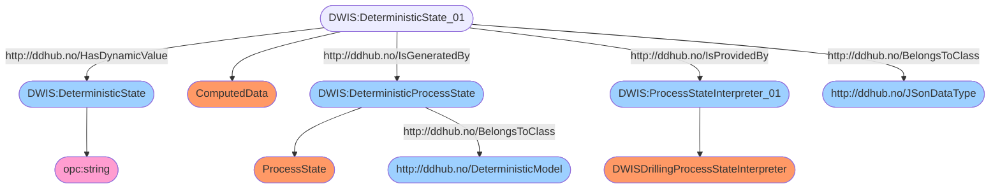
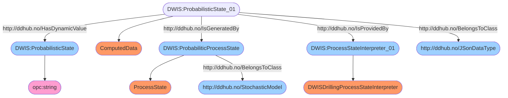
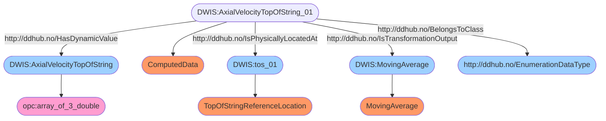
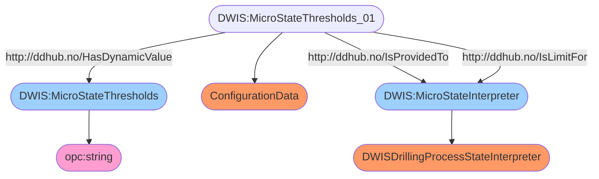
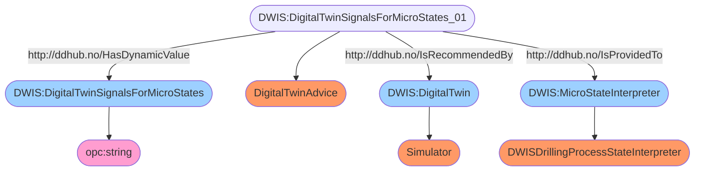

This package is developed as part of the Society of Petroleum (SPE) Drilling and Wells Interoperability Standards (D-WIS), a sub-committee of the Drilling System Automation Technical Section.
This package contains the data model used by the D-WIS microstate interpretation engine.

There are 5 classes:
- `MicroStates`
- `ProbabilisticMicroStates`
- `SignalGroup`
- `Thresholds`
- `Calibrations`

# Microstates
The class `MicroStates` is used to represent the deterministic version of the interpreted drilling process microstates. It has a TimeStampUTC property and 5 32 bit integers to store the encoded values of the microstates.

Each microstate is encoded on 2 bits, therefore providing 4 combinations with the combination 00 reserved to mean `undefined`. The index for each microstate is encoded in an enumeration: `MicroStateIndex`.

The `MicroStates` class defines two methods to update the value at a given microstate position: `UpdateMicroState` and to read the value at a given microstate index: `GetValue`. The value is passed as a `byte` and only 
the two least significant bits are used.

The `MicroStates` has the following default semantic:
``` dwis DeterministicState
DynamicDrillingSignal:DeterministicState
ComputedData:DeterministicState#01
JSonDataType:DeterministicState#01
DeterministicState#01 HasDynamicValue DeterministicState
ProcessState:DeterministicProcessState
DeterministicModel:DeterministicProcessState
DeterministicState#01 IsGeneratedBy DeterministicProcessState
DWISDrillingProcessStateInterpreter:ProcessStateInterpreter#01
DeterministicState#01 IsProvidedBy ProcessStateInterpreter#01
```

This semantic translates into the following semantic graph:


And to retrieve the deterministic microstate on the `Blackboard`, one can use the following SparQL query:
```sparql
PREFIX rdf:<http://www.w3.org/1999/02/22-rdf-syntax-ns#>
PREFIX ddhub:<http://ddhub.no/>
PREFIX quantity:<http://ddhub.no/UnitAndQuantity>

SELECT ?DeterministicState
WHERE {
	?DeterministicState_01 rdf:type ddhub:ComputedData .
	?DeterministicState_01 rdf:type ddhub:JSonDataType .
	?DeterministicState_01 ddhub:HasDynamicValue ?DeterministicState .
	?DeterministicProcessState rdf:type ddhub:ProcessState .
	?DeterministicProcessState rdf:type ddhub:DeterministicModel .
	?DeterministicState_01 ddhub:IsGeneratedBy ?DeterministicProcessState .
	?ProcessStateInterpreter_01 rdf:type ddhub:DWISDrillingProcessStateInterpreter .
	?DeterministicState_01 ddhub:IsProvidedBy ?ProcessStateInterpreter_01 .
}
```

The `DynamicDrillingSignal`, i.e., the live OPC-UA variable has the type string and contains a Json serialization of the class `MicroStates`. The Json schema for the classes defined in
`DWIS.MicroState.Model` can be found here: https://github.com/D-WIS/MicroStateEngine/blob/main/DWIS.MicroState.JsonSchema/MicroStates.json. The meta data describing the semantic of the
class `MicroState` can be found here: https://github.com/D-WIS/MicroStateEngine/blob/main/DWIS.MicroState.JsonSchema/MetaDataMicroStates.json.

There is a method `RegisterToBlackboard` to create the manifest file and upload it on the `Blackboard` if necessary. The method check if the semantic has already been uploaded and if 
that is the case, it only returns a `QueryResult` place holder.

There is also a method `SendToBlackboard` used for updating the value on the `Blackboard`. The `QueryResult` place holder must be passed as an argument of the function.

# ProbabilisticMicroStates
The class `ProbabilisticMicroStates` is used to store the probabilitic version of the drilling process state in terms of microstates. This class defines a `TimeStampUTC` property and 
all the different microstates in the form of either `BernoulliDrillingProperty` or `TernaryDrillingProperty` properties. A `BernoulliDrillingProperty` gives the probability to be in 
of two states. The probability to be in the other state is therefore the complementary value compared to 1. A `TernaryDrillingProperty` gives the probabilities to be in each of three 
states. The sum of the probabilities is equal to 1.

An overall minimum semantic is defined for the class `ProbabilitisticMicroStates`:
``` dwis ProbabilisticState
DynamicDrillingSignal:ProbabilisticState
ComputedData:ProbabilisticState#01
JSonDataType:ProbabilisticState#01
ProbabilisticState#01 HasDynamicValue ProbabilisticState
ProcessState:ProbabiliticProcessState
StochasticModel:ProbabiliticProcessState
ProbabilisticState#01 IsGeneratedBy ProbabiliticProcessState
DWISDrillingProcessStateInterpreter:ProcessStateInterpreter#01
ProbabilisticState#01 IsProvidedBy ProcessStateInterpreter#01
[SemanticFact("ProbabilisticState", Nouns.Enum.DynamicDrillingSignal)]
```

This semantic translates into the following semantic graph:


And to retrieve the probabilistic microstate on the `Blackboard`, one can use the following SparQL query:
```sparql
PREFIX rdf:<http://www.w3.org/1999/02/22-rdf-syntax-ns#>
PREFIX ddhub:<http://ddhub.no/>
PREFIX quantity:<http://ddhub.no/UnitAndQuantity>

SELECT ?ProbabilisticState
WHERE {
	?ProbabilisticState_01 rdf:type ddhub:ComputedData .
	?ProbabilisticState_01 rdf:type ddhub:JSonDataType .
	?ProbabilisticState_01 ddhub:HasDynamicValue ?ProbabilisticState .
	?ProbabiliticProcessState rdf:type ddhub:ProcessState .
	?ProbabiliticProcessState rdf:type ddhub:StochasticModel .
	?ProbabilisticState_01 ddhub:IsGeneratedBy ?ProbabiliticProcessState .
	?ProcessStateInterpreter_01 rdf:type ddhub:DWISDrillingProcessStateInterpreter .
	?ProbabilisticState_01 ddhub:IsProvidedBy ?ProcessStateInterpreter_01 .
}
```

The semantic of each individual properties of the class `ProbabilisticMicroStates` is also defined. For instance the semantic graph corresponding to the property `AxialVelocityTopOfString` is:


However, the properties are not stored individually in the `Blackboard`, meaning that it is not possible to retrieve only one property at a time by using a SparQL query using
the provided semantic. The purpose of the semantic description for each of the property is to have a formal description of the meaning of the property.

The `DynamicDrillingSignal`, i.e., the live OPC-UA variable has the type string and contains a Json serialization of the class `ProbabilisticMicroStates`. The Json schema for the classes defined in
`DWIS.MicroState.Model` can be found here: https://github.com/D-WIS/MicroStateEngine/blob/main/DWIS.MicroState.JsonSchema/MicroStates.json. The meta data describing the semantic of the
class `ProbabilisticMicroStates` can be found here: https://github.com/D-WIS/MicroStateEngine/blob/main/DWIS.MicroState.JsonSchema/MetaDataMicroStates.json.

There is a method `RegisterToBlackboard` to create the manifest file and upload it on the `Blackboard` if necessary. The method check if the semantic has already been uploaded and if 
that is the case, it only returns a `QueryResult` place holder.

There is also a method `SendToBlackboard` used for updating the value on the `Blackboard`. The `QueryResult` place holder must be passed as an argument of the function.

# Thresholds
The `Microstate Interpretation Engine` needs thresholds to determine the different states. These thresholds are grouped in a class called `Thresholds`. The class `Thresholds` has a 
`TimeStampUTC` property. The other properties are `ScalarDrillingProperty`, meaning that their propability distribution is of the *Dirac* type.

An overall minimum semantic is defined for the class `Thresholds`:
``` dwis MicroStateThresholds
DynamicDrillingSignal:MicroStateThresholds
ConfigurationData:MicroStateThresholds#01
MicroStateThresholds#01 HasDynamicValue MicroStateThresholds
DWISDrillingProcessStateInterpreter:MicroStateInterpreter
MicroStateThresholds#01 IsProvidedTo MicroStateInterpreter
MicroStateThresholds#01 IsLimitFor MicroStateInterpreter
```

This semantic translates into the following semantic graph:


And to retrieve the probabilistic microstate on the `Blackboard`, one can use the following SparQL query:
```sparql
PREFIX rdf:<http://www.w3.org/1999/02/22-rdf-syntax-ns#>
PREFIX ddhub:<http://ddhub.no/>
PREFIX quantity:<http://ddhub.no/UnitAndQuantity>

SELECT ?MicroStateThresholds
WHERE {
	?MicroStateThresholds_01 rdf:type ddhub:ConfigurationData .
	?MicroStateThresholds_01 ddhub:HasDynamicValue ?MicroStateThresholds .
	?MicroStateInterpreter rdf:type ddhub:DWISDrillingProcessStateInterpreter .
	?MicroStateThresholds_01 ddhub:IsProvidedTo ?MicroStateInterpreter .
	?MicroStateThresholds_01 ddhub:IsLimitFor ?MicroStateInterpreter .
}
```

The semantic of each individual properties of the class `Thresholds` is also defined. For instance the semantic graph corresponding to the property `ZeroAxialVelocityTopOfStringThreshold` is:


However, the properties are not stored individually in the `Blackboard`, meaning that it is not possible to retrieve only one property at a time by using a SparQL query using
the provided semantic. The purpose of the semantic description for each of the property is to have a formal description of the meaning of the property.

The `DynamicDrillingSignal`, i.e., the live OPC-UA variable has the type string and contains a Json serialization of the class `Thresholds`. The Json schema for the classes defined in
`DWIS.MicroState.Model` can be found here: https://github.com/D-WIS/MicroStateEngine/blob/main/DWIS.MicroState.JsonSchema/MicroStates.json. The meta data describing the semantic of the
class `ProbabilisticMicroStates` can be found here: https://github.com/D-WIS/MicroStateEngine/blob/main/DWIS.MicroState.JsonSchema/MetaDataMicroStates.json.

A producer of content for the `Thresholds` can use two methods that are provided for convenience: `RegisterToBlackboard` and `SendToBlackboard`. The method `RegisterToBlackboard`
is used to create the manifest file and upload it on the `Blackboard` if necessary. The method check if the semantic has already been uploaded and if 
that is the case, it only returns a `QueryResult` place holder. The method `SendToBlackboard` is used for updating the value on the `Blackboard`. The `QueryResult` place holder must 
be passed as an argument of the function.

# SignalGroup
The `Micro-state Interpretation Engine` needs signals that are typically generated by a digital twin. These signals can be generated individually or grouped into a class called 
`SignalGroup`. The class `SignalGroup` has a property `TimeStampUTC` used to define the time and date at which the `SignalGroup` has been issued. There are also all the necessary
properties used by the `Micro-state Interpretation Engine` to calculate the micro-states. These properties are of type `GaussianDrillingProperty` and `BernoulliDrillingProperty`, 
meaning that an uncertainty is defined for the passed values, whether the value is a scalar or a boolean one.

An overall minimum semantic is defined for the class `SignalGroup`:
``` dwis DigitalTwinSignalsForMicroStates
DynamicDrillingSignal:DigitalTwinSignalsForMicroStates
DigitalTwinAdvice: DigitalTwinSignalsForMicroStates#01
DigitalTwinSignalsForMicroStates#01 HasDynamicValue DigitalTwinSignalsForMicroStates
Simulator:DigitalTwin
DigitalTwinSignalsForMicroStates#01 IsRecommendedBy DigitalTwin
DWISDrillingProcessStateInterpreter:MicroStateInterpreter
DigitalTwinSignalsForMicroStates#01 IsProvidedTo MicroStateInterpreter
```

This semantic translates into the following semantic graph:


And to retrieve the probabilistic microstate on the `Blackboard`, one can use the following SparQL query:
```sparql
PREFIX rdf:<http://www.w3.org/1999/02/22-rdf-syntax-ns#>
PREFIX ddhub:<http://ddhub.no/>
PREFIX quantity:<http://ddhub.no/UnitAndQuantity>

SELECT ?DigitalTwinSignalsForMicroStates
WHERE {
	?DigitalTwinSignalsForMicroStates_01 rdf:type ddhub:DigitalTwinAdvice .
	?DigitalTwinSignalsForMicroStates_01 ddhub:HasDynamicValue ?DigitalTwinSignalsForMicroStates .
	?DigitalTwin rdf:type ddhub:Simulator .
	?DigitalTwinSignalsForMicroStates_01 ddhub:IsRecommendedBy ?DigitalTwin .
	?MicroStateInterpreter rdf:type ddhub:DWISDrillingProcessStateInterpreter .
	?DigitalTwinSignalsForMicroStates_01 ddhub:IsProvidedTo ?MicroStateInterpreter .
}
```

The `DynamicDrillingSignal`, i.e., the live OPC-UA variable has the type string and contains a Json serialization of the class `SignalGroup`. The Json schema for the classes defined in
`DWIS.MicroState.Model` can be found here: https://github.com/D-WIS/MicroStateEngine/blob/main/DWIS.MicroState.JsonSchema/MicroStates.json. The meta data describing the semantic of the
class `ProbabilisticMicroStates` can be found here: https://github.com/D-WIS/MicroStateEngine/blob/main/DWIS.MicroState.JsonSchema/MetaDataMicroStates.json.

The semantic of each individual properties of the class `SignalGroup` is also defined. For instance the semantic graph corresponding to the property `UCS` is:

```mermaid
flowchart TD
	 classDef typeClass fill:#f96;
	 classDef classClass fill:#9dd0ff;
	 classDef opcClass fill:#ff9dd0;
	 classDef quantityClass fill:#d0ff9d;
	DWIS:UCS_bh([DWIS:UCS_bh]) --> DynamicDrillingSignal([DynamicDrillingSignal]):::typeClass
	DWIS:UCS_bh_01([DWIS:UCS_bh_01]) --> PhysicalData([PhysicalData]):::typeClass
	DWIS:MovingAverage([DWIS:MovingAverage]) --> MovingAverage([MovingAverage]):::typeClass
	DWIS:CuttingsComponent_01([DWIS:CuttingsComponent_01]) --> CuttingsComponent([CuttingsComponent]):::typeClass
	DWIS:bh_01([DWIS:bh_01]) --> HoleBottomLocation([HoleBottomLocation]):::typeClass
	DWIS:UCS_bh_01([DWIS:UCS_bh_01]) -- http://ddhub.no/BelongsToClass --> http://ddhub.no/ContinuousDataType([http://ddhub.no/ContinuousDataType]):::classClass
	DWIS:UCS_bh_01([DWIS:UCS_bh_01]) -- http://ddhub.no/HasDynamicValue --> DWIS:UCS_bh([DWIS:UCS_bh]):::classClass
	DWIS:UCS_bh_01([DWIS:UCS_bh_01]) -- http://ddhub.no/IsOfMeasurableQuantity --> FormationStrengthDrilling([FormationStrengthDrilling]):::quantityClass
	DWIS:UCS_bh_01([DWIS:UCS_bh_01]) -- http://ddhub.no/IsTransformationOutput --> DWIS:MovingAverage([DWIS:MovingAverage]):::classClass
	DWIS:UCS_bh_01([DWIS:UCS_bh_01]) -- http://ddhub.no/ConcernsAFluidComponent --> DWIS:CuttingsComponent_01([DWIS:CuttingsComponent_01]):::classClass
	DWIS:UCS_bh_01([DWIS:UCS_bh_01]) -- http://ddhub.no/IsPhysicallyLocatedAt --> DWIS:bh_01([DWIS:bh_01]):::classClass
```


And the one for `UCSSlope` is:

```mermaid
flowchart TD
	 classDef typeClass fill:#f96;
	 classDef classClass fill:#9dd0ff;
	 classDef opcClass fill:#ff9dd0;
	 classDef quantityClass fill:#d0ff9d;
	DWIS:UCSSlope_bh([DWIS:UCSSlope_bh]) --> DynamicDrillingSignal([DynamicDrillingSignal]):::typeClass
	DWIS:UCSSlope_bh_01([DWIS:UCSSlope_bh_01]) --> PhysicalData([PhysicalData]):::typeClass
	DWIS:MovingAverage([DWIS:MovingAverage]) --> MovingAverage([MovingAverage]):::typeClass
	DWIS:CuttingsComponent_01([DWIS:CuttingsComponent_01]) --> CuttingsComponent([CuttingsComponent]):::typeClass
	DWIS:bh_01([DWIS:bh_01]) --> HoleBottomLocation([HoleBottomLocation]):::typeClass
	DWIS:UCSSlope_bh_01([DWIS:UCSSlope_bh_01]) -- http://ddhub.no/BelongsToClass --> http://ddhub.no/ContinuousDataType([http://ddhub.no/ContinuousDataType]):::classClass
	DWIS:UCSSlope_bh_01([DWIS:UCSSlope_bh_01]) -- http://ddhub.no/HasDynamicValue --> DWIS:UCSSlope_bh([DWIS:UCSSlope_bh]):::classClass
	DWIS:UCSSlope_bh_01([DWIS:UCSSlope_bh_01]) -- http://ddhub.no/IsOfMeasurableQuantity --> PressureGradientPerLengthDrilling([PressureGradientPerLengthDrilling]):::quantityClass
	DWIS:UCSSlope_bh_01([DWIS:UCSSlope_bh_01]) -- http://ddhub.no/IsTransformationOutput --> DWIS:MovingAverage([DWIS:MovingAverage]):::classClass
	DWIS:UCSSlope_bh_01([DWIS:UCSSlope_bh_01]) -- http://ddhub.no/ConcernsAFluidComponent --> DWIS:CuttingsComponent_01([DWIS:CuttingsComponent_01]):::classClass
	DWIS:UCSSlope_bh_01([DWIS:UCSSlope_bh_01]) -- http://ddhub.no/IsPhysicallyLocatedAt --> DWIS:bh_01([DWIS:bh_01]):::classClass
```


If a signal is published individually, i.e., outside a `SignalGroup`, it can be retrieve by using multiple altenative SparQL queries to accomodate with various possible way of 
defining the signal. Here is a example based on `AxialVelocityTopOfString`:
```sparql
PREFIX rdf:<http://www.w3.org/1999/02/22-rdf-syntax-ns#>
PREFIX ddhub:<http://ddhub.no/>
PREFIX quantity:<http://ddhub.no/UnitAndQuantity>

SELECT ?v_tos
WHERE {
	?v_tos_01 rdf:type ddhub:PhysicalData .
	?v_tos_01 rdf:type ddhub:ContinuousDataType .
	?v_tos_01 ddhub:HasDynamicValue ?v_tos .
	?v_tos_01 ddhub:IsOfMeasurableQuantity quantity:BlockVelocityDrilling .
	?tos_01 rdf:type ddhub:TopOfStringReferenceLocation .
	?v_tos_01 ddhub:IsPhysicallyLocatedAt ?tos_01 .
	?MovingAverage rdf:type ddhub:MovingAverage .
	?v_tos_01 ddhub:IsTransformationOutput ?MovingAverage .
}
```

```sparql
PREFIX rdf:<http://www.w3.org/1999/02/22-rdf-syntax-ns#>
PREFIX ddhub:<http://ddhub.no/>
PREFIX quantity:<http://ddhub.no/UnitAndQuantity>

SELECT ?v_tos ?sigma_v_tos ?factOptionSet
WHERE {
	?v_tos_01 rdf:type ddhub:PhysicalData .
	?v_tos_01 rdf:type ddhub:ContinuousDataType .
	?v_tos_01 ddhub:HasDynamicValue ?v_tos .
	?v_tos_01 ddhub:IsOfMeasurableQuantity quantity:BlockVelocityDrilling .
	?tos_01 rdf:type ddhub:TopOfStringReferenceLocation .
	?v_tos_01 ddhub:IsPhysicallyLocatedAt ?tos_01 .
	?MovingAverage rdf:type ddhub:MovingAverage .
	?v_tos_01 ddhub:IsTransformationOutput ?MovingAverage .
	?sigma_v_tos_01 rdf:type ddhub:DrillingDataPoint .
	?sigma_v_tos_01 ddhub:HasValue ?sigma_v_tos .
	?GaussianUncertainty_01 rdf:type ddhub:GaussianUncertainty .
	?v_tos_01 ddhub:HasUncertainty ?GaussianUncertainty_01 .
	?GaussianUncertainty_01 ddhub:HasUncertaintyStandardDeviation ?sigma_v_tos_01 .
  BIND (' 1' as ?factOptionSet)
}
```

```sparql
PREFIX rdf:<http://www.w3.org/1999/02/22-rdf-syntax-ns#>
PREFIX ddhub:<http://ddhub.no/>
PREFIX quantity:<http://ddhub.no/UnitAndQuantity>

SELECT ?v_tos ?sigma_v_tos ?factOptionSet
WHERE {
	?v_tos_01 rdf:type ddhub:PhysicalData .
	?v_tos_01 rdf:type ddhub:ContinuousDataType .
	?v_tos_01 ddhub:HasDynamicValue ?v_tos .
	?v_tos_01 ddhub:IsOfMeasurableQuantity quantity:BlockVelocityDrilling .
	?tos_01 rdf:type ddhub:TopOfStringReferenceLocation .
	?v_tos_01 ddhub:IsPhysicallyLocatedAt ?tos_01 .
	?MovingAverage rdf:type ddhub:MovingAverage .
	?v_tos_01 ddhub:IsTransformationOutput ?MovingAverage .
	?sigma_v_tos_01 rdf:type ddhub:DrillingDataPoint .
	?sigma_v_tos_01 ddhub:HasValue ?sigma_v_tos .
	?GaussianUncertainty_01 rdf:type ddhub:GaussianUncertainty .
	?v_tos_01 ddhub:HasUncertainty ?GaussianUncertainty_01 .
	?GaussianUncertainty_01 ddhub:HasUncertaintyStandardDeviation ?sigma_v_tos_01 .
	?GaussianUncertainty_01 ddhub:HasUncertaintyMean ?v_tos_01 .
  BIND (' 1 11' as ?factOptionSet)
}
```

```sparql
PREFIX rdf:<http://www.w3.org/1999/02/22-rdf-syntax-ns#>
PREFIX ddhub:<http://ddhub.no/>
PREFIX quantity:<http://ddhub.no/UnitAndQuantity>

SELECT ?v_tos ?v_tos_prec ?v_tos_acc ?factOptionSet
WHERE {
	?v_tos_01 rdf:type ddhub:PhysicalData .
	?v_tos_01 rdf:type ddhub:ContinuousDataType .
	?v_tos_01 ddhub:HasDynamicValue ?v_tos .
	?v_tos_01 ddhub:IsOfMeasurableQuantity quantity:BlockVelocityDrilling .
	?tos_01 rdf:type ddhub:TopOfStringReferenceLocation .
	?v_tos_01 ddhub:IsPhysicallyLocatedAt ?tos_01 .
	?MovingAverage rdf:type ddhub:MovingAverage .
	?v_tos_01 ddhub:IsTransformationOutput ?MovingAverage .
	?v_tos_prec_01 rdf:type ddhub:DrillingDataPoint .
	?v_tos_prec_01 ddhub:HasValue ?v_tos_prec .
	?v_tos_acc_01 rdf:type ddhub:DrillingDataPoint .
	?v_tos_acc_01 ddhub:HasValue ?v_tos_acc .
	?SensorUncertainty_01 rdf:type ddhub:SensorUncertainty .
	?SensorUncertainty_01 ddhub:HasUncertaintyPrecision ?v_tos_prec_01 .
	?SensorUncertainty_01 ddhub:HasUncertaintyAccuracy ?v_tos_acc_01 .
	?v_tos_01 ddhub:HasUncertainty ?SensorUncertainty_01 .
  BIND (' 2' as ?factOptionSet)
}
```

```sparql
PREFIX rdf:<http://www.w3.org/1999/02/22-rdf-syntax-ns#>
PREFIX ddhub:<http://ddhub.no/>
PREFIX quantity:<http://ddhub.no/UnitAndQuantity>

SELECT ?v_tos ?v_tos_prec ?v_tos_acc ?factOptionSet
WHERE {
	?v_tos_01 rdf:type ddhub:PhysicalData .
	?v_tos_01 rdf:type ddhub:ContinuousDataType .
	?v_tos_01 ddhub:HasDynamicValue ?v_tos .
	?v_tos_01 ddhub:IsOfMeasurableQuantity quantity:BlockVelocityDrilling .
	?tos_01 rdf:type ddhub:TopOfStringReferenceLocation .
	?v_tos_01 ddhub:IsPhysicallyLocatedAt ?tos_01 .
	?MovingAverage rdf:type ddhub:MovingAverage .
	?v_tos_01 ddhub:IsTransformationOutput ?MovingAverage .
	?v_tos_prec_01 rdf:type ddhub:DrillingDataPoint .
	?v_tos_prec_01 ddhub:HasValue ?v_tos_prec .
	?v_tos_acc_01 rdf:type ddhub:DrillingDataPoint .
	?v_tos_acc_01 ddhub:HasValue ?v_tos_acc .
	?SensorUncertainty_01 rdf:type ddhub:SensorUncertainty .
	?SensorUncertainty_01 ddhub:HasUncertaintyPrecision ?v_tos_prec_01 .
	?SensorUncertainty_01 ddhub:HasUncertaintyAccuracy ?v_tos_acc_01 .
	?v_tos_01 ddhub:HasUncertainty ?SensorUncertainty_01 .
	?SensorUncertainty_01 ddhub:HasUncertaintyMean ?v_tos_01 .
  BIND (' 2 21' as ?factOptionSet)
}
```

```sparql
PREFIX rdf:<http://www.w3.org/1999/02/22-rdf-syntax-ns#>
PREFIX ddhub:<http://ddhub.no/>
PREFIX quantity:<http://ddhub.no/UnitAndQuantity>

SELECT ?v_tos ?v_tos_fs ?v_tos_prop ?factOptionSet
WHERE {
	?v_tos_01 rdf:type ddhub:PhysicalData .
	?v_tos_01 rdf:type ddhub:ContinuousDataType .
	?v_tos_01 ddhub:HasDynamicValue ?v_tos .
	?v_tos_01 ddhub:IsOfMeasurableQuantity quantity:BlockVelocityDrilling .
	?tos_01 rdf:type ddhub:TopOfStringReferenceLocation .
	?v_tos_01 ddhub:IsPhysicallyLocatedAt ?tos_01 .
	?MovingAverage rdf:type ddhub:MovingAverage .
	?v_tos_01 ddhub:IsTransformationOutput ?MovingAverage .
	?v_tos_fs_01 rdf:type ddhub:DrillingDataPoint .
	?v_tos_fs_01 ddhub:HasValue ?v_tos_fs_01 .
	?v_tos_prop_01 rdf:type ddhub:DrillingDataPoint .
	?v_tos_prop_01 ddhub:HasValue ?v_tos_prop_01 .
	?FullScaleUncertainty_01 rdf:type ddhub:FullScaleUncertainty .
	?FullScaleUncertainty_01 ddhub:HasFullScale ?v_tos_fs_01 .
	?FullScaleUncertainty_01 ddhub:HasProportionError ?v_tos_prop_01 .
	?v_tos_01 ddhub:HasUncertainty ?FullScaleUncertainty_01 .
  BIND (' 3' as ?factOptionSet)
}
```

```sparql
PREFIX rdf:<http://www.w3.org/1999/02/22-rdf-syntax-ns#>
PREFIX ddhub:<http://ddhub.no/>
PREFIX quantity:<http://ddhub.no/UnitAndQuantity>

SELECT ?v_tos ?v_tos_fs ?v_tos_prop ?factOptionSet
WHERE {
	?v_tos_01 rdf:type ddhub:PhysicalData .
	?v_tos_01 rdf:type ddhub:ContinuousDataType .
	?v_tos_01 ddhub:HasDynamicValue ?v_tos .
	?v_tos_01 ddhub:IsOfMeasurableQuantity quantity:BlockVelocityDrilling .
	?tos_01 rdf:type ddhub:TopOfStringReferenceLocation .
	?v_tos_01 ddhub:IsPhysicallyLocatedAt ?tos_01 .
	?MovingAverage rdf:type ddhub:MovingAverage .
	?v_tos_01 ddhub:IsTransformationOutput ?MovingAverage .
	?v_tos_fs_01 rdf:type ddhub:DrillingDataPoint .
	?v_tos_fs_01 ddhub:HasValue ?v_tos_fs_01 .
	?v_tos_prop_01 rdf:type ddhub:DrillingDataPoint .
	?v_tos_prop_01 ddhub:HasValue ?v_tos_prop_01 .
	?FullScaleUncertainty_01 rdf:type ddhub:FullScaleUncertainty .
	?FullScaleUncertainty_01 ddhub:HasFullScale ?v_tos_fs_01 .
	?FullScaleUncertainty_01 ddhub:HasProportionError ?v_tos_prop_01 .
	?v_tos_01 ddhub:HasUncertainty ?FullScaleUncertainty_01 .
	?FullScaleUncertainty_01 ddhub:HasUncertaintyMean ?v_tos_01 .
  BIND (' 3 31' as ?factOptionSet)
}
```

These SparQL queries can be automatically generated using the semantic that is defined for each individual property. Here is an example in C#:
``` csharp
Assembly? assembly = Assembly.GetAssembly(typeof(SignalGroup));
var queries1 = GeneratorSparQLManifestFile.GetSparQLQueries(assembly, typeof(SignalGroup).FullName, "AxialVelocityTopOfString");
```

There are three methods that are defined in the class `SignalGroup` to interact with the `Blackboard`. One is `RegisterToBlackboard` to register a `SignalGroup` signal on the
`Blackboard`. This method is used to create a manifest file and upload it on the `Blackboard` if necessary. The method check if the semantic has already been uploaded and if that
is the case, it only returns a `QueryResult` place holder. The method `SendToBlackboard` is used for updating the value on the `Blackboard`. The `QueryResult` place holder
must be passed as an argument of the function. There is also another `RegisterToBlackboard` method that allows to register all the individual signals defined in the `SignalGroup`
class. This method can be used by a digital twin that generates individal signals instead of a group of signals.

# Calibrations
The class `Calibrations` defines a dictionary of `CalibrationParameters`. A `CalibrationParameters` is a class that define the `Scaling`, `Bias` and `Delay` that 
are necessary to minimize the differences of a series of measurements compared to other series of measurements produced by other digital twins. The dictionary has 
two levels. The first level concerns the properties of the `SignalGroup` classes. Then for each `DrillingProperty` in the `SignalGroup` that has a series of
data providers, there is a dictionary of `CalibrationParameters` for each of the sources. A data source is characterized by an object of the type `DWISNodeID`.
