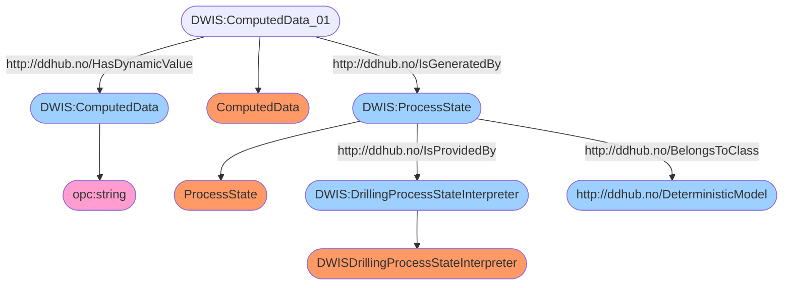

# Semantic Graph for `MicroStates`


# Semantic Queries for `MicroStates`
## Query-DWIS.MicroState.Model.MicroStates-000
```sparql
PREFIX rdf: <http://www.w3.org/1999/02/22-rdf-syntax-ns#>
PREFIX ddhub: <http://ddhub.no/>
PREFIX quantity: <http://ddhub.no/UnitAndQuantity>

SELECT ?ComputedData
WHERE {
	?ComputedData rdf:type ddhub:DynamicDrillingSignal .
	?ComputedData#01 rdf:type ddhub:ComputedData .
	?ComputedData#01 ddhub:HasDynamicValue ?ComputedData .
	?ProcessState rdf:type ddhub:ProcessState .
	?ProcessState ddhub:BelongsToClass ddhub:DeterministicModel .
	?ComputedData#01 ddhub:IsGeneratedBy ?ProcessState .
	?DrillingProcessStateInterpreter rdf:type ddhub:DWISDrillingProcessStateInterpreter .
	?ProcessState ddhub:IsProvidedBy ?DrillingProcessStateInterpreter .
}

```
