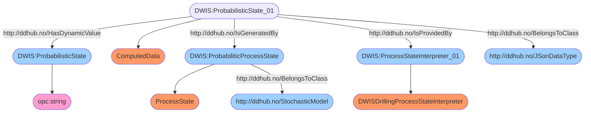

# Semantic Graph for `ProbabilisticMicroStates`


# Semantic Queries for `ProbabilisticMicroStates`
## Query-DWIS.MicroState.Model.ProbabilisticMicroStates-000
```sparql
PREFIX rdf:<http://www.w3.org/1999/02/22-rdf-syntax-ns#>
PREFIX ddhub:<http://ddhub.no/>
PREFIX quantity:<http://ddhub.no/UnitAndQuantity>

SELECT ?ProbabilisticState
WHERE {
	?ProbabilisticState_01 rdf:type ddhub:ComputedData .
	?ProbabilisticState_01 rdf:type ddhub:JSonDataType .
	?ProbabilisticState_01 ddhub:HasDynamicValue ?ProbabilisticState .
	?ProbabiliticProcessState rdf:type ddhub:ProcessState .
	?ProbabiliticProcessState rdf:type ddhub:StochasticModel .
	?ProbabilisticState_01 ddhub:IsGeneratedBy ?ProbabiliticProcessState .
	?ProcessStateInterpreter_01 rdf:type ddhub:DWISDrillingProcessStateInterpreter .
	?ProbabilisticState_01 ddhub:IsProvidedBy ?ProcessStateInterpreter_01 .
}

```
