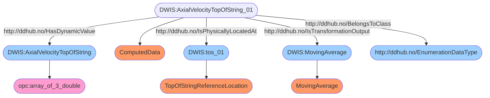

# Semantic Graph for property `AxialVelocityTopOfString` of class `ProbabilisticMicroStates`

```mermaid
flowchart TD
	 classDef typeClass fill:#f96;
	 classDef classClass fill:#9dd0ff;
	 classDef opcClass fill:#ff9dd0;
	 classDef quantityClass fill:#d0ff9d;
	DWIS:AxialVelocityTopOfString([DWIS:AxialVelocityTopOfString]) --> opc:array_of_3_double([opc:array_of_3_double]):::opcClass
	DWIS:AxialVelocityTopOfString_01([DWIS:AxialVelocityTopOfString_01]) --> ComputedData([ComputedData]):::typeClass
	DWIS:tos_01([DWIS:tos_01]) --> TopOfStringReferenceLocation([TopOfStringReferenceLocation]):::typeClass
	DWIS:MovingAverage([DWIS:MovingAverage]) --> MovingAverage([MovingAverage]):::typeClass
	DWIS:AxialVelocityTopOfString_01([DWIS:AxialVelocityTopOfString_01]) -- http://ddhub.no/BelongsToClass --> http://ddhub.no/EnumerationDataType([http://ddhub.no/EnumerationDataType]):::classClass
	DWIS:AxialVelocityTopOfString_01([DWIS:AxialVelocityTopOfString_01]) -- http://ddhub.no/HasDynamicValue --> DWIS:AxialVelocityTopOfString([DWIS:AxialVelocityTopOfString]):::classClass
	DWIS:AxialVelocityTopOfString_01([DWIS:AxialVelocityTopOfString_01]) -- http://ddhub.no/IsPhysicallyLocatedAt --> DWIS:tos_01([DWIS:tos_01]):::classClass
	DWIS:AxialVelocityTopOfString_01([DWIS:AxialVelocityTopOfString_01]) -- http://ddhub.no/IsTransformationOutput --> DWIS:MovingAverage([DWIS:MovingAverage]):::classClass
```

