# Semantic Graph for `FusedSignalGroup`

```mermaid
flowchart TD
	 classDef typeClass fill:#f96;
	 classDef classClass fill:#9dd0ff;
	 classDef opcClass fill:#ff9dd0;
	 classDef quantityClass fill:#d0ff9d;
	DWIS:FusedSignalsForMicroStates([DWIS:FusedSignalsForMicroStates]) --> opc:string([opc:string]):::opcClass
	DWIS:FusedSignalsForMicroStates_01([DWIS:FusedSignalsForMicroStates_01]) --> DigitalTwinAdvice([DigitalTwinAdvice]):::typeClass
	DWIS:MicroStateInterpreter([DWIS:MicroStateInterpreter]) --> DWISDrillingProcessStateInterpreter([DWISDrillingProcessStateInterpreter]):::typeClass
	DWIS:SignalFusionInterpreter_01([DWIS:SignalFusionInterpreter_01]) --> Interpreter([Interpreter]):::typeClass
	DWIS:DigitalTwinSignals_01([DWIS:DigitalTwinSignals_01]) --> DigitalTwinAdvice([DigitalTwinAdvice]):::typeClass
	DWIS:DigitalTwin([DWIS:DigitalTwin]) --> Simulator([Simulator]):::typeClass
	DWIS:DigitalTwinSignalsForMicroStates([DWIS:DigitalTwinSignalsForMicroStates]) --> DynamicDrillingSignal([DynamicDrillingSignal]):::typeClass
	DWIS:DigitalTwinSignalsForMicroStates_01([DWIS:DigitalTwinSignalsForMicroStates_01]) --> DigitalTwinAdvice([DigitalTwinAdvice]):::typeClass
	DWIS:MicroStateInterpreter([DWIS:MicroStateInterpreter]) -- http://ddhub.no/BelongsToClass --> http://ddhub.no/DWISDrillingProcessStateInterpreter([http://ddhub.no/DWISDrillingProcessStateInterpreter]):::classClass
	DWIS:SignalFusionInterpreter_01([DWIS:SignalFusionInterpreter_01]) -- http://ddhub.no/BelongsToClass --> http://ddhub.no/DescriptiveModel([http://ddhub.no/DescriptiveModel]):::classClass
	DWIS:SignalFusionInterpreter_01([DWIS:SignalFusionInterpreter_01]) -- http://ddhub.no/BelongsToClass --> http://ddhub.no/ForwardModel([http://ddhub.no/ForwardModel]):::classClass
	DWIS:SignalFusionInterpreter_01([DWIS:SignalFusionInterpreter_01]) -- http://ddhub.no/BelongsToClass --> http://ddhub.no/WhiteBoxModel([http://ddhub.no/WhiteBoxModel]):::classClass
	DWIS:SignalFusionInterpreter_01([DWIS:SignalFusionInterpreter_01]) -- http://ddhub.no/BelongsToClass --> http://ddhub.no/SpecializedModel([http://ddhub.no/SpecializedModel]):::classClass
	DWIS:SignalFusionInterpreter_01([DWIS:SignalFusionInterpreter_01]) -- http://ddhub.no/BelongsToClass --> http://ddhub.no/EmpiricalModel([http://ddhub.no/EmpiricalModel]):::classClass
	DWIS:SignalFusionInterpreter_01([DWIS:SignalFusionInterpreter_01]) -- http://ddhub.no/BelongsToClass --> http://ddhub.no/StochasticModel([http://ddhub.no/StochasticModel]):::classClass
	DWIS:DigitalTwin([DWIS:DigitalTwin]) -- http://ddhub.no/BelongsToClass --> http://ddhub.no/Simulator([http://ddhub.no/Simulator]):::classClass
	DWIS:FusedSignalsForMicroStates_01([DWIS:FusedSignalsForMicroStates_01]) -- http://ddhub.no/HasDynamicValue --> DWIS:FusedSignalsForMicroStates([DWIS:FusedSignalsForMicroStates]):::classClass
	DWIS:FusedSignalsForMicroStates_01([DWIS:FusedSignalsForMicroStates_01]) -- http://ddhub.no/IsProvidedBy --> DWIS:MicroStateInterpreter([DWIS:MicroStateInterpreter]):::classClass
	DWIS:FusedSignalsForMicroStates_01([DWIS:FusedSignalsForMicroStates_01]) -- http://ddhub.no/IsComputedBy --> DWIS:SignalFusionInterpreter_01([DWIS:SignalFusionInterpreter_01]):::classClass
	DWIS:DigitalTwinSignals_01([DWIS:DigitalTwinSignals_01]) -- http://ddhub.no/IsRecommendedBy --> DWIS:DigitalTwin([DWIS:DigitalTwin]):::classClass
	DWIS:DigitalTwinSignals_01([DWIS:DigitalTwinSignals_01]) -- http://ddhub.no/IsProvidedTo --> DWIS:MicroStateInterpreter_01([DWIS:MicroStateInterpreter_01]):::classClass
	DWIS:DigitalTwinSignals_01([DWIS:DigitalTwinSignals_01]) -- http://ddhub.no/IsComputationInput --> DWIS:SignalFusionInterpreter_01([DWIS:SignalFusionInterpreter_01]):::classClass
	DWIS:DigitalTwinSignalsForMicroStates_01([DWIS:DigitalTwinSignalsForMicroStates_01]) -- http://ddhub.no/HasDynamicValue --> DWIS:DigitalTwinSignalsForMicroStates([DWIS:DigitalTwinSignalsForMicroStates]):::classClass
	DWIS:DigitalTwinSignalsForMicroStates_01([DWIS:DigitalTwinSignalsForMicroStates_01]) -- http://ddhub.no/IsRecommendedBy --> DWIS:DigitalTwin([DWIS:DigitalTwin]):::classClass
	DWIS:DigitalTwinSignalsForMicroStates_01([DWIS:DigitalTwinSignalsForMicroStates_01]) -- http://ddhub.no/IsProvidedTo --> DWIS:MicroStateInterpreter([DWIS:MicroStateInterpreter]):::classClass
```


# Semantic Queries for `FusedSignalGroup`
## Query-DWIS.MicroState.Model.FusedSignalGroup-000
```sparql
PREFIX rdf:<http://www.w3.org/1999/02/22-rdf-syntax-ns#>
PREFIX ddhub:<http://ddhub.no/>
PREFIX quantity:<http://ddhub.no/UnitAndQuantity>

SELECT ?FusedSignalsForMicroStates
WHERE {
	?FusedSignalsForMicroStates_01 rdf:type ddhub:DigitalTwinAdvice .
	?FusedSignalsForMicroStates_01 ddhub:HasDynamicValue ?FusedSignalsForMicroStates .
	?MicroStateInterpreter rdf:type ddhub:DWISDrillingProcessStateInterpreter .
	?FusedSignalsForMicroStates_01 ddhub:IsProvidedBy ?MicroStateInterpreter .
	?SignalFusionInterpreter_01 rdf:type ddhub:Interpreter .
	?SignalFusionInterpreter_01 rdf:type ddhub:DescriptiveModel .
	?SignalFusionInterpreter_01 rdf:type ddhub:ForwardModel .
	?SignalFusionInterpreter_01 rdf:type ddhub:WhiteBoxModel .
	?SignalFusionInterpreter_01 rdf:type ddhub:SpecializedModel .
	?SignalFusionInterpreter_01 rdf:type ddhub:EmpiricalModel .
	?SignalFusionInterpreter_01 rdf:type ddhub:StochasticModel .
	?FusedSignalsForMicroStates_01 ddhub:IsComputedBy ?SignalFusionInterpreter_01 .
	?DigitalTwinSignals_01 rdf:type ddhub:DigitalTwinAdvice .
	?DigitalTwin rdf:type ddhub:Simulator .
	?DigitalTwinSignals_01 ddhub:IsRecommendedBy ?DigitalTwin .
	?DigitalTwinSignals_01 ddhub:IsProvidedTo ?MicroStateInterpreter_01 .
	?DigitalTwinSignals_01 ddhub:IsComputationInput ?SignalFusionInterpreter_01 .
	?DigitalTwinSignalsForMicroStates_01 rdf:type ddhub:DigitalTwinAdvice .
	?DigitalTwinSignalsForMicroStates_01 ddhub:HasDynamicValue ?DigitalTwinSignalsForMicroStates .
	?DigitalTwin rdf:type ddhub:Simulator .
	?DigitalTwinSignalsForMicroStates_01 ddhub:IsRecommendedBy ?DigitalTwin .
	?MicroStateInterpreter rdf:type ddhub:DWISDrillingProcessStateInterpreter .
	?DigitalTwinSignalsForMicroStates_01 ddhub:IsProvidedTo ?MicroStateInterpreter .
}

```
