# Semantic Graph for `Calibrations`

```mermaid
flowchart TD
	 classDef typeClass fill:#f96;
	 classDef classClass fill:#9dd0ff;
	 classDef opcClass fill:#ff9dd0;
	 classDef quantityClass fill:#d0ff9d;
	DWIS:MicroStateCalibration([DWIS:MicroStateCalibration]) --> opc:string([opc:string]):::opcClass
	DWIS:MicroStateCalibration_01([DWIS:MicroStateCalibration_01]) --> ComputedData([ComputedData]):::typeClass
	DWIS:CalibrationInterpretor_01([DWIS:CalibrationInterpretor_01]) --> Interpreter([Interpreter]):::typeClass
	DWIS:MicroStateInterpreter_01([DWIS:MicroStateInterpreter_01]) --> DWISDrillingProcessStateInterpreter([DWISDrillingProcessStateInterpreter]):::typeClass
	DWIS:DigitalTwinSignals_01([DWIS:DigitalTwinSignals_01]) --> DigitalTwinAdvice([DigitalTwinAdvice]):::typeClass
	DWIS:DigitalTwin([DWIS:DigitalTwin]) --> Simulator([Simulator]):::typeClass
	DWIS:MicroStateCalibration_01([DWIS:MicroStateCalibration_01]) -- http://ddhub.no/BelongsToClass --> http://ddhub.no/JSonDataType([http://ddhub.no/JSonDataType]):::classClass
	DWIS:CalibrationInterpretor_01([DWIS:CalibrationInterpretor_01]) -- http://ddhub.no/BelongsToClass --> http://ddhub.no/CalibrationModel([http://ddhub.no/CalibrationModel]):::classClass
	DWIS:CalibrationInterpretor_01([DWIS:CalibrationInterpretor_01]) -- http://ddhub.no/BelongsToClass --> http://ddhub.no/WhiteBoxModel([http://ddhub.no/WhiteBoxModel]):::classClass
	DWIS:CalibrationInterpretor_01([DWIS:CalibrationInterpretor_01]) -- http://ddhub.no/BelongsToClass --> http://ddhub.no/SpecializedModel([http://ddhub.no/SpecializedModel]):::classClass
	DWIS:CalibrationInterpretor_01([DWIS:CalibrationInterpretor_01]) -- http://ddhub.no/BelongsToClass --> http://ddhub.no/AlgebraicModel([http://ddhub.no/AlgebraicModel]):::classClass
	DWIS:CalibrationInterpretor_01([DWIS:CalibrationInterpretor_01]) -- http://ddhub.no/BelongsToClass --> http://ddhub.no/InversionModel([http://ddhub.no/InversionModel]):::classClass
	DWIS:CalibrationInterpretor_01([DWIS:CalibrationInterpretor_01]) -- http://ddhub.no/BelongsToClass --> http://ddhub.no/EmpiricalModel([http://ddhub.no/EmpiricalModel]):::classClass
	DWIS:CalibrationInterpretor_01([DWIS:CalibrationInterpretor_01]) -- http://ddhub.no/BelongsToClass --> http://ddhub.no/TransientModel([http://ddhub.no/TransientModel]):::classClass
	DWIS:CalibrationInterpretor_01([DWIS:CalibrationInterpretor_01]) -- http://ddhub.no/BelongsToClass --> http://ddhub.no/DeterministicModel([http://ddhub.no/DeterministicModel]):::classClass
	DWIS:MicroStateCalibration_01([DWIS:MicroStateCalibration_01]) -- http://ddhub.no/HasDynamicValue --> DWIS:MicroStateCalibration([DWIS:MicroStateCalibration]):::classClass
	DWIS:MicroStateCalibration_01([DWIS:MicroStateCalibration_01]) -- http://ddhub.no/IsComputedBy --> DWIS:CalibrationInterpretor_01([DWIS:CalibrationInterpretor_01]):::classClass
	DWIS:MicroStateCalibration_01([DWIS:MicroStateCalibration_01]) -- http://ddhub.no/IsProvidedBy --> DWIS:MicroStateInterpreter_01([DWIS:MicroStateInterpreter_01]):::classClass
	DWIS:DigitalTwinSignals_01([DWIS:DigitalTwinSignals_01]) -- http://ddhub.no/IsRecommendedBy --> DWIS:DigitalTwin([DWIS:DigitalTwin]):::classClass
	DWIS:DigitalTwinSignals_01([DWIS:DigitalTwinSignals_01]) -- http://ddhub.no/IsProvidedTo --> DWIS:MicroStateInterpreter_01([DWIS:MicroStateInterpreter_01]):::classClass
	DWIS:DigitalTwinSignals_01([DWIS:DigitalTwinSignals_01]) -- http://ddhub.no/IsComputationInput --> DWIS:CalibrationInterpretor_01([DWIS:CalibrationInterpretor_01]):::classClass
```


# Semantic Queries for `Calibrations`
## Query-DWIS.MicroState.Model.Calibrations-000
```sparql
PREFIX rdf:<http://www.w3.org/1999/02/22-rdf-syntax-ns#>
PREFIX ddhub:<http://ddhub.no/>
PREFIX quantity:<http://ddhub.no/UnitAndQuantity>

SELECT ?MicroStateCalibration
WHERE {
	?MicroStateCalibration_01 rdf:type ddhub:ComputedData .
	?MicroStateCalibration_01 rdf:type ddhub:JSonDataType .
	?MicroStateCalibration_01 ddhub:HasDynamicValue ?MicroStateCalibration .
	?CalibrationInterpretor_01 rdf:type ddhub:Interpreter .
	?CalibrationInterpretor_01 rdf:type ddhub:CalibrationModel .
	?CalibrationInterpretor_01 rdf:type ddhub:WhiteBoxModel .
	?CalibrationInterpretor_01 rdf:type ddhub:SpecializedModel .
	?CalibrationInterpretor_01 rdf:type ddhub:AlgebraicModel .
	?CalibrationInterpretor_01 rdf:type ddhub:InversionModel .
	?CalibrationInterpretor_01 rdf:type ddhub:EmpiricalModel .
	?CalibrationInterpretor_01 rdf:type ddhub:TransientModel .
	?CalibrationInterpretor_01 rdf:type ddhub:DeterministicModel .
	?MicroStateInterpreter_01 rdf:type ddhub:DWISDrillingProcessStateInterpreter .
	?MicroStateCalibration_01 ddhub:IsComputedBy ?CalibrationInterpretor_01 .
	?MicroStateCalibration_01 ddhub:IsProvidedBy ?MicroStateInterpreter_01 .
	?DigitalTwinSignals_01 rdf:type ddhub:DigitalTwinAdvice .
	?DigitalTwin rdf:type ddhub:Simulator .
	?DigitalTwinSignals_01 ddhub:IsRecommendedBy ?DigitalTwin .
	?DigitalTwinSignals_01 ddhub:IsProvidedTo ?MicroStateInterpreter_01 .
	?DigitalTwinSignals_01 ddhub:IsComputationInput ?CalibrationInterpretor_01 .
}

```
