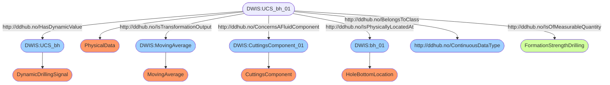
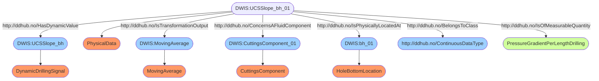

# Semantic Graph for `UCS`

```mermaid
flowchart TD
	 classDef typeClass fill:#f96;
	 classDef classClass fill:#9dd0ff;
	 classDef opcClass fill:#ff9dd0;
	 classDef quantityClass fill:#d0ff9d;
	DWIS:UCS_bh([DWIS:UCS_bh]) --> DynamicDrillingSignal([DynamicDrillingSignal]):::typeClass
	DWIS:UCS_bh_01([DWIS:UCS_bh_01]) --> PhysicalData([PhysicalData]):::typeClass
	DWIS:MovingAverage([DWIS:MovingAverage]) --> MovingAverage([MovingAverage]):::typeClass
	DWIS:CuttingsComponent_01([DWIS:CuttingsComponent_01]) --> CuttingsComponent([CuttingsComponent]):::typeClass
	DWIS:bh_01([DWIS:bh_01]) --> HoleBottomLocation([HoleBottomLocation]):::typeClass
	DWIS:UCS_bh_01([DWIS:UCS_bh_01]) -- http://ddhub.no/BelongsToClass --> http://ddhub.no/ContinuousDataType([http://ddhub.no/ContinuousDataType]):::classClass
	DWIS:UCS_bh_01([DWIS:UCS_bh_01]) -- http://ddhub.no/HasDynamicValue --> DWIS:UCS_bh([DWIS:UCS_bh]):::classClass
	DWIS:UCS_bh_01([DWIS:UCS_bh_01]) -- http://ddhub.no/IsOfMeasurableQuantity --> FormationStrengthDrilling([FormationStrengthDrilling]):::quantityClass
	DWIS:UCS_bh_01([DWIS:UCS_bh_01]) -- http://ddhub.no/IsTransformationOutput --> DWIS:MovingAverage([DWIS:MovingAverage]):::classClass
	DWIS:UCS_bh_01([DWIS:UCS_bh_01]) -- http://ddhub.no/ConcernsAFluidComponent --> DWIS:CuttingsComponent_01([DWIS:CuttingsComponent_01]):::classClass
	DWIS:UCS_bh_01([DWIS:UCS_bh_01]) -- http://ddhub.no/IsPhysicallyLocatedAt --> DWIS:bh_01([DWIS:bh_01]):::classClass
```

# Semantic Graph for `UCSSlope`

```mermaid
flowchart TD
	 classDef typeClass fill:#f96;
	 classDef classClass fill:#9dd0ff;
	 classDef opcClass fill:#ff9dd0;
	 classDef quantityClass fill:#d0ff9d;
	DWIS:UCSSlope_bh([DWIS:UCSSlope_bh]) --> DynamicDrillingSignal([DynamicDrillingSignal]):::typeClass
	DWIS:UCSSlope_bh_01([DWIS:UCSSlope_bh_01]) --> PhysicalData([PhysicalData]):::typeClass
	DWIS:MovingAverage([DWIS:MovingAverage]) --> MovingAverage([MovingAverage]):::typeClass
	DWIS:CuttingsComponent_01([DWIS:CuttingsComponent_01]) --> CuttingsComponent([CuttingsComponent]):::typeClass
	DWIS:bh_01([DWIS:bh_01]) --> HoleBottomLocation([HoleBottomLocation]):::typeClass
	DWIS:UCSSlope_bh_01([DWIS:UCSSlope_bh_01]) -- http://ddhub.no/BelongsToClass --> http://ddhub.no/ContinuousDataType([http://ddhub.no/ContinuousDataType]):::classClass
	DWIS:UCSSlope_bh_01([DWIS:UCSSlope_bh_01]) -- http://ddhub.no/HasDynamicValue --> DWIS:UCSSlope_bh([DWIS:UCSSlope_bh]):::classClass
	DWIS:UCSSlope_bh_01([DWIS:UCSSlope_bh_01]) -- http://ddhub.no/IsOfMeasurableQuantity --> PressureGradientPerLengthDrilling([PressureGradientPerLengthDrilling]):::quantityClass
	DWIS:UCSSlope_bh_01([DWIS:UCSSlope_bh_01]) -- http://ddhub.no/IsTransformationOutput --> DWIS:MovingAverage([DWIS:MovingAverage]):::classClass
	DWIS:UCSSlope_bh_01([DWIS:UCSSlope_bh_01]) -- http://ddhub.no/ConcernsAFluidComponent --> DWIS:CuttingsComponent_01([DWIS:CuttingsComponent_01]):::classClass
	DWIS:UCSSlope_bh_01([DWIS:UCSSlope_bh_01]) -- http://ddhub.no/IsPhysicallyLocatedAt --> DWIS:bh_01([DWIS:bh_01]):::classClass
```

