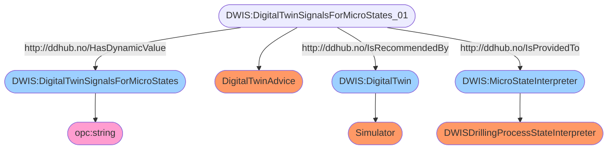

# Semantic Graph for `SignalGroup`


# Semantic Queries for `SignalGroup`
## Query-DWIS.MicroState.Model.SignalGroup-000
```sparql
PREFIX rdf:<http://www.w3.org/1999/02/22-rdf-syntax-ns#>
PREFIX ddhub:<http://ddhub.no/>
PREFIX quantity:<http://ddhub.no/UnitAndQuantity>

SELECT ?DigitalTwinSignalsForMicroStates
WHERE {
	?DigitalTwinSignalsForMicroStates_01 rdf:type ddhub:DigitalTwinAdvice .
	?DigitalTwinSignalsForMicroStates_01 ddhub:HasDynamicValue ?DigitalTwinSignalsForMicroStates .
	?DigitalTwin rdf:type ddhub:Simulator .
	?DigitalTwinSignalsForMicroStates_01 ddhub:IsRecommendedBy ?DigitalTwin .
	?MicroStateInterpreter rdf:type ddhub:DWISDrillingProcessStateInterpreter .
	?DigitalTwinSignalsForMicroStates_01 ddhub:IsProvidedTo ?MicroStateInterpreter .
}

```
