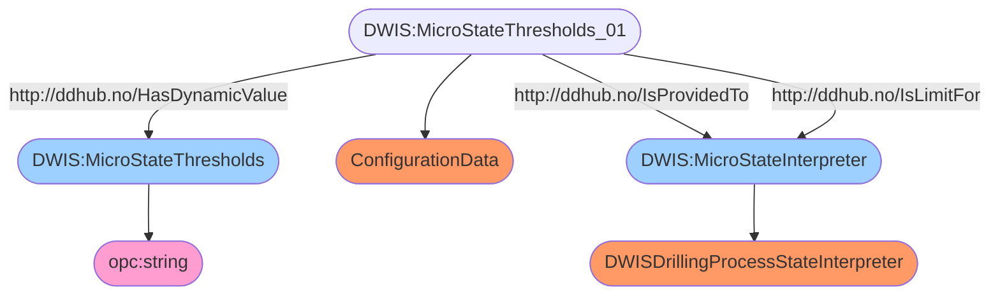

# Semantic Graph for `Thresholds`


# Semantic Queries for `Thresholds`
## Query-DWIS.MicroState.Model.Thresholds-000
```sparql
PREFIX rdf:<http://www.w3.org/1999/02/22-rdf-syntax-ns#>
PREFIX ddhub:<http://ddhub.no/>
PREFIX quantity:<http://ddhub.no/UnitAndQuantity>

SELECT ?MicroStateThresholds
WHERE {
	?MicroStateThresholds_01 rdf:type ddhub:ConfigurationData .
	?MicroStateThresholds_01 ddhub:HasDynamicValue ?MicroStateThresholds .
	?MicroStateInterpreter rdf:type ddhub:DWISDrillingProcessStateInterpreter .
	?MicroStateThresholds_01 ddhub:IsProvidedTo ?MicroStateInterpreter .
	?MicroStateThresholds_01 ddhub:IsLimitFor ?MicroStateInterpreter .
}

```
