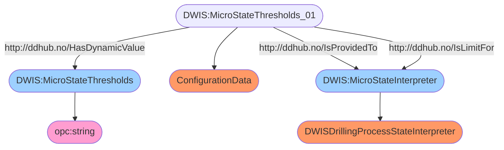

# Semantic Graph for property `ZeroAxialVelocityTopOfStringThreshold` of class `Thresholds`

```mermaid
flowchart TD
	 classDef typeClass fill:#f96;
	 classDef classClass fill:#9dd0ff;
	 classDef opcClass fill:#ff9dd0;
	 classDef quantityClass fill:#d0ff9d;
	DWIS:MicroStateThresholds([DWIS:MicroStateThresholds]) --> opc:string([opc:string]):::opcClass
	DWIS:MicroStateThresholds_01([DWIS:MicroStateThresholds_01]) --> ConfigurationData([ConfigurationData]):::typeClass
	DWIS:MicroStateInterpreter([DWIS:MicroStateInterpreter]) --> DWISDrillingProcessStateInterpreter([DWISDrillingProcessStateInterpreter]):::typeClass
	DWIS:MicroStateThresholds_01([DWIS:MicroStateThresholds_01]) -- http://ddhub.no/HasDynamicValue --> DWIS:MicroStateThresholds([DWIS:MicroStateThresholds]):::classClass
	DWIS:MicroStateThresholds_01([DWIS:MicroStateThresholds_01]) -- http://ddhub.no/IsProvidedTo --> DWIS:MicroStateInterpreter([DWIS:MicroStateInterpreter]):::classClass
	DWIS:MicroStateThresholds_01([DWIS:MicroStateThresholds_01]) -- http://ddhub.no/IsLimitFor --> DWIS:MicroStateInterpreter([DWIS:MicroStateInterpreter]):::classClass
```

