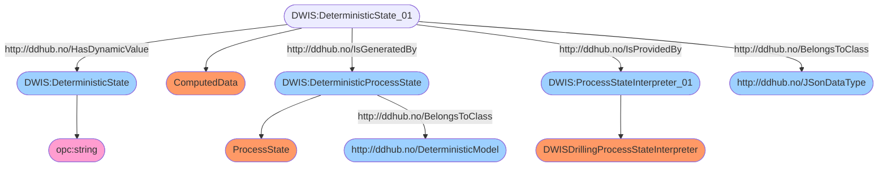
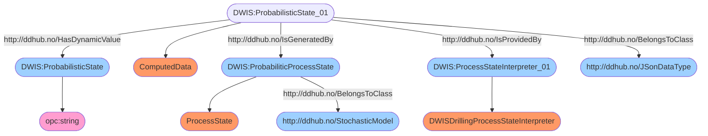
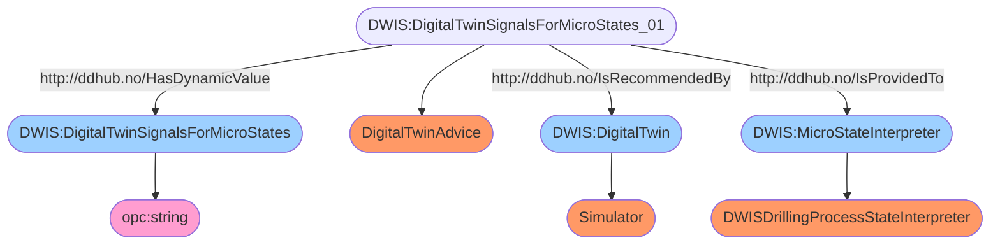
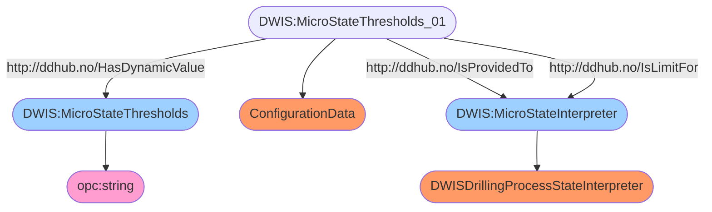

# DWIS Microstates 
## Context
This work is performed as part of the Drilling and Wells Interoperability Standard (D-WIS) sub-commmittee. D-WIS is a subcommittee of the Society of Petroleum Engineer's
Drilling Automation Technical Section.

## Summary
The drilling process state is defined in a multidimensional space of micro-states. 
The micro-state basis is orthogonal. Each micro-state is calculated using a combination of logical statements. 
The variable used in the logical statements are supposed to be generated by one or more digital twins. 
The digital twins can give an estimation of their uncertainty on the estimated values. 
There are two results provided by the interpretation engine: a deterministic state and a probabilistic state. 
The uncertainty on the digital twin signals is used when calculating the probabilistic state. 
Sensor fusion is used when there are several sources for the same signal. 
The search for the input signals used in the logical statements is performed using sparql queries on the Drilling Data Hub (DDHub). 
The logical statements also use threshold values. These threshold values are collected from the DDHub using sparql queries. 
The deterministic microstate is published back on the DDHub together with its semantic description.
All the individual probabilistic microstates are published back on the DDHub together with their semantic description.

## Prerequisites
The `DWIS Microstates Interpretation Engine` makes use of the `DWIS Blackboard`. So you shall install the `DWIS Blackboard` before installing
the `DWIS Microstates Interpretation Engine`.

## Getting started
The `docker run` command for windows is:
```
docker run --name microstatesengine -v C:\Volumes\DWISMicroStateSignalGenerator:/home digiwells/dwismicrostateinterpretationengine:stable
```
where `C:\Volumes\DWISMicroStateSignalGenerator` is any folder where you would like to access the config.json file that is used to configure
the application.

and the `docker run` command for linux is:
```
docker run --name microstatesengine -v /home/Volumes/DWISMicroStateSignalGenerator:/home digiwells/dwismicrostateinterpretationengine:stable
```
where `/home/Volumes/DWISMicroStateSignalGenerator` is any directory where you would like to access the config.json file that is used to
configure the application.

## Configuration
A configuration file is available in the directory/folder that is connected to the internal `/home` directory. The name of the configuration
file is `config.json` and is in Json format.

The configuration file has the following properties:
- `LoopDuration` (a TimeSpan, default 1s): this property defines the loop duration of the service, i.e., the time interval used to check if new signals are available.
- `OPCUAURL` (a string, default "opc.tcp://localhost:48030"): this property defines the `URL` used to connect to the `DWIS Blackboard`
- `DefaultProbability` (a double, default 0.1): this property defines the default probability for Bernoulli Drilling Properties for which the 
probability has not been defined.
- `DefaultStandardDeviation` (a double, default 0.1): this property defines the default standard deviation for Gaussian Drilling Properties
for which the standard deviation has not been informed.
- `CircularBufferSize` (an integer, default 300): this property defines the maximum number of elements in circular buffer that are used by
the digital twin calibration algorithm.
- `CalibrationMinTimeWindow` (a TimeSpan, default 120s): this property defines the minimum time window that is acceptable to start doing
calibration of digital twin signals.
- `CalibrationTimeWindowFactor` (a double, default 0.5): this property defines the proportion of data that is used in circular buffer to calibrate
the signals from multiple digital twins.
- `CalibrationConvergenceTolerance` (a double, default 1e-6): this property defines the tolerance of the `Levenberg-Marquardt` algorithm
used to calibrate the signals from multiple digital twins.
- `CalibrationMaxNumberOfIterations` (an integer, default 1000): this property defines the maximum number of iterations that are acceptable
while running the `Levenberg-Marquardt` algorithm used to calibrate the signals from multiple digital twins.
- `GenerateRandomValues` (a boolean, default false): this property is used to tell the `DWIS Microstates Interpretation Engine` to generate
randome values.

## Using the Microstates Interpretation Engine
The `DWIS Microstates Interpretation Engine` searches for `SignalGroup` on the `DWIS Blackboard`. If any are found, then they are used
to estimate the drilling process microstates. It also searches for `Thresholds` as they are used in the logical statements that define
the drilling process state. If there are several `SignalGroup` available on the `DWIS Blackboard`, the signals are first calibrated by optimizing
a scaling and a bias factors as well as a time delay such that they are all of the same order of magnitude. Then the signals are fused using
the informed standard deviation provided by each of the digital twins for each of the signals. It is the calibrated and fused value that
is used in the logical expressions that define the microstates.

The `DWIS Microstates Interpretation Engine` outputs on the `DWIS Blackboard` the calibrated and fused `SignalGroup` that is used for the
estimation of the microstates. It also publishes on the `DWIS Blackboard` a deterministic `MicroStates` and a probabilistic `MicroStates`.

The Json schemas for the different objects manipulated by the `DWIS Microstates Interpretation Engine` can be found here:
https://github.com/D-WIS/MicroStateEngine/blob/main/DWIS.MicroState.JsonSchema/MicroStates.json.


## Semantic Description of a Deterministic Microstate byte structure
Individual deterministic microstate components can be stored on 2 bits as they can have either 2 or 3 values
and an additional value (0) is reserved to define that the state component is unknown. It is therefore
possible to store all the individual deterministic microstates in one long chain of bits. A data structure
composed of 5 unsigned integer is used to store the chain of bits. This allows to store 180 bits or in
other words 90 different deterministic microstate components.
The deterministic microstate byte structure is defined using the following semantic graph:


The Sparql query used to retrieve the deterministic `MicroStates` is:
```sparql
PREFIX rdf:<http://www.w3.org/1999/02/22-rdf-syntax-ns#>
PREFIX ddhub:<http://ddhub.no/>
PREFIX quantity:<http://ddhub.no/UnitAndQuantity>

SELECT ?DeterministicState
WHERE {
	?DeterministicState_01 rdf:type ddhub:ComputedData .
	?DeterministicState_01 rdf:type ddhub:JSonDataType .
	?DeterministicState_01 ddhub:HasDynamicValue ?DeterministicState .
	?DeterministicProcessState rdf:type ddhub:ProcessState .
	?DeterministicProcessState rdf:type ddhub:DeterministicModel .
	?DeterministicState_01 ddhub:IsGeneratedBy ?DeterministicProcessState .
	?ProcessStateInterpreter_01 rdf:type ddhub:DWISDrillingProcessStateInterpreter .
	?DeterministicState_01 ddhub:IsProvidedBy ?ProcessStateInterpreter_01 .
}

```

## Semantic Description of a Probabilistic Microstate
The individual probabilitic microstate have their own semantic description. At the moment, there are 
76 microstates. In this README file only one example is given.

The semantic description of the axial velocity of the top of string probabilistic state is:


The Spartql query used to retrieve the probabilistic `ProbabilisticMicroStates` is:
```sparql
PREFIX rdf:<http://www.w3.org/1999/02/22-rdf-syntax-ns#>
PREFIX ddhub:<http://ddhub.no/>
PREFIX quantity:<http://ddhub.no/UnitAndQuantity>

SELECT ?ProbabilisticState
WHERE {
	?ProbabilisticState_01 rdf:type ddhub:ComputedData .
	?ProbabilisticState_01 rdf:type ddhub:JSonDataType .
	?ProbabilisticState_01 ddhub:HasDynamicValue ?ProbabilisticState .
	?ProbabiliticProcessState rdf:type ddhub:ProcessState .
	?ProbabiliticProcessState rdf:type ddhub:StochasticModel .
	?ProbabilisticState_01 ddhub:IsGeneratedBy ?ProbabiliticProcessState .
	?ProcessStateInterpreter_01 rdf:type ddhub:DWISDrillingProcessStateInterpreter .
	?ProbabilisticState_01 ddhub:IsProvidedBy ?ProcessStateInterpreter_01 .
}

```

## Example Logical Statements for microstates
To calculate a deterministic or probabilistic microstate, a logical statement is used. For instance, the logical statement used to determine the state of the axial velocity of the
top of string is:
- state 1: $|v_{tos}| <= \epsilon_{v_{tos}}$
- state 2: $v_{tos} > \epsilon_{v_{tos}}$
- state 3: $v_{tos} < -\epsilon_{v_{tos}}$

where $v_{tos}$ is the top of string velocity and $\epsilon_{v_{tos}}$ is a threshold for the top of string velocity to consider that it is equal to zero.

So these logical statements make use of estimated realtime signals and possible time varying thresholds values. The realtime signals are typically generated by a digital twin of the
drilling process. The thresholds may be defined statically or may be calculated as a function of the current state of the drilling process. 

For the purpose of probabilistic micro-state determination, the estimated real-time signals provided by the digital twins may be accompanied by uncertainty information.

## Semantic Description of SignalGroup
The estimated real-time signals produced by a DigitalTwin are retrieved from the DDHub using a semantical query: 

```sparql
PREFIX rdf:<http://www.w3.org/1999/02/22-rdf-syntax-ns#>
PREFIX ddhub:<http://ddhub.no/>
PREFIX quantity:<http://ddhub.no/UnitAndQuantity>

SELECT ?DigitalTwinSignalsForMicroStates
WHERE {
	?DigitalTwinSignalsForMicroStates_01 rdf:type ddhub:DigitalTwinAdvice .
	?DigitalTwinSignalsForMicroStates_01 ddhub:HasDynamicValue ?DigitalTwinSignalsForMicroStates .
	?DigitalTwin rdf:type ddhub:Simulator .
	?DigitalTwinSignalsForMicroStates_01 ddhub:IsRecommendedBy ?DigitalTwin .
	?MicroStateInterpreter rdf:type ddhub:DWISDrillingProcessStateInterpreter .
	?DigitalTwinSignalsForMicroStates_01 ddhub:IsProvidedTo ?MicroStateInterpreter .
}

```

The semantic graph of the SignalGroup is:


## Semantic of the DigitalTwin Calibrations
When multiple DigitalTwins are available, the DWIS Drilling Process State Interpretation Engine attempts at calibrating the signals from
the different sources. The calibration consist in finding a scaling and bias factors and a time delay for each digital twin and for each 
signal such that the difference between them is minimized. The result of the calibration is stored in a `Calibrations` object. This object
is published on the `Blackboard`. It can be retrieved with the following Sparql Query:

```sparql
PREFIX rdf:<http://www.w3.org/1999/02/22-rdf-syntax-ns#>
PREFIX ddhub:<http://ddhub.no/>
PREFIX quantity:<http://ddhub.no/UnitAndQuantity>

SELECT ?MicroStateCalibration
WHERE {
	?MicroStateCalibration_01 rdf:type ddhub:ComputedData .
	?MicroStateCalibration_01 rdf:type ddhub:JSonDataType .
	?MicroStateCalibration_01 ddhub:HasDynamicValue ?MicroStateCalibration .
	?CalibrationInterpretor_01 rdf:type ddhub:Interpreter .
	?CalibrationInterpretor_01 rdf:type ddhub:CalibrationModel .
	?CalibrationInterpretor_01 rdf:type ddhub:WhiteBoxModel .
	?CalibrationInterpretor_01 rdf:type ddhub:SpecializedModel .
	?CalibrationInterpretor_01 rdf:type ddhub:AlgebraicModel .
	?CalibrationInterpretor_01 rdf:type ddhub:InversionModel .
	?CalibrationInterpretor_01 rdf:type ddhub:EmpiricalModel .
	?CalibrationInterpretor_01 rdf:type ddhub:TransientModel .
	?CalibrationInterpretor_01 rdf:type ddhub:DeterministicModel .
	?MicroStateInterpreter_01 rdf:type ddhub:DWISDrillingProcessStateInterpreter .
	?MicroStateCalibration_01 ddhub:IsComputedBy ?CalibrationInterpretor_01 .
	?MicroStateCalibration_01 ddhub:IsProvidedBy ?MicroStateInterpreter_01 .
	?DigitalTwinSignals_01 rdf:type ddhub:DigitalTwinAdvice .
	?DigitalTwin rdf:type ddhub:Simulator .
	?DigitalTwinSignals_01 ddhub:IsRecommendedBy ?DigitalTwin .
	?DigitalTwinSignals_01 ddhub:IsProvidedTo ?MicroStateInterpreter_01 .
	?DigitalTwinSignals_01 ddhub:IsComputationInput ?CalibrationInterpretor_01 .
}

```

The semantic graph for the `Calibrations` is:

```mermaid
flowchart TD
	 classDef typeClass fill:#f96;
	 classDef classClass fill:#9dd0ff;
	 classDef opcClass fill:#ff9dd0;
	 classDef quantityClass fill:#d0ff9d;
	DWIS:MicroStateCalibration([DWIS:MicroStateCalibration]) --> opc:string([opc:string]):::opcClass
	DWIS:MicroStateCalibration_01([DWIS:MicroStateCalibration_01]) --> ComputedData([ComputedData]):::typeClass
	DWIS:CalibrationInterpretor_01([DWIS:CalibrationInterpretor_01]) --> Interpreter([Interpreter]):::typeClass
	DWIS:MicroStateInterpreter_01([DWIS:MicroStateInterpreter_01]) --> DWISDrillingProcessStateInterpreter([DWISDrillingProcessStateInterpreter]):::typeClass
	DWIS:DigitalTwinSignals_01([DWIS:DigitalTwinSignals_01]) --> DigitalTwinAdvice([DigitalTwinAdvice]):::typeClass
	DWIS:DigitalTwin([DWIS:DigitalTwin]) --> Simulator([Simulator]):::typeClass
	DWIS:MicroStateCalibration_01([DWIS:MicroStateCalibration_01]) -- http://ddhub.no/BelongsToClass --> http://ddhub.no/JSonDataType([http://ddhub.no/JSonDataType]):::classClass
	DWIS:CalibrationInterpretor_01([DWIS:CalibrationInterpretor_01]) -- http://ddhub.no/BelongsToClass --> http://ddhub.no/CalibrationModel([http://ddhub.no/CalibrationModel]):::classClass
	DWIS:CalibrationInterpretor_01([DWIS:CalibrationInterpretor_01]) -- http://ddhub.no/BelongsToClass --> http://ddhub.no/WhiteBoxModel([http://ddhub.no/WhiteBoxModel]):::classClass
	DWIS:CalibrationInterpretor_01([DWIS:CalibrationInterpretor_01]) -- http://ddhub.no/BelongsToClass --> http://ddhub.no/SpecializedModel([http://ddhub.no/SpecializedModel]):::classClass
	DWIS:CalibrationInterpretor_01([DWIS:CalibrationInterpretor_01]) -- http://ddhub.no/BelongsToClass --> http://ddhub.no/AlgebraicModel([http://ddhub.no/AlgebraicModel]):::classClass
	DWIS:CalibrationInterpretor_01([DWIS:CalibrationInterpretor_01]) -- http://ddhub.no/BelongsToClass --> http://ddhub.no/InversionModel([http://ddhub.no/InversionModel]):::classClass
	DWIS:CalibrationInterpretor_01([DWIS:CalibrationInterpretor_01]) -- http://ddhub.no/BelongsToClass --> http://ddhub.no/EmpiricalModel([http://ddhub.no/EmpiricalModel]):::classClass
	DWIS:CalibrationInterpretor_01([DWIS:CalibrationInterpretor_01]) -- http://ddhub.no/BelongsToClass --> http://ddhub.no/TransientModel([http://ddhub.no/TransientModel]):::classClass
	DWIS:CalibrationInterpretor_01([DWIS:CalibrationInterpretor_01]) -- http://ddhub.no/BelongsToClass --> http://ddhub.no/DeterministicModel([http://ddhub.no/DeterministicModel]):::classClass
	DWIS:MicroStateCalibration_01([DWIS:MicroStateCalibration_01]) -- http://ddhub.no/HasDynamicValue --> DWIS:MicroStateCalibration([DWIS:MicroStateCalibration]):::classClass
	DWIS:MicroStateCalibration_01([DWIS:MicroStateCalibration_01]) -- http://ddhub.no/IsComputedBy --> DWIS:CalibrationInterpretor_01([DWIS:CalibrationInterpretor_01]):::classClass
	DWIS:MicroStateCalibration_01([DWIS:MicroStateCalibration_01]) -- http://ddhub.no/IsProvidedBy --> DWIS:MicroStateInterpreter_01([DWIS:MicroStateInterpreter_01]):::classClass
	DWIS:DigitalTwinSignals_01([DWIS:DigitalTwinSignals_01]) -- http://ddhub.no/IsRecommendedBy --> DWIS:DigitalTwin([DWIS:DigitalTwin]):::classClass
	DWIS:DigitalTwinSignals_01([DWIS:DigitalTwinSignals_01]) -- http://ddhub.no/IsProvidedTo --> DWIS:MicroStateInterpreter_01([DWIS:MicroStateInterpreter_01]):::classClass
	DWIS:DigitalTwinSignals_01([DWIS:DigitalTwinSignals_01]) -- http://ddhub.no/IsComputationInput --> DWIS:CalibrationInterpretor_01([DWIS:CalibrationInterpretor_01]):::classClass
```


## Semantic Description of the Fused SignalGroup
When multiple DigitalTwins provide information that can be used by the DWIS Microstate Interpretation Engine, then the signals are calibrated
and fused. The resulting SignalGroup that contains the calibrated and fused signals can be retrieved using the following Sparql query:

```sparql
PREFIX rdf:<http://www.w3.org/1999/02/22-rdf-syntax-ns#>
PREFIX ddhub:<http://ddhub.no/>
PREFIX quantity:<http://ddhub.no/UnitAndQuantity>

SELECT ?FusedSignalsForMicroStates
WHERE {
	?FusedSignalsForMicroStates_01 rdf:type ddhub:DigitalTwinAdvice .
	?FusedSignalsForMicroStates_01 ddhub:HasDynamicValue ?FusedSignalsForMicroStates .
	?MicroStateInterpreter rdf:type ddhub:DWISDrillingProcessStateInterpreter .
	?FusedSignalsForMicroStates_01 ddhub:IsProvidedBy ?MicroStateInterpreter .
	?SignalFusionInterpreter_01 rdf:type ddhub:Interpreter .
	?SignalFusionInterpreter_01 rdf:type ddhub:DescriptiveModel .
	?SignalFusionInterpreter_01 rdf:type ddhub:ForwardModel .
	?SignalFusionInterpreter_01 rdf:type ddhub:WhiteBoxModel .
	?SignalFusionInterpreter_01 rdf:type ddhub:SpecializedModel .
	?SignalFusionInterpreter_01 rdf:type ddhub:EmpiricalModel .
	?SignalFusionInterpreter_01 rdf:type ddhub:StochasticModel .
	?FusedSignalsForMicroStates_01 ddhub:IsComputedBy ?SignalFusionInterpreter_01 .
	?DigitalTwinSignals_01 rdf:type ddhub:DigitalTwinAdvice .
	?DigitalTwin rdf:type ddhub:Simulator .
	?DigitalTwinSignals_01 ddhub:IsRecommendedBy ?DigitalTwin .
	?DigitalTwinSignals_01 ddhub:IsProvidedTo ?MicroStateInterpreter_01 .
	?DigitalTwinSignals_01 ddhub:IsComputationInput ?SignalFusionInterpreter_01 .
	?DigitalTwinSignalsForMicroStates_01 rdf:type ddhub:DigitalTwinAdvice .
	?DigitalTwinSignalsForMicroStates_01 ddhub:HasDynamicValue ?DigitalTwinSignalsForMicroStates .
	?DigitalTwin rdf:type ddhub:Simulator .
	?DigitalTwinSignalsForMicroStates_01 ddhub:IsRecommendedBy ?DigitalTwin .
	?MicroStateInterpreter rdf:type ddhub:DWISDrillingProcessStateInterpreter .
	?DigitalTwinSignalsForMicroStates_01 ddhub:IsProvidedTo ?MicroStateInterpreter .
}

```

The semantic graph of the Fused Signal Group is:

```mermaid
flowchart TD
	 classDef typeClass fill:#f96;
	 classDef classClass fill:#9dd0ff;
	 classDef opcClass fill:#ff9dd0;
	 classDef quantityClass fill:#d0ff9d;
	DWIS:FusedSignalsForMicroStates([DWIS:FusedSignalsForMicroStates]) --> opc:string([opc:string]):::opcClass
	DWIS:FusedSignalsForMicroStates_01([DWIS:FusedSignalsForMicroStates_01]) --> DigitalTwinAdvice([DigitalTwinAdvice]):::typeClass
	DWIS:MicroStateInterpreter([DWIS:MicroStateInterpreter]) --> DWISDrillingProcessStateInterpreter([DWISDrillingProcessStateInterpreter]):::typeClass
	DWIS:SignalFusionInterpreter_01([DWIS:SignalFusionInterpreter_01]) --> Interpreter([Interpreter]):::typeClass
	DWIS:DigitalTwinSignals_01([DWIS:DigitalTwinSignals_01]) --> DigitalTwinAdvice([DigitalTwinAdvice]):::typeClass
	DWIS:DigitalTwin([DWIS:DigitalTwin]) --> Simulator([Simulator]):::typeClass
	DWIS:DigitalTwinSignalsForMicroStates([DWIS:DigitalTwinSignalsForMicroStates]) --> DynamicDrillingSignal([DynamicDrillingSignal]):::typeClass
	DWIS:DigitalTwinSignalsForMicroStates_01([DWIS:DigitalTwinSignalsForMicroStates_01]) --> DigitalTwinAdvice([DigitalTwinAdvice]):::typeClass
	DWIS:MicroStateInterpreter([DWIS:MicroStateInterpreter]) -- http://ddhub.no/BelongsToClass --> http://ddhub.no/DWISDrillingProcessStateInterpreter([http://ddhub.no/DWISDrillingProcessStateInterpreter]):::classClass
	DWIS:SignalFusionInterpreter_01([DWIS:SignalFusionInterpreter_01]) -- http://ddhub.no/BelongsToClass --> http://ddhub.no/DescriptiveModel([http://ddhub.no/DescriptiveModel]):::classClass
	DWIS:SignalFusionInterpreter_01([DWIS:SignalFusionInterpreter_01]) -- http://ddhub.no/BelongsToClass --> http://ddhub.no/ForwardModel([http://ddhub.no/ForwardModel]):::classClass
	DWIS:SignalFusionInterpreter_01([DWIS:SignalFusionInterpreter_01]) -- http://ddhub.no/BelongsToClass --> http://ddhub.no/WhiteBoxModel([http://ddhub.no/WhiteBoxModel]):::classClass
	DWIS:SignalFusionInterpreter_01([DWIS:SignalFusionInterpreter_01]) -- http://ddhub.no/BelongsToClass --> http://ddhub.no/SpecializedModel([http://ddhub.no/SpecializedModel]):::classClass
	DWIS:SignalFusionInterpreter_01([DWIS:SignalFusionInterpreter_01]) -- http://ddhub.no/BelongsToClass --> http://ddhub.no/EmpiricalModel([http://ddhub.no/EmpiricalModel]):::classClass
	DWIS:SignalFusionInterpreter_01([DWIS:SignalFusionInterpreter_01]) -- http://ddhub.no/BelongsToClass --> http://ddhub.no/StochasticModel([http://ddhub.no/StochasticModel]):::classClass
	DWIS:DigitalTwin([DWIS:DigitalTwin]) -- http://ddhub.no/BelongsToClass --> http://ddhub.no/Simulator([http://ddhub.no/Simulator]):::classClass
	DWIS:FusedSignalsForMicroStates_01([DWIS:FusedSignalsForMicroStates_01]) -- http://ddhub.no/HasDynamicValue --> DWIS:FusedSignalsForMicroStates([DWIS:FusedSignalsForMicroStates]):::classClass
	DWIS:FusedSignalsForMicroStates_01([DWIS:FusedSignalsForMicroStates_01]) -- http://ddhub.no/IsProvidedBy --> DWIS:MicroStateInterpreter([DWIS:MicroStateInterpreter]):::classClass
	DWIS:FusedSignalsForMicroStates_01([DWIS:FusedSignalsForMicroStates_01]) -- http://ddhub.no/IsComputedBy --> DWIS:SignalFusionInterpreter_01([DWIS:SignalFusionInterpreter_01]):::classClass
	DWIS:DigitalTwinSignals_01([DWIS:DigitalTwinSignals_01]) -- http://ddhub.no/IsRecommendedBy --> DWIS:DigitalTwin([DWIS:DigitalTwin]):::classClass
	DWIS:DigitalTwinSignals_01([DWIS:DigitalTwinSignals_01]) -- http://ddhub.no/IsProvidedTo --> DWIS:MicroStateInterpreter_01([DWIS:MicroStateInterpreter_01]):::classClass
	DWIS:DigitalTwinSignals_01([DWIS:DigitalTwinSignals_01]) -- http://ddhub.no/IsComputationInput --> DWIS:SignalFusionInterpreter_01([DWIS:SignalFusionInterpreter_01]):::classClass
	DWIS:DigitalTwinSignalsForMicroStates_01([DWIS:DigitalTwinSignalsForMicroStates_01]) -- http://ddhub.no/HasDynamicValue --> DWIS:DigitalTwinSignalsForMicroStates([DWIS:DigitalTwinSignalsForMicroStates]):::classClass
	DWIS:DigitalTwinSignalsForMicroStates_01([DWIS:DigitalTwinSignalsForMicroStates_01]) -- http://ddhub.no/IsRecommendedBy --> DWIS:DigitalTwin([DWIS:DigitalTwin]):::classClass
	DWIS:DigitalTwinSignalsForMicroStates_01([DWIS:DigitalTwinSignalsForMicroStates_01]) -- http://ddhub.no/IsProvidedTo --> DWIS:MicroStateInterpreter([DWIS:MicroStateInterpreter]):::classClass
```


## Semantic Description for Thresholds used in Microstate Logical Statements
Similarly, the threshold values are retrieved using a `SparQL` query: 
```sparql
PREFIX rdf:<http://www.w3.org/1999/02/22-rdf-syntax-ns#>
PREFIX ddhub:<http://ddhub.no/>
PREFIX quantity:<http://ddhub.no/UnitAndQuantity>

SELECT ?MicroStateThresholds
WHERE {
	?MicroStateThresholds_01 rdf:type ddhub:ConfigurationData .
	?MicroStateThresholds_01 ddhub:HasDynamicValue ?MicroStateThresholds .
	?MicroStateInterpreter rdf:type ddhub:DWISDrillingProcessStateInterpreter .
	?MicroStateThresholds_01 ddhub:IsProvidedTo ?MicroStateInterpreter .
	?MicroStateThresholds_01 ddhub:IsLimitFor ?MicroStateInterpreter .
}

```

The semantic graph of the Microstate Thresholds is:


# Data Model
The data schemas of the information exchanged on the DWIS Blackboard can be found here:
https://github.com/D-WIS/MicroStateEngine/blob/main/DWIS.MicroState.JsonSchema/MicroStates.json.

When working with .Net, two nugets are provided for convenience to access the exchanged data on the DWIS Blackboard. 
The first one contains the whole model and is accessible here: https://www.nuget.org/packages/DWIS.MicroState.Model. 
The second one only defines the data structures without the behavior and is available here: 
https://www.nuget.org/packages/DWIS.MicroState.ModelShared.

# Source Code
The source code of the `DWIS Microstates Interpretation Engine` is written in C# and can be found here:
https://github.com/D-WIS/MicroStateEngine/tree/main.

# Dependences
This service depends on:
- OSDC.DotnetLibraries.Drilling.DrillingProperties: the nuget is available here: https://www.nuget.org/packages/OSDC.DotnetLibraries.Drilling.DrillingProperties
- DWIS.Client.ReferenceImplementation: the nuget is available here: https://www.nuget.org/packages/DWIS.Client.ReferenceImplementation
- DWIS.Client.ReferenceImplementation.OPCFoundation: the nuget is available here: https://www.nuget.org/packages/DWIS.Client.ReferenceImplementation.OPCFoundation

# References
There are two references for the `DWIS Microstates Interpretation Engine`:
- Cayeux, Eric, Macpherson, John, Pirovolou, Dimitrios, Laing, Moray, and Fred Florence. "A General Framework to Describe Drilling Process States." 
Paper presented at the SPE/IADC International Drilling Conference and Exhibition, Stavanger, Norway, March 2023. doi: https://doi.org/10.2118/212537-MS
- Cayeux, E., Macpherson, J., Pirovolou, D., Laing, M., and F. Florence. "A General Framework to Describe Drilling Process States." SPE J. (2024;): doi: https://doi.org/10.2118/212537-PA

# Contributors
The code of the `DWIS Microstates Interpretation Engine` is developed and maintained by Eric Cayeux (NORCE Norwegian Research Center).
