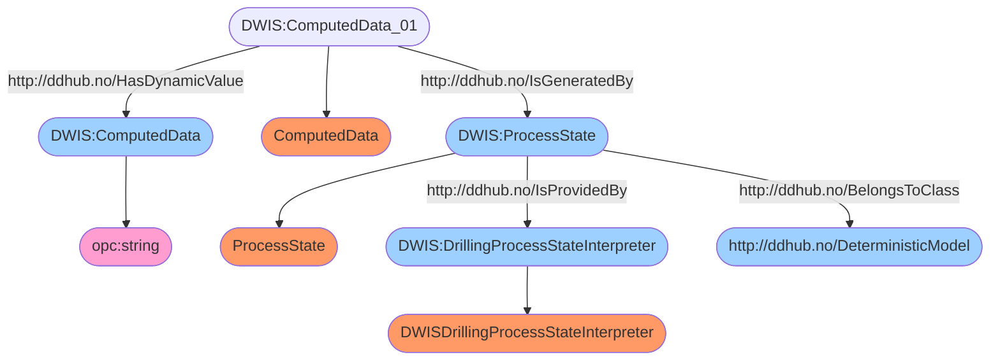
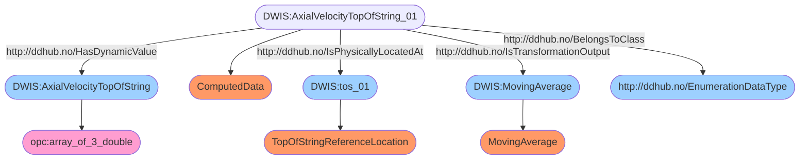

# DWIS Microstates 
## Context
This work is performed as part of the Drilling and Wells Interoperability Standard (D-WIS) sub-commmittee. D-WIS is a subcommittee of the Society of Petroleum Engineer's
Drilling Automation Technical Section.

## Summary
The drilling process state is defined in a multidimensional space of micro-states. 
The micro-state basis is orthogonal. Each micro-state is calculated using a combination of logical statements. 
The variable used in the logical statements are supposed to be generated by one or more digital twins. 
The digital twins can give an estimation of their uncertainty on the estimated values. 
There are two results provided by the interpretation engine: a deterministic state and a probabilistic state. 
The uncertainty on the digital twin signals is used when calculating the probabilistic state. 
Sensor fusion is used when there are several sources for the same signal. 
The search for the input signals used in the logical statements is performed using sparql queries on the Drilling Data Hub (DDHub). 
The logical statements also use threshold values. These threshold values are collected from the DDHub using sparql queries. 
The deterministic microstate is published back on the DDHub together with its semantic description.
All the individual probabilistic microstates are published back on the DDHub together with their semantic description.

## Semantic Description of a Deterministic Microstate byte structure
Individual deterministic microstate components can be stored on 2 bits as they can have either 2 or 3 values
and an additional value (0) is reserved to define that the state component is unknown. It is therefore
possible to store all the individual deterministic microstates in one long chain of bits. A data structure
composed of 5 unsigned integer is used to store the chain of bits. This allows to store 180 bits or in
other words 90 different deterministic microstate components.
The deterministic microstate byte structure is defined using the following semantic graph:

## Example Semantic Description of a Probabilistic Microstate
The individual probabilitic microstate have their own semantic description. At the moment, there are 
76 microstates. In this README file only one example is given.

The semantic description of the axial velocity of the top of string probabilistic state is:

## Example Logical Statements for microstates
To calculate a deterministic or probabilistic microstate, a logical statement is used. For instance, the logical statement used to determine the state of the axial velocity of the
top of string is:
- state 1: $|v_{tos}| <= \epsilon_{v_{tos}}$
- state 2: $v_{tos} > \epsilon_{v_{tos}}$
- state 3: $v_{tos} < -\epsilon_{v_{tos}}$

where $v_{tos}$ is the top of string velocity and $\epsilon_{v_{tos}}$ is a threshold for the top of string velocity to consider that it is equal to zero.

So these logical statements make use of estimated realtime signals and possible time varying thresholds values. The realtime signals are typically generated by a digital twin of the
drilling process. The thresholds may be defined statically or may be calculated as a function of the current state of the drilling process. 

For the purpose of probabilistic micro-state determination, the estimated real-time signals provided by the digital twins may be accompanied by uncertainty information.
## Example Semantic Query for Signals used in Microstate Logical Statements
The estimated real-time signals are retrieved from the DDHub using semantical queries. The semantic queries try to retrieve uncertainty information if available.

An example set of semantic queries to retrieve the axial velocity of the top of string is shown below:
### Query-DWIS.MicroState.Model.SignalGroup-AxialVelocityTopOfString-000
```sparql
PREFIX rdf: <http://www.w3.org/1999/02/22-rdf-syntax-ns#>
PREFIX ddhub: <http://ddhub.no/>
PREFIX quantity: <http://ddhub.no/UnitAndQuantity>

SELECT ?v_tos
WHERE {
	?v_tos rdf:type ddhub:DynamicDrillingSignal .
	?v_tos#01 rdf:type ddhub:PhysicalData .
	?v_tos#01 ddhub:HasDynamicValue ?v_tos .
	?v_tos#01 ddhub:IsOfMeasurableQuantity quantity:BlockVelocity .
	?tos#01 rdf:type ddhub:TopOfStringReferenceLocation .
	?v_tos#01 ddhub:IsPhysicallyLocatedAt ?tos#01 .
	?MovingAverage rdf:type ddhub:MovingAverage .
	?v_tos#01 ddhub:IsTransformationOutput ?MovingAverage .
}

```
### Query-DWIS.MicroState.Model.SignalGroup-AxialVelocityTopOfString-001
```sparql
PREFIX rdf: <http://www.w3.org/1999/02/22-rdf-syntax-ns#>
PREFIX ddhub: <http://ddhub.no/>
PREFIX quantity: <http://ddhub.no/UnitAndQuantity>

SELECT ?v_tos, ?sigma_v_tos, ?factOptionSet
WHERE {
	?v_tos rdf:type ddhub:DynamicDrillingSignal .
	?v_tos#01 rdf:type ddhub:PhysicalData .
	?v_tos#01 ddhub:HasDynamicValue ?v_tos .
	?v_tos#01 ddhub:IsOfMeasurableQuantity quantity:BlockVelocity .
	?tos#01 rdf:type ddhub:TopOfStringReferenceLocation .
	?v_tos#01 ddhub:IsPhysicallyLocatedAt ?tos#01 .
	?MovingAverage rdf:type ddhub:MovingAverage .
	?v_tos#01 ddhub:IsTransformationOutput ?MovingAverage .
	?sigma_v_tos rdf:type ddhub:DrillingSignal .
	?sigma_v_tos#01 rdf:type ddhub:DrillingDataPoint .
	?sigma_v_tos#01 ddhub:HasValue ?sigma_v_tos .
	?GaussianUncertainty#01 rdf:type ddhub:GaussianUncertainty .
	?v_tos#01 ddhub:HasUncertainty ?GaussianUncertainty#01 .
	?GaussianUncertainty#01 ddhub:HasUncertaintyStandardDeviation ?sigma_v_tos#01 .
  BIND ("1" as ?factOptionSet)
}

```
### Query-DWIS.MicroState.Model.SignalGroup-AxialVelocityTopOfString-002
```sparql
PREFIX rdf: <http://www.w3.org/1999/02/22-rdf-syntax-ns#>
PREFIX ddhub: <http://ddhub.no/>
PREFIX quantity: <http://ddhub.no/UnitAndQuantity>

SELECT ?v_tos, ?sigma_v_tos, ?factOptionSet
WHERE {
	?v_tos rdf:type ddhub:DynamicDrillingSignal .
	?v_tos#01 rdf:type ddhub:PhysicalData .
	?v_tos#01 ddhub:HasDynamicValue ?v_tos .
	?v_tos#01 ddhub:IsOfMeasurableQuantity quantity:BlockVelocity .
	?tos#01 rdf:type ddhub:TopOfStringReferenceLocation .
	?v_tos#01 ddhub:IsPhysicallyLocatedAt ?tos#01 .
	?MovingAverage rdf:type ddhub:MovingAverage .
	?v_tos#01 ddhub:IsTransformationOutput ?MovingAverage .
	?sigma_v_tos rdf:type ddhub:DrillingSignal .
	?sigma_v_tos#01 rdf:type ddhub:DrillingDataPoint .
	?sigma_v_tos#01 ddhub:HasValue ?sigma_v_tos .
	?GaussianUncertainty#01 rdf:type ddhub:GaussianUncertainty .
	?v_tos#01 ddhub:HasUncertainty ?GaussianUncertainty#01 .
	?GaussianUncertainty#01 ddhub:HasUncertaintyStandardDeviation ?sigma_v_tos#01 .
	?GaussianUncertainty#01 ddhub:HasUncertaintyMean ?v_tos#01 .
  BIND ("1,11" as ?factOptionSet)
}

```
### Query-DWIS.MicroState.Model.SignalGroup-AxialVelocityTopOfString-003
```sparql
PREFIX rdf: <http://www.w3.org/1999/02/22-rdf-syntax-ns#>
PREFIX ddhub: <http://ddhub.no/>
PREFIX quantity: <http://ddhub.no/UnitAndQuantity>

SELECT ?v_tos, ?v_tos_prec, ?v_tos_acc, ?factOptionSet
WHERE {
	?v_tos rdf:type ddhub:DynamicDrillingSignal .
	?v_tos#01 rdf:type ddhub:PhysicalData .
	?v_tos#01 ddhub:HasDynamicValue ?v_tos .
	?v_tos#01 ddhub:IsOfMeasurableQuantity quantity:BlockVelocity .
	?tos#01 rdf:type ddhub:TopOfStringReferenceLocation .
	?v_tos#01 ddhub:IsPhysicallyLocatedAt ?tos#01 .
	?MovingAverage rdf:type ddhub:MovingAverage .
	?v_tos#01 ddhub:IsTransformationOutput ?MovingAverage .
	?v_tos_prec rdf:type ddhub:DrillingSignal .
	?v_tos_prec#01 rdf:type ddhub:DrillingDataPoint .
	?v_tos_prec#01 ddhub:HasValue ?v_tos_prec .
	?v_tos_acc rdf:type ddhub:DrillingSignal .
	?v_tos_acc#01 rdf:type ddhub:DrillingDataPoint .
	?v_tos_acc#01 ddhub:HasValue ?v_tos_acc .
	?SensorUncertainty#01 rdf:type ddhub:SensorUncertainty .
	?SensorUncertainty#01 ddhub:HasUncertaintyPrecision ?v_tos_prec#01 .
	?SensorUncertainty#01 ddhub:HasUncertaintyAccuracy ?v_tos_acc#01 .
	?v_tos#01 ddhub:HasUncertainty ?SensorUncertainty#01 .
  BIND ("2" as ?factOptionSet)
}

```
### Query-DWIS.MicroState.Model.SignalGroup-AxialVelocityTopOfString-004
```sparql
PREFIX rdf: <http://www.w3.org/1999/02/22-rdf-syntax-ns#>
PREFIX ddhub: <http://ddhub.no/>
PREFIX quantity: <http://ddhub.no/UnitAndQuantity>

SELECT ?v_tos, ?v_tos_prec, ?v_tos_acc, ?factOptionSet
WHERE {
	?v_tos rdf:type ddhub:DynamicDrillingSignal .
	?v_tos#01 rdf:type ddhub:PhysicalData .
	?v_tos#01 ddhub:HasDynamicValue ?v_tos .
	?v_tos#01 ddhub:IsOfMeasurableQuantity quantity:BlockVelocity .
	?tos#01 rdf:type ddhub:TopOfStringReferenceLocation .
	?v_tos#01 ddhub:IsPhysicallyLocatedAt ?tos#01 .
	?MovingAverage rdf:type ddhub:MovingAverage .
	?v_tos#01 ddhub:IsTransformationOutput ?MovingAverage .
	?v_tos_prec rdf:type ddhub:DrillingSignal .
	?v_tos_prec#01 rdf:type ddhub:DrillingDataPoint .
	?v_tos_prec#01 ddhub:HasValue ?v_tos_prec .
	?v_tos_acc rdf:type ddhub:DrillingSignal .
	?v_tos_acc#01 rdf:type ddhub:DrillingDataPoint .
	?v_tos_acc#01 ddhub:HasValue ?v_tos_acc .
	?SensorUncertainty#01 rdf:type ddhub:SensorUncertainty .
	?SensorUncertainty#01 ddhub:HasUncertaintyPrecision ?v_tos_prec#01 .
	?SensorUncertainty#01 ddhub:HasUncertaintyAccuracy ?v_tos_acc#01 .
	?v_tos#01 ddhub:HasUncertainty ?SensorUncertainty#01 .
	?SensorUncertainty#01 ddhub:HasUncertaintyMean ?v_tos#01 .
  BIND ("2,21" as ?factOptionSet)
}

```
### Query-DWIS.MicroState.Model.SignalGroup-AxialVelocityTopOfString-005
```sparql
PREFIX rdf: <http://www.w3.org/1999/02/22-rdf-syntax-ns#>
PREFIX ddhub: <http://ddhub.no/>
PREFIX quantity: <http://ddhub.no/UnitAndQuantity>

SELECT ?v_tos, ?v_tos_fs, ?v_tos_prop, ?factOptionSet
WHERE {
	?v_tos rdf:type ddhub:DynamicDrillingSignal .
	?v_tos#01 rdf:type ddhub:PhysicalData .
	?v_tos#01 ddhub:HasDynamicValue ?v_tos .
	?v_tos#01 ddhub:IsOfMeasurableQuantity quantity:BlockVelocity .
	?tos#01 rdf:type ddhub:TopOfStringReferenceLocation .
	?v_tos#01 ddhub:IsPhysicallyLocatedAt ?tos#01 .
	?MovingAverage rdf:type ddhub:MovingAverage .
	?v_tos#01 ddhub:IsTransformationOutput ?MovingAverage .
	?v_tos_fs rdf:type ddhub:DrillingSignal .
	?v_tos_fs#01 rdf:type ddhub:DrillingDataPoint .
	?v_tos_fs#01 ddhub:HasValue ?v_tos_fs#01 .
	?v_tos_prop rdf:type ddhub:DrillingSignal .
	?v_tos_prop#01 rdf:type ddhub:DrillingDataPoint .
	?v_tos_prop#01 ddhub:HasValue ?v_tos_prop#01 .
	?FullScaleUncertainty#01 rdf:type ddhub:FullScaleUncertainty .
	?FullScaleUncertainty#01 ddhub:HasFullScale ?v_tos_fs#01 .
	?FullScaleUncertainty#01 ddhub:HasProportionError ?v_tos_prop#01 .
	?v_tos#01 ddhub:HasUncertainty ?FullScaleUncertainty#01 .
  BIND ("3" as ?factOptionSet)
}

```
### Query-DWIS.MicroState.Model.SignalGroup-AxialVelocityTopOfString-006
```sparql
PREFIX rdf: <http://www.w3.org/1999/02/22-rdf-syntax-ns#>
PREFIX ddhub: <http://ddhub.no/>
PREFIX quantity: <http://ddhub.no/UnitAndQuantity>

SELECT ?v_tos, ?v_tos_fs, ?v_tos_prop, ?factOptionSet
WHERE {
	?v_tos rdf:type ddhub:DynamicDrillingSignal .
	?v_tos#01 rdf:type ddhub:PhysicalData .
	?v_tos#01 ddhub:HasDynamicValue ?v_tos .
	?v_tos#01 ddhub:IsOfMeasurableQuantity quantity:BlockVelocity .
	?tos#01 rdf:type ddhub:TopOfStringReferenceLocation .
	?v_tos#01 ddhub:IsPhysicallyLocatedAt ?tos#01 .
	?MovingAverage rdf:type ddhub:MovingAverage .
	?v_tos#01 ddhub:IsTransformationOutput ?MovingAverage .
	?v_tos_fs rdf:type ddhub:DrillingSignal .
	?v_tos_fs#01 rdf:type ddhub:DrillingDataPoint .
	?v_tos_fs#01 ddhub:HasValue ?v_tos_fs#01 .
	?v_tos_prop rdf:type ddhub:DrillingSignal .
	?v_tos_prop#01 rdf:type ddhub:DrillingDataPoint .
	?v_tos_prop#01 ddhub:HasValue ?v_tos_prop#01 .
	?FullScaleUncertainty#01 rdf:type ddhub:FullScaleUncertainty .
	?FullScaleUncertainty#01 ddhub:HasFullScale ?v_tos_fs#01 .
	?FullScaleUncertainty#01 ddhub:HasProportionError ?v_tos_prop#01 .
	?v_tos#01 ddhub:HasUncertainty ?FullScaleUncertainty#01 .
	?FullScaleUncertainty#01 ddhub:HasUncertaintyMean ?v_tos#01 .
  BIND ("3,31" as ?factOptionSet)
}

```
The semantic definition for the `DrillingProperty` makes use of optional facts to allow recovering alternative ways to define the uncertainty of the signal.
In order to know which of those options correspond to each of the queries, an additional variable is provided by the semantic query that is bound to a comma separated
list of the option indices used in the query.

## Example Semantic Query for Thresholds used in Microstate Logical Statements
Similarly, the threshold values are retrieved using `SparQL` queries. Below, you will find an example corresponding the queries used to retrieve the threshold for the axial
velocity of the top of string:
### Query-DWIS.MicroState.Model.Thresholds-ZeroAxialVelocityTopOfStringThreshold-000
```sparql
PREFIX rdf: <http://www.w3.org/1999/02/22-rdf-syntax-ns#>
PREFIX ddhub: <http://ddhub.no/>
PREFIX quantity: <http://ddhub.no/UnitAndQuantity>

SELECT ?ZeroAxialVelocityTopOfStringThreshold
WHERE {
	?ZeroAxialVelocityTopOfStringThreshold rdf:type ddhub:DrillingSignal .
	?ZeroAxialVelocityTopOfStringThreshold#01 rdf:type ddhub:Limit .
	?ZeroAxialVelocityTopOfStringThreshold#01 ddhub:HasValue ?ZeroAxialVelocityTopOfStringThreshold .
	?ZeroAxialVelocityTopOfStringThreshold#01 ddhub:IsOfMeasurableQuantity quantity:BlockVelocity .
	?tos#01 rdf:type ddhub:TopOfStringReferenceLocation .
	?ZeroAxialVelocityTopOfStringThreshold#01 ddhub:IsPhysicallyLocatedAt ?tos#01 .
	?MovingAverage rdf:type ddhub:MovingAverage .
	?signal#01 rdf:type ddhub:DrillingDataPoint .
	?signal#01 ddhub:IsTransformationOutput ?MovingAverage .
}

```
### Query-DWIS.MicroState.Model.Thresholds-ZeroAxialVelocityTopOfStringThreshold-001
```sparql
PREFIX rdf: <http://www.w3.org/1999/02/22-rdf-syntax-ns#>
PREFIX ddhub: <http://ddhub.no/>
PREFIX quantity: <http://ddhub.no/UnitAndQuantity>

SELECT ?ZeroAxialVelocityTopOfStringThreshold, ?factOptionSet
WHERE {
	?ZeroAxialVelocityTopOfStringThreshold rdf:type ddhub:DrillingSignal .
	?ZeroAxialVelocityTopOfStringThreshold#01 rdf:type ddhub:Limit .
	?ZeroAxialVelocityTopOfStringThreshold#01 ddhub:HasValue ?ZeroAxialVelocityTopOfStringThreshold .
	?ZeroAxialVelocityTopOfStringThreshold#01 ddhub:IsOfMeasurableQuantity quantity:BlockVelocity .
	?tos#01 rdf:type ddhub:TopOfStringReferenceLocation .
	?ZeroAxialVelocityTopOfStringThreshold#01 ddhub:IsPhysicallyLocatedAt ?tos#01 .
	?MovingAverage rdf:type ddhub:MovingAverage .
	?signal#01 rdf:type ddhub:DrillingDataPoint .
	?signal#01 ddhub:IsTransformationOutput ?MovingAverage .
	?ZeroAxialVelocityTopOfStringThreshold#01 ddhub:IsToBeComparedWith ?signal#01 .
  BIND ("1" as ?factOptionSet)
}

```
### Query-DWIS.MicroState.Model.Thresholds-ZeroAxialVelocityTopOfStringThreshold-002
```sparql
PREFIX rdf: <http://www.w3.org/1999/02/22-rdf-syntax-ns#>
PREFIX ddhub: <http://ddhub.no/>
PREFIX quantity: <http://ddhub.no/UnitAndQuantity>

SELECT ?ZeroAxialVelocityTopOfStringThreshold, ?factOptionSet
WHERE {
	?ZeroAxialVelocityTopOfStringThreshold rdf:type ddhub:DrillingSignal .
	?ZeroAxialVelocityTopOfStringThreshold#01 rdf:type ddhub:Limit .
	?ZeroAxialVelocityTopOfStringThreshold#01 ddhub:HasValue ?ZeroAxialVelocityTopOfStringThreshold .
	?ZeroAxialVelocityTopOfStringThreshold#01 ddhub:IsOfMeasurableQuantity quantity:BlockVelocity .
	?tos#01 rdf:type ddhub:TopOfStringReferenceLocation .
	?ZeroAxialVelocityTopOfStringThreshold#01 ddhub:IsPhysicallyLocatedAt ?tos#01 .
	?MovingAverage rdf:type ddhub:MovingAverage .
	?signal#01 rdf:type ddhub:DrillingDataPoint .
	?signal#01 ddhub:IsTransformationOutput ?MovingAverage .
	?signal#01 ddhub:IsToBeComparedWith ?ZeroAxialVelocityTopOfStringThreshold#01 .
  BIND ("2" as ?factOptionSet)
}

```
## Docker Image
A docker of the microstate interpreter is automatically generated on dockerhub each time the source code on github is changed.
To retrieve the lastest stable docker image use the following command:
```docker
docker pull digiwells/dwismicrostateinterpretationengine:stable
```
The docker image makes use of a shared volume. In this shared volume, the application reads a configuration file called `config.json`. The configuration has two properties:
- `LoopDuration`: a string that represents the loop duration using the following format: "hh:mm:ss"
- `OPCUAURL`: an URL that define how to access the OPC-UA server associated with the DDHub, e.g., `opc.tcp://localhost:48030`

## Dependences
This service depends on:
- OSDC.DotnetLibraries.Drilling.DrillingProperties

## References
There are two references for the `DWIS Microstates Interpretation Engine`:
- Cayeux, Eric, Macpherson, John, Pirovolou, Dimitrios, Laing, Moray, and Fred Florence. "A General Framework to Describe Drilling Process States." 
Paper presented at the SPE/IADC International Drilling Conference and Exhibition, Stavanger, Norway, March 2023. doi: https://doi.org/10.2118/212537-MS
- Cayeux, E., Macpherson, J., Pirovolou, D., Laing, M., and F. Florence. "A General Framework to Describe Drilling Process States." SPE J. (2024;): doi: https://doi.org/10.2118/212537-PA

## Contributors
The code of the `DWIS Microstates Interpretation Engine` is developed and maintained by Eric Cayeux (NORCE Norwegian Research Center).
